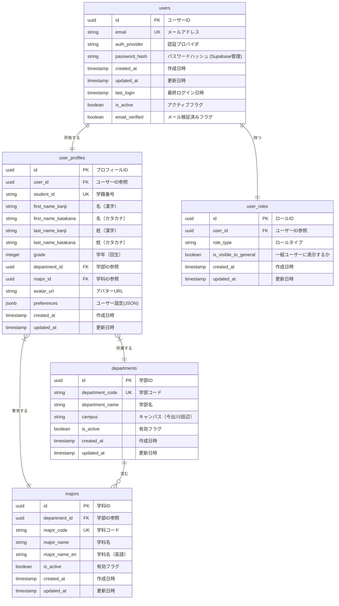
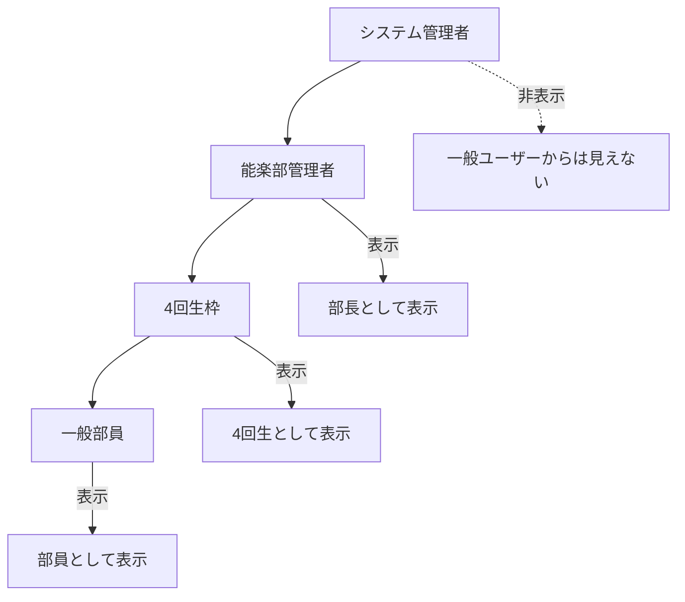

# BACK-DB-001.1: ユーザーアカウント・プロフィールテーブル設計

## 概要
能楽部練習表自動生成システムのユーザー情報を管理するデータベース構造をPythonとSupabaseを用いて設計・実装します。学生の認証情報、個人プロフィール、学籍情報、ロール管理を適切に管理し、システム全体のユーザー管理基盤を構築します。

## 詳細
- ユーザーアカウントテーブル設計と実装（認証情報管理）
- ユーザープロフィールテーブル設計と実装（学生個人情報管理）
- 学部マスターテーブル設計と実装（学部情報の正規化）
- 学科マスターテーブル設計と実装（学科情報の正規化）
- ユーザーロールテーブル設計と実装（権限管理）
- 外部キー制約と参照整合性の設定
- インデックス設計とパフォーマンス最適化

## 依存関係
- 親タスク: BACK-DB-001
- BACK-API-001.1: メールアドレス・パスワードによるログイン/ログアウトAPI実装

## 参照ファイル
- [設計書/10_データモデル_1_概要と主要エンティティ.md](../../../../../設計書/10_データモデル_1_概要と主要エンティティ.md)
- [設計書/11b_ER図詳細.md](../../../../../設計書/11b_ER図詳細.md)
- [設計書/11g_実装指針_バックエンド.md](../../../../../設計書/11g_実装指針_バックエンド.md)

## 成果物
- ユーザーアカウントテーブルSQL定義
- ユーザープロフィールテーブルSQL定義
- 学部マスターテーブルSQL定義
- 学科マスターテーブルSQL定義
- ユーザーロールテーブルSQL定義
- マイグレーションスクリプト
- Pythonデータモデル（Pydanticモデル）
- データアクセスレイヤーコード

## ステータス
- [x] 未開始
- [ ] 進行中
- [ ] レビュー中
- [ ] 完了

## 担当者
未割り当て

## 主要機能
1. **ユーザーアカウント管理**
   - ユーザーID管理（UUID）
   - 認証情報管理（メールアドレス・パスワード）
   - アカウント状態管理（有効/無効/ロック等）
   - 最終ログイン情報の追跡

2. **学生プロフィール情報管理**
   - 基本個人情報（氏名：漢字・カタカナ）
   - 学籍情報（学籍番号、学年、学部、学科、キャンパス）
   - 表示名とアバター画像管理
   - ユーザー設定の保存

3. **学部・学科情報管理**
   - 学部マスターデータの管理
   - 学科マスターデータの管理
   - キャンパス情報の管理
   - 学部・学科コードと名称の正規化
   - 学部と学科の階層関係管理

4. **ユーザーロール管理**
   - 階層的権限管理（システム管理者、能楽部管理者、4回生枠、一般部員）
   - ロール別アクセス制御
   - システム管理者の非表示化制御

## 実装予定ファイル
以下は実装予定の全ファイルのリストです。各ファイルの役割と目的を簡潔に記載します。

- `migrations/user_account.sql` - ユーザーアカウントテーブル定義SQL
- `migrations/user_profile.sql` - ユーザープロフィールテーブル定義SQL
- `migrations/departments.sql` - 学部マスターテーブル定義SQL
- `migrations/majors.sql` - 学科マスターテーブル定義SQL
- `migrations/user_roles.sql` - ユーザーロールテーブル定義SQL
- `app/models/user.py` - ユーザー関連Pydanticモデル定義
- `app/models/department.py` - 学部・学科関連Pydanticモデル定義
- `app/repositories/user_repository.py` - ユーザーデータアクセスレイヤー
- `app/repositories/department_repository.py` - 学部・学科データアクセスレイヤー
- `app/schemas/user_schemas.py` - ユーザーAPI用スキーマ定義
- `app/services/user_service.py` - ユーザーサービスロジック
- `tests/models/test_user_models.py` - ユーザーモデルのテスト
- `tests/repositories/test_user_repository.py` - リポジトリのテスト

## 設計図
### データベース構造図

### ロール階層図

## 実装アプローチ
### データベース設計と実装
1. **テーブル構造設計**
   - 正規化レベルの決定（第3正規形を基本）
   - 学部情報の正規化（マスターテーブル化）
   - ロール管理の分離
   - 列タイプとデフォルト値の決定
   - 制約条件の定義（PK, FK, UK, Check制約）
   - インデックス戦略の設計

2. **マイグレーションスクリプト作成**
   - テーブル作成SQLの記述
   - 学部マスターデータの初期投入
   - インデックス作成SQLの記述
   - RLSポリシー設定
   - Supabase用マイグレーションファイル構成

### Pythonモデル実装
1. **データモデル設計**
   - Pydanticベースモデルの実装
   - 学生情報特有のバリデーションルール
   - モデル間の関連付け
   - シリアル化/デシリアル化の実装

## 実装するすべてのファイル構成詳細
以下は全ての実装予定ファイルの詳細です。各ファイルごとに目的とクラス、メソッド、依存関係などを詳しく記載します。

### `migrations/user_account.sql`
**目的**: ユーザーアカウント情報を格納するテーブルを定義するSQL

**主要内容**:
- `users`テーブルの作成
- 主キー、一意制約、インデックスの設定
- RLSポリシー（行レベルセキュリティ）の設定
- コメントと説明の追加

### `migrations/user_profile.sql`
**目的**: 学生の個人プロフィール情報を格納するテーブルを定義するSQL

**主要内容**:
- `user_profiles`テーブルの作成
- 外部キー制約の設定（users, departments, majors）
- 学籍番号の一意制約設定
- インデックスの設定
- RLSポリシーの設定

### `migrations/departments.sql`
**目的**: 学部マスター情報を格納するテーブルを定義するSQL

**主要内容**:
- `departments`テーブルの作成
- 学部コードの一意制約設定
- 初期データ投入（主要学部情報）
- インデックスの設定

### `migrations/majors.sql`
**目的**: 学科マスター情報を格納するテーブルを定義するSQL

**主要内容**:
- `majors`テーブルの作成
- 学科コードの一意制約設定
- 初期データ投入（主要学科情報）
- インデックスの設定

### `migrations/user_roles.sql`
**目的**: ユーザーロール情報を格納するテーブルを定義するSQL

**主要内容**:
- `user_roles`テーブルの作成
- 外部キー制約の設定
- ロールタイプのCheck制約設定
- インデックスの設定
- RLSポリシーの設定

### `app/models/user.py`
**目的**: ユーザー関連のドメインモデルを定義するPythonファイル

**クラス/インターフェース**:
- `User`: ユーザーアカウントのドメインモデル
  - **継承/実装**: `pydantic.BaseModel`
  - **主要属性**:
    - `id: UUID` - ユーザーID
    - `email: EmailStr` - メールアドレス
    - `auth_provider: str` - 認証プロバイダ
    - `created_at: datetime` - 作成日時
    - `updated_at: datetime` - 更新日時
    - `last_login: Optional[datetime]` - 最終ログイン日時
    - `is_active: bool` - アクティブフラグ
    - `email_verified: bool` - メール検証済みフラグ
  - **主要メソッド**: 
    - `to_dict() -> dict` - 辞書形式に変換
  - **依存クラス**: なし

- `UserProfile`: 学生プロフィールのドメインモデル
  - **継承/実装**: `pydantic.BaseModel`
  - **主要属性**:
    - `id: UUID` - プロフィールID
    - `user_id: UUID` - ユーザーID参照
    - `student_id: str` - 学籍番号
    - `first_name_kanji: str` - 名（漢字）
    - `first_name_katakana: str` - 名（カタカナ）
    - `last_name_kanji: str` - 姓（漢字）
    - `last_name_katakana: str` - 姓（カタカナ）
    - `grade: int` - 学年（回生）
    - `department_id: UUID` - 学部ID参照
    - `major_id: UUID` - 学科ID参照
    - `avatar_url: Optional[str]` - アバターURL
    - `preferences: Dict[str, Any]` - ユーザー設定
    - `created_at: datetime` - 作成日時
    - `updated_at: datetime` - 更新日時
  - **主要メソッド**: 
    - `full_name_kanji() -> str` - フルネーム（漢字）を取得
    - `full_name_katakana() -> str` - フルネーム（カタカナ）を取得
    - `grade_display() -> str` - 学年表示（例：「3回生」）
    - `to_dict() -> dict` - 辞書形式に変換
  - **依存クラス**: なし

- `UserRole`: ユーザーロールのドメインモデル
  - **継承/実装**: `pydantic.BaseModel`
  - **主要属性**:
    - `id: UUID` - ロールID
    - `user_id: UUID` - ユーザーID参照
    - `role_type: str` - ロールタイプ（system_admin, club_admin, senior, general）
    - `is_visible_to_general: bool` - 一般ユーザーに表示するか
    - `created_at: datetime` - 作成日時
    - `updated_at: datetime` - 更新日時
  - **主要メソッド**: 
    - `is_admin() -> bool` - 管理者権限かどうか
    - `can_manage_users() -> bool` - ユーザー管理権限があるか
    - `role_display_name() -> str` - ロール表示名を取得
    - `to_dict() -> dict` - 辞書形式に変換
  - **依存クラス**: なし

### `app/models/department.py`
**目的**: 学部・学科関連のドメインモデルを定義するPythonファイル

**クラス/インターフェース**:
- `Department`: 学部のドメインモデル
  - **継承/実装**: `pydantic.BaseModel`
  - **主要属性**:
    - `id: UUID` - 学部ID
    - `department_code: str` - 学部コード
    - `department_name: str` - 学部名
    - `campus: str` - キャンパス（今出川/田辺）
    - `is_active: bool` - 有効フラグ
    - `created_at: datetime` - 作成日時
    - `updated_at: datetime` - 更新日時
  - **主要メソッド**: 
    - `full_display_name() -> str` - フル表示名（学部名 + キャンパス）
    - `is_imadegawa() -> bool` - 今出川キャンパスかどうか
    - `is_tanabe() -> bool` - 田辺キャンパスかどうか
    - `to_dict() -> dict` - 辞書形式に変換
  - **依存クラス**: なし

- `Major`: 学科のドメインモデル
  - **継承/実装**: `pydantic.BaseModel`
  - **主要属性**:
    - `id: UUID` - 学科ID
    - `department_id: UUID` - 学部ID参照
    - `major_code: str` - 学科コード
    - `major_name: str` - 学科名
    - `major_name_en: str` - 学科名（英語）
    - `is_active: bool` - 有効フラグ
    - `created_at: datetime` - 作成日時
    - `updated_at: datetime` - 更新日時
  - **主要メソッド**: 
    - `display_name() -> str` - 表示名を取得
    - `full_display_name_with_department(department_name: str) -> str` - 学部名付きフル表示名
    - `to_dict() -> dict` - 辞書形式に変換
  - **依存クラス**: なし

### `app/repositories/user_repository.py`
**目的**: ユーザー関連データのデータアクセス層を実装するPythonファイル

**クラス/インターフェース**:
- `UserRepository`: ユーザーデータにアクセスするリポジトリクラス
  - **継承/実装**: なし
  - **主要属性**:
    - `_db_client` - データベースクライアント
    - `_logger` - ロガー
  - **主要メソッド**: 
    - `__init__(db_client)` - コンストラクタ
    - `get_by_id(user_id: UUID) -> Optional[User]` - IDでユーザーを取得
    - `get_by_email(email: str) -> Optional[User]` - メールでユーザーを取得
    - `get_by_student_id(student_id: str) -> Optional[UserProfile]` - 学籍番号でプロフィール取得
    - `create(user_data: dict) -> User` - ユーザーを作成
    - `update(user_id: UUID, update_data: dict) -> User` - ユーザーを更新
    - `delete(user_id: UUID) -> bool` - ユーザーを削除
    - `get_profile(user_id: UUID) -> Optional[UserProfile]` - プロフィールを取得
    - `update_profile(user_id: UUID, profile_data: dict) -> UserProfile` - プロフィール更新
    - `get_user_role(user_id: UUID) -> Optional[UserRole]` - ユーザーロール取得
    - `update_user_role(user_id: UUID, role_type: str) -> UserRole` - ロール更新
    - `get_users_by_role(role_type: str, include_hidden: bool = False) -> List[User]` - ロール別ユーザー取得
  - **依存クラス**: `User`, `UserProfile`, `UserRole`

### `app/repositories/department_repository.py`
**目的**: 学部・学科関連データのデータアクセス層を実装するPythonファイル

**クラス/インターフェース**:
- `DepartmentRepository`: 学部データにアクセスするリポジトリクラス
  - **継承/実装**: なし
  - **主要属性**:
    - `_db_client` - データベースクライアント
    - `_logger` - ロガー
  - **主要メソッド**: 
    - `__init__(db_client)` - コンストラクタ
    - `get_all() -> List[Department]` - 全学部取得
    - `get_by_id(department_id: UUID) -> Optional[Department]` - IDで学部取得
    - `get_by_code(department_code: str) -> Optional[Department]` - コードで学部取得
    - `get_by_campus(campus: str) -> List[Department]` - キャンパス別学部取得
    - `create(department_data: dict) -> Department` - 学部作成
    - `update(department_id: UUID, update_data: dict) -> Department` - 学部更新
  - **依存クラス**: `Department`

- `MajorRepository`: 学科データにアクセスするリポジトリクラス
  - **継承/実装**: なし
  - **主要属性**:
    - `_db_client` - データベースクライアント
    - `_logger` - ロガー
  - **主要メソッド**: 
    - `__init__(db_client)` - コンストラクタ
    - `get_all() -> List[Major]` - 全学科取得
    - `get_by_id(major_id: UUID) -> Optional[Major]` - IDで学科取得
    - `get_by_code(major_code: str) -> Optional[Major]` - コードで学科取得
    - `get_by_department(department_id: UUID) -> List[Major]` - 学部別学科取得
    - `create(major_data: dict) -> Major` - 学科作成
    - `update(major_id: UUID, update_data: dict) -> Major` - 学科更新
  - **依存クラス**: `Major`

### `app/schemas/user_schemas.py`
**目的**: API通信用のユーザー関連データスキーマを定義するPythonファイル

**クラス/インターフェース**:
- `UserCreate`: ユーザー作成リクエストスキーマ
  - **継承/実装**: `pydantic.BaseModel`
  - **主要属性**:
    - `email: EmailStr` - メールアドレス
    - `password: str` - パスワード
    - `student_id: str` - 学籍番号
    - `first_name_kanji: str` - 名（漢字）
    - `first_name_katakana: str` - 名（カタカナ）
    - `last_name_kanji: str` - 姓（漢字）
    - `last_name_katakana: str` - 姓（カタカナ）
    - `grade: int` - 学年
    - `department_id: UUID` - 学部ID
    - `major_id: UUID` - 学科ID
    - `role_type: str` - ロールタイプ
  - **主要メソッド**: 
    - `validate_password(cls, v) -> str` - パスワード検証
    - `validate_student_id(cls, v) -> str` - 学籍番号検証
    - `validate_grade(cls, v) -> int` - 学年検証
    - `validate_katakana(cls, v) -> str` - カタカナ検証

- `UserResponse`: ユーザー情報レスポンススキーマ
  - **継承/実装**: `pydantic.BaseModel`
  - **主要属性**:
    - `id: UUID` - ユーザーID
    - `email: str` - メールアドレス
    - `is_active: bool` - アクティブ状態
    - `email_verified: bool` - メール検証状態
    - `created_at: datetime` - 作成日時
    - `profile: Optional[ProfileResponse]` - プロフィール情報
    - `role: Optional[RoleResponse]` - ロール情報

- `ProfileResponse`: プロフィール情報レスポンススキーマ
  - **継承/実装**: `pydantic.BaseModel`
  - **主要属性**:
    - `student_id: str` - 学籍番号
    - `full_name_kanji: str` - フルネーム（漢字）
    - `full_name_katakana: str` - フルネーム（カタカナ）
    - `grade: int` - 学年
    - `grade_display: str` - 学年表示
    - `avatar_url: Optional[str]` - アバターURL
    - `department: DepartmentResponse` - 学部情報
    - `major: MajorResponse` - 学科情報

- `RoleResponse`: ロール情報レスポンススキーマ
  - **継承/実装**: `pydantic.BaseModel`
  - **主要属性**:
    - `role_type: str` - ロールタイプ
    - `role_display_name: str` - ロール表示名
    - `is_visible_to_general: bool` - 一般ユーザーに表示するか

- `DepartmentResponse`: 学部情報レスポンススキーマ
  - **継承/実装**: `pydantic.BaseModel`
  - **主要属性**:
    - `id: UUID` - 学部ID
    - `department_name: str` - 学部名
    - `campus: str` - キャンパス
    - `full_display_name: str` - フル表示名

- `MajorResponse`: 学科情報レスポンススキーマ
  - **継承/実装**: `pydantic.BaseModel`
  - **主要属性**:
    - `id: UUID` - 学科ID
    - `major_name: str` - 学科名
    - `major_name_en: str` - 学科名（英語）
    - `display_name: str` - 表示名

### `app/services/user_service.py`
**目的**: ユーザー関連のビジネスロジックを実装するサービスクラスのPythonファイル

**クラス/インターフェース**:
- `UserService`: ユーザー関連のビジネスロジックを実装するサービス
  - **継承/実装**: なし
  - **主要属性**:
    - `_user_repository: UserRepository` - ユーザーリポジトリ
    - `_department_repository: DepartmentRepository` - 学部リポジトリ
    - `_auth_service` - 認証サービス
    - `_logger` - ロガー
  - **主要メソッド**: 
    - `__init__(user_repository: UserRepository, department_repository: DepartmentRepository, auth_service)` - コンストラクタ
    - `register_user(user_data: UserCreate) -> UserResponse` - ユーザー登録
    - `get_user_by_id(user_id: UUID, requester_role: str = 'general') -> Optional[UserResponse]` - ユーザー取得（権限考慮）
    - `get_user_by_student_id(student_id: str) -> Optional[UserResponse]` - 学籍番号でユーザー取得
    - `update_user_profile(user_id: UUID, profile_data: dict) -> ProfileResponse` - プロフィール更新
    - `get_users_by_grade(grade: int) -> List[UserResponse]` - 学年別ユーザー取得
    - `get_users_by_department(department_id: UUID) -> List[UserResponse]` - 学部別ユーザー取得
    - `get_users_by_major(major_id: UUID) -> List[UserResponse]` - 学科別ユーザー取得
    - `get_club_members(include_system_admin: bool = False) -> List[UserResponse]` - 部員一覧取得
    - `update_user_role(user_id: UUID, new_role: str, requester_role: str) -> bool` - ロール更新
    - `validate_student_id_uniqueness(student_id: str, exclude_user_id: Optional[UUID] = None) -> bool` - 学籍番号重複チェック
    - `deactivate_user(user_id: UUID) -> bool` - ユーザー無効化
    - `reactivate_user(user_id: UUID) -> bool` - ユーザー再有効化
  - **依存クラス**: `UserRepository`, `DepartmentRepository`, `UserCreate`, `UserResponse`, `ProfileResponse`

### `tests/models/test_user_models.py`
**目的**: ユーザーモデルのユニットテストを実装するPythonファイル

**クラス/インターフェース**:
- `TestUserModel`: ユーザーモデルのテストクラス
  - **継承/実装**: `unittest.TestCase`
  - **主要メソッド**: 
    - `setUp()` - テスト準備
    - `test_create_user()` - ユーザー作成テスト
    - `test_email_validation()` - メールアドレス検証テスト
    - `test_to_dict()` - 辞書変換テスト

- `TestUserProfileModel`: ユーザープロフィールモデルのテストクラス
  - **継承/実装**: `unittest.TestCase`
  - **主要メソッド**: 
    - `setUp()` - テスト準備
    - `test_create_profile()` - プロフィール作成テスト
    - `test_full_name_methods()` - フルネーム取得テスト
    - `test_grade_display()` - 学年表示テスト
    - `test_student_id_validation()` - 学籍番号検証テスト
    - `test_major_relationship()` - 学科関連テスト

- `TestUserRoleModel`: ユーザーロールモデルのテストクラス
  - **継承/実装**: `unittest.TestCase`
  - **主要メソッド**: 
    - `setUp()` - テスト準備
    - `test_create_role()` - ロール作成テスト
    - `test_admin_permissions()` - 管理者権限テスト
    - `test_visibility_settings()` - 表示設定テスト
    - `test_role_display_name()` - ロール表示名テスト

- `TestDepartmentModel`: 学部モデルのテストクラス
  - **継承/実装**: `unittest.TestCase`
  - **主要メソッド**: 
    - `setUp()` - テスト準備
    - `test_create_department()` - 学部作成テスト
    - `test_campus_methods()` - キャンパス判定テスト
    - `test_full_display_name()` - フル表示名テスト

- `TestMajorModel`: 学科モデルのテストクラス
  - **継承/実装**: `unittest.TestCase`
  - **主要メソッド**: 
    - `setUp()` - テスト準備
    - `test_create_major()` - 学科作成テスト
    - `test_display_name_methods()` - 表示名メソッドテスト
    - `test_department_relationship()` - 学部関連テスト

### `tests/repositories/test_user_repository.py`
**目的**: ユーザーリポジトリのユニットテストを実装するPythonファイル

**クラス/インターフェース**:
- `TestUserRepository`: ユーザーリポジトリのテストクラス
  - **継承/実装**: `unittest.TestCase`
  - **主要メソッド**: 
    - `setUp()` - テスト準備
    - `tearDown()` - テスト後処理
    - `test_get_by_id()` - ID取得テスト
    - `test_get_by_email()` - メール取得テスト
    - `test_get_by_student_id()` - 学籍番号取得テスト
    - `test_create_user()` - ユーザー作成テスト
    - `test_update_user()` - ユーザー更新テスト
    - `test_get_profile()` - プロフィール取得テスト
    - `test_update_profile()` - プロフィール更新テスト
    - `test_get_user_role()` - ロール取得テスト
    - `test_update_user_role()` - ロール更新テスト
    - `test_get_users_by_role()` - ロール別ユーザー取得テスト
    - `test_role_visibility()` - ロール表示制御テスト
    - `test_users_by_major()` - 学科別ユーザー取得テスト

- `TestDepartmentRepository`: 学部リポジトリのテストクラス
  - **継承/実装**: `unittest.TestCase`
  - **主要メソッド**: 
    - `setUp()` - テスト準備
    - `tearDown()` - テスト後処理
    - `test_get_all_departments()` - 全学部取得テスト
    - `test_get_by_id()` - ID取得テスト
    - `test_get_by_code()` - コード取得テスト
    - `test_get_by_campus()` - キャンパス別取得テスト
    - `test_create_department()` - 学部作成テスト
    - `test_update_department()` - 学部更新テスト

- `TestMajorRepository`: 学科リポジトリのテストクラス
  - **継承/実装**: `unittest.TestCase`
  - **主要メソッド**: 
    - `setUp()` - テスト準備
    - `tearDown()` - テスト後処理
    - `test_get_all_majors()` - 全学科取得テスト
    - `test_get_by_id()` - ID取得テスト
    - `test_get_by_code()` - コード取得テスト
    - `test_get_by_department()` - 学部別学科取得テスト
    - `test_create_major()` - 学科作成テスト
    - `test_update_major()` - 学科更新テスト

    - `test_role_visibility()` - ロール表示制御テスト
    - `test_users_by_major()` - 学科別ユーザー取得テスト

- `TestDepartmentRepository`: 学部リポジトリのテストクラス
  - **継承/実装**: `unittest.TestCase`
  - **主要メソッド**: 
    - `setUp()` - テスト準備
    - `tearDown()` - テスト後処理
    - `test_get_all_departments()` - 全学部取得テスト
    - `test_get_by_id()` - ID取得テスト
    - `test_get_by_code()` - コード取得テスト
    - `test_get_by_campus()` - キャンパス別取得テスト
    - `test_create_department()` - 学部作成テスト
    - `test_update_department()` - 学部更新テスト

- `TestMajorRepository`: 学科リポジトリのテストクラス
  - **継承/実装**: `unittest.TestCase`
  - **主要メソッド**: 
    - `setUp()` - テスト準備
    - `tearDown()` - テスト後処理
    - `test_get_all_majors()` - 全学科取得テスト
    - `test_get_by_id()` - ID取得テスト
    - `test_get_by_code()` - コード取得テスト
    - `test_get_by_department()` - 学部別学科取得テスト
    - `test_create_major()` - 学科作成テスト
    - `test_update_major()` - 学科更新テスト 

