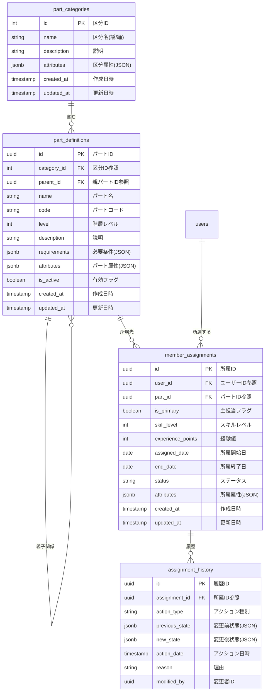

# BACK-DB-001.2: パート区分・メンバー所属テーブル設計

## 概要
練習表自動生成システムにおける謡と踊の区分、詳細なパート分類、およびメンバーの所属情報を管理するデータベース構造をPythonとSupabaseを用いて設計・実装します。パート体系の階層構造と柔軟なメンバー配属の仕組みを実現します。

## 詳細
- 謡/踊区分マスターテーブル設計と実装
- パート区分テーブル設計と実装（階層構造対応）
- メンバー所属テーブル設計と実装（複数所属対応）
- パート間の関連性とスキル要件のモデリング
- 所属履歴と経験値管理の設計

## 依存関係
- 親タスク: BACK-DB-001
- BACK-DB-001.1: ユーザーアカウント・プロフィールテーブル設計と実装

## 参照ファイル
- [設計書/10_データモデル_1_概要と主要エンティティ.md](../../../../../設計書/10_データモデル_1_概要と主要エンティティ.md)
- [設計書/11b_ER図詳細.md](../../../../../設計書/11b_ER図詳細.md)
- [設計書/11g_実装指針_バックエンド.md](../../../../../設計書/11g_実装指針_バックエンド.md)

## 成果物
- 謡踊区分マスターテーブルSQL定義
- パート区分テーブルSQL定義
- メンバー所属テーブルSQL定義
- マイグレーションスクリプト
- Pythonデータモデル（Pydanticモデル）
- データアクセスレイヤーコード

## ステータス
- [x] 未開始
- [ ] 進行中
- [ ] レビュー中
- [ ] 完了

## 担当者
未割り当て

## 主要機能
1. **パート区分管理**
   - 謡/踊の基本区分管理
   - パート階層構造の実現
   - パート間の関連性管理
   - 必要スキルと要件の定義

2. **メンバー所属管理**
   - メンバーのパート所属登録
   - 複数パート兼任の管理
   - 主担当/副担当の区別
   - スキルレベルと経験値の記録

3. **所属履歴管理**
   - 所属履歴の時系列記録
   - 実績と経験のトラッキング
   - パート変更履歴の管理
   - 統計情報の基盤提供

## 実装予定ファイル
以下は実装予定の全ファイルのリストです。各ファイルの役割と目的を簡潔に記載します。

- `migrations/part_category.sql` - 謡踊区分マスターテーブル定義SQL
- `migrations/part_definition.sql` - パート区分テーブル定義SQL
- `migrations/member_assignment.sql` - メンバー所属テーブル定義SQL
- `migrations/assignment_history.sql` - 所属履歴テーブル定義SQL
- `app/models/part.py` - パート関連Pydanticモデル定義
- `app/repositories/part_repository.py` - パートデータアクセスレイヤー
- `app/repositories/member_assignment_repository.py` - メンバー所属データアクセスレイヤー
- `app/schemas/part_schemas.py` - パート関連API用スキーマ定義
- `app/services/part_service.py` - パート管理サービスロジック
- `app/services/assignment_service.py` - 所属管理サービスロジック
- `tests/models/test_part_models.py` - パートモデルのテスト
- `tests/repositories/test_part_repository.py` - パートリポジトリのテスト

## 設計図
### データベース構造図

## 実装アプローチ
### データベース設計と実装
1. **階層構造の実装**
   - 再帰的関連によるツリー構造の実現
   - パスとレベルによる効率的な階層管理
   - パフォーマンスを考慮したクエリ最適化
   - 整合性チェック制約の実装

2. **メンバー所属モデリング**
   - 時間的変化に対応する設計
   - 重複所属と優先順位の管理
   - 統計分析のためのメタデータ追加
   - 履歴テーブルと現状テーブルの分離

## 実装するすべてのファイル構成詳細
以下は全ての実装予定ファイルの詳細です。各ファイルごとに目的とクラス、メソッド、依存関係などを詳しく記載します。

### `migrations/part_category.sql`
**目的**: 謡と踊の基本区分を管理するマスターテーブルを定義するSQL

**主要内容**:
- `part_categories`テーブルの作成
- 主キー、一意制約の設定
- 基本的なインデックスの設定
- コメントと説明の追加

### `migrations/part_definition.sql`
**目的**: パート区分の詳細と階層構造を管理するテーブルを定義するSQL

**主要内容**:
- `part_definitions`テーブルの作成
- 外部キー制約（自己参照を含む）の設定
- 階層検索用インデックスの設定
- チェック制約の設定
- RLSポリシーの設定

### `migrations/member_assignment.sql`
**目的**: メンバーのパート所属情報を管理するテーブルを定義するSQL

**主要内容**:
- `member_assignments`テーブルの作成
- 外部キー制約の設定
- 複合インデックスの設定
- チェック制約の設定
- RLSポリシーの設定

### `migrations/assignment_history.sql`
**目的**: パート所属の変更履歴を記録するテーブルを定義するSQL

**主要内容**:
- `assignment_history`テーブルの作成
- 外部キー制約の設定
- インデックスの設定
- RLSポリシーの設定

### `app/models/part.py`
**目的**: パート関連のドメインモデルを定義するPythonファイル

**クラス/インターフェース**:
- `PartCategory`: パートカテゴリのドメインモデル
  - **継承/実装**: `pydantic.BaseModel`
  - **主要属性**:
    - `id: int` - カテゴリID
    - `name: str` - カテゴリ名（謡/踊）
    - `description: str` - 説明
    - `attributes: Dict[str, Any]` - カテゴリ属性
    - `created_at: datetime` - 作成日時
    - `updated_at: datetime` - 更新日時
  - **主要メソッド**: 
    - `to_dict() -> dict` - 辞書形式に変換
  - **依存クラス**: なし

- `PartDefinition`: パート定義のドメインモデル
  - **継承/実装**: `pydantic.BaseModel`
  - **主要属性**:
    - `id: UUID` - パートID
    - `category_id: int` - カテゴリID参照
    - `parent_id: Optional[UUID]` - 親パートID参照
    - `name: str` - パート名
    - `code: str` - パートコード
    - `level: int` - 階層レベル
    - `description: Optional[str]` - 説明
    - `requirements: Dict[str, Any]` - 必要条件
    - `attributes: Dict[str, Any]` - パート属性
    - `is_active: bool` - 有効フラグ
    - `created_at: datetime` - 作成日時
    - `updated_at: datetime` - 更新日時
  - **主要メソッド**: 
    - `has_requirement(req_name: str) -> bool` - 特定の要件を持つか確認
    - `is_sub_part_of(parent_id: UUID) -> bool` - 特定パートの下位かどうか確認
    - `to_dict() -> dict` - 辞書形式に変換
  - **依存クラス**: なし

- `MemberAssignment`: メンバー所属のドメインモデル
  - **継承/実装**: `pydantic.BaseModel`
  - **主要属性**:
    - `id: UUID` - 所属ID
    - `user_id: UUID` - ユーザーID参照
    - `part_id: UUID` - パートID参照
    - `is_primary: bool` - 主担当フラグ
    - `skill_level: int` - スキルレベル
    - `experience_points: int` - 経験値
    - `assigned_date: date` - 所属開始日
    - `end_date: Optional[date]` - 所属終了日
    - `status: str` - ステータス
    - `attributes: Dict[str, Any]` - 所属属性
    - `created_at: datetime` - 作成日時
    - `updated_at: datetime` - 更新日時
  - **主要メソッド**: 
    - `is_active() -> bool` - 現在有効な所属かどうか確認
    - `duration_days() -> Optional[int]` - 所属期間（日数）を計算
    - `to_dict() -> dict` - 辞書形式に変換
  - **依存クラス**: なし

- `AssignmentHistory`: 所属履歴のドメインモデル
  - **継承/実装**: `pydantic.BaseModel`
  - **主要属性**:
    - `id: UUID` - 履歴ID
    - `assignment_id: UUID` - 所属ID参照
    - `action_type: str` - アクション種別
    - `previous_state: Dict[str, Any]` - 変更前状態
    - `new_state: Dict[str, Any]` - 変更後状態
    - `action_date: datetime` - アクション日時
    - `reason: Optional[str]` - 理由
    - `modified_by: UUID` - 変更者ID
  - **主要メソッド**: 
    - `get_changes() -> Dict[str, Tuple]` - 変更内容を取得
    - `to_dict() -> dict` - 辞書形式に変換
  - **依存クラス**: なし

### `app/repositories/part_repository.py`
**目的**: パート関連データのデータアクセス層を実装するPythonファイル

**クラス/インターフェース**:
- `PartRepository`: パートデータにアクセスするリポジトリクラス
  - **継承/実装**: なし
  - **主要属性**:
    - `_db_client` - データベースクライアント
    - `_logger` - ロガー
  - **主要メソッド**: 
    - `__init__(db_client)` - コンストラクタ
    - `get_categories() -> List[PartCategory]` - 全カテゴリを取得
    - `get_category(category_id: int) -> Optional[PartCategory]` - 特定カテゴリを取得
    - `create_category(category_data: dict) -> PartCategory` - カテゴリを作成
    - `update_category(category_id: int, data: dict) -> PartCategory` - カテゴリを更新
    - `get_parts() -> List[PartDefinition]` - 全パートを取得
    - `get_part(part_id: UUID) -> Optional[PartDefinition]` - 特定パートを取得
    - `create_part(part_data: dict) -> PartDefinition` - パートを作成
    - `update_part(part_id: UUID, data: dict) -> PartDefinition` - パートを更新
    - `get_child_parts(parent_id: UUID) -> List[PartDefinition]` - 子パートを取得
    - `get_part_tree(root_id: Optional[UUID] = None) -> Dict` - パート階層ツリーを取得
    - `get_parts_by_category(category_id: int) -> List[PartDefinition]` - カテゴリ別パート取得
  - **依存クラス**: `PartCategory`, `PartDefinition`

### `app/repositories/member_assignment_repository.py`
**目的**: メンバー所属データのデータアクセス層を実装するPythonファイル

**クラス/インターフェース**:
- `MemberAssignmentRepository`: メンバー所属データにアクセスするリポジトリクラス
  - **継承/実装**: なし
  - **主要属性**:
    - `_db_client` - データベースクライアント
    - `_logger` - ロガー
  - **主要メソッド**: 
    - `__init__(db_client)` - コンストラクタ
    - `get_user_assignments(user_id: UUID) -> List[MemberAssignment]` - ユーザーの所属一覧
    - `get_active_assignments(user_id: UUID) -> List[MemberAssignment]` - 有効な所属一覧
    - `get_assignment(assignment_id: UUID) -> Optional[MemberAssignment]` - 特定所属を取得
    - `create_assignment(assignment_data: dict) -> MemberAssignment` - 所属を作成
    - `update_assignment(assignment_id: UUID, data: dict) -> MemberAssignment` - 所属を更新
    - `end_assignment(assignment_id: UUID, end_date: date, reason: str = None) -> MemberAssignment` - 所属を終了
    - `get_part_members(part_id: UUID) -> List[MemberAssignment]` - パートのメンバー一覧
    - `get_assignment_history(assignment_id: UUID) -> List[AssignmentHistory]` - 所属履歴取得
    - `record_history(assignment_id: UUID, action_type: str, previous: dict, new: dict, reason: str, modified_by: UUID) -> AssignmentHistory` - 履歴記録
  - **依存クラス**: `MemberAssignment`, `AssignmentHistory`

### `app/schemas/part_schemas.py`
**目的**: API通信用のパート関連データスキーマを定義するPythonファイル

**クラス/インターフェース**:
- `CategoryCreate`: カテゴリ作成リクエストスキーマ
  - **継承/実装**: `pydantic.BaseModel`
  - **主要属性**:
    - `name: str` - カテゴリ名
    - `description: str` - 説明
    - `attributes: Optional[Dict[str, Any]]` - カテゴリ属性

- `CategoryResponse`: カテゴリ情報レスポンススキーマ
  - **継承/実装**: `pydantic.BaseModel`
  - **主要属性**:
    - `id: int` - カテゴリID
    - `name: str` - カテゴリ名
    - `description: str` - 説明
    - `attributes: Dict[str, Any]` - カテゴリ属性
    - `created_at: datetime` - 作成日時

- `PartCreate`: パート作成リクエストスキーマ
  - **継承/実装**: `pydantic.BaseModel`
  - **主要属性**:
    - `category_id: int` - カテゴリID
    - `parent_id: Optional[UUID]` - 親パートID
    - `name: str` - パート名
    - `code: str` - パートコード
    - `description: Optional[str]` - 説明
    - `requirements: Optional[Dict[str, Any]]` - 必要条件
    - `attributes: Optional[Dict[str, Any]]` - パート属性

- `PartResponse`: パート情報レスポンススキーマ
  - **継承/実装**: `pydantic.BaseModel`
  - **主要属性**:
    - `id: UUID` - パートID
    - `category_id: int` - カテゴリID
    - `parent_id: Optional[UUID]` - 親パートID
    - `name: str` - パート名
    - `code: str` - パートコード
    - `level: int` - 階層レベル
    - `description: Optional[str]` - 説明
    - `requirements: Dict[str, Any]` - 必要条件
    - `attributes: Dict[str, Any]` - パート属性
    - `is_active: bool` - 有効フラグ
    - `created_at: datetime` - 作成日時

- `AssignmentCreate`: 所属作成リクエストスキーマ
  - **継承/実装**: `pydantic.BaseModel`
  - **主要属性**:
    - `user_id: UUID` - ユーザーID
    - `part_id: UUID` - パートID
    - `is_primary: bool` - 主担当フラグ
    - `skill_level: int` - スキルレベル
    - `assigned_date: date` - 所属開始日
    - `attributes: Optional[Dict[str, Any]]` - 所属属性

- `AssignmentResponse`: 所属情報レスポンススキーマ
  - **継承/実装**: `pydantic.BaseModel`
  - **主要属性**:
    - `id: UUID` - 所属ID
    - `user_id: UUID` - ユーザーID
    - `part_id: UUID` - パートID
    - `part_name: str` - パート名
    - `is_primary: bool` - 主担当フラグ
    - `skill_level: int` - スキルレベル
    - `experience_points: int` - 経験値
    - `assigned_date: date` - 所属開始日
    - `end_date: Optional[date]` - 所属終了日
    - `status: str` - ステータス
    - `created_at: datetime` - 作成日時

### `app/services/part_service.py`
**目的**: パート管理のビジネスロジックを実装するサービスクラスのPythonファイル

**クラス/インターフェース**:
- `PartService`: パート管理のビジネスロジックを実装するサービス
  - **継承/実装**: なし
  - **主要属性**:
    - `_part_repository: PartRepository` - パートリポジトリ
    - `_logger` - ロガー
  - **主要メソッド**: 
    - `__init__(part_repository: PartRepository)` - コンストラクタ
    - `get_all_categories() -> List[CategoryResponse]` - 全カテゴリ取得
    - `create_category(category_data: CategoryCreate) -> CategoryResponse` - カテゴリ作成
    - `update_category(category_id: int, data: dict) -> CategoryResponse` - カテゴリ更新
    - `get_all_parts() -> List[PartResponse]` - 全パート取得
    - `get_part_details(part_id: UUID) -> PartResponse` - パート詳細取得
    - `create_part(part_data: PartCreate) -> PartResponse` - パート作成
    - `update_part(part_id: UUID, data: dict) -> PartResponse` - パート更新
    - `get_part_hierarchy() -> Dict` - パート階層取得
    - `get_category_parts(category_id: int) -> List[PartResponse]` - カテゴリ別パート取得
    - `validate_part_structure(part_id: UUID) -> bool` - パート構造検証
    - `deactivate_part(part_id: UUID) -> PartResponse` - パート無効化
    - `reactivate_part(part_id: UUID) -> PartResponse` - パート再有効化
    - `merge_parts(source_id: UUID, target_id: UUID) -> PartResponse` - パート統合
  - **依存クラス**: `PartRepository`, `CategoryCreate`, `CategoryResponse`, `PartCreate`, `PartResponse`

### `app/services/assignment_service.py`
**目的**: メンバー所属管理のビジネスロジックを実装するサービスクラスのPythonファイル

**クラス/インターフェース**:
- `AssignmentService`: メンバー所属管理のビジネスロジックを実装するサービス
  - **継承/実装**: なし
  - **主要属性**:
    - `_assignment_repository: MemberAssignmentRepository` - 所属リポジトリ
    - `_part_repository: PartRepository` - パートリポジトリ
    - `_user_service` - ユーザーサービス
    - `_logger` - ロガー
  - **主要メソッド**: 
    - `__init__(assignment_repository: MemberAssignmentRepository, part_repository: PartRepository, user_service)` - コンストラクタ
    - `get_user_assignments(user_id: UUID) -> List[AssignmentResponse]` - ユーザーの所属取得
    - `get_active_assignments(user_id: UUID) -> List[AssignmentResponse]` - 有効な所属取得
    - `assign_member(assignment_data: AssignmentCreate, created_by: UUID) -> AssignmentResponse` - メンバー所属登録
    - `update_assignment(assignment_id: UUID, data: dict, modified_by: UUID) -> AssignmentResponse` - 所属更新
    - `end_assignment(assignment_id: UUID, end_date: date, reason: str, modified_by: UUID) -> AssignmentResponse` - 所属終了
    - `get_part_members(part_id: UUID) -> List[AssignmentResponse]` - パートのメンバー取得
    - `get_assignment_history(assignment_id: UUID) -> List[Dict]` - 所属履歴取得
    - `add_experience_points(assignment_id: UUID, points: int, reason: str, modified_by: UUID) -> AssignmentResponse` - 経験値追加
    - `transfer_member(user_id: UUID, from_part_id: UUID, to_part_id: UUID, reason: str, modified_by: UUID) -> AssignmentResponse` - メンバー移動
    - `validate_assignment(user_id: UUID, part_id: UUID) -> Tuple[bool, List[str]]` - 所属可能性の検証
  - **依存クラス**: `MemberAssignmentRepository`, `PartRepository`, `AssignmentCreate`, `AssignmentResponse`

### `tests/models/test_part_models.py`
**目的**: パートモデルのユニットテストを実装するPythonファイル

**クラス/インターフェース**:
- `TestPartCategoryModel`: パートカテゴリモデルのテストクラス
  - **継承/実装**: `unittest.TestCase`
  - **主要メソッド**: 
    - `setUp()` - テスト準備
    - `test_create_category()` - カテゴリ作成テスト
    - `test_to_dict()` - 辞書変換テスト

- `TestPartDefinitionModel`: パート定義モデルのテストクラス
  - **継承/実装**: `unittest.TestCase`
  - **主要メソッド**: 
    - `setUp()` - テスト準備
    - `test_create_part()` - パート作成テスト
    - `test_has_requirement()` - 要件確認テスト
    - `test_is_sub_part_of()` - 下位パート確認テスト

- `TestMemberAssignmentModel`: メンバー所属モデルのテストクラス
  - **継承/実装**: `unittest.TestCase`
  - **主要メソッド**: 
    - `setUp()` - テスト準備
    - `test_create_assignment()` - 所属作成テスト
    - `test_is_active()` - 有効所属確認テスト
    - `test_duration_days()` - 所属期間計算テスト

### `tests/repositories/test_part_repository.py`
**目的**: パートリポジトリのユニットテストを実装するPythonファイル

**クラス/インターフェース**:
- `TestPartRepository`: パートリポジトリのテストクラス
  - **継承/実装**: `unittest.TestCase`
  - **主要メソッド**: 
    - `setUp()` - テスト準備
    - `tearDown()` - テスト後処理
    - `test_get_categories()` - カテゴリ取得テスト
    - `test_create_category()` - カテゴリ作成テスト
    - `test_update_category()` - カテゴリ更新テスト
    - `test_get_parts()` - パート取得テスト
    - `test_create_part()` - パート作成テスト
    - `test_update_part()` - パート更新テスト
    - `test_get_child_parts()` - 子パート取得テスト
    - `test_get_part_tree()` - パートツリー取得テスト 