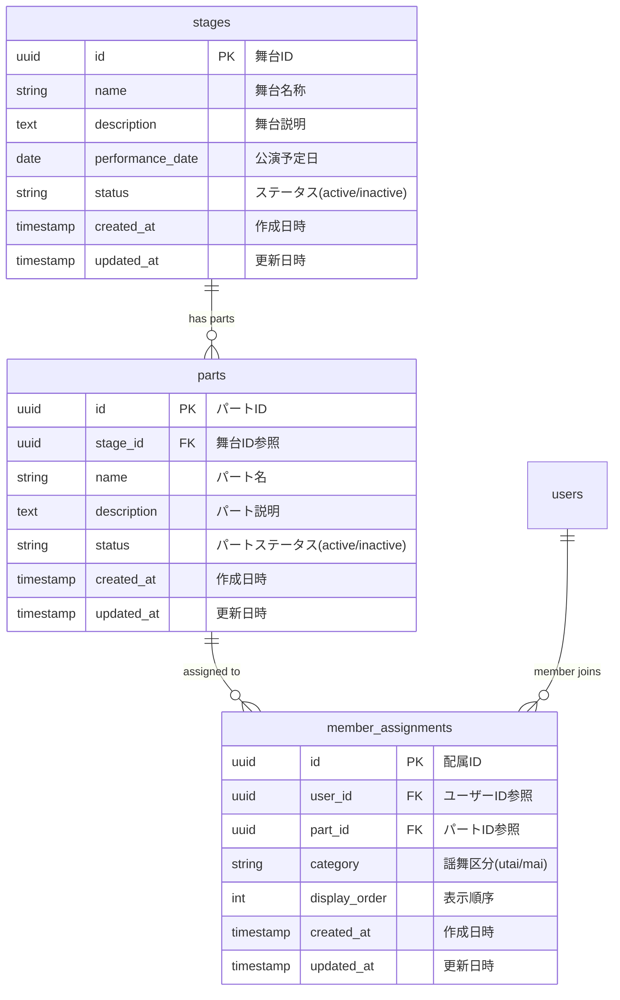

# BACK-DB-001.2: 舞台・パート・メンバー所属管理システム

## 概要
練習表自動生成システムにおいて、舞台とパート情報、メンバーの所属を管理する基本的な3テーブル構成を実装します。シンプルな構造で舞台ごとのパート管理と、メンバーの謡・舞への所属を明確に管理します。

## 詳細
- 舞台情報の管理
- 舞台に紐づくパート情報の管理
- メンバーのパート所属管理（謡・舞の区分）
- 既存usersテーブルとの連携
- シンプルな構造による効率的な練習表生成

## 依存関係
- 親タスク: BACK-DB-001
- BACK-DB-001.1: ユーザーアカウント・プロフィールテーブル設計と実装

## 参照ファイル
- [設計書/10_データモデル_1_概要と主要エンティティ.md](../../../../../設計書/10_データモデル_1_概要と主要エンティティ.md)
- [設計書/11b_ER図詳細.md](../../../../../設計書/11b_ER図詳細.md)
- [設計書/11g_実装指針_バックエンド.md](../../../../../設計書/11g_実装指針_バックエンド.md)

## 成果物
- 舞台テーブル設計（stages）
- パート情報テーブル設計（parts）
- メンバー所属テーブル設計（member_assignments）
- 舞台・パート・メンバー連携機能
- 謡・舞区分管理機能
- 舞台別練習表生成機能

## ステータス
- [x] 未開始
- [ ] 進行中
- [ ] レビュー中
- [ ] 完了

## 担当者
未割り当て

## 実装予定ファイル

### データベース設計
- `migrations/stage_part_member.sql` - 舞台・パート・メンバー管理テーブル群
  - `stages` - 舞台テーブル
  - `parts` - パート情報テーブル
  - `member_assignments` - メンバー所属テーブル

### API・サービス層
- `app/models/stage.py` - 舞台モデル定義
- `app/models/part.py` - パートモデル定義
- `app/models/member_assignment.py` - メンバー所属モデル定義
- `app/services/stage_service.py` - 舞台管理サービス
- `app/services/part_service.py` - パート管理サービス
- `app/services/assignment_service.py` - メンバー所属管理サービス
- `app/api/stage_api.py` - 舞台管理API
- `app/api/part_api.py` - パート管理API
- `app/api/assignment_api.py` - メンバー所属管理API
- `app/schemas/stage_schemas.py` - 舞台・パート・所属用スキーマ

## データベース設計図

### 舞台・パート・メンバー所属管理システム

