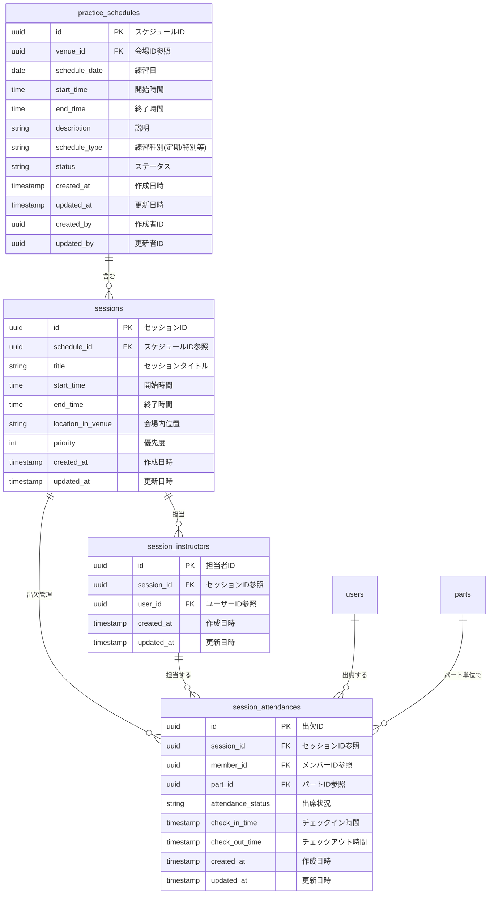

# BACK-DB-001.3: 練習スケジュール・セッションテーブル設計

## 概要
練習表自動生成システムの中核となる練習スケジュールとセッション管理のデータベース構造をPythonとSupabaseを用いて設計・実装します。複数日程、会場、パート、担当講師を効率的に管理できる柔軟なデータモデルを構築します。

## 詳細
- 練習スケジュールマスターテーブル設計と実装
- セッション詳細テーブル設計と実装
- セッション担当者テーブル設計と実装
- セッション出欠管理テーブル設計と実装（パート別メンバー出欠を管理）
- スケジュールの時系列管理機能の実装

## 依存関係
- 親タスク: BACK-DB-001
- BACK-DB-001.1: ユーザーアカウント・プロフィールテーブル設計と実装
- BACK-DB-001.2: パート区分・メンバー所属テーブル設計と実装
- BACK-DB-001.4: 会場マスタ・利用可能時間テーブル設計と実装

## 参照ファイル
- [設計書/10_データモデル_1_概要と主要エンティティ.md](../../../../../設計書/10_データモデル_1_概要と主要エンティティ.md)
- [設計書/11b_ER図詳細.md](../../../../../設計書/11b_ER図詳細.md)
- [設計書/11g_実装指針_バックエンド.md](../../../../../設計書/11g_実装指針_バックエンド.md)

## 成果物
- 練習スケジュールマスターテーブルSQL定義
- セッション詳細テーブルSQL定義
- セッション担当者テーブルSQL定義
- マイグレーションスクリプト
- Pythonデータモデル（Pydanticモデル）
- データアクセスレイヤーコード

## ステータス
- [x] 未開始
- [ ] 進行中
- [ ] レビュー中
- [ ] 完了

## 担当者
未割り当て

## 主要機能
1. **練習スケジュール管理**
   - 練習日程と基本情報の管理
   - 練習全体のステータス管理
   - 練習タイプと目的の分類
   - 関連情報と備考の記録

2. **セッション詳細管理**
   - 時間枠とタイムスロット管理
   - セッション内容と目標設定
   - 必要リソースとスペース配置
   - セッション種別と優先度管理

3. **担当者管理**
   - セッション講師の割り当て
   - 責任者と補助者の区別
   - 担当者の役割定義
   - 担当履歴の記録と追跡

4. **セッション出欠管理**
   - パートメンバー個別の出欠記録
   - 出席状況（出席・欠席・遅刻・早退）の管理
   - 欠席理由と備考の記録
   - チェックイン・チェックアウト時間の管理

## 実装予定ファイル
以下は実装予定の全ファイルのリストです。各ファイルの役割と目的を簡潔に記載します。

- `migrations/practice_schedule.sql` - 練習スケジュールテーブル定義SQL
- `migrations/session.sql` - セッション詳細テーブル定義SQL
- `migrations/session_instructor.sql` - セッション担当者テーブル定義SQL
- `migrations/session_attendance.sql` - セッション出欠管理テーブル定義SQL
- `app/models/schedule.py` - スケジュール関連Pydanticモデル定義
- `app/repositories/schedule_repository.py` - スケジュールデータアクセスレイヤー
- `app/repositories/session_repository.py` - セッションデータアクセスレイヤー
- `app/schemas/schedule_schemas.py` - スケジュール関連API用スキーマ定義
- `app/services/schedule_service.py` - スケジュール管理サービスロジック
- `app/services/session_service.py` - セッション管理サービスロジック
- `tests/models/test_schedule_models.py` - スケジュールモデルのテスト
- `tests/repositories/test_schedule_repository.py` - スケジュールリポジトリのテスト

## 設計図
### データベース構造図

## 実装アプローチ
### データベース設計と実装
1. **スケジュールと時間管理**
   - 効率的な日時クエリを実現するインデックス設計
   - 時間重複を回避する整合性制約の実装
   - 柔軟な繰り返しパターンに対応するデータ構造
   - ステータス移行の管理方法の実装

2. **セッションとパート連携**
   - 多対多関係の効率的な実装
   - 優先度ベースのソート機能の実現
   - パートグループ単位での割り当て機能
   - 参加者数推定のロジック設計

## 実装するすべてのファイル構成詳細
以下は全ての実装予定ファイルの詳細です。各ファイルごとに目的とクラス、メソッド、依存関係などを詳しく記載します。

### `migrations/practice_schedule.sql`
**目的**: 練習スケジュールマスター情報を格納するテーブルを定義するSQL

**主要内容**:
- `practice_schedules`テーブルの作成
- 主キー、外部キー制約の設定
- 日付と時間に関するインデックスの設定
- 重複チェック制約の設定
- RLSポリシーの設定

### `migrations/session.sql`
**目的**: セッション詳細情報を格納するテーブルを定義するSQL

**主要内容**:
- `sessions`テーブルの作成
- 主キー、外部キー制約の設定
- 時間重複チェック制約の設定
- 優先度に関するインデックスの設定
- RLSポリシーの設定

### `migrations/session_instructor.sql`
**目的**: セッション担当者情報を格納するテーブルを定義するSQL

**主要内容**:
- `session_instructors`テーブルの作成
- 主キー、外部キー制約の設定
- ユニーク制約の設定
- インデックスの設定
- RLSポリシーの設定

### `migrations/session_attendance.sql`
**目的**: セッション出欠管理情報を格納するテーブルを定義するSQL

**主要内容**:
- `session_attendances`テーブルの作成
- 主キー、外部キー制約の設定
- ユニーク制約の設定（session_id, member_id, part_id）
- 出席状況のENUM制約設定
- インデックスの設定
- RLSポリシーの設定

### `app/models/schedule.py`
**目的**: スケジュール関連のドメインモデルを定義するPythonファイル

**クラス/インターフェース**:
- `PracticeSchedule`: 練習スケジュールのドメインモデル
  - **継承/実装**: `pydantic.BaseModel`
  - **主要属性**:
    - `id: UUID` - スケジュールID
    - `venue_id: UUID` - 会場ID
    - `schedule_date: date` - 練習日
    - `start_time: time` - 開始時間
    - `end_time: time` - 終了時間
    - `title: str` - 練習タイトル
    - `description: Optional[str]` - 説明
    - `schedule_type: str` - 練習種別
    - `status: str` - ステータス
    - `metadata: Dict[str, Any]` - メタデータ
    - `created_at: datetime` - 作成日時
    - `updated_at: datetime` - 更新日時
    - `created_by: UUID` - 作成者ID
  - **主要メソッド**: 
    - `duration_minutes() -> int` - 練習時間（分）を計算
    - `is_active() -> bool` - 有効なスケジュールかどうか確認
    - `to_dict() -> dict` - 辞書形式に変換
  - **依存クラス**: なし

- `Session`: セッションのドメインモデル
  - **継承/実装**: `pydantic.BaseModel`
  - **主要属性**:
    - `id: UUID` - セッションID
    - `schedule_id: UUID` - スケジュールID参照
    - `start_time: time` - 開始時間
    - `end_time: time` - 終了時間
    - `title: str` - セッションタイトル
    - `description: Optional[str]` - 説明
    - `session_type: str` - セッション種別
    - `priority: int` - 優先度
    - `resources: Dict[str, Any]` - 必要リソース
    - `location_in_venue: Optional[str]` - 会場内位置
    - `status: str` - ステータス
    - `created_at: datetime` - 作成日時
    - `updated_at: datetime` - 更新日時
  - **主要メソッド**: 
    - `duration_minutes() -> int` - セッション時間（分）を計算
    - `overlaps_with(other_session: Session) -> bool` - 他のセッションと重複するか確認
    - `to_dict() -> dict` - 辞書形式に変換
  - **依存クラス**: なし

- `SessionInstructor`: セッション担当者のドメインモデル
  - **継承/実装**: `pydantic.BaseModel`
  - **主要属性**:
    - `id: UUID` - 担当者ID
    - `session_id: UUID` - セッションID参照
    - `user_id: UUID` - ユーザーID参照
    - `role: str` - 役割
    - `status: str` - ステータス
    - `notes: Dict[str, Any]` - 備考
    - `created_at: datetime` - 作成日時
    - `updated_at: datetime` - 更新日時
  - **主要メソッド**: 
    - `is_primary() -> bool` - 主担当かどうか確認
    - `to_dict() -> dict` - 辞書形式に変換
  - **依存クラス**: なし

- `SessionAttendance`: セッション出欠記録のドメインモデル
  - **継承/実装**: `pydantic.BaseModel`
  - **主要属性**:
    - `id: UUID` - 出欠ID
    - `session_id: UUID` - セッションID参照
    - `member_id: UUID` - メンバーID参照
    - `part_id: UUID` - パートID参照
    - `attendance_status: str` - 出席状況
    - `absence_reason: Optional[str]` - 欠席理由
    - `check_in_time: Optional[datetime]` - チェックイン時間
    - `check_out_time: Optional[datetime]` - チェックアウト時間
    - `notes: Optional[str]` - 備考
    - `recorded_by: Optional[UUID]` - 記録者ID
    - `created_at: datetime` - 作成日時
    - `updated_at: datetime` - 更新日時
  - **主要メソッド**: 
    - `is_present() -> bool` - 出席しているかどうか確認
    - `duration_minutes() -> Optional[int]` - 参加時間（分）を計算
    - `to_dict() -> dict` - 辞書形式に変換
  - **依存クラス**: なし

### `app/repositories/schedule_repository.py`
**目的**: スケジュール関連データのデータアクセス層を実装するPythonファイル

**クラス/インターフェース**:
- `ScheduleRepository`: スケジュールデータにアクセスするリポジトリクラス
  - **継承/実装**: なし
  - **主要属性**:
    - `_db_client` - データベースクライアント
    - `_logger` - ロガー
  - **主要メソッド**: 
    - `__init__(db_client)` - コンストラクタ
    - `get_schedule(schedule_id: UUID) -> Optional[PracticeSchedule]` - スケジュールを取得
    - `get_schedules_by_date_range(start_date: date, end_date: date) -> List[PracticeSchedule]` - 日付範囲でスケジュール取得
    - `get_schedules_by_venue(venue_id: UUID, start_date: Optional[date] = None) -> List[PracticeSchedule]` - 会場別スケジュール取得
    - `create_schedule(schedule_data: dict) -> PracticeSchedule` - スケジュール作成
    - `update_schedule(schedule_id: UUID, data: dict) -> PracticeSchedule` - スケジュール更新
    - `delete_schedule(schedule_id: UUID) -> bool` - スケジュール削除
    - `change_schedule_status(schedule_id: UUID, status: str) -> PracticeSchedule` - ステータス変更
  - **依存クラス**: `PracticeSchedule`

### `app/repositories/session_repository.py`
**目的**: セッション関連データのデータアクセス層を実装するPythonファイル

**クラス/インターフェース**:
- `SessionRepository`: セッションデータにアクセスするリポジトリクラス
  - **継承/実装**: なし
  - **主要属性**:
    - `_db_client` - データベースクライアント
    - `_logger` - ロガー
  - **主要メソッド**: 
    - `__init__(db_client)` - コンストラクタ
    - `get_session(session_id: UUID) -> Optional[Session]` - セッションを取得
    - `get_sessions_by_schedule(schedule_id: UUID) -> List[Session]` - スケジュール別セッション取得
    - `create_session(session_data: dict) -> Session` - セッション作成
    - `update_session(session_id: UUID, data: dict) -> Session` - セッション更新
    - `delete_session(session_id: UUID) -> bool` - セッション削除
    - `get_session_instructors(session_id: UUID) -> List[SessionInstructor]` - セッション担当者取得
    - `add_instructor(instructor_data: dict) -> SessionInstructor` - 担当者追加
    - `remove_instructor(instructor_id: UUID) -> bool` - 担当者削除
    - `get_session_attendances(session_id: UUID) -> List[SessionAttendance]` - セッション出欠記録取得
    - `record_attendance(attendance_data: dict) -> SessionAttendance` - 出欠記録
    - `update_attendance(attendance_id: UUID, data: dict) -> SessionAttendance` - 出欠更新
    - `get_member_attendances(member_id: UUID, start_date: Optional[date] = None) -> List[SessionAttendance]` - メンバー別出欠取得
    - `get_part_attendances(part_id: UUID, session_id: UUID) -> List[SessionAttendance]` - パート別出欠取得
  - **依存クラス**: `Session`, `SessionInstructor`, `SessionAttendance`

### `app/schemas/schedule_schemas.py`
**目的**: API通信用のスケジュール関連データスキーマを定義するPythonファイル

**クラス/インターフェース**:
- `ScheduleCreate`: スケジュール作成リクエストスキーマ
  - **継承/実装**: `pydantic.BaseModel`
  - **主要属性**:
    - `venue_id: UUID` - 会場ID
    - `schedule_date: date` - 練習日
    - `start_time: time` - 開始時間
    - `end_time: time` - 終了時間
    - `title: str` - 練習タイトル
    - `description: Optional[str]` - 説明
    - `schedule_type: str` - 練習種別
    - `metadata: Optional[Dict[str, Any]]` - メタデータ

- `ScheduleResponse`: スケジュール情報レスポンススキーマ
  - **継承/実装**: `pydantic.BaseModel`
  - **主要属性**:
    - `id: UUID` - スケジュールID
    - `venue_id: UUID` - 会場ID
    - `venue_name: str` - 会場名
    - `schedule_date: date` - 練習日
    - `start_time: time` - 開始時間
    - `end_time: time` - 終了時間
    - `title: str` - 練習タイトル
    - `description: Optional[str]` - 説明
    - `schedule_type: str` - 練習種別
    - `status: str` - ステータス
    - `metadata: Dict[str, Any]` - メタデータ
    - `created_at: datetime` - 作成日時
    - `sessions_count: int` - セッション数

- `SessionCreate`: セッション作成リクエストスキーマ
  - **継承/実装**: `pydantic.BaseModel`
  - **主要属性**:
    - `schedule_id: UUID` - スケジュールID
    - `start_time: time` - 開始時間
    - `end_time: time` - 終了時間
    - `title: str` - セッションタイトル
    - `description: Optional[str]` - 説明
    - `session_type: str` - セッション種別
    - `priority: int` - 優先度
    - `resources: Optional[Dict[str, Any]]` - 必要リソース
    - `location_in_venue: Optional[str]` - 会場内位置

- `SessionResponse`: セッション情報レスポンススキーマ
  - **継承/実装**: `pydantic.BaseModel`
  - **主要属性**:
    - `id: UUID` - セッションID
    - `schedule_id: UUID` - スケジュールID
    - `start_time: time` - 開始時間
    - `end_time: time` - 終了時間
    - `title: str` - セッションタイトル
    - `description: Optional[str]` - 説明
    - `session_type: str` - セッション種別
    - `priority: int` - 優先度
    - `resources: Dict[str, Any]` - 必要リソース
    - `location_in_venue: Optional[str]` - 会場内位置
    - `status: str` - ステータス
    - `created_at: datetime` - 作成日時
    - `instructors: List[InstructorResponse]` - 担当者リスト
    - `parts: List[PartAssignmentResponse]` - パート割り当てリスト

- `InstructorCreate`: 担当者追加リクエストスキーマ
  - **継承/実装**: `pydantic.BaseModel`
  - **主要属性**:
    - `session_id: UUID` - セッションID
    - `user_id: UUID` - ユーザーID
    - `role: str` - 役割
    - `notes: Optional[Dict[str, Any]]` - 備考

- `InstructorResponse`: 担当者情報レスポンススキーマ
  - **継承/実装**: `pydantic.BaseModel`
  - **主要属性**:
    - `id: UUID` - 担当者ID
    - `session_id: UUID` - セッションID
    - `user_id: UUID` - ユーザーID
    - `user_name: str` - ユーザー名
    - `role: str` - 役割
    - `status: str` - ステータス
    - `notes: Dict[str, Any]` - 備考

- `PartAssignmentCreate`: パート割り当てリクエストスキーマ
  - **継承/実装**: `pydantic.BaseModel`
  - **主要属性**:
    - `session_id: UUID` - セッションID
    - `part_id: UUID` - パートID
    - `priority: int` - 優先度
    - `is_required: bool` - 必須参加フラグ
    - `special_requirements: Optional[Dict[str, Any]]` - 特別要件

- `PartAssignmentResponse`: パート割り当て情報レスポンススキーマ
  - **継承/実装**: `pydantic.BaseModel`
  - **主要属性**:
    - `id: UUID` - 割り当てID
    - `session_id: UUID` - セッションID
    - `part_id: UUID` - パートID
    - `part_name: str` - パート名
    - `priority: int` - 優先度
    - `is_required: bool` - 必須参加フラグ
    - `special_requirements: Dict[str, Any]` - 特別要件
    - `status: str` - ステータス

### `app/services/schedule_service.py`
**目的**: スケジュール管理のビジネスロジックを実装するサービスクラスのPythonファイル

**クラス/インターフェース**:
- `ScheduleService`: スケジュール管理のビジネスロジックを実装するサービス
  - **継承/実装**: なし
  - **主要属性**:
    - `_schedule_repository: ScheduleRepository` - スケジュールリポジトリ
    - `_venue_service` - 会場サービス
    - `_logger` - ロガー
  - **主要メソッド**: 
    - `__init__(schedule_repository: ScheduleRepository, venue_service)` - コンストラクタ
    - `get_schedule_details(schedule_id: UUID) -> ScheduleResponse` - スケジュール詳細取得
    - `create_schedule(schedule_data: ScheduleCreate, created_by: UUID) -> ScheduleResponse` - スケジュール作成
    - `update_schedule(schedule_id: UUID, data: dict) -> ScheduleResponse` - スケジュール更新
    - `delete_schedule(schedule_id: UUID) -> bool` - スケジュール削除
    - `publish_schedule(schedule_id: UUID) -> ScheduleResponse` - スケジュール公開
    - `cancel_schedule(schedule_id: UUID, reason: str) -> ScheduleResponse` - スケジュールキャンセル
    - `get_schedules_by_month(year: int, month: int) -> List[ScheduleResponse]` - 月別スケジュール取得
    - `check_venue_availability(venue_id: UUID, date: date, start_time: time, end_time: time) -> bool` - 会場空き状況確認
    - `get_upcoming_schedules(days: int = 30) -> List[ScheduleResponse]` - 今後のスケジュール取得
    - `copy_schedule(source_id: UUID, target_date: date) -> ScheduleResponse` - スケジュールコピー
  - **依存クラス**: `ScheduleRepository`, `ScheduleCreate`, `ScheduleResponse`

### `app/services/session_service.py`
**目的**: セッション管理のビジネスロジックを実装するサービスクラスのPythonファイル

**クラス/インターフェース**:
- `SessionService`: セッション管理のビジネスロジックを実装するサービス
  - **継承/実装**: なし
  - **主要属性**:
    - `_session_repository: SessionRepository` - セッションリポジトリ
    - `_schedule_repository: ScheduleRepository` - スケジュールリポジトリ
    - `_user_service` - ユーザーサービス
    - `_part_service` - パート管理サービス
    - `_logger` - ロガー
  - **主要メソッド**: 
    - `__init__(session_repository: SessionRepository, schedule_repository: ScheduleRepository, user_service, part_service)` - コンストラクタ
    - `get_session_details(session_id: UUID) -> SessionResponse` - セッション詳細取得
    - `get_schedule_sessions(schedule_id: UUID) -> List[SessionResponse]` - スケジュール別セッション取得
    - `create_session(session_data: SessionCreate) -> SessionResponse` - セッション作成
    - `update_session(session_id: UUID, data: dict) -> SessionResponse` - セッション更新
    - `delete_session(session_id: UUID) -> bool` - セッション削除
    - `add_instructor(instructor_data: InstructorCreate) -> InstructorResponse` - 担当者追加
    - `remove_instructor(instructor_id: UUID) -> bool` - 担当者削除
    - `assign_part(assignment_data: PartAssignmentCreate) -> PartAssignmentResponse` - パート割り当て
    - `remove_part_assignment(assignment_id: UUID) -> bool` - パート割り当て解除
    - `validate_session_time(schedule_id: UUID, start_time: time, end_time: time) -> Tuple[bool, List[str]]` - セッション時間の検証
    - `get_instructor_sessions(user_id: UUID, start_date: date, end_date: date) -> List[SessionResponse]` - 担当者別セッション取得
    - `get_part_sessions(part_id: UUID, start_date: date, end_date: date) -> List[SessionResponse]` - パート別セッション取得
    - `record_attendance(attendance_data: AttendanceCreate) -> AttendanceResponse` - 出欠記録
    - `update_attendance(attendance_id: UUID, data: dict) -> AttendanceResponse` - 出欠更新
    - `get_session_attendance_summary(session_id: UUID) -> Dict[str, Any]` - セッション出欠サマリー取得
    - `get_member_attendance_history(member_id: UUID, start_date: date, end_date: date) -> List[AttendanceResponse]` - メンバー出欠履歴取得
    - `bulk_record_attendance(session_id: UUID, attendances: List[AttendanceCreate]) -> List[AttendanceResponse]` - 一括出欠記録
  - **依存クラス**: `SessionRepository`, `ScheduleRepository`, `SessionCreate`, `SessionResponse`, `InstructorCreate`, `InstructorResponse`, `PartAssignmentCreate`, `PartAssignmentResponse`, `AttendanceCreate`, `AttendanceResponse`

### `tests/models/test_schedule_models.py`
**目的**: スケジュールモデルのユニットテストを実装するPythonファイル

**クラス/インターフェース**:
- `TestPracticeScheduleModel`: 練習スケジュールモデルのテストクラス
  - **継承/実装**: `unittest.TestCase`
  - **主要メソッド**: 
    - `setUp()` - テスト準備
    - `test_create_schedule()` - スケジュール作成テスト
    - `test_duration_minutes()` - 練習時間計算テスト
    - `test_is_active()` - 有効状態確認テスト
    - `test_to_dict()` - 辞書変換テスト

- `TestSessionModel`: セッションモデルのテストクラス
  - **継承/実装**: `unittest.TestCase`
  - **主要メソッド**: 
    - `setUp()` - テスト準備
    - `test_create_session()` - セッション作成テスト
    - `test_duration_minutes()` - セッション時間計算テスト
    - `test_overlaps_with()` - 時間重複確認テスト

- `TestSessionInstructorModel`: セッション担当者モデルのテストクラス
  - **継承/実装**: `unittest.TestCase`
  - **主要メソッド**: 
    - `setUp()` - テスト準備
    - `test_create_instructor()` - 担当者作成テスト
    - `test_is_primary()` - 主担当確認テスト

### `tests/repositories/test_schedule_repository.py`
**目的**: スケジュールリポジトリのユニットテストを実装するPythonファイル

**クラス/インターフェース**:
- `TestScheduleRepository`: スケジュールリポジトリのテストクラス
  - **継承/実装**: `unittest.TestCase`
  - **主要メソッド**: 
    - `setUp()` - テスト準備
    - `tearDown()` - テスト後処理
    - `test_get_schedule()` - スケジュール取得テスト
    - `test_get_schedules_by_date_range()` - 日付範囲取得テスト
    - `test_get_schedules_by_venue()` - 会場別取得テスト
    - `test_create_schedule()` - スケジュール作成テスト
    - `test_update_schedule()` - スケジュール更新テスト
    - `test_change_schedule_status()` - ステータス変更テスト 
