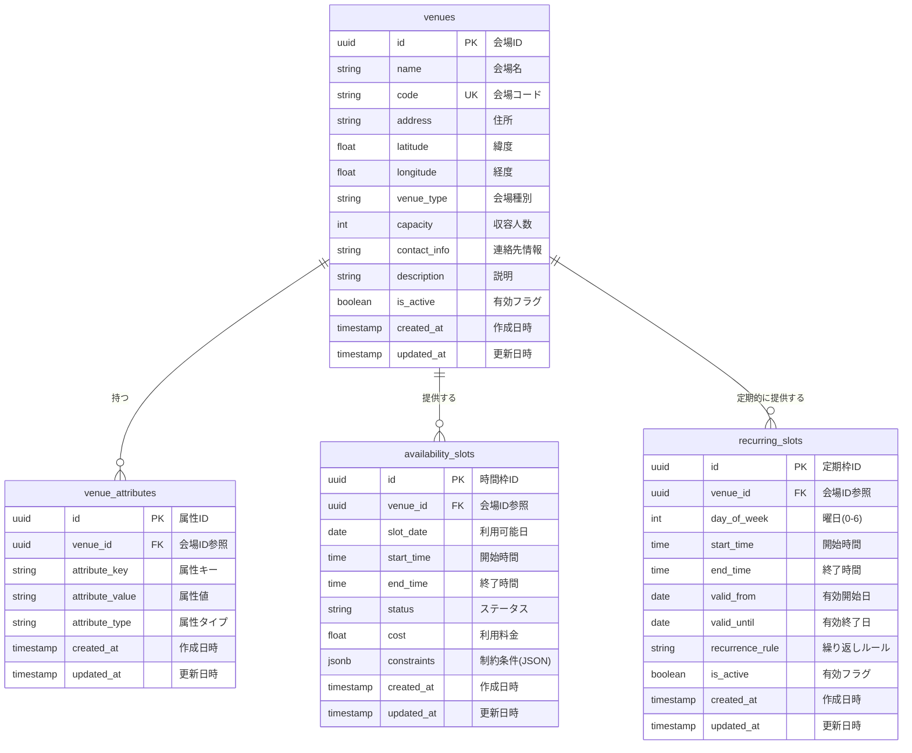

# BACK-DB-001.4: 会場マスタ・利用可能時間テーブル設計

## 概要
練習表自動生成システムの会場情報と利用可能時間を管理するデータベース構造をPythonとSupabaseを用いて設計・実装します。会場の基本情報、詳細な属性、利用可能時間枠を効率的に管理するモデルを構築します。

## 詳細
- 会場マスターテーブル設計と実装
- 会場属性テーブル設計と実装
- 利用可能時間枠テーブル設計と実装
- 定期予約枠テーブル設計と実装
- タイムスロット管理機能の実装

## 依存関係
- 親タスク: BACK-DB-001
- BACK-DB-001.3: 練習スケジュール・セッションテーブル設計と実装

## 参照ファイル
- [設計書/10_データモデル_1_概要と主要エンティティ.md](../../../../../設計書/10_データモデル_1_概要と主要エンティティ.md)
- [設計書/11b_ER図詳細.md](../../../../../設計書/11b_ER図詳細.md)
- [設計書/11g_実装指針_バックエンド.md](../../../../../設計書/11g_実装指針_バックエンド.md)

## 成果物
- 会場マスターテーブルSQL定義
- 会場属性テーブルSQL定義
- 利用可能時間枠テーブルSQL定義
- 定期予約枠テーブルSQL定義
- マイグレーションスクリプト
- Pythonデータモデル（Pydanticモデル）
- データアクセスレイヤーコード

## ステータス
- [x] 未開始
- [ ] 進行中
- [ ] レビュー中
- [ ] 完了

## 担当者
未割り当て

## 主要機能
1. **会場マスター管理**
   - 会場基本情報の管理
   - 住所と地理情報の管理
   - 会場種別と収容人数管理
   - 連絡先と責任者情報の管理

2. **会場属性管理**
   - 会場の設備情報管理
   - 利用条件と制約の管理
   - 料金体系の管理
   - メタデータと追加情報の管理

3. **利用可能時間管理**
   - 利用可能日と時間帯の管理
   - 営業時間と休業日の管理
   - 特別営業日の管理
   - 時間枠の区分管理

4. **定期予約管理**
   - 定期的な予約パターン管理
   - 繰り返しルールの設定
   - 例外日の管理
   - 自動予約生成の基盤提供

## 設計図
### データベース構造図

## 実装予定ファイル
- `migrations/venue.sql` - 会場マスターテーブル定義SQL
- `migrations/venue_attribute.sql` - 会場属性テーブル定義SQL
- `migrations/availability_slot.sql` - 利用可能時間枠テーブル定義SQL
- `migrations/recurring_slot.sql` - 定期予約枠テーブル定義SQL
- `app/models/venue.py` - 会場関連Pydanticモデル定義
- `app/repositories/venue_repository.py` - 会場データアクセスレイヤー
- `app/schemas/venue_schemas.py` - 会場関連API用スキーマ定義
- `app/services/venue_service.py` - 会場管理サービスロジック
- `tests/models/test_venue_models.py` - 会場モデルのテスト
- `tests/repositories/test_venue_repository.py` - 会場リポジトリのテスト 