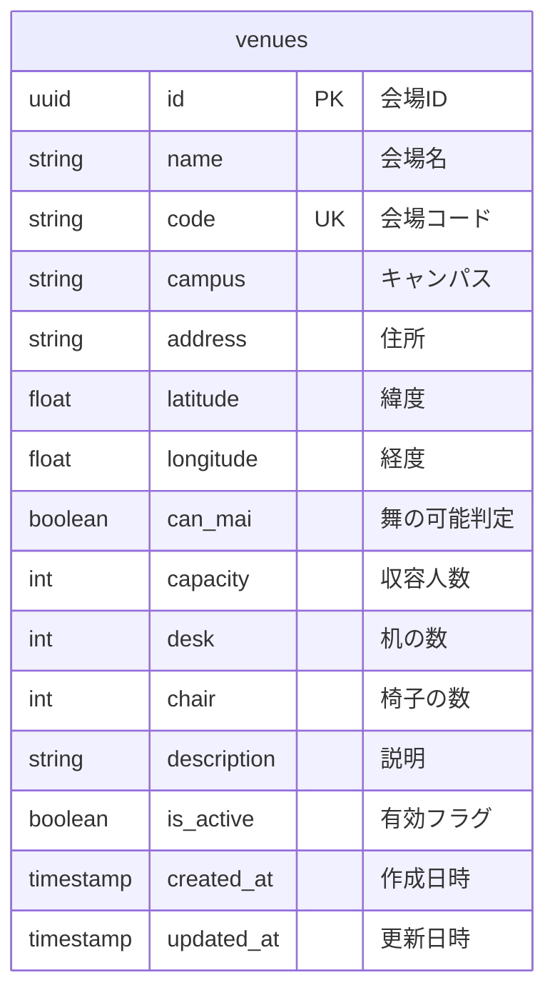

# BACK-DB-001.4: 会場マスタテーブル設計

## 概要
練習表自動生成システムの会場情報を管理するデータベース構造をPythonとSupabaseを用いて設計・実装します。会場の基本情報と属性を単一テーブルで効率的に管理するモデルを構築します。

## 詳細
- 会場マスターテーブル設計と実装
- JSONB列を使用した会場属性管理

## 依存関係
- 親タスク: BACK-DB-001
- BACK-DB-001.3: 練習スケジュール・セッションテーブル設計と実装

## 参照ファイル
- [設計書/10_データモデル_1_概要と主要エンティティ.md](../../../../../設計書/10_データモデル_1_概要と主要エンティティ.md)
- [設計書/11b_ER図詳細.md](../../../../../設計書/11b_ER図詳細.md)
- [設計書/11g_実装指針_バックエンド.md](../../../../../設計書/11g_実装指針_バックエンド.md)

## 成果物
- 会場マスターテーブルSQL定義
- マイグレーションスクリプト
- Pythonデータモデル（Pydanticモデル）
- データアクセスレイヤーコード

## ステータス
- [x] 未開始
- [ ] 進行中
- [ ] レビュー中
- [ ] 完了

## 担当者
未割り当て

## 主要機能
1. **会場マスター管理**
   - 会場基本情報の管理
   - 住所と地理情報の管理
   - 会場種別と収容人数管理

2. **会場属性管理**
   - 利用条件と制約の管理
   - メタデータと追加情報の管理

## 設計図
### データベース構造図

## 実装予定ファイル
- `supabase/migrations/xxxx_create_venues_table.sql` - 会場マスターテーブル定義SQL
- `backend/app/schemas/venue.py` - 会場関連Pydanticスキーマ定義
- `backend/app/repositories/venue_repository.py` - 会場データアクセスレイヤー
- `backend/app/services/venue_service.py` - 会場管理サービスロジック
- `backend/tests/unit/repositories/test_venue_repository.py` - 会場リポジトリのテスト
- `backend/tests/unit/services/test_venue_service.py` - 会場サービスのテスト 