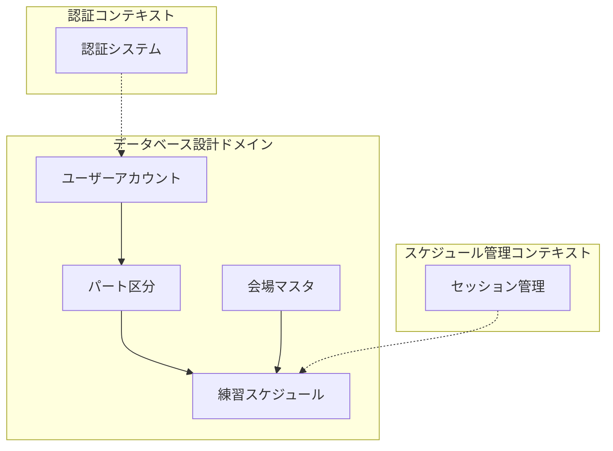
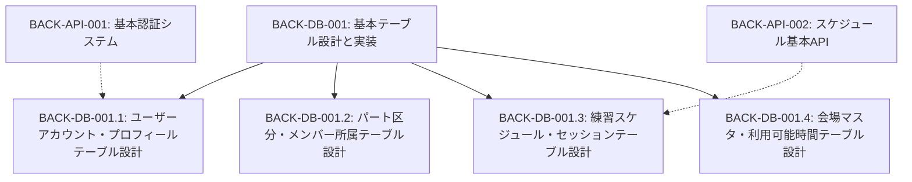
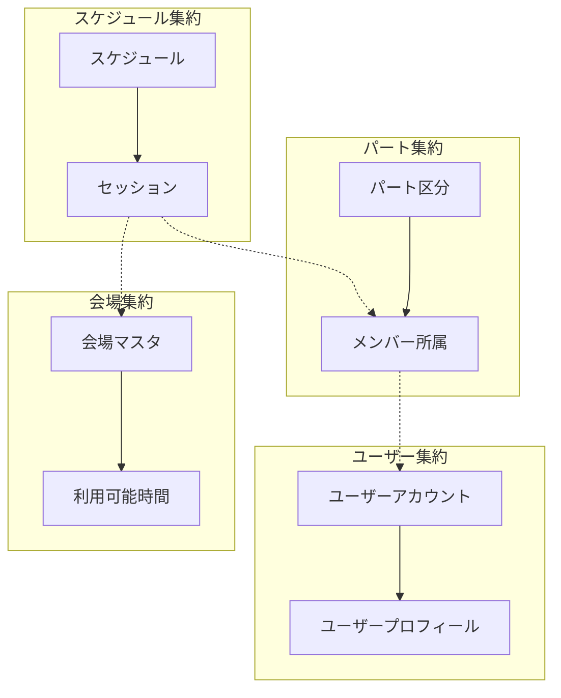
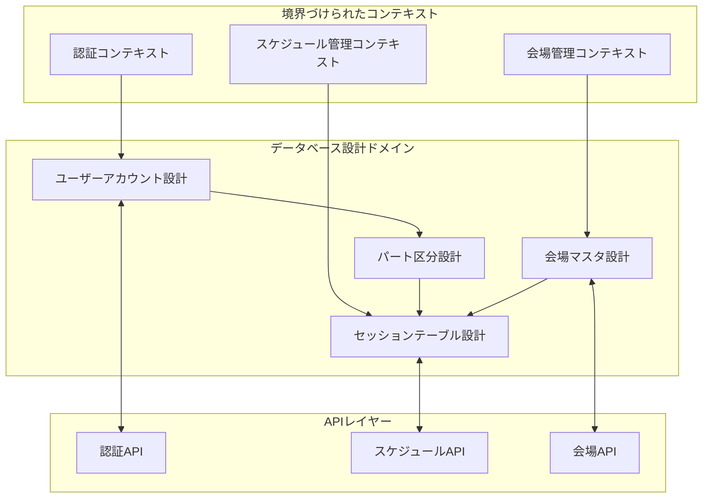
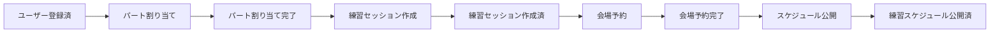

# BACK-DB-001: 基本テーブル設計と実装

## ドメインの概要
データベース設計と実装のドメインでは、練習表自動生成システムの基盤となるデータ構造を定義します。ユーザー情報、パート区分、練習スケジュール、会場情報などの基本エンティティを設計し、それらの関係性を整理することで、システム全体のデータの整合性と効率的なアクセスを実現します。

## ドメインモデルと境界づけられたコンテキスト

## ユビキタス言語

| 用語 | 定義 |
|------|------|
| ユーザーアカウント | システムにアクセスする個人を識別する情報集合 |
| プロフィール | ユーザーの個人情報（氏名、連絡先など） |
| パート区分 | 謡と踊の区分、および詳細なパート分類 |
| メンバー所属 | 各メンバーがどのパートに所属しているかの情報 |
| 練習スケジュール | 特定の日時、場所、内容を持つ練習の予定 |
| セッション | 個別の練習単位（時間枠と内容） |
| 会場 | 練習を行う物理的な場所とその属性 |
| 利用可能時間 | 会場が使用できる時間帯の情報 |

## サブドメイン構成

## サブドメイン詳細

### BACK-DB-001.1: ユーザーアカウント・プロフィールテーブル設計
**ドメイン責務**: 認証情報、基本情報、連絡先を管理するテーブル設計を行う

**ドメインサービス**:
- ユーザー認証データアクセス（ユーザー認証情報の管理）
- プロフィール情報管理（個人情報の取得・更新）

**ステータス**: 未開始

### BACK-DB-001.2: パート区分・メンバー所属テーブル設計
**ドメイン責務**: 謡と踊区分、パート区分、メンバー配属を管理するテーブル設計を行う

**ドメインサービス**:
- パート区分管理（パート情報の登録・変更）
- メンバー所属管理（メンバーのパート配属情報の処理）

**ステータス**: 未開始

### BACK-DB-001.3: 練習スケジュール・セッションテーブル設計
**ドメイン責務**: 日時、場所、内容、担当者を管理するテーブル設計を行う

**ドメインサービス**:
- スケジュールデータアクセス（スケジュール情報の検索・取得）
- セッション管理（個別練習セッションの作成・更新）

**ステータス**: 未開始

### BACK-DB-001.4: 会場マスタ・利用可能時間テーブル設計
**ドメイン責務**: 設備情報、収容人数、予約状況を管理するテーブル設計を行う

**ドメインサービス**:
- 会場情報管理（会場データの登録・更新）
- 利用可能時間管理（会場の利用可能時間帯の設定・確認）

**ステータス**: 未開始

## コマンド・クエリ責務分離（CQRS）

### コマンド（書き込み操作）
- ユーザーアカウント作成・更新
- パート区分登録・変更
- メンバー所属設定
- 練習スケジュール作成・更新
- 会場情報登録・更新
- 利用可能時間設定

### クエリ（読み取り操作）
- ユーザーデータ取得
- パート区分一覧取得
- メンバー所属情報検索
- 練習スケジュール検索
- 会場情報検索
- 利用可能時間確認

## 集約と整合性境界

## 開発コンテキスト図

## 進捗管理

| サブドメイン | ステータス | 担当者 | 開始日 | 完了予定 | 実際の完了日 |
|------------|-----------|--------|-------|---------|------------|
| BACK-DB-001.1 | 未開始 | | | | |
| BACK-DB-001.2 | 未開始 | | | | |
| BACK-DB-001.3 | 未開始 | | | | |
| BACK-DB-001.4 | 未開始 | | | | |

## イベントストーミング

## 課題・リスク

- テーブル間の関連性が複雑になる可能性がある
- ユーザー権限の粒度によるテーブル設計の複雑化
- 会場予約状況と練習スケジュールの整合性維持
- スケジュールの時間重複チェックロジックの実装

## レビューポイント

- 正規化レベルの妥当性（過度な正規化による複雑化の回避）
- 拡張性への配慮（将来的な機能追加に対応できるか）
- パフォーマンスへの影響（検索・結合時の効率）
- セキュリティ考慮事項（特に個人情報を含むテーブル）

## リファレンス

- [設計書/10_データモデル_1_概要と主要エンティティ.md](../../../設計書/10_データモデル_1_概要と主要エンティティ.md)
- [設計書/11b_ER図詳細.md](../../../設計書/11b_ER図詳細.md)
- [設計書/11g_実装指針_バックエンド.md](../../../設計書/11g_実装指針_バックエンド.md) 