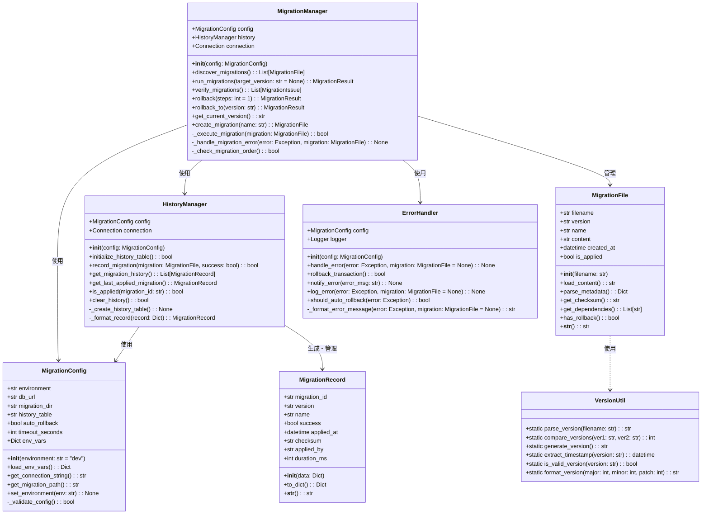
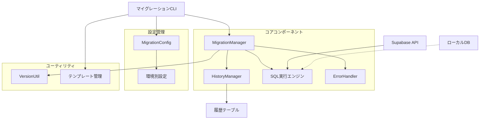
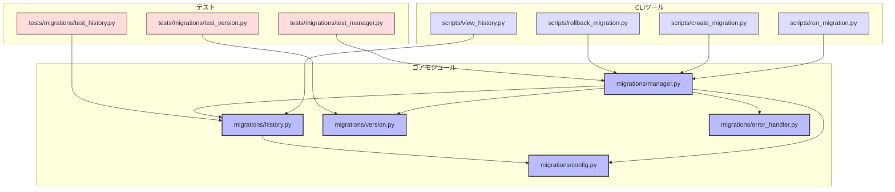

# BACK-DB-002.1: Supabaseマイグレーションスクリプト作成と実行設定

## 概要
Supabaseを利用したデータベースのマイグレーション管理システムを設計・実装します。SQLマイグレーションスクリプトの作成基準の確立、環境（開発・テスト・本番）に応じた実行手順の策定、およびバージョン管理の仕組みを整備し、データベーススキーマの一貫性と安全な変更を実現します。

## 詳細
- マイグレーションスクリプトの命名規則と構成ガイドラインの確立
- Supabase CLIを活用したマイグレーション管理フローの構築
- 開発・テスト・本番環境ごとのマイグレーション実行手順の整備
- マイグレーション履歴管理機能の実装
- エラー処理とロールバック手順の策定
- 環境変数を使用した柔軟な設定切替の仕組み構築

## 依存関係
- 親タスク: BACK-DB-002
- BACK-DB-001: 基本テーブル設計と実装

## 参照ファイル
- [設計書/11g_実装指針_バックエンド.md](../../../../設計書/11g_実装指針_バックエンド.md)
- [設計書/10_データモデル_1_概要と主要エンティティ.md](../../../../設計書/10_データモデル_1_概要と主要エンティティ.md)

## 成果物
- マイグレーションスクリプト作成ガイドライン
- 環境別マイグレーション実行スクリプト
- マイグレーション履歴管理モジュール
- マイグレーションエラー処理モジュール
- 環境設定管理モジュール
- マイグレーション実行手順ドキュメント

## ステータス
- [x] 未開始
- [ ] 進行中
- [ ] レビュー中
- [ ] 完了

## 担当者
未割り当て

## 主要機能
1. **マイグレーションスクリプト管理**
   - SQLマイグレーションファイルの命名規則と構成定義
   - バージョン番号付与のルール策定
   - 依存関係を持つマイグレーションの順序管理
   - 冪等性（べきとうせい）を確保するスクリプト設計

2. **環境別実行設定**
   - 開発環境向けマイグレーション実行設定
   - テスト環境向けマイグレーション実行設定
   - 本番環境向けマイグレーション実行設定
   - 環境変数による設定切替の実装

3. **マイグレーション履歴管理**
   - 実行済みマイグレーションの記録
   - マイグレーション実行結果の記録
   - 実行時間とパフォーマンス情報の記録
   - マイグレーション状態の可視化機能

4. **エラー処理とロールバック**
   - マイグレーション実行エラーの検出と通知
   - トランザクション制御によるアトミックな適用
   - エラー時の自動ロールバック機能
   - 手動ロールバック手順の整備

## 実装予定ファイル
以下は実装予定の全ファイルのリストです。各ファイルの役割と目的を簡潔に記載します。

- `migrations/config.py` - マイグレーション設定管理
- `migrations/manager.py` - マイグレーション実行管理
- `migrations/version.py` - バージョン管理ユーティリティ
- `migrations/history.py` - マイグレーション履歴管理
- `migrations/error_handler.py` - エラー処理とロールバック
- `migrations/templates/migration_template.sql` - マイグレーションスクリプトテンプレート
- `scripts/run_migration.py` - マイグレーション実行スクリプト
- `scripts/create_migration.py` - マイグレーションファイル作成スクリプト
- `scripts/rollback_migration.py` - マイグレーションロールバックスクリプト
- `scripts/view_history.py` - マイグレーション履歴表示スクリプト
- `config/environments/dev.env` - 開発環境設定ファイル
- `config/environments/test.env` - テスト環境設定ファイル
- `config/environments/prod.env` - 本番環境設定ファイル
- `tests/migrations/test_manager.py` - マネージャークラスのテスト
- `tests/migrations/test_history.py` - 履歴管理機能のテスト
- `tests/migrations/test_version.py` - バージョン管理機能のテスト
- `docs/migration_guidelines.md` - マイグレーション開発ガイドライン
- `docs/migration_execution.md` - マイグレーション実行手順

## 設計図
### クラス図

### コンポーネント関係図

## 実装アプローチ
### マイグレーションシステム構築
1. **基本クラス設計と実装**
   - マイグレーション設定クラス（MigrationConfig）の実装
   - マイグレーション管理クラス（MigrationManager）の実装
   - 履歴管理クラス（HistoryManager）の実装
   - マイグレーションファイルクラス（MigrationFile）の実装

2. **環境設定管理**
   - 環境変数読み込み機能の実装
   - 環境別設定ファイルの整備
   - Supabase接続設定の管理
   - 設定切替メカニズムの実装

3. **マイグレーション実行機能**
   - Supabase CLI連携またはAPI連携の実装
   - マイグレーションファイル検出機能の実装
   - SQLスクリプト実行機能の実装
   - トランザクション制御の実装

4. **履歴と状態管理**
   - 履歴テーブルスキーマの設計
   - 履歴記録機能の実装
   - マイグレーション状態照会機能の実装
   - レポート生成機能の実装

### CLIツール開発
1. **コマンドラインインターフェース**
   - マイグレーション作成コマンドの実装
   - マイグレーション実行コマンドの実装
   - ロールバックコマンドの実装
   - 履歴表示コマンドの実装

2. **エラー処理とロギング**
   - 例外処理の実装
   - ロギング機能の実装
   - エラー通知機能の実装
   - ロールバック機能の実装

## 実装するすべてのファイル構成詳細
以下は全ての実装予定ファイルの詳細です。各ファイルごとに目的とクラス/インターフェース、メソッド、依存関係などを詳しく記載します。

### `migrations/config.py`
**目的**: マイグレーション実行のための設定管理

**クラス/インターフェース**:
- `MigrationConfig`: マイグレーション設定クラス
  - **継承/実装**: なし
  - **主要属性**:
    - `environment: str` - 実行環境（dev/test/prod）
    - `db_url: str` - データベース接続URL
    - `migration_dir: str` - マイグレーションファイル格納ディレクトリ
    - `history_table: str` - マイグレーション履歴テーブル名
    - `auto_rollback: bool` - エラー時の自動ロールバックフラグ
    - `timeout_seconds: int` - タイムアウト秒数
    - `env_vars: Dict` - 環境変数
  - **主要メソッド**: 
    - `__init__(environment: str = "dev")` - コンストラクタ
    - `load_env_vars() -> Dict` - 環境変数読み込み
    - `get_connection_string() -> str` - DB接続文字列取得
    - `get_migration_path() -> str` - マイグレーションパス取得
    - `set_environment(env: str) -> None` - 環境切替
  - **プライベートメソッド**:
    - `_validate_config() -> bool` - 設定値検証
  - **依存クラス**: なし

### `migrations/manager.py`
**目的**: マイグレーション実行のメイン処理を管理

**クラス/インターフェース**:
- `MigrationManager`: マイグレーション管理クラス
  - **継承/実装**: なし
  - **主要属性**:
    - `config: MigrationConfig` - 設定
    - `history: HistoryManager` - 履歴管理
    - `connection: Connection` - DB接続
  - **主要メソッド**: 
    - `__init__(config: MigrationConfig)` - コンストラクタ
    - `discover_migrations() -> List[MigrationFile]` - マイグレーションファイル検出
    - `run_migrations(target_version: str = None) -> MigrationResult` - マイグレーション実行
    - `verify_migrations() -> List[MigrationIssue]` - マイグレーション検証
    - `rollback(steps: int = 1) -> MigrationResult` - ロールバック実行
    - `rollback_to(version: str) -> MigrationResult` - 特定バージョンまでロールバック
    - `get_current_version() -> str` - 現在のバージョン取得
    - `create_migration(name: str) -> MigrationFile` - マイグレーションファイル作成
  - **プライベートメソッド**:
    - `_execute_migration(migration: MigrationFile) -> bool` - マイグレーション実行
    - `_handle_migration_error(error: Exception, migration: MigrationFile) -> None` - エラー処理
    - `_check_migration_order() -> bool` - マイグレーション順序チェック
  - **依存クラス**: `MigrationConfig`, `HistoryManager`, `MigrationFile`, `ErrorHandler`

### `migrations/history.py`
**目的**: マイグレーション履歴の管理

**クラス/インターフェース**:
- `HistoryManager`: 履歴管理クラス
  - **継承/実装**: なし
  - **主要属性**:
    - `config: MigrationConfig` - 設定
    - `connection: Connection` - DB接続
  - **主要メソッド**: 
    - `__init__(config: MigrationConfig)` - コンストラクタ
    - `initialize_history_table() -> bool` - 履歴テーブル初期化
    - `record_migration(migration: MigrationFile, success: bool) -> bool` - マイグレーション記録
    - `get_migration_history() -> List[MigrationRecord]` - 履歴取得
    - `get_last_applied_migration() -> MigrationRecord` - 最新適用マイグレーション取得
    - `is_applied(migration_id: str) -> bool` - 適用済み確認
    - `clear_history() -> bool` - 履歴クリア
  - **プライベートメソッド**:
    - `_create_history_table() -> None` - 履歴テーブル作成
    - `_format_record(record: Dict) -> MigrationRecord` - レコード整形
  - **依存クラス**: `MigrationConfig`, `MigrationRecord`

- `MigrationRecord`: マイグレーション履歴レコードクラス
  - **継承/実装**: なし
  - **主要属性**:
    - `migration_id: str` - マイグレーションID
    - `version: str` - バージョン
    - `name: str` - 名前
    - `success: bool` - 成功フラグ
    - `applied_at: datetime` - 適用日時
    - `checksum: str` - チェックサム
    - `applied_by: str` - 適用者
    - `duration_ms: int` - 実行時間（ミリ秒）
  - **主要メソッド**: 
    - `__init__(data: Dict)` - コンストラクタ
    - `to_dict() -> Dict` - 辞書変換
    - `__str__() -> str` - 文字列表現
  - **依存クラス**: なし

### `migrations/version.py`
**目的**: バージョン管理ユーティリティ

**クラス/インターフェース**:
- `VersionUtil`: バージョン管理ユーティリティクラス
  - **継承/実装**: なし
  - **主要メソッド**: 
    - `static parse_version(filename: str) -> str` - ファイル名からバージョン抽出
    - `static compare_versions(ver1: str, ver2: str) -> int` - バージョン比較
    - `static generate_version() -> str` - バージョン生成
    - `static extract_timestamp(version: str) -> datetime` - タイムスタンプ抽出
    - `static is_valid_version(version: str) -> bool` - バージョン検証
    - `static format_version(major: int, minor: int, patch: int) -> str` - バージョン書式設定
  - **依存クラス**: なし

### `migrations/error_handler.py`
**目的**: マイグレーションエラー処理

**クラス/インターフェース**:
- `ErrorHandler`: エラー処理クラス
  - **継承/実装**: なし
  - **主要属性**:
    - `config: MigrationConfig` - 設定
    - `logger: Logger` - ロガー
  - **主要メソッド**: 
    - `__init__(config: MigrationConfig)` - コンストラクタ
    - `handle_error(error: Exception, migration: MigrationFile = None) -> None` - エラー処理
    - `rollback_transaction() -> bool` - トランザクションロールバック
    - `notify_error(error_msg: str) -> None` - エラー通知
    - `log_error(error: Exception, migration: MigrationFile = None) -> None` - エラーログ
    - `should_auto_rollback(error: Exception) -> bool` - 自動ロールバック判定
  - **プライベートメソッド**:
    - `_format_error_message(error: Exception, migration: MigrationFile = None) -> str` - エラーメッセージ書式設定
  - **依存クラス**: `MigrationConfig`, `MigrationFile`

### `scripts/run_migration.py`
**目的**: マイグレーション実行スクリプト

**クラス/関数**:
- `main()` - メイン実行関数
- `parse_args()` - コマンドライン引数解析
- `run_migration(args)` - マイグレーション実行
- `display_results(result: MigrationResult)` - 結果表示
- **依存クラス**: `MigrationManager`, `MigrationConfig`

### `scripts/create_migration.py`
**目的**: マイグレーションファイル作成スクリプト

**クラス/関数**:
- `main()` - メイン実行関数
- `parse_args()` - コマンドライン引数解析
- `create_migration_file(name: str, template: str = None)` - マイグレーションファイル作成
- `generate_migration_content(name: str, template: str)` - マイグレーション内容生成
- **依存クラス**: `MigrationManager`, `MigrationConfig`

### `scripts/rollback_migration.py`
**目的**: マイグレーションロールバックスクリプト

**クラス/関数**:
- `main()` - メイン実行関数
- `parse_args()` - コマンドライン引数解析
- `rollback_migration(args)` - ロールバック実行
- `confirm_rollback(steps: int, target_version: str = None)` - ロールバック確認
- **依存クラス**: `MigrationManager`, `MigrationConfig`

### `scripts/view_history.py`
**目的**: マイグレーション履歴表示スクリプト

**クラス/関数**:
- `main()` - メイン実行関数
- `parse_args()` - コマンドライン引数解析
- `display_history(limit: int = None, format: str = "table")` - 履歴表示
- `export_history(file_path: str, format: str = "json")` - 履歴エクスポート
- **依存クラス**: `HistoryManager`, `MigrationConfig`

### `tests/migrations/test_manager.py`
**目的**: マイグレーションマネージャーのテスト

**クラス/インターフェース**:
- `TestMigrationManager`: マイグレーションマネージャーテストクラス
  - **継承/実装**: `unittest.TestCase`
  - **主要メソッド**: 
    - `setUp()` - テスト準備
    - `tearDown()` - テスト後処理
    - `test_discover_migrations()` - マイグレーション検出テスト
    - `test_run_migrations()` - マイグレーション実行テスト
    - `test_verify_migrations()` - マイグレーション検証テスト
    - `test_rollback()` - ロールバックテスト
    - `test_create_migration()` - マイグレーション作成テスト
    - `test_error_handling()` - エラー処理テスト
  - **依存クラス**: `MigrationManager`, `MigrationConfig`

### `tests/migrations/test_history.py`
**目的**: 履歴管理のテスト

**クラス/インターフェース**:
- `TestHistoryManager`: 履歴管理テストクラス
  - **継承/実装**: `unittest.TestCase`
  - **主要メソッド**: 
    - `setUp()` - テスト準備
    - `tearDown()` - テスト後処理
    - `test_initialize_history_table()` - テーブル初期化テスト
    - `test_record_migration()` - マイグレーション記録テスト
    - `test_get_migration_history()` - 履歴取得テスト
    - `test_get_last_applied_migration()` - 最新マイグレーション取得テスト
    - `test_is_applied()` - 適用済み確認テスト
  - **依存クラス**: `HistoryManager`, `MigrationConfig`, `MigrationRecord`

### `tests/migrations/test_version.py`
**目的**: バージョン管理ユーティリティのテスト

**クラス/インターフェース**:
- `TestVersionUtil`: バージョンユーティリティテストクラス
  - **継承/実装**: `unittest.TestCase`
  - **主要メソッド**: 
    - `test_parse_version()` - バージョン解析テスト
    - `test_compare_versions()` - バージョン比較テスト
    - `test_generate_version()` - バージョン生成テスト
    - `test_extract_timestamp()` - タイムスタンプ抽出テスト
    - `test_is_valid_version()` - バージョン検証テスト
  - **依存クラス**: `VersionUtil`

## ファイル間クラス連携図
