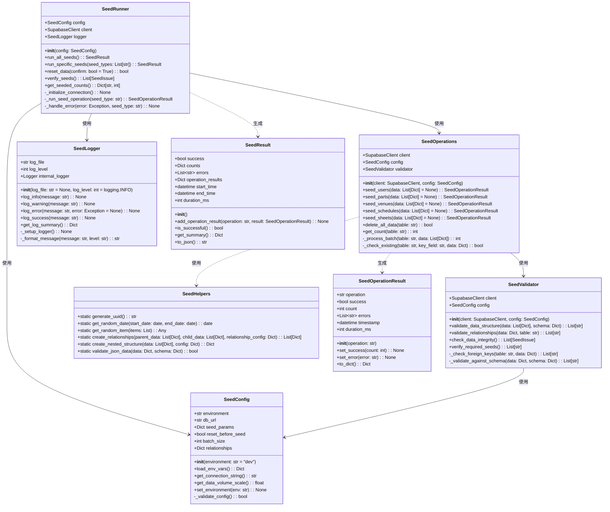
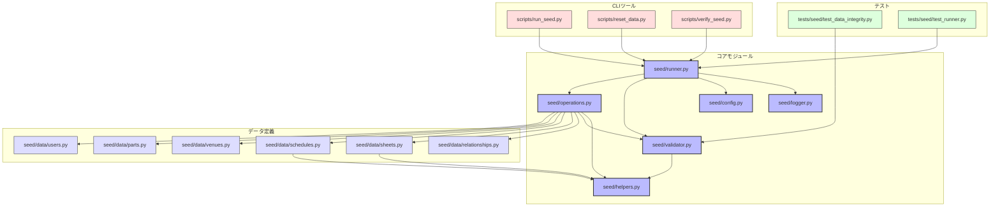

# BACK-DB-002.2: 開発・テスト用基本データセット作成

## 概要
練習表自動生成システムの開発とテストに必要な基本データを定義し、Supabaseに自動的にデータを投入するシードスクリプトを実装します。開発環境とテスト環境でのデータ整合性を確保し、繰り返し可能なデータ初期化の仕組みを提供します。

## 詳細
- ユーザー、パート、会場などのマスターデータ定義
- 各テーブル間の関連性を考慮したデータセット設計
- Python製シードスクリプトの実装
- 開発環境とテスト環境での実行制御機能
- 冪等性（べきとうせい）を持つデータ投入プロセス構築
- サンプルとなる計画、練習表データの作成

## 依存関係
- 親タスク: BACK-DB-002
- BACK-DB-001: 基本テーブル設計と実装
- BACK-DB-002.1: Supabaseマイグレーションスクリプト作成と実行設定

## 参照ファイル
- [設計書/11g_実装指針_バックエンド.md](../../../../設計書/11g_実装指針_バックエンド.md)
- [設計書/10_データモデル_1_概要と主要エンティティ.md](../../../../設計書/10_データモデル_1_概要と主要エンティティ.md)

## 成果物
- シードデータ定義ファイル
- データ投入スクリプト
- テスト用基本データセット
- 開発・テスト環境向け実行スクリプト
- 実行手順ドキュメント
- サンプルデータセット一覧

## ステータス
- [x] 未開始
- [ ] 進行中
- [ ] レビュー中
- [ ] 完了

## 担当者
未割り当て

## 主要機能
1. **シードデータ定義**
   - ユーザーマスターデータの定義
   - パートマスターデータの定義
   - 会場マスターデータの定義
   - 練習計画サンプルデータの定義
   - 練習表サンプルデータの定義
   - 各マスターデータ間の関連付け

2. **データ投入スクリプト**
   - Pythonによるデータ投入処理の実装
   - Supabase APIを使用したデータ操作
   - トランザクション制御によるアトミックな処理
   - 冪等性を考慮した重複チェック処理
   - エラーハンドリングと復旧処理

3. **環境別実行制御**
   - 開発環境向け実行設定
   - テスト環境向け実行設定
   - 環境変数による制御パラメータ設定
   - データボリュームの環境別調整機能

4. **データ確認・検証機能**
   - シードデータの検証ツール
   - データ整合性チェック機能
   - シードデータのリセット機能
   - シード実行ログの記録と分析

## 実装予定ファイル
以下は実装予定の全ファイルのリストです。各ファイルの役割と目的を簡潔に記載します。

- `seed/data/users.py` - ユーザーマスターデータ定義
- `seed/data/parts.py` - パートマスターデータ定義
- `seed/data/venues.py` - 会場マスターデータ定義
- `seed/data/schedules.py` - 練習計画サンプルデータ定義
- `seed/data/sheets.py` - 練習表サンプルデータ定義
- `seed/data/relationships.py` - データ間の関連定義
- `seed/config.py` - シード設定管理
- `seed/runner.py` - シード実行マネージャー
- `seed/operations.py` - データ操作ユーティリティ
- `seed/validator.py` - データ検証ユーティリティ
- `seed/helpers.py` - ヘルパー関数
- `seed/logger.py` - ログ管理
- `scripts/run_seed.py` - シード実行スクリプト
- `scripts/reset_data.py` - データリセットスクリプト
- `scripts/verify_seed.py` - シードデータ検証スクリプト
- `config/seed/dev.env` - 開発環境シード設定
- `config/seed/test.env` - テスト環境シード設定
- `tests/seed/test_data_integrity.py` - データ整合性テスト
- `tests/seed/test_runner.py` - ランナーテスト
- `docs/seed_data.md` - シードデータ説明ドキュメント

## 設計図
### クラス図


### データフロー図
```mermaid
graph TD
    A[シード実行スクリプト] --> B[SeedRunner]
    B --> C[データ読み込み]
    C --> D[データ検証]
    D --> E[データ投入]
    
    subgraph "データソース"
        F1[ユーザーデータ]
        F2[パートデータ]
        F3[会場データ]
        F4[練習計画データ]
        F5[練習表データ]
    end
    
    C --> F1
    C --> F2
    C --> F3
    C --> F4
    C --> F5
    
    subgraph "検証処理"
        D1[構造検証]
        D2[関連性検証]
        D3[整合性検証]
    end
    
    D --> D1
    D --> D2
    D --> D3
    
    subgraph "投入処理"
        E1[既存データ確認]
        E2[バッチ処理]
        E3[関連付け処理]
    end
    
    E --> E1
    E --> E2
    E --> E3
    
    E --> G[Supabase]
    
    H[ログ処理] <--> B
    H <--> D
    H <--> E
    
    I[実行結果] <-- B
```

## 実装アプローチ
### シードデータ設計と実装
1. **基本データ構造の定義**
   - 各テーブルのサンプルデータ構造定義
   - データ間の関連付けルールの設計
   - 開発・テスト用データボリュームの決定
   - ユーザーペルソナと典型的な利用パターンの設計

2. **データ生成の実装**
   - 静的データの定義実装
   - 動的データ生成ロジックの実装
   - 関連データの生成処理実装
   - テスト品質を考慮したエッジケースデータの実装

### シード実行システム構築
1. **基本クラス設計と実装**
   - シード設定クラス（SeedConfig）の実装
   - シード実行クラス（SeedRunner）の実装
   - データ操作クラス（SeedOperations）の実装
   - データ検証クラス（SeedValidator）の実装

2. **データ投入処理の実装**
   - Supabase APIを使用したデータ操作実装
   - バッチ処理による効率的なデータ投入
   - 冪等性を確保する重複チェック機能の実装
   - エラー処理とリカバリー機能の実装

3. **検証とユーティリティ**
   - データ整合性検証機能の実装
   - ヘルパー関数群の実装
   - ログ記録機能の実装
   - ランダムデータ生成ユーティリティの実装

## 実装するすべてのファイル構成詳細
以下は全ての実装予定ファイルの詳細です。各ファイルごとに目的とクラス/インターフェース、メソッド、依存関係などを詳しく記載します。

### `seed/data/users.py`
**目的**: ユーザーマスターデータ定義

**クラス/インターフェース**:
- `UserSeeds`: ユーザーデータ定義クラス
  - **主要属性**:
    - `DEFAULT_USERS: List[Dict]` - デフォルトユーザーデータ
    - `ROLES: List[str]` - ユーザーロール定義
    - `TEST_VOLUME: Dict` - テスト環境のデータボリューム設定
  - **主要メソッド**: 
    - `get_users(environment: str = "dev") -> List[Dict]` - 環境に応じたユーザーデータ取得
    - `generate_random_users(count: int) -> List[Dict]` - ランダムユーザー生成
    - `get_admin_users() -> List[Dict]` - 管理者ユーザー取得
  - **依存クラス**: なし

### `seed/data/parts.py`
**目的**: パートマスターデータ定義

**クラス/インターフェース**:
- `PartSeeds`: パートデータ定義クラス
  - **主要属性**:
    - `DEFAULT_PARTS: List[Dict]` - デフォルトパートデータ
    - `PART_TYPES: List[str]` - パートタイプ定義
    - `PART_HIERARCHIES: Dict` - パート階層関係
  - **主要メソッド**: 
    - `get_parts(environment: str = "dev") -> List[Dict]` - 環境に応じたパートデータ取得
    - `get_parts_by_type(part_type: str) -> List[Dict]` - タイプ別パート取得
    - `get_part_hierarchy() -> Dict` - パート階層関係取得
  - **依存クラス**: なし

### `seed/data/venues.py`
**目的**: 会場マスターデータ定義

**クラス/インターフェース**:
- `VenueSeeds`: 会場データ定義クラス
  - **主要属性**:
    - `DEFAULT_VENUES: List[Dict]` - デフォルト会場データ
    - `VENUE_TYPES: List[str]` - 会場タイプ定義
    - `TEST_VOLUME: Dict` - テスト環境のデータボリューム設定
  - **主要メソッド**: 
    - `get_venues(environment: str = "dev") -> List[Dict]` - 環境に応じた会場データ取得
    - `generate_random_venues(count: int) -> List[Dict]` - ランダム会場生成
    - `get_venues_by_type(venue_type: str) -> List[Dict]` - タイプ別会場取得
  - **依存クラス**: なし

### `seed/data/schedules.py`
**目的**: 練習計画サンプルデータ定義

**クラス/インターフェース**:
- `ScheduleSeeds`: 練習計画データ定義クラス
  - **主要属性**:
    - `DEFAULT_SCHEDULES: List[Dict]` - デフォルト練習計画データ
    - `SCHEDULE_TYPES: List[str]` - 計画タイプ定義
    - `DATE_RANGES: Dict` - 日付範囲設定
  - **主要メソッド**: 
    - `get_schedules(environment: str = "dev") -> List[Dict]` - 環境に応じた練習計画データ取得
    - `generate_schedules_for_timespan(start_date: date, end_date: date, venues: List[Dict]) -> List[Dict]` - 期間内の練習計画生成
    - `get_schedules_by_venue(venue_id: str) -> List[Dict]` - 会場別練習計画取得
  - **依存クラス**: `SeedHelpers`

### `seed/data/sheets.py`
**目的**: 練習表サンプルデータ定義

**クラス/インターフェース**:
- `SheetSeeds`: 練習表データ定義クラス
  - **主要属性**:
    - `DEFAULT_SHEETS: List[Dict]` - デフォルト練習表データ
    - `SHEET_TYPES: List[str]` - 練習表タイプ定義
    - `COMPLEXITY_LEVELS: Dict` - 複雑度レベル設定
  - **主要メソッド**: 
    - `get_sheets(environment: str = "dev") -> List[Dict]` - 環境に応じた練習表データ取得
    - `generate_sheets_for_schedules(schedules: List[Dict], parts: List[Dict]) -> List[Dict]` - 練習計画に基づく練習表生成
    - `get_sheets_by_complexity(level: str) -> List[Dict]` - 複雑度別練習表取得
  - **依存クラス**: `SeedHelpers`

### `seed/data/relationships.py`
**目的**: データ間の関連定義

**クラス/インターフェース**:
- `RelationshipConfig`: 関連設定クラス
  - **主要属性**:
    - `TABLE_RELATIONSHIPS: Dict` - テーブル間関連定義
    - `REQUIRED_REFERENCES: Dict` - 必須参照定義
    - `CASCADE_RULES: Dict` - カスケード処理ルール
  - **主要メソッド**: 
    - `get_relationships() -> Dict` - 関連定義取得
    - `get_dependency_order() -> List[str]` - 依存順序取得
    - `validate_relationship(parent_table: str, child_table: str, data: Dict) -> List[str]` - 関連検証
  - **依存クラス**: なし

### `seed/config.py`
**目的**: シード設定管理

**クラス/インターフェース**:
- `SeedConfig`: シード設定クラス
  - **継承/実装**: なし
  - **主要属性**:
    - `environment: str` - 実行環境（dev/test）
    - `db_url: str` - データベース接続URL
    - `seed_params: Dict` - シードパラメータ
    - `reset_before_seed: bool` - シード前リセットフラグ
    - `batch_size: int` - バッチサイズ
    - `relationships: Dict` - 関連設定
  - **主要メソッド**: 
    - `__init__(environment: str = "dev")` - コンストラクタ
    - `load_env_vars() -> Dict` - 環境変数読み込み
    - `get_connection_string() -> str` - DB接続文字列取得
    - `get_data_volume_scale() -> float` - データ量スケール取得
    - `set_environment(env: str) -> None` - 環境設定
  - **プライベートメソッド**:
    - `_validate_config() -> bool` - 設定値検証
  - **依存クラス**: なし

### `seed/runner.py`
**目的**: シード実行管理

**クラス/インターフェース**:
- `SeedRunner`: シード実行マネージャークラス
  - **継承/実装**: なし
  - **主要属性**:
    - `config: SeedConfig` - 設定
    - `client: SupabaseClient` - Supabaseクライアント
    - `logger: SeedLogger` - ロガー
  - **主要メソッド**: 
    - `__init__(config: SeedConfig)` - コンストラクタ
    - `run_all_seeds() -> SeedResult` - 全シード実行
    - `run_specific_seeds(seed_types: List[str]) -> SeedResult` - 特定シード実行
    - `reset_data(confirm: bool = True) -> bool` - データリセット
    - `verify_seeds() -> List[SeedIssue]` - シード検証
    - `get_seeded_counts() -> Dict[str, int]` - シードデータ数取得
  - **プライベートメソッド**:
    - `_initialize_connection() -> None` - 接続初期化
    - `_run_seed_operation(seed_type: str) -> SeedOperationResult` - シード操作実行
    - `_handle_error(error: Exception, seed_type: str) -> None` - エラー処理
  - **依存クラス**: `SeedConfig`, `SeedOperations`, `SeedLogger`, `SeedResult`

### `seed/operations.py`
**目的**: データ操作ユーティリティ

**クラス/インターフェース**:
- `SeedOperations`: データ操作クラス
  - **継承/実装**: なし
  - **主要属性**:
    - `client: SupabaseClient` - Supabaseクライアント
    - `config: SeedConfig` - 設定
    - `validator: SeedValidator` - 検証ツール
  - **主要メソッド**: 
    - `__init__(client: SupabaseClient, config: SeedConfig)` - コンストラクタ
    - `seed_users(data: List[Dict] = None) -> SeedOperationResult` - ユーザーデータ投入
    - `seed_parts(data: List[Dict] = None) -> SeedOperationResult` - パートデータ投入
    - `seed_venues(data: List[Dict] = None) -> SeedOperationResult` - 会場データ投入
    - `seed_schedules(data: List[Dict] = None) -> SeedOperationResult` - 練習計画データ投入
    - `seed_sheets(data: List[Dict] = None) -> SeedOperationResult` - 練習表データ投入
    - `delete_all_data(table: str) -> bool` - 全データ削除
    - `get_count(table: str) -> int` - データ数取得
  - **プライベートメソッド**:
    - `_process_batch(table: str, data: List[Dict]) -> int` - バッチ処理
    - `_check_existing(table: str, key_field: str, data: Dict) -> bool` - 既存データ確認
  - **依存クラス**: `SeedConfig`, `SeedValidator`, `SeedOperationResult`, `SeedHelpers`

### `seed/validator.py`
**目的**: データ検証ユーティリティ

**クラス/インターフェース**:
- `SeedValidator`: データ検証クラス
  - **継承/実装**: なし
  - **主要属性**:
    - `client: SupabaseClient` - Supabaseクライアント
    - `config: SeedConfig` - 設定
  - **主要メソッド**: 
    - `__init__(client: SupabaseClient, config: SeedConfig)` - コンストラクタ
    - `validate_data_structure(data: List[Dict], schema: Dict) -> List[str]` - データ構造検証
    - `validate_relationships(data: Dict, table: str) -> List[str]` - 関連性検証
    - `check_data_integrity() -> List[SeedIssue]` - データ整合性確認
    - `verify_required_seeds() -> List[str]` - 必須シード確認
  - **プライベートメソッド**:
    - `_check_foreign_keys(table: str, data: Dict) -> List[str]` - 外部キー確認
    - `_validate_against_schema(data: Dict, schema: Dict) -> List[str]` - スキーマ検証
  - **依存クラス**: `SeedConfig`, `SeedHelpers`

### `seed/helpers.py`
**目的**: ヘルパー関数

**クラス/インターフェース**:
- `SeedHelpers`: ヘルパーユーティリティクラス
  - **継承/実装**: なし
  - **主要メソッド**: 
    - `static generate_uuid() -> str` - UUID生成
    - `static get_random_date(start_date: date, end_date: date) -> date` - ランダム日付取得
    - `static get_random_item(items: List) -> Any` - ランダム要素取得
    - `static create_relationships(parent_data: List[Dict], child_data: List[Dict], relationship_config: Dict) -> List[Dict]` - 関連付け
    - `static create_nested_structure(data: List[Dict], config: Dict) -> Dict` - 入れ子構造作成
    - `static validate_json_data(data: Dict, schema: Dict) -> bool` - JSONデータ検証
  - **依存クラス**: なし

### `seed/logger.py`
**目的**: ログ管理

**クラス/インターフェース**:
- `SeedLogger`: ログ管理クラス
  - **継承/実装**: なし
  - **主要属性**:
    - `log_file: str` - ログファイルパス
    - `log_level: int` - ログレベル
    - `internal_logger: Logger` - 内部ロガー
  - **主要メソッド**: 
    - `__init__(log_file: str = None, log_level: int = logging.INFO)` - コンストラクタ
    - `log_info(message: str) -> None` - 情報ログ
    - `log_warning(message: str) -> None` - 警告ログ
    - `log_error(message: str, error: Exception = None) -> None` - エラーログ
    - `log_success(message: str) -> None` - 成功ログ
    - `get_log_summary() -> Dict` - ログ概要取得
  - **プライベートメソッド**:
    - `_setup_logger() -> None` - ロガー設定
    - `_format_message(message: str, level: str) -> str` - メッセージ書式設定
  - **依存クラス**: `logging`

### `scripts/run_seed.py`
**目的**: シード実行スクリプト

**クラス/関数**:
- `main()` - メイン実行関数
- `parse_args()` - コマンドライン引数解析
- `run_seed(args)` - シード実行
- `display_results(result: SeedResult)` - 結果表示
- **依存クラス**: `SeedRunner`, `SeedConfig`, `SeedLogger`

### `scripts/reset_data.py`
**目的**: データリセットスクリプト

**クラス/関数**:
- `main()` - メイン実行関数
- `parse_args()` - コマンドライン引数解析
- `reset_seed_data(args)` - データリセット
- `confirm_reset(environment: str)` - リセット確認
- **依存クラス**: `SeedRunner`, `SeedConfig`

### `scripts/verify_seed.py`
**目的**: シードデータ検証スクリプト

**クラス/関数**:
- `main()` - メイン実行関数
- `parse_args()` - コマンドライン引数解析
- `verify_seed_data(args)` - データ検証
- `display_issues(issues: List[SeedIssue])` - 問題表示
- **依存クラス**: `SeedRunner`, `SeedConfig`, `SeedValidator`

### `tests/seed/test_data_integrity.py`
**目的**: データ整合性テスト

**クラス/インターフェース**:
- `TestDataIntegrity`: データ整合性テストクラス
  - **継承/実装**: `unittest.TestCase`
  - **主要メソッド**: 
    - `setUp()` - テスト準備
    - `tearDown()` - テスト後処理
    - `test_user_data_integrity()` - ユーザーデータ整合性テスト
    - `test_part_data_integrity()` - パートデータ整合性テスト
    - `test_venue_data_integrity()` - 会場データ整合性テスト
    - `test_schedule_references()` - 練習計画参照テスト
    - `test_sheet_references()` - 練習表参照テスト
  - **依存クラス**: `SeedValidator`, `SeedConfig`, `SupabaseClient`

### `tests/seed/test_runner.py`
**目的**: ランナーテスト

**クラス/インターフェース**:
- `TestSeedRunner`: シード実行テストクラス
  - **継承/実装**: `unittest.TestCase`
  - **主要メソッド**: 
    - `setUp()` - テスト準備
    - `tearDown()` - テスト後処理
    - `test_run_all_seeds()` - 全シード実行テスト
    - `test_run_specific_seeds()` - 特定シード実行テスト
    - `test_reset_data()` - データリセットテスト
    - `test_error_handling()` - エラー処理テスト
    - `test_verify_seeds()` - シード検証テスト
  - **依存クラス**: `SeedRunner`, `SeedConfig`, `SeedLogger`

## ファイル間クラス連携図
