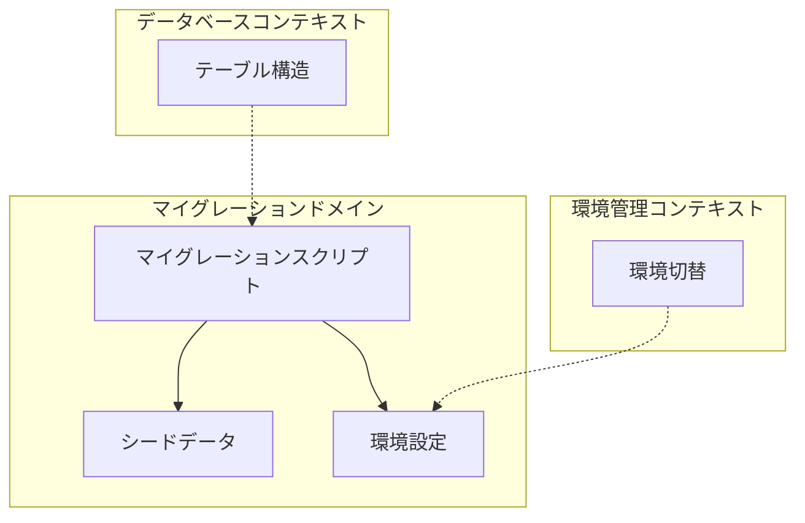
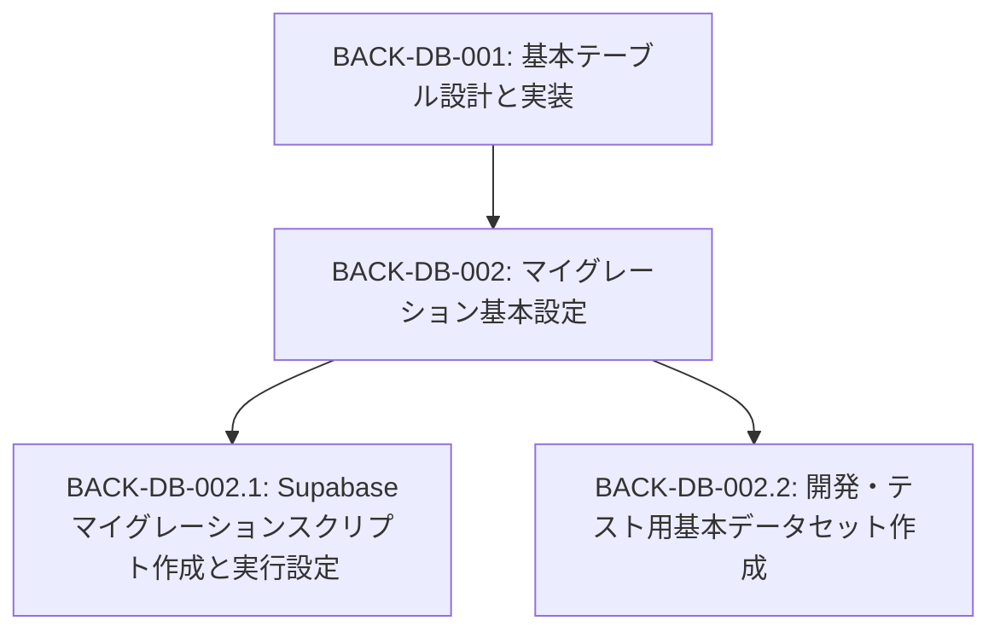
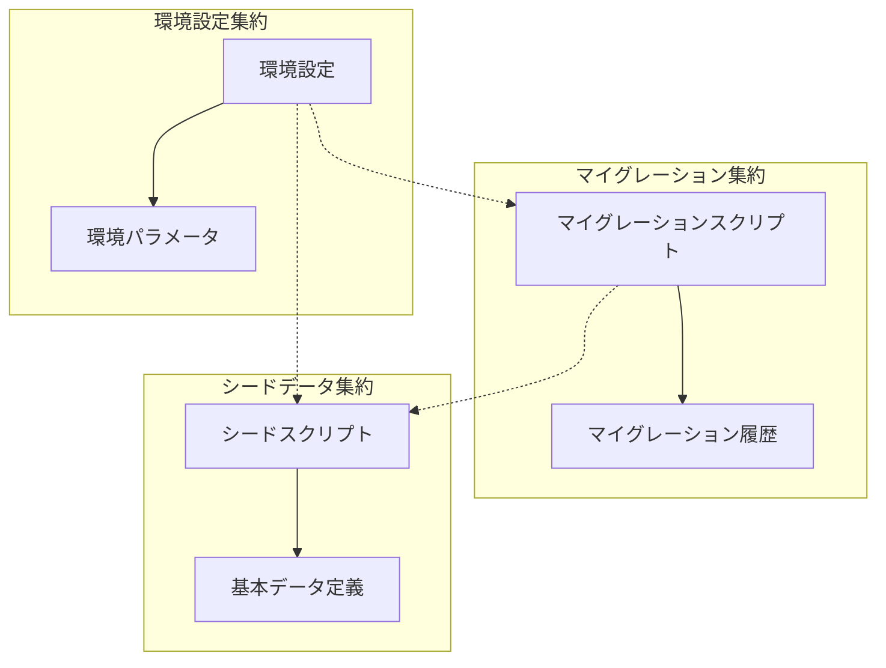
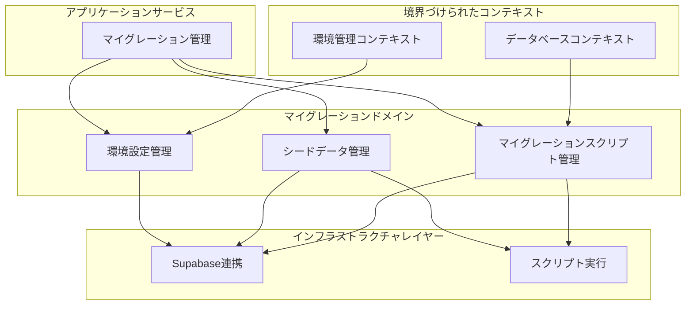

# BACK-DB-002: マイグレーション基本設定

## ドメインの概要
マイグレーション基本設定ドメインは、データベース構造の変更を管理し、環境間での一貫性を確保するための仕組みを提供します。Supabaseを使用したマイグレーションスクリプトの作成と実行設定、および開発・テスト用の基本データセットの作成を担当します。

## ドメインモデルと境界づけられたコンテキスト

## ユビキタス言語

| 用語 | 定義 |
|------|------|
| マイグレーション | データベース構造の変更を管理するための仕組み |
| マイグレーションスクリプト | データベース構造の変更を記述したコード |
| シードデータ | 初期データやテスト用データのこと |
| 開発環境 | 開発者がローカルで使用する環境 |
| テスト環境 | テストを実行するための専用環境 |
| 本番環境 | 実際のユーザーが使用する環境 |
| Supabase | 使用するバックエンドサービス |

## サブドメイン構成

## サブドメイン詳細

### BACK-DB-002.1: Supabaseマイグレーションスクリプト作成と実行設定
**ドメイン責務**: Supabaseに対応したマイグレーションスクリプトを作成し、各環境での実行手順を確立する

**ドメインサービス**:
- マイグレーションスクリプト管理（スクリプトの作成・バージョン管理）
- 環境別実行設定（開発・テスト・本番環境でのマイグレーション実行方法）

**ステータス**: 未開始

### BACK-DB-002.2: 開発・テスト用基本データセット作成
**ドメイン責務**: システム開発とテストに必要な基本データを定義し、シードスクリプトを作成する

**ドメインサービス**:
- シードデータ定義（ユーザー、パート、会場などの基本データ定義）
- シードスクリプト管理（データ投入スクリプトの作成・更新）

**ステータス**: 未開始

## コマンド・クエリ責務分離（CQRS）

### コマンド（書き込み操作）
- マイグレーションスクリプト作成
- マイグレーション実行
- シードスクリプト作成
- シードデータ投入
- 環境設定更新

### クエリ（読み取り操作）
- マイグレーション履歴確認
- 現在のスキーマ確認
- シードデータ状態確認
- 環境設定確認

## 集約と整合性境界

## 開発コンテキスト図

## 進捗管理

| サブドメイン | ステータス | 担当者 | 開始日 | 完了予定 | 実際の完了日 |
|------------|-----------|--------|-------|---------|------------|
| BACK-DB-002.1 | 未開始 | | | | |
| BACK-DB-002.2 | 未開始 | | | | |

## イベントストーミング

## 課題・リスク

- 複数環境間でのマイグレーション整合性確保
- マイグレーションの順序依存性管理
- シードデータの整合性確保
- 本番環境への安全なマイグレーション適用方法
- マイグレーションのロールバック戦略

## レビューポイント

- マイグレーションスクリプトの冪等性（何度実行しても同じ結果になるか）
- 環境間の差異への対応策（開発・テスト・本番）
- シードデータの網羅性と代表性
- Supabaseとの連携方法の適切さ
- スクリプト実行の自動化レベル

## リファレンス

- [設計書/11g_実装指針_バックエンド.md](../../../設計書/11g_実装指針_バックエンド.md)
- [設計書/10_データモデル_1_概要と主要エンティティ.md](../../../設計書/10_データモデル_1_概要と主要エンティティ.md) 