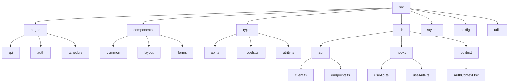
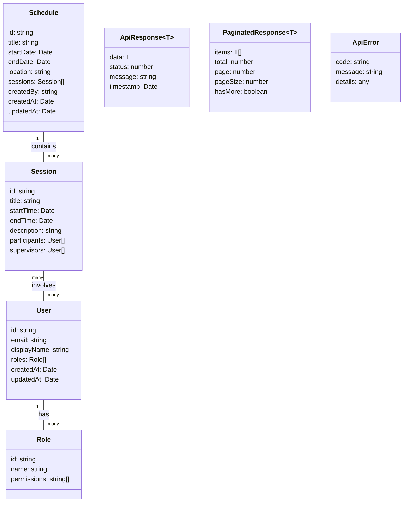
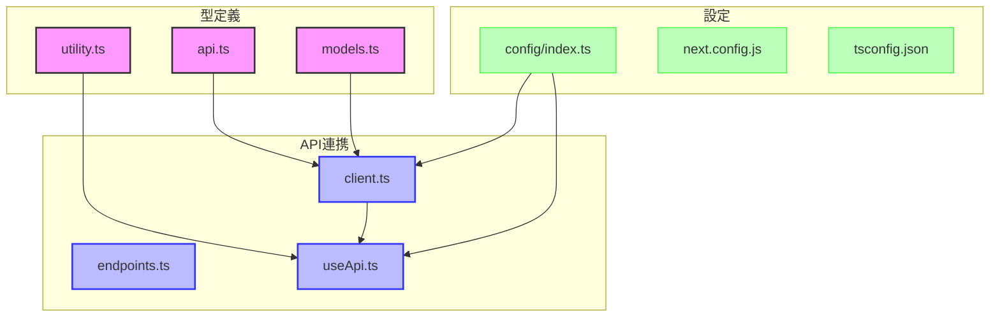

# FRONT-ARCH-001.1: Next.jsプロジェクトセットアップとTypeScript型定義

## 概要
練習表自動生成システムのフロントエンド開発環境を整備するため、Next.jsプロジェクトの初期セットアップとTypeScript型定義を確立します。バックエンドAPIとの連携を考慮した型定義や、開発効率と品質を向上させるためのプロジェクト構造を設計します。

## 詳細
- Next.jsプロジェクトの初期化とディレクトリ構造の設計
- TypeScriptの設定とESLint/Prettierの導入
- APIレスポンスに対応した型定義の作成
- 共通インターフェースと型ユーティリティの実装
- 環境変数と設定ファイルの構築

## 依存関係
- 親タスク: FRONT-ARCH-001

## 参照ファイル
- [設計書/11f_実装指針_フロントエンド.md](../../../../設計書/11f_実装指針_フロントエンド.md)
- [設計書/11c_画面設計詳細.md](../../../../設計書/11c_画面設計詳細.md)

## 成果物
- Next.jsプロジェクト構造
- TypeScript設定ファイル
- 共通型定義ファイル
- ESLint/Prettier設定
- APIクライアントの基本実装
- 環境変数設定ファイル

## ステータス
- [x] 未開始
- [ ] 進行中
- [ ] レビュー中
- [ ] 完了

## 担当者
未割り当て

## 主要機能
1. **プロジェクト構造設計**
   - 機能別ディレクトリ構造の確立
   - 命名規則とファイル配置ガイドラインの策定
   - ビルド設定とパフォーマンス最適化
   - デプロイ設定の基本構築

2. **TypeScript型システム**
   - APIレスポンス型の定義
   - コンポーネントProps型の設計
   - 状態管理のための型定義
   - ユーティリティ型の実装

3. **開発環境整備**
   - ESLint/Prettierによるコード品質管理
   - 環境変数管理システムの構築
   - エディタ設定と推奨拡張機能
   - gitフックとコミット前検証

## 実装予定ファイル
以下は実装予定の全ファイルのリストです。各ファイルの役割と目的を簡潔に記載します。

- `next.config.js` - Next.jsの基本設定ファイル
- `tsconfig.json` - TypeScriptコンパイラ設定
- `src/types/api.ts` - APIレスポンス型定義
- `src/types/models.ts` - ドメインモデル型定義
- `src/types/utility.ts` - ユーティリティ型定義
- `src/lib/api/client.ts` - APIクライアント基本実装
- `src/lib/hooks/useApi.ts` - API呼び出しカスタムフック
- `.eslintrc.js` - ESLint設定ファイル
- `.prettierrc` - Prettier設定ファイル
- `.env.example` - 環境変数テンプレート
- `src/config/index.ts` - アプリケーション設定

## 設計図
### プロジェクト構造


### 型定義システム


## 実装アプローチ
### プロジェクト初期化
1. **基本プロジェクト設定**
   - Next.jsプロジェクトの作成
   - TypeScript・ESLint・Prettier設定
   - ディレクトリ構造の確立
   - gitignore設定と初期コミット

2. **型システム構築**
   - 共通型定義の作成
   - APIクライアント型の実装
   - API応答型の定義
   - 状態管理のための型実装

## 実装するすべてのファイル構成詳細
以下は全ての実装予定ファイルの詳細です。各ファイルごとに目的とクラス/インターフェース、メソッド、依存関係などを詳しく記載します。

### `next.config.js`
**目的**: Next.jsフレームワークの設定を定義

**主要設定項目**:
- ビルド設定とパフォーマンス最適化オプション
- 環境変数設定
- API Proxyとリライトルール
- 画像最適化設定
- サードパーティモジュール設定

**設定例**:
```javascript
/** @type {import('next').NextConfig} */
const nextConfig = {
  reactStrictMode: true,
  images: {
    domains: ['localhost', 'example.com'],
  },
  env: {
    API_BASE_URL: process.env.API_BASE_URL,
  },
  async rewrites() {
    return [
      {
        source: '/api/:path*',
        destination: `${process.env.API_BASE_URL}/:path*`,
      },
    ];
  },
};

module.exports = nextConfig;
```

### `tsconfig.json`
**目的**: TypeScriptコンパイラの設定を定義

**主要設定項目**:
- コンパイルオプション
- 型検査の厳格度
- パスエイリアス設定
- ライブラリ参照設定
- ソースマップ設定

**設定例**:
```json
{
  "compilerOptions": {
    "target": "es5",
    "lib": ["dom", "dom.iterable", "esnext"],
    "allowJs": true,
    "skipLibCheck": true,
    "strict": true,
    "forceConsistentCasingInFileNames": true,
    "noEmit": true,
    "esModuleInterop": true,
    "module": "esnext",
    "moduleResolution": "node",
    "resolveJsonModule": true,
    "isolatedModules": true,
    "jsx": "preserve",
    "incremental": true,
    "baseUrl": ".",
    "paths": {
      "@/*": ["./src/*"]
    }
  },
  "include": ["next-env.d.ts", "**/*.ts", "**/*.tsx"],
  "exclude": ["node_modules"]
}
```

### `src/types/api.ts`
**目的**: APIレスポンスの型定義を提供

**インターフェース/型**:
- `ApiResponse<T>`: API応答の基本構造
  - **プロパティ**: 
    - `data: T`: 応答データ
    - `status: number`: ステータスコード
    - `message: string`: メッセージ
    - `timestamp: Date`: タイムスタンプ

- `PaginatedResponse<T>`: ページネーション応答構造
  - **プロパティ**: 
    - `items: T[]`: アイテムリスト
    - `total: number`: 合計アイテム数
    - `page: number`: 現在のページ
    - `pageSize: number`: ページサイズ
    - `hasMore: boolean`: 続きがあるか

- `ApiError`: エラー応答構造
  - **プロパティ**: 
    - `code: string`: エラーコード
    - `message: string`: エラーメッセージ
    - `details: any`: 詳細情報

**依存関係**:
- なし（基本型定義）

### `src/types/models.ts`
**目的**: ドメインモデルの型定義を提供

**インターフェース/型**:
- `User`: ユーザーモデル
  - **プロパティ**: 
    - `id: string`: ユーザーID
    - `email: string`: メールアドレス
    - `displayName: string`: 表示名
    - `roles: Role[]`: ロールリスト
    - `createdAt: Date`: 作成日時
    - `updatedAt: Date`: 更新日時

- `Role`: ロールモデル
  - **プロパティ**: 
    - `id: string`: ロールID
    - `name: string`: ロール名
    - `permissions: string[]`: 権限リスト

- `Schedule`: スケジュールモデル
  - **プロパティ**: 
    - `id: string`: スケジュールID
    - `title: string`: タイトル
    - `startDate: Date`: 開始日
    - `endDate: Date`: 終了日
    - `location: string`: 場所
    - `sessions: Session[]`: セッションリスト
    - `createdBy: string`: 作成者ID
    - `createdAt: Date`: 作成日時
    - `updatedAt: Date`: 更新日時

- `Session`: セッションモデル
  - **プロパティ**: 
    - `id: string`: セッションID
    - `title: string`: タイトル
    - `startTime: Date`: 開始時間
    - `endTime: Date`: 終了時間
    - `description: string`: 説明
    - `participants: User[]`: 参加者リスト
    - `supervisors: User[]`: 監督者リスト

**依存関係**:
- なし（基本型定義）

### `src/types/utility.ts`
**目的**: 汎用的なユーティリティ型を提供

**インターフェース/型**:
- `Nullable<T>`: null許容型
  - **定義**: `type Nullable<T> = T | null;`

- `Optional<T>`: undefined許容型
  - **定義**: `type Optional<T> = T | undefined;`

- `Result<T, E>`: 結果型（成功または失敗）
  - **定義**: 
    ```typescript
    type Result<T, E = Error> = 
      | { success: true; value: T }
      | { success: false; error: E };
    ```

- `DeepPartial<T>`: ネストされたオブジェクトの部分的型
  - **定義**: 再帰的にPartial<T>を適用

- `AsyncData<T, E>`: 非同期データの状態型
  - **定義**: 
    ```typescript
    type AsyncData<T, E = Error> = 
      | { status: 'idle' }
      | { status: 'loading' }
      | { status: 'success'; data: T }
      | { status: 'error'; error: E };
    ```

**依存関係**:
- なし（基本型定義）

### `src/lib/api/client.ts`
**目的**: APIとの通信を行うクライアントクラスを実装

**クラス/インターフェース**:
- `ApiClient`: APIリクエスト送信の基本クラス
  - **メソッド**: 
    - `constructor(baseUrl: string, headers?: Record<string, string>)`: クライアント初期化
    - `setAuthToken(token: string): void`: 認証トークン設定
    - `get<T>(path: string, params?: Record<string, any>): Promise<ApiResponse<T>>`: GETリクエスト
    - `post<T>(path: string, data?: any): Promise<ApiResponse<T>>`: POSTリクエスト
    - `put<T>(path: string, data?: any): Promise<ApiResponse<T>>`: PUTリクエスト
    - `delete<T>(path: string): Promise<ApiResponse<T>>`: DELETEリクエスト
    - `handleResponse<T>(response: Response): Promise<ApiResponse<T>>`: レスポンス処理
    - `handleError(error: any): never`: エラー処理

**依存関係**:
- `src/types/api.ts`: API型定義
- `src/config/index.ts`: 設定情報

### `src/lib/hooks/useApi.ts`
**目的**: API呼び出しを行うカスタムフックを実装

**フック/関数**:
- `useApi`: API呼び出しと状態管理を行うカスタムフック
  - **パラメータ**: 
    - `apiClient: ApiClient`: APIクライアントインスタンス
  - **戻り値**: 
    - `get<T>`: GETリクエストを行う関数
    - `post<T>`: POSTリクエストを行う関数
    - `put<T>`: PUTリクエストを行う関数
    - `delete<T>`: DELETEリクエストを行う関数

- `usePaginatedApi`: ページネーション対応API呼び出しを行うフック
  - **パラメータ**: 
    - `apiClient: ApiClient`: APIクライアントインスタンス
    - `path: string`: APIパス
    - `initialPageSize?: number`: 初期ページサイズ
  - **戻り値**: 
    - `data`: 現在のデータ
    - `loading`: ロード中フラグ
    - `error`: エラー情報
    - `page`: 現在のページ
    - `loadMore`: 次ページ読み込み関数
    - `reload`: 再読み込み関数

**依存関係**:
- `src/lib/api/client.ts`: APIクライアント
- `src/types/api.ts`: API型定義
- `react`: Reactフック

### `.eslintrc.js`
**目的**: ESLintによるコード品質チェックの設定を定義

**主要設定項目**:
- パーサーオプション
- プラグイン設定
- ルール設定
- 適用対象ファイル
- 無視ファイル

**設定例**:
```javascript
module.exports = {
  root: true,
  parser: '@typescript-eslint/parser',
  plugins: ['@typescript-eslint', 'react', 'react-hooks'],
  extends: [
    'eslint:recommended',
    'plugin:@typescript-eslint/recommended',
    'plugin:react/recommended',
    'plugin:react-hooks/recommended',
    'next/core-web-vitals',
    'prettier',
  ],
  env: {
    browser: true,
    node: true,
    es6: true,
  },
  settings: {
    react: {
      version: 'detect',
    },
  },
  rules: {
    'react/react-in-jsx-scope': 'off',
    'react/prop-types': 'off',
    '@typescript-eslint/explicit-module-boundary-types': 'off',
    '@typescript-eslint/no-unused-vars': ['warn', { argsIgnorePattern: '^_' }],
  },
};
```

### `.prettierrc`
**目的**: Prettierによるコードフォーマット設定を定義

**主要設定項目**:
- コードスタイル設定
- フォーマットオプション
- タブ設定
- 行長制限
- クォート設定

**設定例**:
```json
{
  "semi": true,
  "tabWidth": 2,
  "printWidth": 100,
  "singleQuote": true,
  "trailingComma": "es5",
  "jsxSingleQuote": false,
  "bracketSpacing": true,
  "arrowParens": "avoid",
  "endOfLine": "lf"
}
```

### `src/config/index.ts`
**目的**: アプリケーション全体の設定値を一元管理

**設定**:
- `config`: 設定オブジェクト
  - **プロパティ**: 
    - `apiBaseUrl`: API基本URL
    - `apiTimeout`: APIタイムアウト
    - `authTokenKey`: 認証トークン保存キー
    - `paginationDefaults`: ページネーション初期設定
    - `dateFormat`: 日付フォーマット
    - `environment`: 実行環境情報

**環境変数利用**:
- `NEXT_PUBLIC_API_BASE_URL`: API基本URL
- `NEXT_PUBLIC_ENV`: 環境名（development/production/test）

**依存関係**:
- なし

## ファイル間クラス連携図
