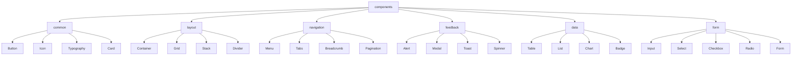
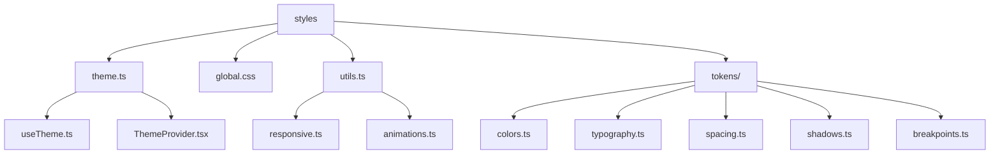

# FRONT-ARCH-001.2: コンポーネント設計とスタイリングシステム構築

## 概要
練習表自動生成システムのフロントエンド開発における再利用可能なコンポーネントライブラリとスタイリングシステムを設計・実装します。UIの一貫性を保ちながら、開発効率と保守性を高めるためのコンポーネント構造とデザインシステムを確立します。

## 詳細
- コンポーネント設計ガイドラインの策定
- アトミックデザインに基づいたコンポーネント階層の確立
- スタイリングシステムの構築（CSS-in-JS または CSS Modules）
- レスポンシブデザインの実装方針
- アクセシビリティ対応のフレームワーク整備

## 依存関係
- 親タスク: FRONT-ARCH-001
- 関連タスク: FRONT-ARCH-001.1（Next.jsプロジェクトセットアップとTypeScript型定義）

## 参照ファイル
- [設計書/11f_実装指針_フロントエンド.md](../../../../設計書/11f_実装指針_フロントエンド.md)
- [設計書/11c_画面設計詳細.md](../../../../設計書/11c_画面設計詳細.md)
- [設計書/11e_UIコンポーネント設計.md](../../../../設計書/11e_UIコンポーネント設計.md)

## 成果物
- コンポーネントライブラリ
- スタイリングシステム
- デザイントークン定義ファイル
- コンポーネント設計ガイドライン
- コンポーネントストーリーブック

## ステータス
- [x] 未開始
- [ ] 進行中
- [ ] レビュー中
- [ ] 完了

## 担当者
未割り当て

## 主要機能
1. **コンポーネントライブラリ**
   - 共通入力コンポーネント（テキスト入力、セレクト、チェックボックスなど）
   - レイアウトコンポーネント（コンテナ、グリッド、カードなど）
   - ナビゲーションコンポーネント（メニュー、タブ、パンくずリストなど）
   - フィードバックコンポーネント（アラート、モーダル、トーストなど）
   - データ表示コンポーネント（テーブル、リスト、グラフなど）

2. **スタイリングシステム**
   - デザイントークン定義（色、タイポグラフィ、スペーシング、シャドウなど）
   - レスポンシブブレークポイント設定
   - テーマ切替機能の基本構造
   - グローバルスタイルとリセット
   - アニメーションとトランジション

3. **アクセシビリティ対応**
   - WAI-ARIA対応
   - キーボードナビゲーション対応
   - スクリーンリーダー対応
   - コントラスト比最適化
   - フォーカス管理

## 実装予定ファイル
以下は実装予定の全ファイルのリストです。各ファイルの役割と目的を簡潔に記載します。

- `src/components/common/Button/Button.tsx` - ボタンコンポーネント
- `src/components/common/Input/Input.tsx` - 入力フィールドコンポーネント
- `src/components/common/Select/Select.tsx` - セレクトコンポーネント
- `src/components/common/Checkbox/Checkbox.tsx` - チェックボックスコンポーネント
- `src/components/common/Radio/Radio.tsx` - ラジオボタンコンポーネント
- `src/components/common/Card/Card.tsx` - カードコンポーネント
- `src/components/layout/Container/Container.tsx` - コンテナコンポーネント
- `src/components/layout/Grid/Grid.tsx` - グリッドレイアウトコンポーネント
- `src/components/layout/Stack/Stack.tsx` - スタックレイアウトコンポーネント
- `src/components/navigation/Menu/Menu.tsx` - メニューコンポーネント
- `src/components/navigation/Tabs/Tabs.tsx` - タブコンポーネント
- `src/components/feedback/Alert/Alert.tsx` - アラートコンポーネント
- `src/components/feedback/Modal/Modal.tsx` - モーダルコンポーネント
- `src/components/feedback/Toast/Toast.tsx` - トースト通知コンポーネント
- `src/components/data/Table/Table.tsx` - テーブルコンポーネント
- `src/components/data/List/List.tsx` - リストコンポーネント
- `src/styles/theme.ts` - デザイントークン定義
- `src/styles/global.css` - グローバルスタイル
- `src/styles/utils.ts` - スタイルユーティリティ関数
- `src/components/index.ts` - コンポーネントエクスポート
- `.storybook/main.js` - Storybookの設定
- `.storybook/preview.js` - Storybook表示設定

## 設計図
### コンポーネント階層


### スタイリングシステム構造


## 実装アプローチ
### コンポーネント設計
1. **デザインシステム確立**
   - デザイントークンの定義
   - コンポーネントの設計原則策定
   - コンポーネント間の連携ルール確立

2. **コンポーネント実装**
   - アトミックデザイン原則に基づく実装
   - 再利用性と保守性を重視した設計
   - Storybookによるコンポーネントカタログ作成

3. **スタイリング実装**
   - CSS-in-JSライブラリ選定と導入
   - レスポンシブデザインの実装
   - テーマ切替機能の実装

## 実装するすべてのファイル構成詳細
以下は全ての実装予定ファイルの詳細です。各ファイルごとに目的とクラス/コンポーネント、プロパティ、依存関係などを詳しく記載します。

### `src/components/common/Button/Button.tsx`
**目的**: 様々なスタイルとサイズのボタンコンポーネントを提供

**コンポーネント/インターフェース**:
- `ButtonProps`: ボタンのプロパティ
  - **プロパティ**: 
    - `variant?: 'primary' | 'secondary' | 'outline' | 'text'`: ボタンの見た目のバリエーション
    - `size?: 'small' | 'medium' | 'large'`: ボタンのサイズ
    - `disabled?: boolean`: 無効状態
    - `isLoading?: boolean`: ローディング状態
    - `leftIcon?: ReactNode`: 左側のアイコン
    - `rightIcon?: ReactNode`: 右側のアイコン
    - `onClick?: (event: React.MouseEvent) => void`: クリックハンドラ
    - `type?: 'button' | 'submit' | 'reset'`: ボタンのタイプ
    - `fullWidth?: boolean`: 幅100%表示
    - `children: ReactNode`: ボタンのコンテンツ

- `Button`: ボタンコンポーネント
  - **props**: `ButtonProps`
  - **実装詳細**: スタイリングシステムと連携し、異なるバリエーションとサイズに対応

**依存関係**:
- `src/styles/theme.ts`: デザイントークン
- `src/components/common/Icon/Icon.tsx`: アイコンコンポーネント（オプション）

### `src/components/common/Input/Input.tsx`
**目的**: テキスト入力フィールドコンポーネントを提供

**コンポーネント/インターフェース**:
- `InputProps`: 入力フィールドのプロパティ
  - **プロパティ**: 
    - `id: string`: 入力フィールドのID
    - `name: string`: 入力フィールドの名前
    - `value: string`: 入力値
    - `onChange: (event: React.ChangeEvent<HTMLInputElement>) => void`: 変更ハンドラ
    - `placeholder?: string`: プレースホルダーテキスト
    - `type?: 'text' | 'password' | 'email' | 'number' | 'tel'`: 入力タイプ
    - `disabled?: boolean`: 無効状態
    - `error?: string`: エラーメッセージ
    - `label?: string`: ラベルテキスト
    - `required?: boolean`: 必須フィールド
    - `icon?: ReactNode`: アイコン
    - `size?: 'small' | 'medium' | 'large'`: 入力フィールドのサイズ

- `Input`: 入力フィールドコンポーネント
  - **props**: `InputProps`
  - **実装詳細**: アクセシブルな入力フィールドを提供し、エラー状態などを視覚的に表現

**依存関係**:
- `src/styles/theme.ts`: デザイントークン
- `src/components/common/Icon/Icon.tsx`: アイコンコンポーネント（オプション）

### `src/components/layout/Container/Container.tsx`
**目的**: コンテンツのコンテナを提供し、最大幅や余白を制御

**コンポーネント/インターフェース**:
- `ContainerProps`: コンテナのプロパティ
  - **プロパティ**: 
    - `maxWidth?: 'xs' | 'sm' | 'md' | 'lg' | 'xl' | 'full'`: 最大幅
    - `padding?: boolean | string`: パディング設定
    - `center?: boolean`: 中央寄せするかどうか
    - `children: ReactNode`: コンテナのコンテンツ

- `Container`: コンテナコンポーネント
  - **props**: `ContainerProps`
  - **実装詳細**: 異なる画面サイズに対応するレスポンシブなコンテナを提供

**依存関係**:
- `src/styles/theme.ts`: デザイントークン

### `src/components/feedback/Modal/Modal.tsx`
**目的**: モーダルダイアログを表示するコンポーネントを提供

**コンポーネント/インターフェース**:
- `ModalProps`: モーダルのプロパティ
  - **プロパティ**: 
    - `isOpen: boolean`: モーダルの表示状態
    - `onClose: () => void`: 閉じる処理
    - `title?: string`: モーダルのタイトル
    - `size?: 'sm' | 'md' | 'lg' | 'xl'`: モーダルのサイズ
    - `closeOnOverlayClick?: boolean`: オーバーレイクリックで閉じるかどうか
    - `closeOnEscape?: boolean`: Escキーで閉じるかどうか
    - `children: ReactNode`: モーダルのコンテンツ

- `Modal`: モーダルコンポーネント
  - **props**: `ModalProps`
  - **実装詳細**: アクセシブルなモーダルダイアログを提供し、キーボードイベントや焦点管理を適切に処理

- `ModalHeader`: モーダルヘッダーコンポーネント
  - **props**: `{ children?: ReactNode }`
  - **実装詳細**: タイトルと閉じるボタンを含むヘッダー

- `ModalBody`: モーダル本文コンポーネント
  - **props**: `{ children: ReactNode }`
  - **実装詳細**: モーダルの主要コンテンツ領域

- `ModalFooter`: モーダルフッターコンポーネント
  - **props**: `{ children: ReactNode }`
  - **実装詳細**: アクションボタンなどを含むフッター

**依存関係**:
- `src/styles/theme.ts`: デザイントークン
- `src/components/common/Button/Button.tsx`: ボタンコンポーネント
- `react-dom`: ポータル機能
- `src/hooks/useKeyPress.ts`: キー入力の検出（オプション）

### `src/components/data/Table/Table.tsx`
**目的**: データテーブルを表示するコンポーネントを提供

**コンポーネント/インターフェース**:
- `Column<T>`: テーブルの列定義
  - **プロパティ**: 
    - `id: string`: 列のID
    - `header: string | ReactNode`: 列のヘッダー
    - `accessor: (row: T) => any`: データのアクセサ関数
    - `cell?: (value: any, row: T) => ReactNode`: セルのレンダリング関数
    - `width?: string | number`: 列の幅
    - `sortable?: boolean`: ソート可能かどうか

- `TableProps<T>`: テーブルのプロパティ
  - **プロパティ**: 
    - `data: T[]`: テーブルデータ
    - `columns: Column<T>[]`: 列定義
    - `loading?: boolean`: ローディング状態
    - `sortable?: boolean`: ソート機能の有効化
    - `pagination?: { pageSize: number; currentPage: number; totalItems: number }`: ページネーション情報
    - `onPageChange?: (page: number) => void`: ページ変更ハンドラ
    - `onSort?: (columnId: string, direction: 'asc' | 'desc') => void`: ソートハンドラ
    - `emptyState?: ReactNode`: データが空の場合の表示

- `Table<T>`: テーブルコンポーネント
  - **props**: `TableProps<T>`
  - **実装詳細**: ソート、ページネーション、ローディング状態などをサポートするデータテーブル

**依存関係**:
- `src/styles/theme.ts`: デザイントークン
- `src/components/feedback/Spinner/Spinner.tsx`: ローディングスピナー（オプション）
- `src/components/navigation/Pagination/Pagination.tsx`: ページネーションコンポーネント（オプション）

### `src/styles/theme.ts`
**目的**: アプリケーション全体のデザイントークンを定義

**オブジェクト/インターフェース**:
- `Theme`: テーマの型定義
  - **プロパティ**: 
    - `colors`: 色定義
    - `typography`: タイポグラフィ定義
    - `spacing`: スペーシング定義
    - `breakpoints`: ブレークポイント定義
    - `shadows`: シャドウ定義
    - `radii`: 角丸定義
    - `zIndices`: z-index階層定義
    - `transitions`: トランジション定義

- `lightTheme`: ライトモードテーマ
  - **実装詳細**: ライトモード用のデザイントークン値

- `darkTheme`: ダークモードテーマ
  - **実装詳細**: ダークモード用のデザイントークン値

- `createTheme`: カスタムテーマ作成関数
  - **パラメータ**: `overrides: DeepPartial<Theme>`
  - **戻り値**: `Theme`
  - **実装詳細**: デフォルトテーマをベースにカスタマイズされたテーマを生成

**依存関係**:
- `src/types/utility.ts`: ユーティリティ型（DeepPartialなど）

### `src/styles/utils.ts`
**目的**: スタイリングに関するユーティリティ関数を提供

**関数**:
- `responsive`: レスポンシブ値を生成する関数
  - **パラメータ**: `value: Record<string, any> | any`
  - **戻り値**: メディアクエリを含むスタイル
  - **実装詳細**: 異なるブレークポイントに対応する値を生成

- `spacing`: スペーシング値を取得する関数
  - **パラメータ**: `value: number | string`
  - **戻り値**: CSSサイズ値
  - **実装詳細**: テーマのスペーシングスケールから適切な値を計算

- `color`: 色値を取得する関数
  - **パラメータ**: `value: string`
  - **戻り値**: CSS色値
  - **実装詳細**: テーマのカラースキームから色を取得

**依存関係**:
- `src/styles/theme.ts`: デザイントークン

## ファイル間コンポーネント連携図
```mermaid
graph TD
    subgraph "共通コンポーネント"
        BT[Button.tsx]
        IN[Input.tsx]
        SE[Select.tsx]
        CH[Checkbox.tsx]
        RA[Radio.tsx]
        CA[Card.tsx]
        IC[Icon.tsx]
        TY[Typography.tsx]
    end
    
    subgraph "レイアウトコンポーネント"
        CO[Container.tsx]
        GR[Grid.tsx]
        ST[Stack.tsx]
    end
    
    subgraph "フィードバックコンポーネント"
        AL[Alert.tsx]
        MO[Modal.tsx]
        TO[Toast.tsx]
        SP[Spinner.tsx]
    end
    
    subgraph "データコンポーネント"
        TA[Table.tsx]
        LI[List.tsx]
    end
    
    subgraph "スタイル"
        TH[theme.ts]
        GL[global.css]
        UT[utils.ts]
    end
    
    TH --> BT
    TH --> IN
    TH --> SE
    TH --> CH
    TH --> RA
    TH --> CA
    TH --> CO
    TH --> GR
    TH --> ST
    TH --> AL
    TH --> MO
    TH --> TO
    TH --> TA
    TH --> LI
    
    UT --> BT
    UT --> IN
    UT --> CO
    UT --> GR
    UT --> ST
    
    IC --> BT
    IC --> IN
    IC --> SE
    
    BT --> MO
    BT --> AL
    
    TY --> BT
    TY --> IN
    TY --> AL
    TY --> TA
    
    classDef common fill:#f9f,stroke:#333,stroke-width:2px;
    classDef layout fill:#bbf,stroke:#33f,stroke-width:2px;
    classDef feedback fill:#bfb,stroke:#3f3,stroke-width:1px;
    classDef data fill:#fbb,stroke:#f33,stroke-width:1px;
    classDef style fill:#fff,stroke:#999,stroke-width:1px;
    
    class BT,IN,SE,CH,RA,CA,IC,TY common;
    class CO,GR,ST layout;
    class AL,MO,TO,SP feedback;
    class TA,LI data;
    class TH,GL,UT style;
``` 