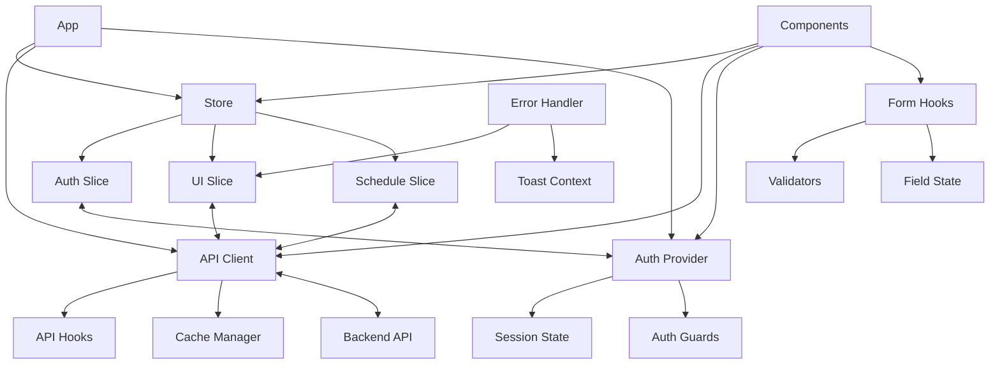
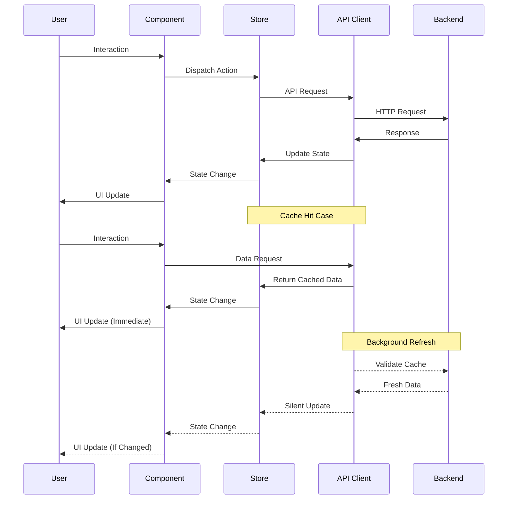
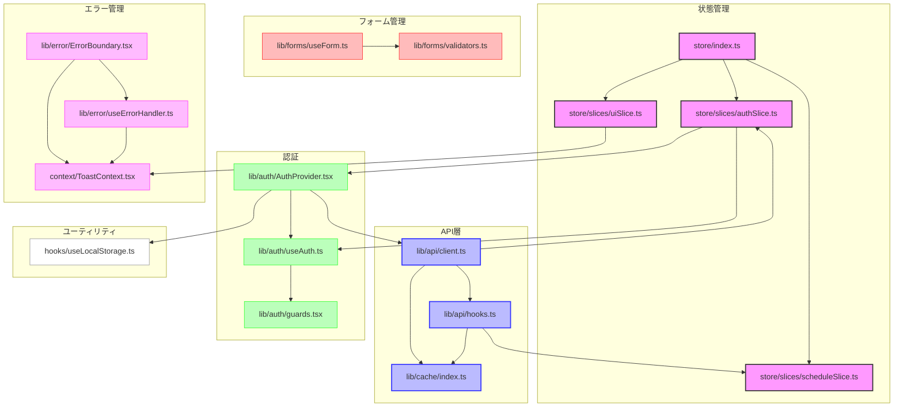

# FRONT-ARCH-001.3: 状態管理システムとデータフローアーキテクチャ

## 概要
練習表自動生成システムのフロントエンド開発における状態管理システムとデータフローアーキテクチャを設計・実装します。クライアントサイドの状態、APIデータ、キャッシュ、およびユーザーセッション情報を効率的に管理するための一貫したアプローチを構築します。

## 詳細
- グローバル状態管理ライブラリの選定と実装
- APIデータフェッチングとキャッシュ戦略の確立
- フォーム状態管理アプローチの設計
- エラー処理とロード状態の一元管理
- 認証状態とユーザーセッション管理の実装

## 依存関係
- 親タスク: FRONT-ARCH-001
- 関連タスク: 
  - FRONT-ARCH-001.1（Next.jsプロジェクトセットアップとTypeScript型定義）
  - FRONT-ARCH-001.2（コンポーネント設計とスタイリングシステム構築）
  - BACK-API-001（APIサーバー基盤構築）

## 参照ファイル
- [設計書/11f_実装指針_フロントエンド.md](../../../../設計書/11f_実装指針_フロントエンド.md)
- [設計書/11g_状態管理設計.md](../../../../設計書/11g_状態管理設計.md)

## 成果物
- 状態管理基盤
- APIクライアントとキャッシュシステム
- 認証システムとセッション管理
- フォーム管理ユーティリティ
- エラー処理とロード状態管理システム

## ステータス
- [x] 未開始
- [ ] 進行中
- [ ] レビュー中
- [ ] 完了

## 担当者
未割り当て

## 主要機能
1. **グローバル状態管理**
   - アプリケーション全体の状態管理（Redux/Zustand/Jotai/Recoilなど）
   - 状態の永続化と復元
   - 状態のデバッグツール連携
   - 非同期アクションの処理

2. **APIデータフェッチングとキャッシュ**
   - REST APIクライアント実装
   - キャッシュ戦略（SWR/React Query等）
   - 自動再フェッチとエラーリトライ
   - オプティミスティックUI更新

3. **フォーム状態管理**
   - フォームのバリデーション
   - フィールド状態とエラー管理
   - 複雑なフォームの分割管理
   - フォーム送信状態の処理

4. **認証とセッション管理**
   - ユーザーセッション状態
   - トークン管理と更新
   - 権限に基づくルーティング制御
   - セッション有効期限管理

## 実装予定ファイル
以下は実装予定の全ファイルのリストです。各ファイルの役割と目的を簡潔に記載します。

- `src/store/index.ts` - 状態管理のエントリーポイント
- `src/store/slices/authSlice.ts` - 認証状態管理
- `src/store/slices/uiSlice.ts` - UI状態管理
- `src/store/slices/scheduleSlice.ts` - スケジュール関連状態管理
- `src/lib/api/client.ts` - APIクライアント実装
- `src/lib/api/hooks.ts` - APIフック実装
- `src/lib/forms/useForm.ts` - フォーム管理カスタムフック
- `src/lib/forms/validators.ts` - フォームバリデーション
- `src/lib/auth/AuthProvider.tsx` - 認証コンテキストプロバイダー
- `src/lib/auth/useAuth.ts` - 認証カスタムフック
- `src/lib/auth/guards.tsx` - ルート保護コンポーネント
- `src/lib/cache/index.ts` - キャッシュマネージャー
- `src/lib/error/ErrorBoundary.tsx` - エラーバウンダリー
- `src/lib/error/useErrorHandler.ts` - エラーハンドリングフック
- `src/context/ToastContext.tsx` - トースト通知コンテキスト
- `src/hooks/useLocalStorage.ts` - ローカルストレージフック

## 設計図
### 状態管理アーキテクチャ

### データフロー図

## 実装アプローチ
### 状態管理システム
1. **状態管理ライブラリの選定**
   - パフォーマンスと開発体験のバランスを考慮
   - スケーラビリティと保守性を重視
   - TypeScript連携の容易さを評価

2. **状態カテゴリの分離**
   - UI状態（モーダル、ドロワー、選択状態など）
   - エンティティ状態（ユーザーデータ、スケジュールなど）
   - セッション状態（認証、権限など）
   - トランジェント状態（フォーム入力、一時データなど）

3. **APIと状態の連携**
   - サーバーデータの効率的なキャッシュ
   - 楽観的UI更新の実装
   - エラー状態とロード状態の統合管理

## 実装するすべてのファイル構成詳細
以下は全ての実装予定ファイルの詳細です。各ファイルごとに目的とクラス/関数、インターフェース、実装詳細などを詳しく記載します。

### `src/store/index.ts`
**目的**: 状態管理システムのエントリーポイントと設定

**内容**:
- `store`: アプリケーションのグローバルストア
  - **実装詳細**: 選定した状態管理ライブラリに基づくストア設定
  - **機能**:
    - スライスの統合
    - ミドルウェア設定
    - 開発ツール連携
    - 永続化設定

- `StoreProvider`: ストアプロバイダーコンポーネント
  - **props**: `{ children: ReactNode }`
  - **実装詳細**: アプリケーション全体にストアを提供するプロバイダー

- `useAppDispatch`: ディスパッチフック
  - **戻り値**: 型付きディスパッチ関数
  - **実装詳細**: TypeScriptと連携した型安全なディスパッチ関数

- `useAppSelector`: セレクターフック
  - **パラメータ**: `selector: (state: RootState) => T`
  - **戻り値**: 選択した状態値
  - **実装詳細**: 型安全なセレクターフック

**依存関係**:
- 選定した状態管理ライブラリ（Redux/Zustand/Jotai/Recoilなど）
- `src/store/slices/*`: 各状態スライス

### `src/store/slices/authSlice.ts`
**目的**: 認証関連の状態管理

**内容**:
- `AuthState`: 認証状態の型定義
  - **プロパティ**: 
    - `user: User | null`: 認証ユーザー
    - `token: string | null`: 認証トークン
    - `isAuthenticated: boolean`: 認証状態
    - `isLoading: boolean`: ロード状態
    - `error: Error | null`: エラー情報

- `authSlice`: 認証スライス
  - **初期状態**: `AuthState`の初期値
  - **リデューサー**:
    - `login`: ログイン処理
    - `logout`: ログアウト処理
    - `refreshToken`: トークン更新
    - `updateUser`: ユーザー情報更新
    - `setAuthError`: 認証エラー設定

- `selectUser`: ユーザー情報セレクター
  - **戻り値**: `User | null`

- `selectIsAuthenticated`: 認証状態セレクター
  - **戻り値**: `boolean`

- 非同期アクション:
  - `loginAsync`: ログイン非同期アクション
  - `logoutAsync`: ログアウト非同期アクション
  - `refreshTokenAsync`: トークン更新非同期アクション

**依存関係**:
- 選定した状態管理ライブラリ
- `src/types/models.ts`: ユーザー型定義
- `src/lib/api/client.ts`: APIクライアント

### `src/lib/api/client.ts`
**目的**: バックエンドAPIと通信するクライアント

**内容**:
- `ApiClient`: APIクライアントクラス
  - **メソッド**: 
    - `constructor(baseUrl: string, options?: ApiClientOptions)`: クライアント初期化
    - `setAuthToken(token: string): void`: 認証トークン設定
    - `get<T>(path: string, params?: Record<string, any>, options?: RequestOptions): Promise<T>`: GETリクエスト
    - `post<T>(path: string, data?: any, options?: RequestOptions): Promise<T>`: POSTリクエスト
    - `put<T>(path: string, data?: any, options?: RequestOptions): Promise<T>`: PUTリクエスト
    - `delete<T>(path: string, options?: RequestOptions): Promise<T>`: DELETEリクエスト
    - `request<T>(config: RequestConfig): Promise<T>`: 汎用リクエスト
    - `handleResponse<T>(response: Response): Promise<T>`: レスポンス処理
    - `handleError(error: any): never`: エラー処理

- `RequestOptions`: リクエストオプション型
  - **プロパティ**: 
    - `headers?: Record<string, string>`: カスタムヘッダー
    - `timeout?: number`: タイムアウト設定
    - `cache?: 'default' | 'no-store' | 'reload' | 'no-cache' | 'force-cache'`: キャッシュ設定
    - `signal?: AbortSignal`: 中断シグナル

- `api`: APIクライアントのシングルトンインスタンス

**依存関係**:
- `src/config/index.ts`: 設定情報
- `src/lib/error/useErrorHandler.ts`: エラーハンドリング

### `src/lib/api/hooks.ts`
**目的**: APIデータ取得と状態管理のためのReactフック

**内容**:
- `useFetch`: データ取得カスタムフック
  - **パラメータ**: 
    - `path: string`: APIパス
    - `params?: Record<string, any>`: クエリパラメータ
    - `options?: FetchOptions`: 取得オプション
  - **戻り値**: 
    - `data: T | undefined`: 取得データ
    - `isLoading: boolean`: ロード状態
    - `error: Error | null`: エラー情報
    - `refetch: () => Promise<void>`: 再取得関数

- `useMutation`: データ変更カスタムフック
  - **パラメータ**: 
    - `path: string`: APIパス
    - `method: 'POST' | 'PUT' | 'DELETE'`: HTTPメソッド
    - `options?: MutationOptions`: 変更オプション
  - **戻り値**: 
    - `mutate: (data?: any) => Promise<T>`: 変更実行関数
    - `isLoading: boolean`: ロード状態
    - `error: Error | null`: エラー情報
    - `reset: () => void`: 状態リセット関数

- `useInfiniteQuery`: 無限スクロールデータ取得フック
  - **パラメータ**: 
    - `path: string`: APIパス
    - `getNextPageParam: (lastPage: any, allPages: any[]) => any`: 次ページパラメータ取得関数
    - `options?: InfiniteQueryOptions`: クエリオプション
  - **戻り値**: 
    - `data: T[]`: 取得データ
    - `isLoading: boolean`: ロード状態
    - `error: Error | null`: エラー情報
    - `hasNextPage: boolean`: 次ページ存在フラグ
    - `fetchNextPage: () => Promise<void>`: 次ページ取得関数

**依存関係**:
- `src/lib/api/client.ts`: APIクライアント
- `src/lib/cache/index.ts`: キャッシュマネージャー
- `react`: React Hooks

### `src/lib/forms/useForm.ts`
**目的**: フォーム状態と検証を管理するカスタムフック

**内容**:
- `useForm`: フォーム管理フック
  - **パラメータ**: 
    - `initialValues: T`: 初期値
    - `validationSchema?: ValidationSchema<T>`: バリデーションスキーマ
    - `onSubmit?: (values: T, helpers: FormHelpers) => void | Promise<void>`: 送信ハンドラ
  - **戻り値**: 
    - `values: T`: フォーム値
    - `errors: Record<keyof T, string>`: フィールドエラー
    - `touched: Record<keyof T, boolean>`: フィールドタッチ状態
    - `isSubmitting: boolean`: 送信中状態
    - `handleChange: (e: ChangeEvent<any>) => void`: 変更ハンドラ
    - `handleBlur: (e: FocusEvent<any>) => void`: フォーカス喪失ハンドラ
    - `handleSubmit: (e: FormEvent) => void`: 送信ハンドラ
    - `setFieldValue: (name: keyof T, value: any) => void`: フィールド値設定
    - `resetForm: () => void`: フォームリセット

- `ValidationSchema<T>`: バリデーションスキーマ型
  - **実装詳細**: オブジェクト形式または関数形式のバリデーションスキーマ定義

- `FormHelpers`: フォームヘルパー型
  - **プロパティ**: 
    - `setSubmitting: (isSubmitting: boolean) => void`: 送信状態設定
    - `resetForm: () => void`: フォームリセット
    - `setErrors: (errors: Record<string, string>) => void`: エラー設定

**依存関係**:
- `src/lib/forms/validators.ts`: バリデーション関数
- `react`: React Hooks

### `src/lib/auth/AuthProvider.tsx`
**目的**: アプリケーション全体の認証状態管理

**内容**:
- `AuthContext`: 認証コンテキスト
  - **プロパティ**: 
    - `user: User | null`: 現在のユーザー
    - `isAuthenticated: boolean`: 認証状態
    - `isLoading: boolean`: ロード状態
    - `login: (email: string, password: string) => Promise<void>`: ログイン関数
    - `logout: () => Promise<void>`: ログアウト関数
    - `signup: (userData: SignupData) => Promise<void>`: サインアップ関数
    - `refreshToken: () => Promise<void>`: トークン更新関数

- `AuthProvider`: 認証プロバイダーコンポーネント
  - **props**: `{ children: ReactNode }`
  - **実装詳細**: 認証状態の管理とトークンの取得・更新・保存を行う

- `useAuthInit`: 認証初期化フック
  - **実装詳細**: ローカルストレージからトークンを取得し初期認証状態を設定

**依存関係**:
- `src/store/slices/authSlice.ts`: 認証状態スライス
- `src/lib/api/client.ts`: APIクライアント
- `src/hooks/useLocalStorage.ts`: ローカルストレージフック
- `react`: React Context API

### `src/lib/error/ErrorBoundary.tsx`
**目的**: コンポーネントツリー内のエラーをキャッチし適切に表示

**内容**:
- `ErrorBoundary`: エラーバウンダリーコンポーネント
  - **props**: 
    - `children: ReactNode`: 子コンポーネント
    - `fallback?: ReactNode | ((error: Error, resetError: () => void) => ReactNode)`: エラー表示コンポーネント
    - `onError?: (error: Error, info: ErrorInfo) => void`: エラーハンドラー
  - **state**: 
    - `error: Error | null`: 捕捉したエラー
  - **メソッド**: 
    - `static getDerivedStateFromError(error: Error): { error: Error }`: エラー状態設定
    - `componentDidCatch(error: Error, info: ErrorInfo): void`: エラーログ記録
    - `resetError(): void`: エラー状態リセット

- `withErrorBoundary`: エラーバウンダリーでコンポーネントをラップするHOC
  - **パラメータ**: 
    - `Component: ComponentType
`: 対象コンポーネント
    - `errorBoundaryProps?: ErrorBoundaryProps`: エラーバウンダリーのプロパティ
  - **戻り値**: エラーバウンダリーでラップされたコンポーネント

**依存関係**:
- `src/context/ToastContext.tsx`: トースト通知コンテキスト
- `react`: React Error Boundary API

### `src/context/ToastContext.tsx`
**目的**: 通知メッセージの表示を管理するコンテキスト

**内容**:
- `Toast`: トースト型
  - **プロパティ**: 
    - `id: string`: トーストID
    - `type: 'info' | 'success' | 'warning' | 'error'`: トースト種類
    - `message: string`: メッセージ
    - `duration?: number`: 表示時間（ミリ秒）
    - `position?: 'top' | 'bottom' | 'top-left' | 'top-right' | 'bottom-left' | 'bottom-right'`: 表示位置

- `ToastContext`: トーストコンテキスト
  - **プロパティ**: 
    - `toasts: Toast[]`: 現在のトースト一覧
    - `addToast: (toast: Omit<Toast, 'id'>) => string`: トースト追加関数
    - `removeToast: (id: string) => void`: トースト削除関数
    - `clearToasts: () => void`: 全トースト削除関数

- `ToastProvider`: トーストプロバイダーコンポーネント
  - **props**: `{ children: ReactNode }`
  - **実装詳細**: トースト状態管理と表示・削除を制御

- `ToastContainer`: トースト表示コンポーネント
  - **props**: `{ position?: ToastPosition }`
  - **実装詳細**: トーストの視覚的表示とアニメーション

- `useToast`: トースト利用フック
  - **戻り値**: `ToastContext`
  - **実装詳細**: 簡易なトースト通知API

**依存関係**:
- `src/components/feedback/Toast/Toast.tsx`: トーストコンポーネント
- `react`: React Context API

### `src/hooks/useLocalStorage.ts`
**目的**: ローカルストレージを使用した永続的な状態管理

**内容**:
- `useLocalStorage<T>`: ローカルストレージ利用フック
  - **パラメータ**: 
    - `key: string`: ストレージキー
    - `initialValue: T | (() => T)`: 初期値
  - **戻り値**: 
    - `[value: T, setValue: (value: T | ((val: T) => T)) => void]`: 状態と設定関数
  - **実装詳細**: 
    - ローカルストレージからの値の読み取り
    - 値の更新とストレージへの保存
    - ストレージイベントによる同期

- `clearLocalStorageItem`: 特定のアイテムをクリアする関数
  - **パラメータ**: `key: string`
  - **実装詳細**: ローカルストレージから特定のキーを削除

- `clearLocalStorage`: すべてのアプリ関連アイテムをクリアする関数
  - **パラメータ**: `prefix?: string`
  - **実装詳細**: 特定のプレフィックスを持つすべてのキーを削除

**依存関係**:
- `react`: React Hooks

## ファイル間連携図
