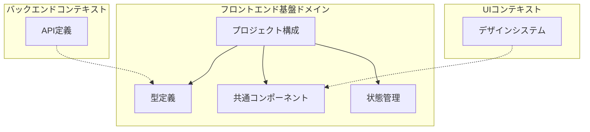
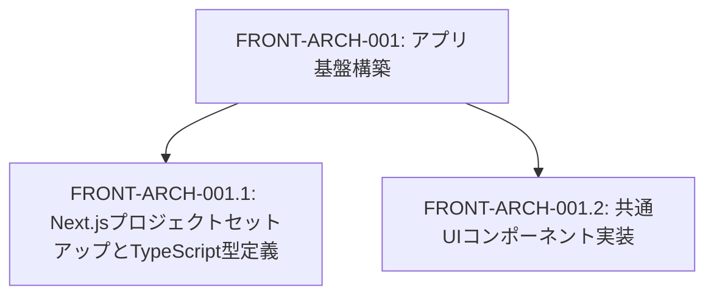
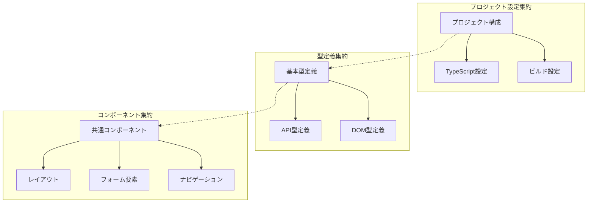
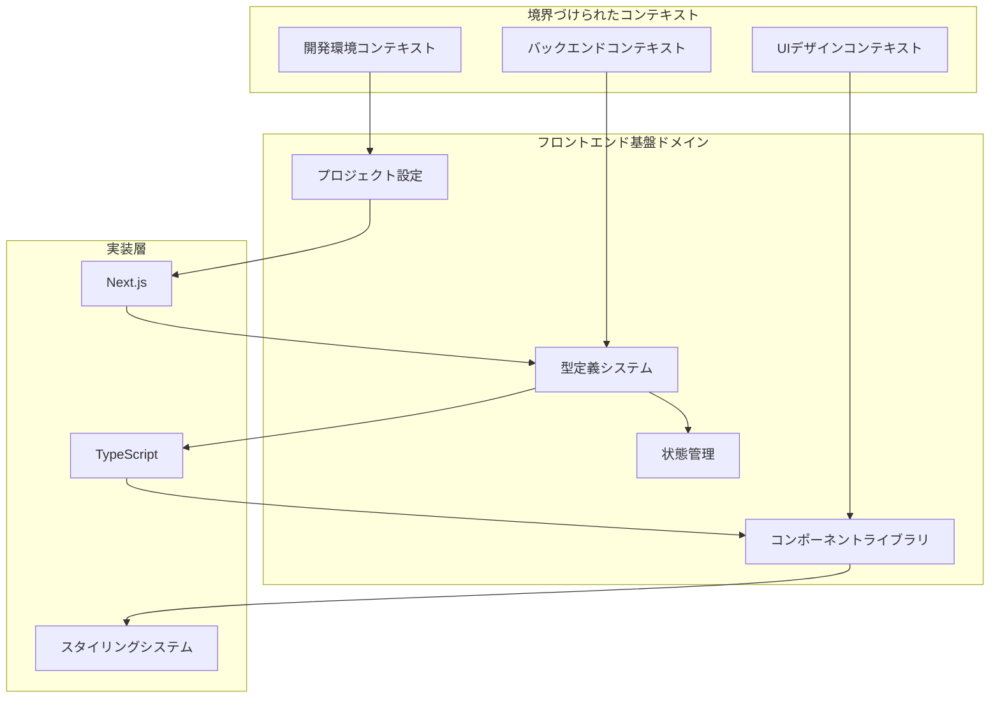

# FRONT-ARCH-001: アプリ基盤構築

## ドメインの概要
アプリ基盤構築ドメインは、フロントエンドアプリケーション全体の基盤となるアーキテクチャとコンポーネント設計を担当します。Next.jsプロジェクトの初期設定とTypeScript型定義の確立、および共通UIコンポーネントの実装を通じて、一貫性のあるユーザーインターフェースと効率的な開発環境を提供します。

## ドメインモデルと境界づけられたコンテキスト

## ユビキタス言語

| 用語 | 定義 |
|------|------|
| Next.js | Reactベースのフロントエンドフレームワーク |
| TypeScript | 静的型付けを提供するJavaScriptの上位互換言語 |
| コンポーネント | 再利用可能なUI要素 |
| ヘッダー | ページ上部に表示される共通ナビゲーション領域 |
| フッター | ページ下部に表示される共通情報領域 |
| ナビゲーション | サイト内の移動を支援するUI要素 |
| フォーム要素 | データ入力のためのUI要素（入力フィールド、ボタンなど） |
| 型定義 | データ構造を明示的に定義するTypeScriptの機能 |
| インターフェース | オブジェクトの形状を定義するTypeScriptの構造 |

## サブドメイン構成

## サブドメイン詳細

### FRONT-ARCH-001.1: Next.jsプロジェクトセットアップとTypeScript型定義
**ドメイン責務**: Next.jsプロジェクトの基本構造を設定し、アプリケーション全体で使用する型定義を確立する

**ドメインサービス**:
- プロジェクト構造設計（ディレクトリ構成、ファイル命名規則）
- TypeScript型定義管理（共通型、APIレスポンス型）
- ビルド設定最適化（コンパイラオプション、バンドル設定）

**ステータス**: 未開始

### FRONT-ARCH-001.2: 共通UIコンポーネント実装
**ドメイン責務**: アプリケーション全体で再利用可能な基本UIコンポーネントを設計・実装する

**ドメインサービス**:
- コンポーネントライブラリ管理（コンポーネントの実装・文書化）
- スタイル管理（CSSフレームワーク連携、テーマ設定）
- アクセシビリティ対応（WAI-ARIA準拠、キーボード操作）

**ステータス**: 未開始

## コマンド・クエリ責務分離（CQRS）

### コマンド（書き込み操作）
- プロジェクト構造初期化
- 依存パッケージインストール
- 型定義ファイル作成
- コンポーネント実装
- ビルド設定更新

### クエリ（読み取り操作）
- 型情報参照
- コンポーネント属性参照
- プロジェクト構成確認
- ビルド設定取得

## 集約と整合性境界

## 開発コンテキスト図

## 進捗管理

| サブドメイン | ステータス | 担当者 | 開始日 | 完了予定 | 実際の完了日 |
|------------|-----------|--------|-------|---------|------------|
| FRONT-ARCH-001.1 | 未開始 | | | | |
| FRONT-ARCH-001.2 | 未開始 | | | | |

## イベントストーミング

## 課題・リスク

- TypeScriptの型定義の複雑さと保守性
- コンポーネントの再利用性と柔軟性のバランス
- Next.jsのバージョンアップへの対応
- パフォーマンス最適化（特にビルド時間とバンドルサイズ）
- クロスブラウザ互換性の確保

## レビューポイント

- プロジェクト構造の一貫性と拡張性
- TypeScript型定義の厳格さと使いやすさ
- コンポーネントの分割粒度の適切さ
- スタイリングアプローチの一貫性
- コードの可読性と文書化

## リファレンス

- [設計書/11f_実装指針_フロントエンド.md](../../../設計書/11f_実装指針_フロントエンド.md)
- [設計書/11c_画面設計詳細.md](../../../設計書/11c_画面設計詳細.md) 