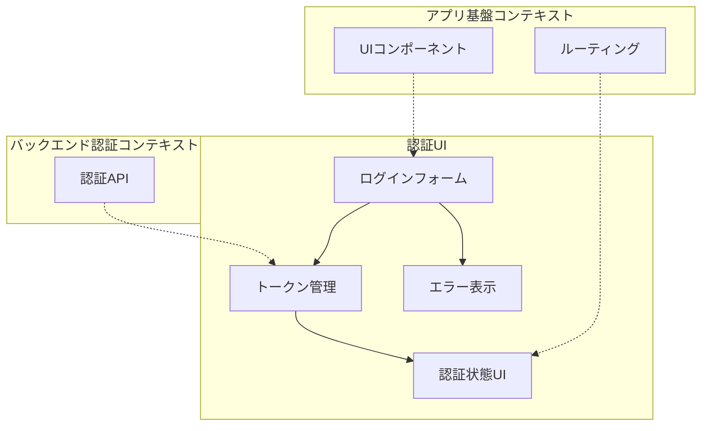
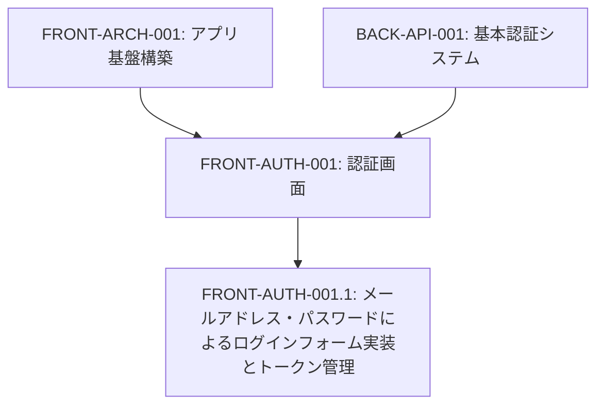
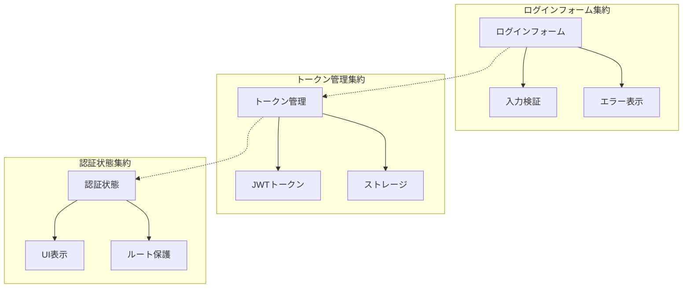
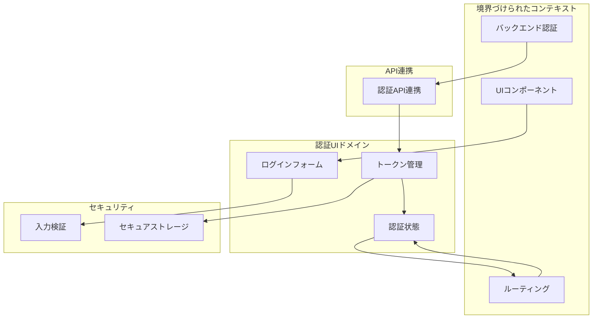
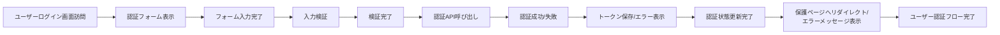

# FRONT-AUTH-001: 認証画面

## ドメインの概要
認証画面ドメインは、ユーザーがシステムにアクセスするためのエントリーポイントとなる認証インターフェースを提供します。メールアドレスとパスワードによるログインフォームの実装と、取得した認証トークンの管理機能を通じて、安全かつ使いやすいユーザー認証体験を実現します。

## ドメインモデルと境界づけられたコンテキスト

## ユビキタス言語

| 用語 | 定義 |
|------|------|
| ログインフォーム | ユーザー認証情報を入力するためのインターフェース |
| 認証トークン | サーバーから発行される一時的なアクセス許可証 |
| JWT | JSON Web Token、認証情報を安全に伝達するための標準形式 |
| 認証状態 | ユーザーがログイン済みかどうかの状態 |
| トークン管理 | 認証トークンの保存、検証、更新、削除を行う機能 |
| ログアウト | 認証状態を終了させる操作 |
| パスワードマスキング | パスワード入力を視覚的に隠す機能 |
| 認証エラー | 認証プロセス中に発生するエラー状態 |

## サブドメイン構成

## サブドメイン詳細

### FRONT-AUTH-001.1: メールアドレス・パスワードによるログインフォーム実装とトークン管理
**ドメイン責務**: ユーザー認証のためのログインフォームを実装し、認証トークンを適切に管理する

**ドメインサービス**:
- ログインフォーム管理（入力検証、エラー表示、送信処理）
- トークン管理サービス（JWT保存、検証、更新）
- 認証状態管理（ログイン状態の保持と反映）

**ステータス**: 未開始

## コマンド・クエリ責務分離（CQRS）

### コマンド（書き込み操作）
- ログイン実行
- ログアウト実行
- トークン保存
- トークン削除
- 認証エラーリセット

### クエリ（読み取り操作）
- 認証状態確認
- トークン取得
- ユーザー情報取得
- 認証エラー情報取得

## 集約と整合性境界

## 開発コンテキスト図

## 進捗管理

| サブドメイン | ステータス | 担当者 | 開始日 | 完了予定 | 実際の完了日 |
|------------|-----------|--------|-------|---------|------------|
| FRONT-AUTH-001.1 | 未開始 | | | | |

## イベントストーミング

## 課題・リスク

- セキュリティ（クロスサイトスクリプティング、トークン漏洩）
- ユーザビリティとセキュリティのバランス
- 複数デバイスからのログイン状態管理
- オフライン状態での認証処理
- バックエンドAPIとの整合性維持

## レビューポイント

- 入力検証の完全性（クライアント側とサーバー側の両方）
- エラーメッセージの明確さと親切さ
- トークン保存方法のセキュリティレベル
- ログイン/ログアウト操作のUX
- 認証状態の一貫した反映

## リファレンス

- [設計書/11c_画面設計詳細.md](../../../設計書/11c_画面設計詳細.md)
- [設計書/07_権限・ロール設計.md](../../../設計書/07_権限・ロール設計.md) 