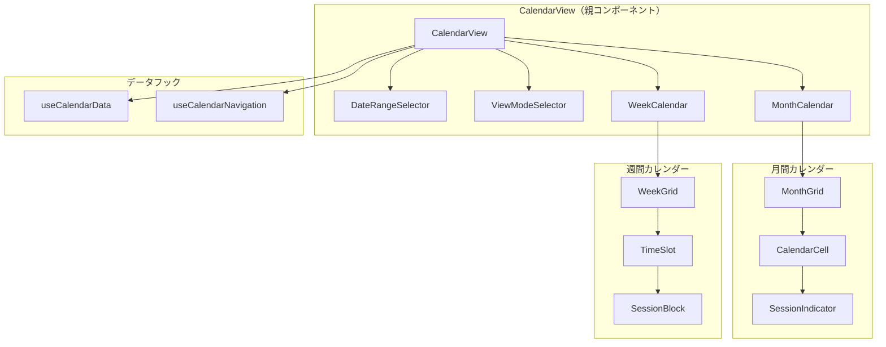
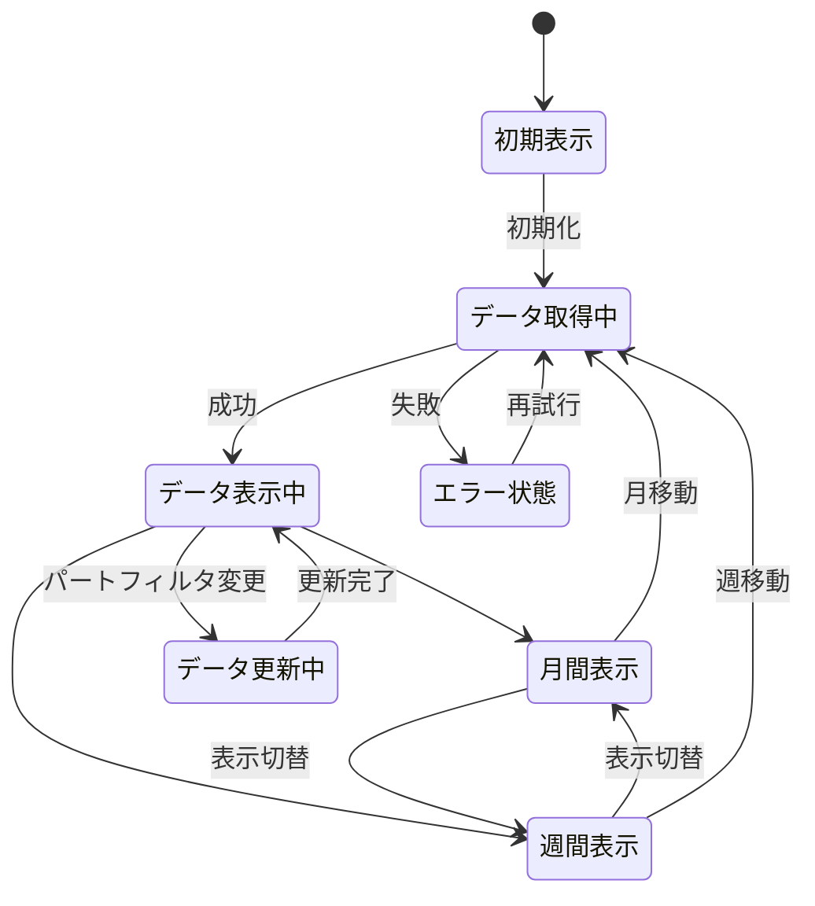
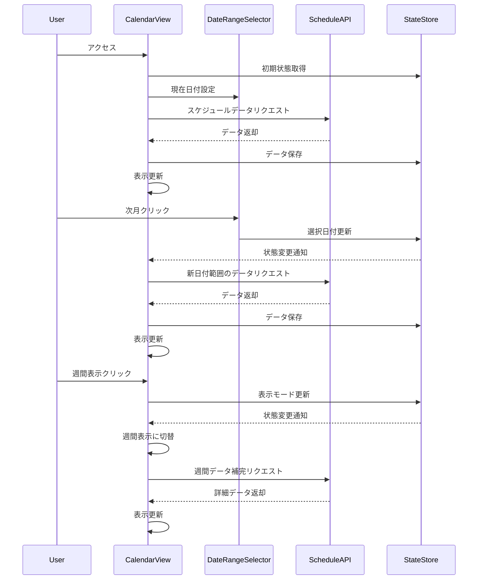
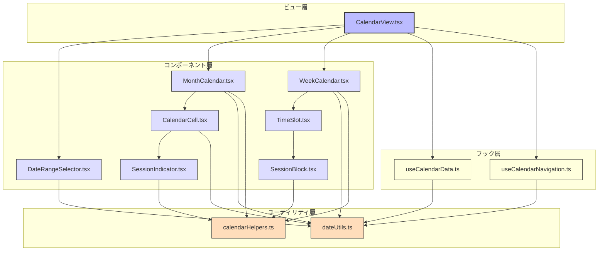

# FRONT-SCHED-001.1: 月間・週間カレンダービュー実装と日付範囲選択機能

## 概要
練習表自動生成システムにおいて、月間・週間単位でスケジュールを表示するカレンダービューとその日付範囲を選択する機能を実装します。モダンなUIライブラリを使用し、ユーザーが直感的に操作できるカレンダーインターフェースを提供します。

## 詳細
- 月間カレンダービューの実装（月全体を表示するビュー）
- 週間カレンダービューの実装（1週間の詳細を表示するビュー）
- 月間/週間ビューの切り替え機能
- 日付範囲選択UIの実装（前月/翌月、前週/翌週ナビゲーション）
- 当日・選択日のハイライト表示
- 練習セッションの視覚的表示（カラーコード、時間枠）
- レスポンシブデザイン対応（PC・タブレット・モバイル）

## 依存関係
- 親タスク: FRONT-SCHED-001
- FRONT-ARCH-001: アプリ基盤構築
- BACK-API-002.1: 日付範囲・パート別スケジュール取得APIエンドポイント実装

## 参照ファイル
- [設計書/11c_画面設計詳細.md](../../../../../設計書/11c_画面設計詳細.md)
- [設計書/11f_実装指針_フロントエンド.md](../../../../../設計書/11f_実装指針_フロントエンド.md)

## 成果物
- 月間カレンダーコンポーネント
- 週間カレンダーコンポーネント
- 日付選択コンポーネント
- スケジュールデータ取得・表示ロジック
- レスポンシブデザインスタイル
- 単体・統合テストコード

## ステータス
- [x] 未開始
- [ ] 進行中
- [ ] レビュー中
- [ ] 完了

## 担当者
未割り当て

## 主要機能
1. **月間カレンダービュー**
   - 1ヶ月分のスケジュールを一覧表示
   - 日付ごとのセッション数またはサマリー表示
   - 土日祝日の特別表示
   - 当日と選択日のハイライト
   - 特定のパートによるフィルタリング表示

2. **週間カレンダービュー**
   - 1週間分のスケジュールを時間軸付きで詳細表示
   - セッションの時間枠を視覚的に表現
   - 複数のセッションを同時表示
   - パート別の色分け表示
   - 時間枠の調整表示

3. **日付範囲選択機能**
   - カレンダー上部に日付範囲選択UI設置
   - 今日ボタン（現在の月/週にジャンプ）
   - 前月/翌月、前週/翌週ナビゲーションボタン
   - 年月またはYYYY/WW形式の週表示
   - カレンダー形式での日付選択ポップアップ

4. **データ取得・表示ロジック**
   - 選択範囲のスケジュールデータAPIリクエスト
   - データ取得中のローディング表示
   - エラー発生時の適切な処理と再試行機能
   - データキャッシュによるパフォーマンス最適化
   - 表示範囲変更時の差分データ取得

## 実装予定ファイル
以下は実装予定の全ファイルのリストです。各ファイルの役割と目的を簡潔に記載します。

- `src/features/schedule/views/CalendarView.tsx` - カレンダービュー親コンポーネント
- `src/features/schedule/components/MonthCalendar.tsx` - 月間カレンダーコンポーネント
- `src/features/schedule/components/WeekCalendar.tsx` - 週間カレンダーコンポーネント
- `src/features/schedule/components/DateRangeSelector.tsx` - 日付範囲選択コンポーネント
- `src/features/schedule/components/CalendarCell.tsx` - カレンダーセルコンポーネント
- `src/features/schedule/components/SessionIndicator.tsx` - セッション表示コンポーネント
- `src/features/schedule/hooks/useCalendarData.ts` - カレンダーデータ取得カスタムフック
- `src/features/schedule/hooks/useCalendarNavigation.ts` - カレンダーナビゲーションカスタムフック
- `src/features/schedule/utils/dateUtils.ts` - 日付操作ユーティリティ関数
- `src/features/schedule/utils/calendarHelpers.ts` - カレンダー表示補助関数
- `src/features/schedule/styles/Calendar.module.css` - カレンダースタイル定義
- `__tests__/features/schedule/MonthCalendar.test.tsx` - 月間カレンダーのテスト
- `__tests__/features/schedule/WeekCalendar.test.tsx` - 週間カレンダーのテスト

## 設計図
### コンポーネント構成図

### ステート管理図

### シーケンス図

## 実装アプローチ
### カレンダービュー実装
1. **基盤コンポーネント設計**
   - React + TypeScriptを使用したコンポーネント設計
   - カレンダーUIライブラリ選定（react-big-calendar等を候補に検討）
   - カスタマイズ可能な基本カレンダーコンポーネントの実装
   - Atom設計による再利用可能なUI部品の作成

2. **月間カレンダー実装**
   - 7列×最大6行のグリッドレイアウト
   - 日付セルコンポーネントの実装
   - 当日・選択日・祝日のスタイリング
   - セッション要約表示（件数・色付きマーカー）
   - 月をまたぐ日付の表示（前月・翌月）

3. **週間カレンダー実装**
   - 時間単位のグリッドレイアウト
   - 時間目盛りの表示
   - セッションブロックの配置と表示
   - 時間枠の適切な視覚化
   - 複数セッションの重なり処理

4. **日付選択UI実装**
   - ユーザーフレンドリーな日付選択コンポーネント
   - キーボードナビゲーション対応
   - アクセシビリティ対応
   - 国際化対応（日本語カレンダー）
   - モバイル対応の操作性

## 実装するすべてのファイル構成詳細
以下は全ての実装予定ファイルの詳細です。各ファイルごとに目的とコンポーネント/フック、属性、メソッドなどを詳しく記載します。

### `src/features/schedule/views/CalendarView.tsx`
**目的**: カレンダービューの親コンポーネント。表示モードの切り替えや日付範囲選択などの制御を行う

**コンポーネント**:
- `CalendarView`: メインのカレンダービューコンポーネント
  - **プロパティ**:
    - `initialDate?: Date`: 初期表示日
    - `initialViewMode?: 'month' | 'week'`: 初期表示モード
    - `partId?: number`: フィルタするパートID
  - **状態**:
    - `viewMode: 'month' | 'week'`: 現在の表示モード
    - `currentDate: Date`: 現在選択中の日付
    - `selectedRange: { start: Date, end: Date }`: 表示中の日付範囲
    - `isLoading: boolean`: データ読み込み中フラグ
    - `error: Error | null`: エラー情報
  - **メソッド**:
    - `handleViewModeChange(mode: 'month' | 'week')`: 表示モード変更ハンドラ
    - `handleDateChange(date: Date)`: 日付変更ハンドラ
    - `handleRangeChange(range: { start: Date, end: Date })`: 表示範囲変更ハンドラ
  - **依存フック**:
    - `useCalendarData`: スケジュールデータ取得
    - `useCalendarNavigation`: カレンダーナビゲーション

### `src/features/schedule/components/MonthCalendar.tsx`
**目的**: 月間カレンダービューのコンポーネント。月全体を表示するグリッドを実装

**コンポーネント**:
- `MonthCalendar`: 月間カレンダーコンポーネント
  - **プロパティ**:
    - `date: Date`: 表示する月の日付
    - `sessions: Schedule[]`: 表示するセッションデータ
    - `onDateClick: (date: Date) => void`: 日付クリック時のコールバック
    - `onSessionClick?: (session: Schedule) => void`: セッションクリック時のコールバック
    - `highlightToday?: boolean`: 当日をハイライト表示するかのフラグ
  - **内部コンポーネント**:
    - `MonthHeader`: 曜日ヘッダー表示
    - `MonthGrid`: 日付グリッド
    - `CalendarCell`: 個別の日付セル
  - **メソッド**:
    - `generateMonthDays()`: 表示する日付の配列を生成
    - `getSessionsForDate(date: Date)`: 指定日のセッションを抽出
    - `handleCellClick(date: Date)`: セルクリック時の処理

### `src/features/schedule/components/WeekCalendar.tsx`
**目的**: 週間カレンダービューのコンポーネント。1週間の詳細スケジュールを時間軸付きで表示

**コンポーネント**:
- `WeekCalendar`: 週間カレンダーコンポーネント
  - **プロパティ**:
    - `startDate: Date`: 週の開始日
    - `sessions: Schedule[]`: 表示するセッションデータ
    - `onSessionClick?: (session: Schedule) => void`: セッションクリック時のコールバック
    - `hourRange?: { start: number, end: number }`: 表示する時間範囲（デフォルト: 8-21時）
  - **内部コンポーネント**:
    - `WeekHeader`: 日付ヘッダー表示
    - `TimeGrid`: 時間×曜日のグリッド
    - `TimeLabel`: 時間ラベル
    - `SessionBlock`: セッション表示ブロック
  - **メソッド**:
    - `generateTimeSlots()`: 時間枠の配列を生成
    - `getSessionsForDay(day: Date)`: 指定日のセッションを抽出
    - `calculateSessionPosition(session: Schedule)`: セッションの表示位置とサイズを計算

### `src/features/schedule/components/DateRangeSelector.tsx`
**目的**: 日付範囲を選択するためのUIコンポーネント。月間・週間表示の切り替えや前後ナビゲーションを提供

**コンポーネント**:
- `DateRangeSelector`: 日付範囲選択コンポーネント
  - **プロパティ**:
    - `currentDate: Date`: 現在選択中の日付
    - `viewMode: 'month' | 'week'`: 現在の表示モード
    - `onDateChange: (date: Date) => void`: 日付変更時のコールバック
    - `onViewModeChange: (mode: 'month' | 'week') => void`: 表示モード変更時のコールバック
  - **状態**:
    - `isDatePickerOpen: boolean`: 日付ピッカーの表示状態
  - **メソッド**:
    - `handlePrevious()`: 前の月/週に移動
    - `handleNext()`: 次の月/週に移動
    - `handleToday()`: 今日の日付に移動
    - `handleViewModeToggle()`: 月間/週間表示の切り替え
    - `formatDateRange()`: 現在の日付範囲を表示用にフォーマット

### `src/features/schedule/hooks/useCalendarData.ts`
**目的**: カレンダーに表示するスケジュールデータを取得するカスタムフック

**フック**:
- `useCalendarData`: カレンダーデータ取得フック
  - **パラメータ**:
    - `dateRange: { start: Date, end: Date }`: 取得する日付範囲
    - `partId?: number`: フィルタするパートID
  - **戻り値**:
    - `data: Schedule[]`: スケジュールデータ
    - `isLoading: boolean`: 読み込み状態
    - `error: Error | null`: エラー情報
    - `refetch: () => Promise<void>`: データ再取得関数
  - **内部状態**:
    - `cache: Map<string, Schedule[]>`: 取得済みデータのキャッシュ
  - **依存API**:
    - `getSchedulesByDateRange`: スケジュールデータ取得API

### `src/features/schedule/utils/dateUtils.ts`
**目的**: 日付計算に関するユーティリティ関数を提供

**関数**:
- `getMonthDates(date: Date): Date[]`: 月カレンダーに表示する日付配列を取得
- `getWeekDates(startDate: Date): Date[]`: 週カレンダーに表示する日付配列を取得
- `getMonthRange(date: Date): { start: Date, end: Date }`: 月の開始日と終了日を取得
- `getWeekRange(date: Date): { start: Date, end: Date }`: 週の開始日と終了日を取得
- `formatMonthTitle(date: Date): string`: 月表示用のタイトルをフォーマット
- `formatWeekTitle(startDate: Date, endDate: Date): string`: 週表示用のタイトルをフォーマット
- `isToday(date: Date): boolean`: 指定日が今日かどうかを判定
- `isSameDay(date1: Date, date2: Date): boolean`: 2つの日付が同じ日かどうかを判定
- `isWeekend(date: Date): boolean`: 指定日が週末かどうかを判定

## ファイル間のコンポーネント連携図
