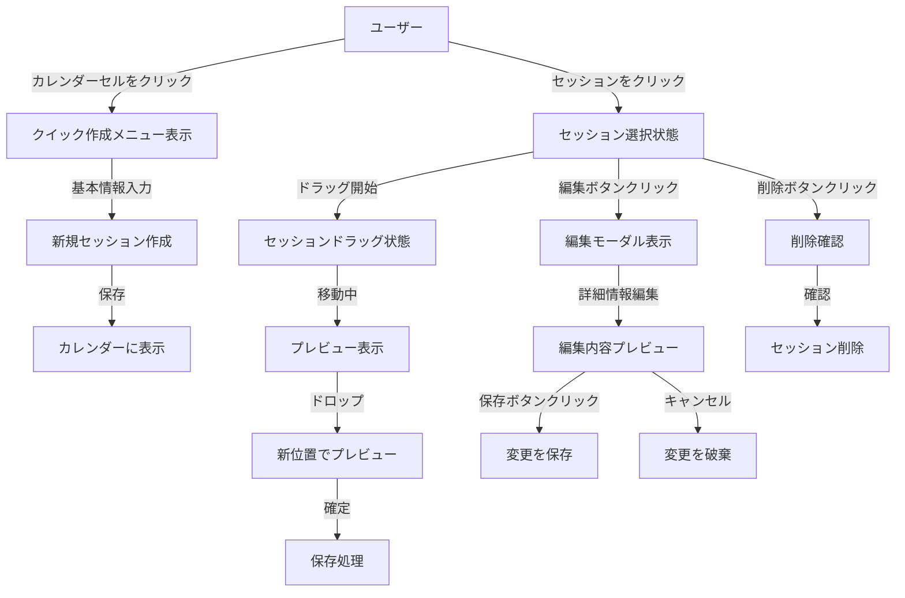
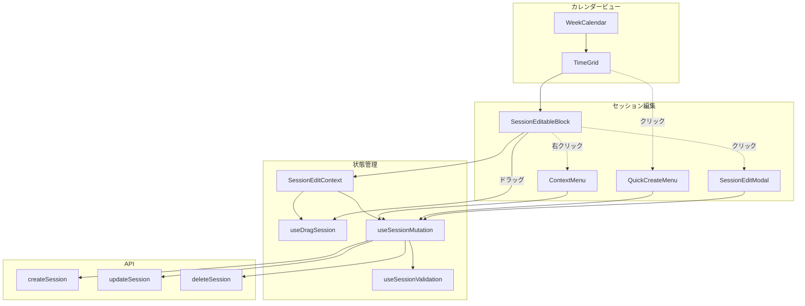
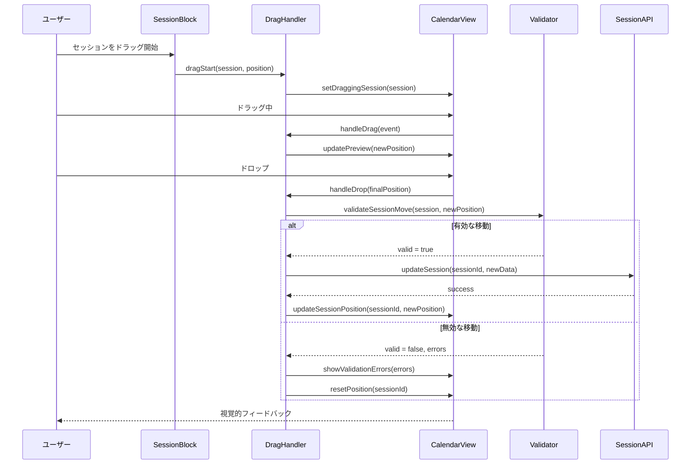
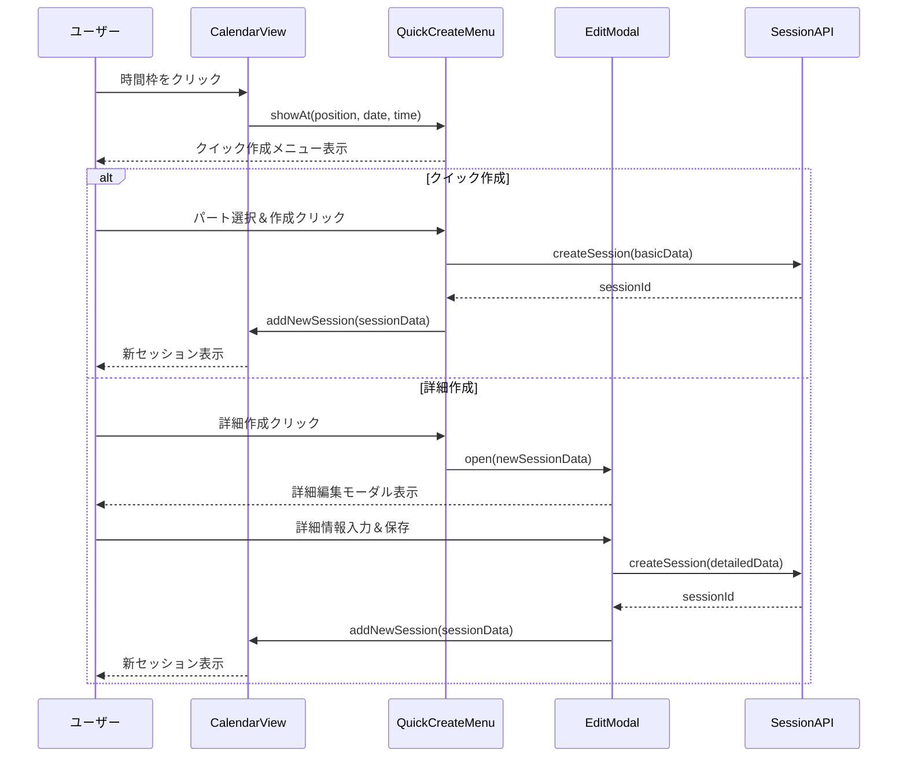
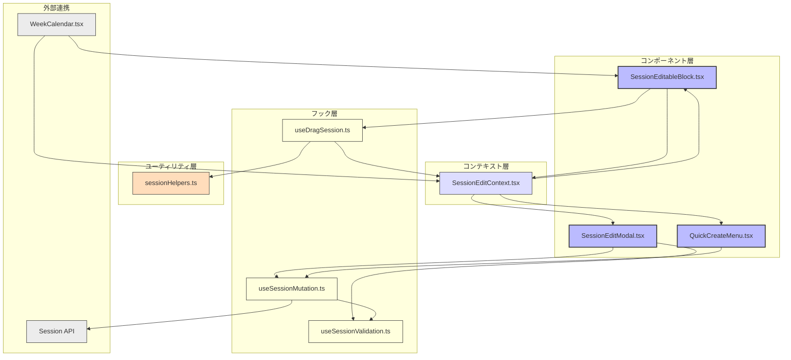

# FRONT-SCHED-001.2: ドラッグ＆ドロップによる練習セッション作成・編集インターフェース実装

## 概要
練習表自動生成システムにおいて、直感的なドラッグ＆ドロップ操作によって練習セッションを作成・編集できるインターフェースを実装します。ユーザーがマウスやタッチ操作で簡単にセッションの作成、移動、時間変更、削除を行えるようにし、スケジュール管理の効率を高めます。

## 詳細
- セッション作成インターフェース（クリック/タップによる作成開始）
- ドラッグ＆ドロップによるセッション移動機能
- セッション時間範囲のリサイズ機能（開始・終了時刻の調整）
- セッション編集モーダル/ポップアップの実装
- 競合チェックと視覚的フィードバック
- 変更のリアルタイムプレビューと保存機能
- 編集操作取り消し/やり直し機能

## 依存関係
- 親タスク: FRONT-SCHED-001
- FRONT-SCHED-001.1: 月間・週間カレンダービュー実装と日付範囲選択機能
- FRONT-ARCH-001: アプリ基盤構築
- BACK-API-002.2: 練習セッション作成・更新・削除APIエンドポイント実装

## 参照ファイル
- [設計書/11c_画面設計詳細.md](../../../../../設計書/11c_画面設計詳細.md)
- [設計書/11f_実装指針_フロントエンド.md](../../../../../設計書/11f_実装指針_フロントエンド.md)

## 成果物
- セッション作成・編集コンポーネント
- ドラッグ＆ドロップ操作ハンドラ
- セッション詳細編集モーダル
- セッションデータ操作ロジック
- 競合チェックロジック
- 単体・統合テストコード

## ステータス
- [x] 未開始
- [ ] 進行中
- [ ] レビュー中
- [ ] 完了

## 担当者
未割り当て

## 主要機能
1. **セッション作成機能**
   - カレンダー上でのクリック/タップによる新規セッション作成開始
   - 開始・終了時刻の視覚的設定
   - 基本情報（パート、説明など）の入力フォーム
   - テンプレートからの作成機能
   - 作成後の即時表示と最適化

2. **ドラッグ＆ドロップ操作**
   - セッションブロックのドラッグによる日付・時間変更
   - スナップ機能による一定時間単位でのグリッド調整
   - ドラッグ中の視覚的ガイド表示
   - 無効なエリアへのドラッグ防止
   - タッチデバイス対応操作

3. **セッション編集機能**
   - セッションクリックによる詳細編集モーダル表示
   - インライン編集のための吹き出しメニュー
   - 編集中の一時保存状態管理
   - バリデーションと入力チェック
   - キーボード操作によるアクセシビリティ

4. **競合管理・エラー処理**
   - セッション時間の重複チェック
   - 会場や指導者の同時刻予定チェック
   - エラー時の視覚的フィードバック
   - 競合解決のための代替案提示
   - 変更適用前の検証

## 実装予定ファイル
以下は実装予定の全ファイルのリストです。各ファイルの役割と目的を簡潔に記載します。

- `src/features/schedule/components/SessionEditableBlock.tsx` - ドラッグ可能なセッションブロックコンポーネント
- `src/features/schedule/components/SessionEditModal.tsx` - セッション詳細編集モーダル
- `src/features/schedule/components/QuickCreateMenu.tsx` - クイック作成メニュー
- `src/features/schedule/hooks/useDragSession.ts` - セッションドラッグ操作カスタムフック
- `src/features/schedule/hooks/useSessionMutation.ts` - セッションデータ変更カスタムフック
- `src/features/schedule/hooks/useSessionValidation.ts` - セッションバリデーションカスタムフック
- `src/features/schedule/utils/sessionHelpers.ts` - セッション操作ヘルパー関数
- `src/features/schedule/context/SessionEditContext.tsx` - セッション編集状態コンテキスト
- `src/features/schedule/styles/SessionEdit.module.css` - セッション編集関連スタイル
- `__tests__/features/schedule/SessionEditableBlock.test.tsx` - セッションブロックのテスト
- `__tests__/features/schedule/useDragSession.test.ts` - ドラッグ操作フックのテスト

## 設計図
### インタラクション設計図

### コンポーネント関連図

### シーケンス図: ドラッグ＆ドロップ操作

### シーケンス図: セッション作成

## 実装アプローチ
### ドラッグ＆ドロップ実装
1. **ライブラリ選定と基本実装**
   - React DnD または react-draggableなどのライブラリ検討
   - タッチデバイス対応を考慮した実装
   - パフォーマンスとアクセシビリティの両立
   - カレンダーグリッドとの連携設計

2. **インタラクション設計**
   - ドラッグ開始/中/終了時のビジュアルフィードバック
   - スナップ機能（30分単位など）の実装
   - 無効なドロップ位置の視覚的表示
   - 競合時の警告表示
   - 移動アニメーションの最適化

3. **データ同期と永続化**
   - 楽観的UI更新の実装
   - バックグラウンドでのAPI保存
   - エラー発生時のロールバック表示
   - 変更履歴の管理とUndoサポート
   - オフライン動作とデータ同期

4. **セッション編集UI**
   - 直感的な編集フォームデザイン
   - リアルタイムバリデーション
   - ショートカットキー対応
   - アクセシビリティ対応（WAI-ARIA）
   - レスポンシブデザイン対応

## 実装するすべてのファイル構成詳細
以下は全ての実装予定ファイルの詳細です。各ファイルごとに目的とコンポーネント/フック、属性、メソッドなどを詳しく記載します。

### `src/features/schedule/components/SessionEditableBlock.tsx`
**目的**: ドラッグ操作が可能なセッションブロックのUIコンポーネント

**コンポーネント**:
- `SessionEditableBlock`: ドラッグ可能なセッションブロック
  - **プロパティ**:
    - `session: Session`: セッションデータ
    - `isSelected: boolean`: 選択状態
    - `onSelect: (sessionId: string) => void`: 選択コールバック
    - `onStartDrag: (sessionId: string, event: any) => void`: ドラッグ開始コールバック
    - `onResize: (sessionId: string, type: 'start' | 'end', time: Date) => void`: リサイズコールバック
  - **状態**:
    - `isDragging: boolean`: ドラッグ中フラグ
    - `resizeType: 'none' | 'start' | 'end'`: リサイズ種別
  - **メソッド**:
    - `handleDragStart(e: DragEvent)`: ドラッグ開始処理
    - `handleDragEnd(e: DragEvent)`: ドラッグ終了処理
    - `handleResizeStart(type: 'start' | 'end', e: MouseEvent)`: リサイズ開始処理
    - `handleContextMenu(e: MouseEvent)`: コンテキストメニュー表示
  - **スタイル**:
    - パートに応じた色分け表示
    - ドラッグ中/選択中の視覚的フィードバック
    - リサイズハンドル表示

### `src/features/schedule/components/SessionEditModal.tsx`
**目的**: セッションの詳細情報を編集するためのモーダルダイアログ

**コンポーネント**:
- `SessionEditModal`: セッション編集モーダル
  - **プロパティ**:
    - `isOpen: boolean`: モーダル表示状態
    - `session?: Session`: 編集対象セッション（未指定で新規作成モード）
    - `onClose: () => void`: モーダルクローズコールバック
    - `onSave: (sessionData: SessionFormData) => Promise<void>`: 保存コールバック
    - `onDelete?: (sessionId: string) => Promise<void>`: 削除コールバック
  - **状態**:
    - `formData: SessionFormData`: フォーム入力値
    - `isSubmitting: boolean`: 送信中フラグ
    - `errors: Record<string, string>`: バリデーションエラー
  - **メソッド**:
    - `handleInputChange(e: ChangeEvent)`: 入力値変更処理
    - `handleSubmit(e: FormEvent)`: フォーム送信処理
    - `handleDelete()`: 削除処理
    - `validateForm(): boolean`: フォームバリデーション
  - **依存**:
    - Yupまたは他のバリデーションライブラリ

### `src/features/schedule/components/QuickCreateMenu.tsx`
**目的**: カレンダー上で素早くセッションを作成するためのポップアップメニュー

**コンポーネント**:
- `QuickCreateMenu`: クイックセッション作成メニュー
  - **プロパティ**:
    - `position: { x: number, y: number }`: 表示位置
    - `date: Date`: セッション作成日
    - `time: Date`: セッション開始時間
    - `onQuickCreate: (data: QuickSessionData) => void`: クイック作成コールバック
    - `onDetailedCreate: (initialData: SessionFormData) => void`: 詳細作成コールバック
    - `onClose: () => void`: メニュークローズコールバック
  - **状態**:
    - `selectedPart: number | null`: 選択中のパートID
    - `duration: number`: セッション時間（分）
  - **メソッド**:
    - `handlePartSelect(partId: number)`: パート選択処理
    - `handleDurationChange(minutes: number)`: 時間変更処理
    - `handleQuickCreate()`: クイック作成実行
    - `handleDetailedCreate()`: 詳細作成モード移行

### `src/features/schedule/hooks/useDragSession.ts`
**目的**: セッションのドラッグ操作を管理するカスタムフック

**フック**:
- `useDragSession`: セッションドラッグ処理フック
  - **パラメータ**:
    - `onSessionMove: (sessionId: string, newStart: Date, newEnd: Date) => Promise<boolean>`: 移動確定コールバック
  - **戻り値**:
    - `startDrag: (sessionId: string, initialPosition: any) => void`: ドラッグ開始関数
    - `handleDrag: (event: any) => void`: ドラッグ中処理関数
    - `endDrag: (event: any) => void`: ドラッグ終了関数
    - `draggingSessionId: string | null`: ドラッグ中セッションID
    - `dragPreview: { start: Date, end: Date } | null`: ドラッグプレビュー情報
  - **内部状態**:
    - `draggingSession`: ドラッグ中セッション情報
    - `initialPosition`: ドラッグ開始位置
    - `currentOffset`: 現在のドラッグオフセット
  - **依存**:
    - カレンダーのグリッド座標変換ユーティリティ

### `src/features/schedule/hooks/useSessionMutation.ts`
**目的**: セッションデータの作成・更新・削除操作を管理するカスタムフック

**フック**:
- `useSessionMutation`: セッション変更操作フック
  - **戻り値**:
    - `createSession: (data: SessionCreateData) => Promise<Session>`: セッション作成関数
    - `updateSession: (id: string, data: Partial<SessionUpdateData>) => Promise<Session>`: 更新関数
    - `deleteSession: (id: string) => Promise<boolean>`: 削除関数
    - `isLoading: boolean`: 処理中フラグ
    - `error: Error | null`: エラー情報
  - **内部処理**:
    - APIリクエスト送信
    - 楽観的UI更新
    - キャッシュ更新
    - エラーハンドリング
  - **依存**:
    - スケジュールAPIクライアント
    - 状態管理ライブラリ（Redux/Zustandなど）

### `src/features/schedule/hooks/useSessionValidation.ts`
**目的**: セッション操作の検証を行うカスタムフック

**フック**:
- `useSessionValidation`: セッション検証フック
  - **戻り値**:
    - `validateCreateSession: (data: SessionCreateData) => ValidationResult`: 作成検証関数
    - `validateUpdateSession: (id: string, data: SessionUpdateData) => ValidationResult`: 更新検証関数
    - `validateMoveSession: (id: string, newStart: Date, newEnd: Date) => ValidationResult`: 移動検証関数
    - `errors: ValidationErrors | null`: 検証エラー情報
  - **内部処理**:
    - 時間重複チェック
    - 会場利用可能チェック
    - 監督者スケジュールチェック
    - 営業時間内チェック
  - **依存**:
    - セッションデータコンテキスト
    - バリデーションスキーマ

### `src/features/schedule/context/SessionEditContext.tsx`
**目的**: セッション編集の状態を管理するReactコンテキスト

**コンポーネント/コンテキスト**:
- `SessionEditContext`: セッション編集状態コンテキスト
  - **値**:
    - `selectedSessionId: string | null`: 選択中セッションID
    - `draggingSessionId: string | null`: ドラッグ中セッションID
    - `editingSessionId: string | null`: 編集中セッションID
    - `isQuickCreateMenuOpen: boolean`: クイック作成メニュー表示状態
    - `quickCreatePosition: { date: Date, time: Date } | null`: クイック作成位置
  - **アクション**:
    - `selectSession: (id: string | null) => void`: セッション選択
    - `startDragSession: (id: string) => void`: ドラッグ開始
    - `endDragSession: () => void`: ドラッグ終了
    - `openSessionEdit: (id: string | null) => void`: 編集モーダル表示
    - `openQuickCreateMenu: (date: Date, time: Date) => void`: クイック作成メニュー表示
    - `closeAllMenus: () => void`: 全メニュークローズ

- `SessionEditProvider`: セッション編集状態プロバイダー
  - **プロパティ**:
    - `children: ReactNode`: 子コンポーネント
  - **状態管理**:
    - コンテキスト値の状態管理
    - アクション実装
    - 副作用（サイドエフェクト）管理

## ファイル間のコンポーネント連携図
