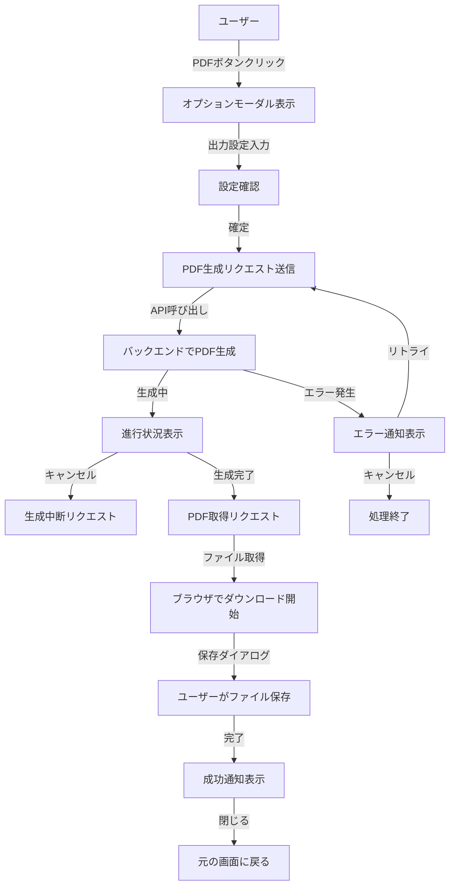
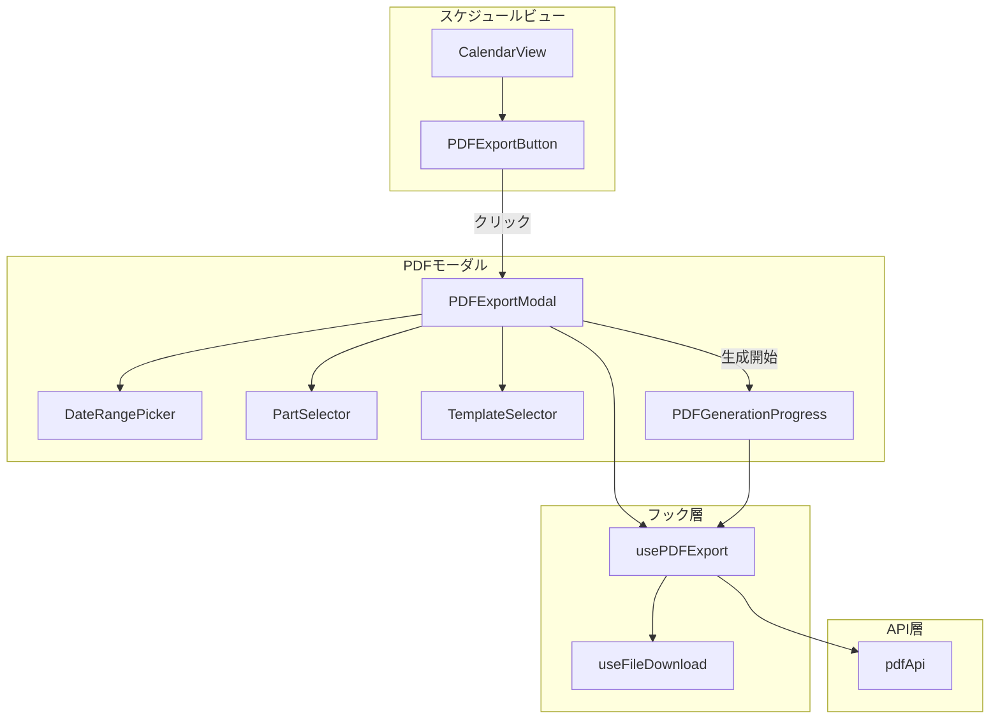
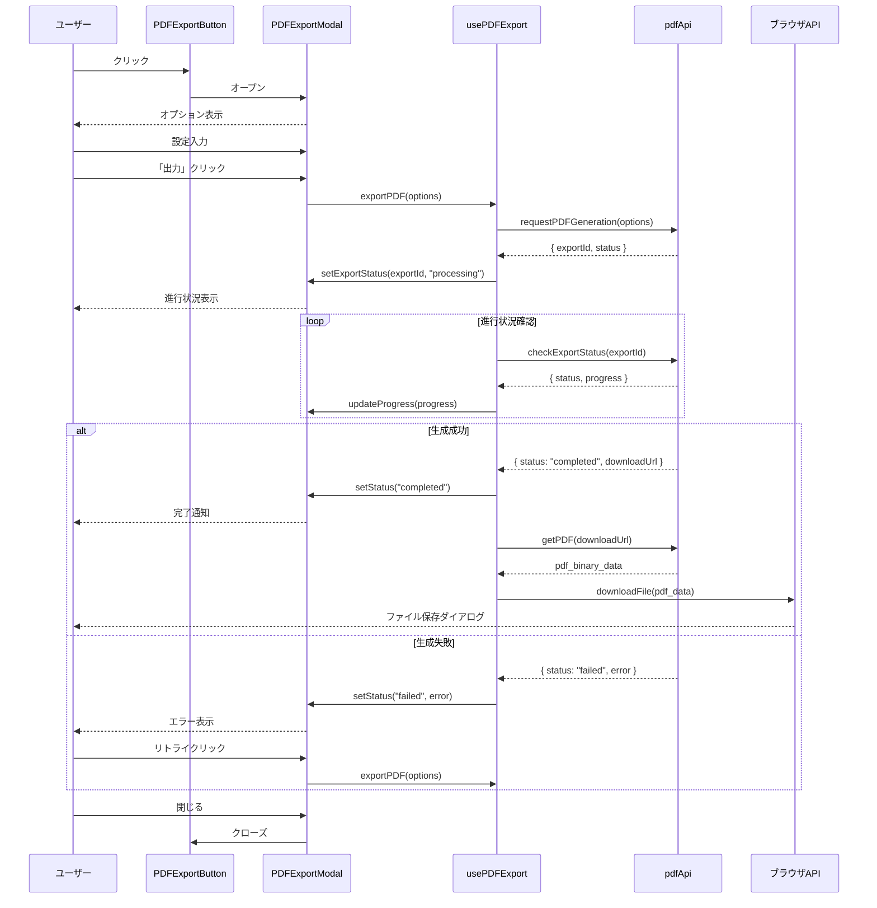
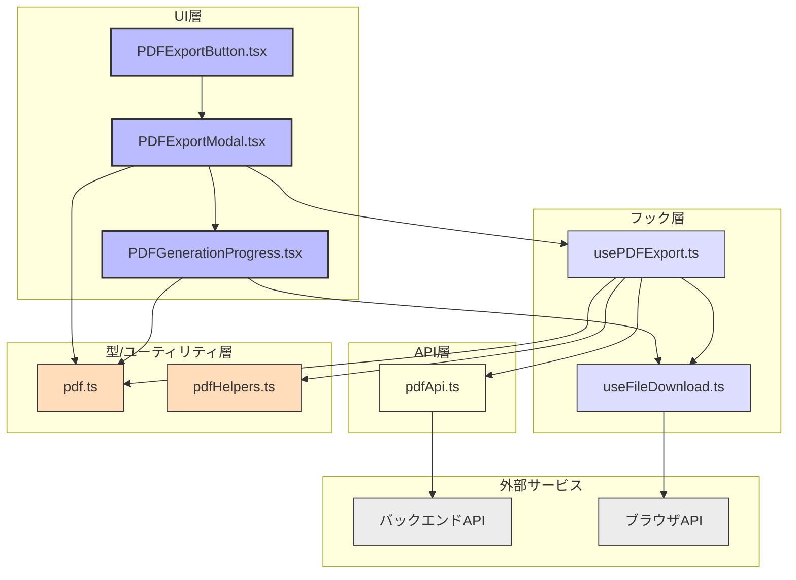

# FRONT-SCHED-001.3: スケジュールPDF出力ボタンとダウンロード機能実装

## 概要
練習表自動生成システムにおいて、表示中のスケジュールをPDF形式で出力し、ダウンロードする機能を実装します。ユーザーが現在閲覧しているスケジュール情報を印刷用に最適化されたPDF形式で保存・共有できるようにし、オフライン環境での情報参照や関係者への配布を容易にします。

## 詳細
- スケジュールPDF出力ボタンのUI実装
- PDF出力オプション選択インターフェース（日付範囲、パート、レイアウト等）
- バックエンドPDF生成APIとの連携
- PDF生成進行状況の表示
- 生成されたPDFのダウンロード処理
- ファイル保存ダイアログとの連携
- エラーハンドリングとリトライ機能

## 依存関係
- 親タスク: FRONT-SCHED-001
- FRONT-SCHED-001.1: 月間・週間カレンダービュー実装と日付範囲選択機能
- FRONT-ARCH-001: アプリ基盤構築
- BACK-API-002.3: スケジュールPDF出力機能とダウンロードAPIエンドポイント実装

## 参照ファイル
- [設計書/11c_画面設計詳細.md](../../../../../設計書/11c_画面設計詳細.md)
- [設計書/11f_実装指針_フロントエンド.md](../../../../../設計書/11f_実装指針_フロントエンド.md)

## 成果物
- PDF出力ボタンコンポーネント
- PDF出力オプション設定モーダル
- PDF生成進行状況表示コンポーネント
- ファイルダウンロード処理ロジック
- PDF関連APIクライアント実装
- 単体・統合テストコード

## ステータス
- [x] 未開始
- [ ] 進行中
- [ ] レビュー中
- [ ] 完了

## 担当者
未割り当て

## 主要機能
1. **PDF出力UI**
   - スケジュール画面に統合されたPDF出力ボタン
   - ボタンクリック時のオプション設定モーダル表示
   - 現在の表示範囲に基づく初期設定値
   - レスポンシブ対応UIデザイン
   - アクセシビリティ対応

2. **PDF出力オプション設定**
   - 日付範囲（開始日・終了日）設定
   - パート選択（複数選択可能）
   - 出力形式（月間/週間/リスト形式）選択
   - ページサイズとレイアウト（縦/横）設定
   - 詳細情報表示オプション

3. **PDF生成・ダウンロードフロー**
   - バックエンドAPI呼び出しとパラメータ送信
   - 非同期処理による生成リクエスト管理
   - 進行状況の表示（プログレスバー）
   - 生成完了時の自動ダウンロード開始
   - ブラウザのファイル保存機能との連携

4. **エラー処理とユーザーフィードバック**
   - API接続エラーの適切な処理
   - 生成タイムアウト時のリトライ機能
   - 進行状況の定期的な更新
   - 操作成功/失敗時の通知表示
   - オフライン時の対応とキューイング

## 実装予定ファイル
以下は実装予定の全ファイルのリストです。各ファイルの役割と目的を簡潔に記載します。

- `src/features/schedule/components/PDFExportButton.tsx` - PDF出力ボタンコンポーネント
- `src/features/schedule/components/PDFExportModal.tsx` - PDF出力設定モーダル
- `src/features/schedule/components/PDFGenerationProgress.tsx` - 生成進行状況表示
- `src/features/schedule/hooks/usePDFExport.ts` - PDF出力処理カスタムフック
- `src/features/schedule/hooks/useFileDownload.ts` - ファイルダウンロードカスタムフック
- `src/features/schedule/api/pdfApi.ts` - PDF関連API呼び出し関数
- `src/features/schedule/utils/pdfHelpers.ts` - PDF関連ヘルパー関数
- `src/features/schedule/types/pdf.ts` - PDF関連型定義
- `__tests__/features/schedule/PDFExportButton.test.tsx` - PDFボタンのテスト
- `__tests__/features/schedule/usePDFExport.test.ts` - PDF出力フックのテスト

## 設計図
### PDF出力フロー図


### コンポーネント設計図


### シーケンス図


## 実装アプローチ
### PDF出力機能実装
1. **UIコンポーネント設計**
   - スケジュール画面に自然に統合されるボタンデザイン
   - 直感的な設定オプションレイアウト
   - プログレスインジケーターのリアルタイム更新
   - 状態に応じた適切なフィードバック表示
   - モバイル対応UI

2. **APIインテグレーション**
   - バックエンドPDF生成エンドポイントとの連携
   - PDF生成リクエストの管理
   - ポーリングによる進行状況確認
   - WebSocketによるリアルタイム更新（オプション）
   - エラー状態の適切な処理とリトライ

3. **ファイルダウンロード実装**
   - ブラウザAPI（Fetch, Blob, createObjectURL）を利用したダウンロード
   - 適切なMIMEタイプとファイル名設定
   - ダウンロード進行状況表示
   - キャンセル機能の実装
   - モバイルブラウザ対応

4. **状態管理**
   - PDF出力状態の追跡と保持
   - 画面遷移後の状態保持
   - 複数PDF生成リクエストの管理
   - エラー状態の保持と表示
   - キューイングとバックグラウンド処理

## 実装するすべてのファイル構成詳細
以下は全ての実装予定ファイルの詳細です。各ファイルごとに目的とコンポーネント/フック、属性、メソッドなどを詳しく記載します。

### `src/features/schedule/components/PDFExportButton.tsx`
**目的**: スケジュールをPDF出力するためのボタンコンポーネント

**コンポーネント**:
- `PDFExportButton`: PDF出力ボタン
  - **プロパティ**:
    - `currentDateRange: { start: Date, end: Date }`: 現在表示中の日付範囲
    - `currentViewMode: 'month' | 'week'`: 現在のカレンダー表示モード
    - `selectedPartId?: number`: 現在選択中のパートID
    - `className?: string`: 追加CSSクラス
    - `disabled?: boolean`: 無効状態フラグ
  - **状態**:
    - `isModalOpen: boolean`: モーダル表示状態
    - `isExporting: boolean`: 出力処理中フラグ
  - **メソッド**:
    - `handleClick()`: ボタンクリック処理
    - `handleModalClose()`: モーダルクローズ処理
    - `handleExportStart()`: 出力開始処理
  - **レンダリング**:
    - PDF出力ボタン要素
    - PDFExportModalコンポーネント（条件付き）

### `src/features/schedule/components/PDFExportModal.tsx`
**目的**: PDF出力のオプション設定と進行状況を表示するモーダルダイアログ

**コンポーネント**:
- `PDFExportModal`: PDF出力設定モーダル
  - **プロパティ**:
    - `isOpen: boolean`: モーダル表示状態
    - `onClose: () => void`: クローズコールバック
    - `onExport: (options: PDFExportOptions) => void`: 出力開始コールバック
    - `initialOptions: Partial<PDFExportOptions>`: 初期設定値
    - `exportStatus?: PDFExportStatus`: 現在の出力状態
  - **状態**:
    - `options: PDFExportOptions`: 出力オプション
    - `activeTab: 'options' | 'progress'`: アクティブタブ
    - `validationErrors: Record<string, string>`: バリデーションエラー
  - **メソッド**:
    - `handleOptionChange(key: string, value: any)`: オプション変更処理
    - `handleDateRangeChange(range: { start: Date, end: Date })`: 日付範囲変更処理
    - `handlePartSelectionChange(partIds: number[])`: パート選択変更処理
    - `handleExportClick()`: 出力ボタンクリック処理
    - `validateOptions(): boolean`: オプションバリデーション
  - **レンダリング**:
    - モーダルダイアログ
    - 設定オプションフォーム
    - 進行状況表示（条件付き）

### `src/features/schedule/components/PDFGenerationProgress.tsx`
**目的**: PDF生成進行状況を表示するコンポーネント

**コンポーネント**:
- `PDFGenerationProgress`: 生成進行状況表示
  - **プロパティ**:
    - `exportId: string`: 出力ID
    - `status: 'processing' | 'completed' | 'failed'`: 出力状態
    - `progress?: number`: 進行度（0-100）
    - `error?: string`: エラーメッセージ
    - `downloadUrl?: string`: ダウンロードURL
    - `onRetry?: () => void`: リトライコールバック
    - `onCancel?: () => void`: キャンセルコールバック
  - **状態**:
    - `isDownloading: boolean`: ダウンロード中フラグ
    - `downloadError: string | null`: ダウンロードエラー
  - **メソッド**:
    - `handleDownloadClick()`: ダウンロードボタンクリック処理
    - `handleRetryClick()`: リトライボタンクリック処理
    - `handleCancelClick()`: キャンセルボタンクリック処理
  - **レンダリング**:
    - プログレスバー
    - 状態メッセージ
    - アクションボタン（状態に応じて）

### `src/features/schedule/hooks/usePDFExport.ts`
**目的**: PDF出力処理とその状態管理を行うカスタムフック

**フック**:
- `usePDFExport`: PDF出力処理フック
  - **戻り値**:
    - `exportPDF: (options: PDFExportOptions) => Promise<string>`: PDF出力開始関数
    - `exportStatus: Record<string, PDFExportStatus>`: 出力状態オブジェクト
    - `checkStatus: (exportId: string) => Promise<PDFExportStatus>`: 状態確認関数
    - `cancelExport: (exportId: string) => Promise<boolean>`: 出力キャンセル関数
    - `downloadPDF: (exportId: string) => Promise<boolean>`: PDFダウンロード関数
    - `clearExport: (exportId: string) => void`: 出力情報クリア関数
  - **内部状態**:
    - `exportsStatus`: 複数出力の状態管理
    - `pollingIntervals`: ポーリング間隔管理
  - **内部メソッド**:
    - `startStatusPolling(exportId: string)`: ステータスポーリング開始
    - `stopStatusPolling(exportId: string)`: ステータスポーリング停止
    - `updateExportStatus(exportId: string, status: Partial<PDFExportStatus>)`: 状態更新
  - **依存**:
    - `pdfApi`: PDF操作API
    - `useFileDownload`: ファイルダウンロードフック

### `src/features/schedule/hooks/useFileDownload.ts`
**目的**: ファイルダウンロード処理を行うカスタムフック

**フック**:
- `useFileDownload`: ファイルダウンロードフック
  - **戻り値**:
    - `downloadFile: (url: string, filename?: string) => Promise<boolean>`: URLからのダウンロード関数
    - `downloadBlob: (blob: Blob, filename: string) => boolean`: Blobからのダウンロード関数
    - `isDownloading: boolean`: ダウンロード中フラグ
    - `error: Error | null`: エラー情報
  - **内部処理**:
    - Fetch APIを使用したファイル取得
    - Blob URLの生成と処理
    - ダウンロードリンクの生成と自動クリック
    - リソース解放処理
  - **ブラウザAPI使用**:
    - `fetch`
    - `URL.createObjectURL`
    - `URL.revokeObjectURL`

### `src/features/schedule/api/pdfApi.ts`
**目的**: PDF関連APIへのアクセスを提供する関数群

**関数**:
- `requestPDFGeneration(options: PDFExportOptions): Promise<{ exportId: string, status: string }>`: PDF生成リクエスト
- `checkPDFExportStatus(exportId: string): Promise<PDFExportStatus>`: 生成状態確認
- `cancelPDFExport(exportId: string): Promise<boolean>`: 生成キャンセル
- `getPDFDownloadUrl(exportId: string): Promise<string>`: ダウンロードURL取得
- `getPDFTemplates(): Promise<PDFTemplate[]>`: 利用可能なテンプレート取得

**型定義**:
- API Request/Response型
- エラーハンドリング
- リトライロジック

### `src/features/schedule/types/pdf.ts`
**目的**: PDF関連の型定義を提供

**型定義**:
- `PDFExportOptions`: 出力オプション型
  ```typescript
  interface PDFExportOptions {
    startDate: Date;
    endDate: Date;
    partIds?: number[];
    templateId?: string;
    paperSize: 'A4' | 'A3' | 'Letter';
    orientation: 'portrait' | 'landscape';
    includeDetails: boolean;
    fontSize?: number;
  }
  ```
- `PDFExportStatus`: 出力状態型
  ```typescript
  interface PDFExportStatus {
    exportId: string;
    status: 'processing' | 'completed' | 'failed';
    progress?: number;
    error?: string;
    createdAt: Date;
    expiresAt?: Date;
    downloadUrl?: string;
  }
  ```
- `PDFTemplate`: テンプレート情報型
  ```typescript
  interface PDFTemplate {
    id: string;
    name: string;
    description: string;
    previewUrl?: string;
    supportedOptions: {
      paperSizes: string[];
      orientations: string[];
      [key: string]: any;
    };
  }
  ```

## ファイル間のコンポーネント連携図
