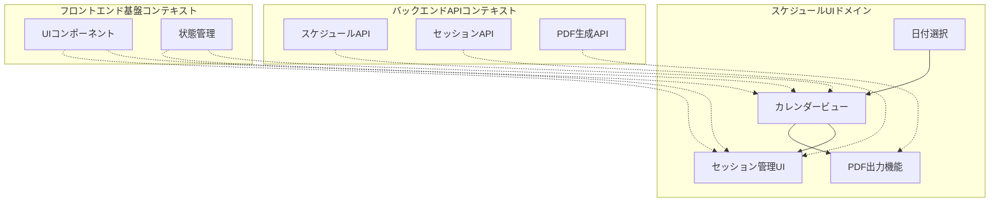
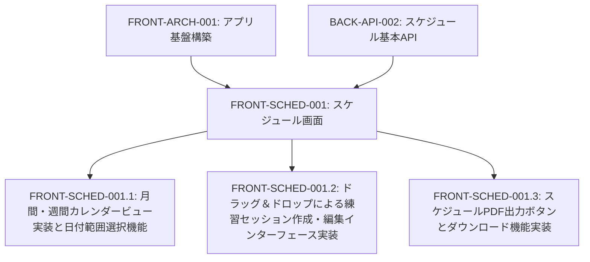
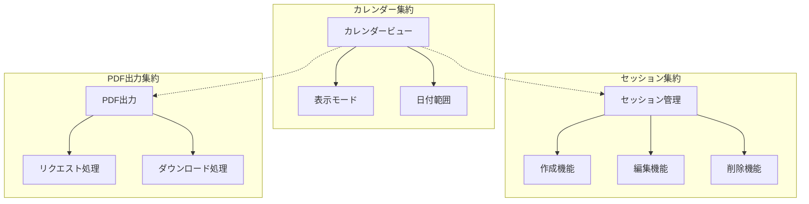
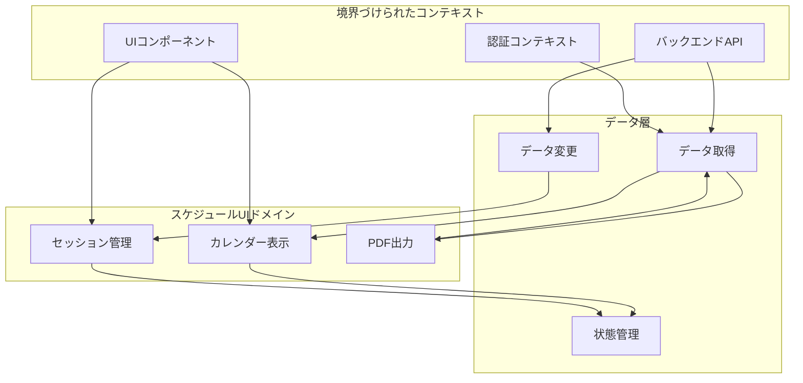

# FRONT-SCHED-001: スケジュール画面

## ドメインの概要
スケジュール画面ドメインは、練習表自動生成システムの中核となるスケジュール管理インターフェースを提供します。月間・週間カレンダービューの実装、ドラッグ＆ドロップによる練習セッション管理、スケジュールPDF出力機能などを通じて、直感的かつ効率的なスケジュール操作体験を実現します。

## ドメインモデルと境界づけられたコンテキスト

## ユビキタス言語

| 用語 | 定義 |
|------|------|
| カレンダービュー | スケジュールを月間・週間単位で表示する画面 |
| セッション | 個別の練習単位（時間枠と内容） |
| ドラッグ＆ドロップ | マウス操作でセッションを移動・編集する方法 |
| 日付範囲選択 | 表示するスケジュール期間を指定する機能 |
| PDF出力 | スケジュールを印刷可能なPDF形式で出力する機能 |
| 月間表示 | 1か月単位でスケジュールを俯瞰表示するモード |
| 週間表示 | 1週間単位で詳細にスケジュールを表示するモード |
| 時間枠 | セッションの開始時刻と終了時刻 |

## サブドメイン構成

## サブドメイン詳細

### FRONT-SCHED-001.1: 月間・週間カレンダービュー実装と日付範囲選択機能
**ドメイン責務**: スケジュールを月間・週間単位で表示するカレンダービューと、表示期間を選択する機能を実装する

**ドメインサービス**:
- カレンダー表示サービス（月間/週間表示の切り替え、日付レンダリング）
- 日付範囲選択サービス（日付範囲の指定と保持）
- データ取得サービス（指定期間のスケジュールデータ取得）

**ステータス**: 未開始

### FRONT-SCHED-001.2: ドラッグ＆ドロップによる練習セッション作成・編集インターフェース実装
**ドメイン責務**: 直感的なドラッグ＆ドロップ操作による練習セッションの作成・編集機能を実装する

**ドメインサービス**:
- セッションUI管理（セッション表示、ドラッグ＆ドロップ機能）
- セッション操作サービス（作成、移動、リサイズ、削除）
- 変更保存サービス（変更のAPI送信、楽観的UI更新）

**ステータス**: 未開始

### FRONT-SCHED-001.3: スケジュールPDF出力ボタンとダウンロード機能実装
**ドメイン責務**: 現在表示中のスケジュールをPDF形式で出力し、ダウンロードする機能を実装する

**ドメインサービス**:
- PDF生成リクエストサービス（API呼び出し、パラメータ設定）
- ファイルダウンロードサービス（生成されたPDFのダウンロード処理）
- 進行状態管理（生成中の表示、エラーハンドリング）

**ステータス**: 未開始

## コマンド・クエリ責務分離（CQRS）

### コマンド（書き込み操作）
- 日付範囲変更
- 表示モード切替（月間/週間）
- セッション作成
- セッション移動
- セッション時間変更
- セッション削除
- PDF出力リクエスト

### クエリ（読み取り操作）
- スケジュールデータ取得
- 現在の表示モード確認
- 日付範囲情報取得
- セッション詳細取得
- PDF生成状態確認

## 集約と整合性境界

## 開発コンテキスト図

## 進捗管理

| サブドメイン | ステータス | 担当者 | 開始日 | 完了予定 | 実際の完了日 |
|------------|-----------|--------|-------|---------|------------|
| FRONT-SCHED-001.1 | 未開始 | | | | |
| FRONT-SCHED-001.2 | 未開始 | | | | |
| FRONT-SCHED-001.3 | 未開始 | | | | |

## イベントストーミング

```mermaid
graph LR
    E1[ユーザーログイン完了] --> C1[スケジュール画面表示]
    C1 --> E2[初期カレンダー表示完了]
    E2 --> C2[日付範囲変更]
    C2 --> E3[新規データ取得完了]
    E3 --> C3[セッション作成/編集操作]
    C3 --> E4[セッション変更保存完了]
    E4 --> C4[PDF出力ボタンクリック]
    C4 --> E5[PDF生成リクエスト送信]
    E5 --> C5[PDFダウンロード開始]
    C5 --> E6[ファイル保存完了]
```

## 課題・リスク

- 複雑なUI操作（ドラッグ＆ドロップ）の品質と互換性確保
- 大量のスケジュールデータの効率的な表示と操作
- リアルタイム更新との整合性維持
- モバイル端末でのUX最適化
- PDF生成処理の遅延とユーザー体験

## レビューポイント

- カレンダーUIの使いやすさと視認性
- ドラッグ＆ドロップ操作の直感性
- データ取得・保存の効率性と応答性
- エラー状態の適切な処理と表示
- レスポンシブデザインの対応状況

## リファレンス

- [設計書/11c_画面設計詳細.md](../../../設計書/11c_画面設計詳細.md)
- [設計書/11f_実装指針_フロントエンド.md](../../../設計書/11f_実装指針_フロントエンド.md) 