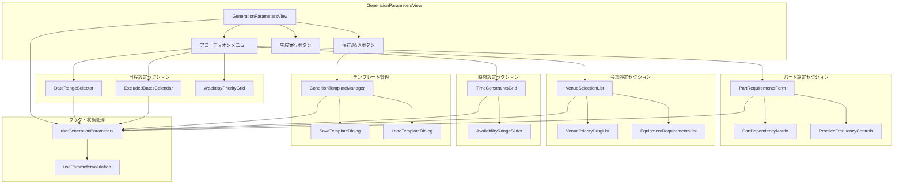
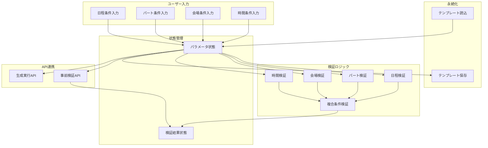
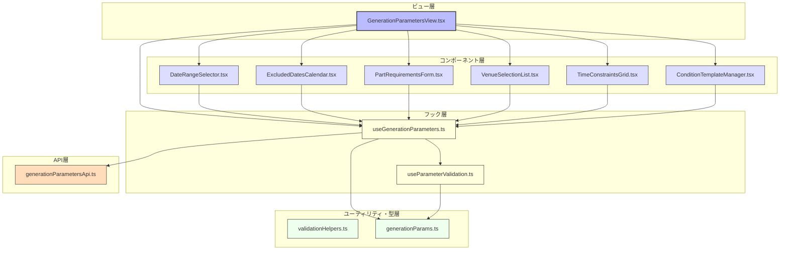

# FRONT-SCHED-002.1: 日程・パート・会場条件指定による生成パラメータ設定フォーム実装

## 概要
練習表自動生成システムにおいて、スケジュール自動生成に必要な各種条件（日程・パート・会場）を指定するためのフォームインターフェースを実装します。ユーザーが直感的に制約条件を設定し、それらの条件に基づいて最適な練習スケジュールを生成するための入力インターフェースを提供します。

## 詳細
- 生成期間（開始日・終了日）設定フォーム
- 除外日設定カレンダー
- パート別練習頻度・時間設定
- パート間の依存関係・制約条件設定
- 会場選択と優先順位付け
- 時間帯設定（曜日ごとの利用可能時間）
- 設備要件指定
- 条件保存と再利用機能

## 依存関係
- 親タスク: FRONT-SCHED-002
- FRONT-ARCH-001: アプリ基盤構築
- BACK-API-003.1: 条件入力に基づくスケジュール自動生成APIエンドポイント実装

## 参照ファイル
- [設計書/11c_画面設計詳細.md](../../../../../設計書/11c_画面設計詳細.md)
- [設計書/11f_実装指針_フロントエンド.md](../../../../../設計書/11f_実装指針_フロントエンド.md)
- [設計書/09_アルゴリズム詳細_1_スケジュール生成.md](../../../../../設計書/09_アルゴリズム詳細_1_スケジュール生成.md)

## 成果物
- 条件入力フォームコンポーネント
- 入力検証ロジック
- 条件保存・読込機能
- リアルタイム競合検出UI
- レスポンシブ対応フォームレイアウト
- 単体・統合テストコード

## ステータス
- [x] 未開始
- [ ] 進行中
- [ ] レビュー中
- [ ] 完了

## 担当者
未割り当て

## 主要機能
1. **日程条件設定機能**
   - 生成期間（開始日・終了日）設定
   - 除外日設定（カレンダーピッカー）
   - 曜日別優先度設定
   - 祝日・特別日の扱い設定
   - 期間内練習回数の最小・最大値設定

2. **パート条件設定機能**
   - パート別練習頻度設定（週あたり回数）
   - パート別練習時間設定（1回あたり時間）
   - パート間依存関係設定（前後関係、同日条件）
   - 特定パートの練習優先度設定
   - 同時練習可能パートの組み合わせ設定

3. **会場条件設定機能**
   - 利用可能会場選択（複数選択）
   - 会場優先順位設定（ドラッグ＆ドロップによる順序変更）
   - パート別推奨会場設定
   - 設備要件指定（必須設備のチェックリスト）
   - 収容人数条件設定

4. **条件保存・検証機能**
   - 条件セットの保存・名前付け機能
   - 保存済み条件の読み込み機能
   - リアルタイム入力検証と競合表示
   - 条件の有効性スコア表示
   - 生成可能性の事前評価

## 実装予定ファイル
以下は実装予定の全ファイルのリストです。各ファイルの役割と目的を簡潔に記載します。

- `src/features/schedule-generator/views/GenerationParametersView.tsx` - 条件入力フォームのメインビュー
- `src/features/schedule-generator/components/DateRangeSelector.tsx` - 期間指定コンポーネント
- `src/features/schedule-generator/components/ExcludedDatesCalendar.tsx` - 除外日選択カレンダー
- `src/features/schedule-generator/components/PartRequirementsForm.tsx` - パート要件設定フォーム
- `src/features/schedule-generator/components/VenueSelectionList.tsx` - 会場選択リスト
- `src/features/schedule-generator/components/TimeConstraintsGrid.tsx` - 時間制約設定グリッド
- `src/features/schedule-generator/components/ConditionTemplateManager.tsx` - 条件テンプレート管理
- `src/features/schedule-generator/hooks/useGenerationParameters.ts` - パラメータ管理フック
- `src/features/schedule-generator/hooks/useParameterValidation.ts` - パラメータ検証フック
- `src/features/schedule-generator/utils/validationHelpers.ts` - 検証ヘルパー関数
- `src/features/schedule-generator/api/generationParametersApi.ts` - パラメータAPI連携
- `src/features/schedule-generator/types/generationParams.ts` - パラメータ型定義

## 設計図
### コンポーネント構成図

### データフロー図

## 実装アプローチ
### 条件入力フォーム設計
1. **段階的開示UI設計**
   - アコーディオンメニューによる関連条件のグループ化
   - 基本条件と詳細条件の分離（詳細はアドバンスト設定で開示）
   - ウィザード形式とフリーフォーム形式の切り替え
   - コンテキストヘルプとツールチップの配置

2. **リアルタイム検証とフィードバック**
   - 入力フィールドごとの即時バリデーション
   - 条件間の整合性チェック（矛盾検出）
   - 視覚的なエラー・警告表示（色分け、アイコン）
   - 修正候補の提案

3. **直感的な操作設計**
   - ドラッグ＆ドロップによる優先順位設定
   - スライダーによる数値範囲指定
   - カレンダーピッカーによる日付選択
   - マトリクス形式での関係性設定

4. **テンプレート管理**
   - 頻用パターンの保存機能
   - 名前付きテンプレートのCRUD操作
   - インポート・エクスポート機能
   - デフォルトテンプレートの提供

## 実装するすべてのコンポーネント詳細
以下に各コンポーネントの詳細仕様を記載します。

### `GenerationParametersView.tsx`
**目的**: 条件入力フォームのメインコンテナ。各種条件設定セクションをまとめる親コンポーネント

**プロパティ**:
- `onParametersSubmit: (params: GenerationParameters) => void`: 条件確定時コールバック
- `initialParameters?: Partial<GenerationParameters>`: 初期パラメータ
- `templateId?: string`: 読み込むテンプレートID

**状態**:
- `currentParameters: GenerationParameters`: 現在の入力パラメータ
- `activeSection: string`: 現在開いているセクション
- `validationState: ValidationState`: 検証状態
- `isSaving: boolean`: 保存処理中フラグ

**メソッド**:
- `handleSectionToggle(sectionId: string)`: セクション開閉処理
- `handleParameterChange(path: string, value: any)`: パラメータ更新処理
- `handleSaveTemplate()`: テンプレート保存処理
- `handleLoadTemplate(id: string)`: テンプレート読込処理
- `handleSubmit()`: 条件確定処理

### `DateRangeSelector.tsx`
**目的**: 生成期間の開始日と終了日を設定するコンポーネント

**プロパティ**:
- `value: {startDate: Date, endDate: Date}`: 選択期間
- `onChange: (range: {startDate: Date, endDate: Date}) => void`: 変更コールバック
- `minDate?: Date`: 選択可能最小日付
- `maxDate?: Date`: 選択可能最大日付
- `disabled?: boolean`: 無効状態

**状態**:
- `isStartPickerOpen: boolean`: 開始日ピッカー表示状態
- `isEndPickerOpen: boolean`: 終了日ピッカー表示状態

**メソッド**:
- `handleStartDateChange(date: Date)`: 開始日変更処理
- `handleEndDateChange(date: Date)`: 終了日変更処理
- `handleQuickRangeSelect(preset: string)`: クイック選択処理

### `PartRequirementsForm.tsx`
**目的**: パートごとの練習要件（頻度・時間・依存関係など）を設定するフォーム

**プロパティ**:
- `parts: Part[]`: パート一覧
- `value: PartRequirements[]`: パート要件データ
- `onChange: (requirements: PartRequirements[]) => void`: 変更コールバック
- `venues: Venue[]`: 会場一覧（パート別推奨会場設定用）

**状態**:
- `editingPartId: number | null`: 編集中パートID
- `isMatrixViewOpen: boolean`: 依存関係マトリクス表示状態

**メソッド**:
- `handleFrequencyChange(partId: number, value: number)`: 頻度変更処理
- `handleDurationChange(partId: number, value: number)`: 時間変更処理
- `handleVenuePreferenceChange(partId: number, venueIds: number[])`: 推奨会場変更処理
- `handleDependencyChange(sourceId: number, targetId: number, type: string)`: 依存関係変更処理

### `VenueSelectionList.tsx`
**目的**: 利用可能会場の選択と優先順位付けを行うリスト

**プロパティ**:
- `venues: Venue[]`: 会場一覧
- `selectedVenues: number[]`: 選択済み会場ID
- `venueOrder: number[]`: 会場優先順位
- `onChange: (selection: {ids: number[], order: number[]}) => void`: 変更コールバック
- `equipmentTypes: EquipmentType[]`: 設備種別一覧

**状態**:
- `draggedVenueId: number | null`: ドラッグ中会場ID
- `filterText: string`: フィルタテキスト
- `filterEquipment: number[]`: フィルタ設備ID

**メソッド**:
- `handleVenueToggle(venueId: number)`: 会場選択切替
- `handleDragStart(venueId: number)`: ドラッグ開始処理
- `handleDragOver(venueId: number)`: ドラッグオーバー処理
- `handleDrop()`: ドロップ処理
- `handleFilterChange(text: string)`: フィルタテキスト変更処理
- `handleEquipmentFilterChange(equipmentIds: number[])`: 設備フィルタ変更処理

### `TimeConstraintsGrid.tsx`
**目的**: 曜日・時間帯ごとの利用可能性を設定するグリッド

**プロパティ**:
- `value: TimeConstraints`: 時間制約データ
- `onChange: (constraints: TimeConstraints) => void`: 変更コールバック
- `hourStart?: number`: 表示開始時間（デフォルト: 8）
- `hourEnd?: number`: 表示終了時間（デフォルト: 22）
- `interval?: number`: 時間間隔（分）（デフォルト: 30）

**状態**:
- `selectionStart: {day: number, time: number} | null`: 選択開始セル
- `selectionEnd: {day: number, time: number} | null`: 選択終了セル
- `selectionMode: 'available' | 'unavailable'`: 選択モード

**メソッド**:
- `handleCellMouseDown(day: number, time: number)`: セルマウス押下処理
- `handleCellMouseOver(day: number, time: number)`: セルマウスオーバー処理
- `handleCellMouseUp()`: セルマウスアップ処理
- `applySelection()`: 選択適用処理
- `handleRangeSliderChange(day: number, range: [number, number])`: 時間範囲変更処理

### `useGenerationParameters.ts`
**目的**: 生成パラメータの状態管理と操作を提供するカスタムフック

**パラメータ**:
- `initialParams?: Partial<GenerationParameters>`: 初期パラメータ

**戻り値**:
- `parameters: GenerationParameters`: 現在のパラメータ
- `setParameters: (params: GenerationParameters) => void`: パラメータ全体設定
- `updateParameter: (path: string, value: any) => void`: パラメータ部分更新
- `resetParameters: () => void`: パラメータリセット
- `saveAsTemplate: (name: string) => Promise<string>`: テンプレート保存
- `loadTemplate: (id: string) => Promise<void>`: テンプレート読込
- `isModified: boolean`: 変更有無フラグ

**内部処理**:
- パスによるネストオブジェクト更新（例: "dateRange.startDate"）
- APIとの連携による保存・読込
- 変更状態の追跡

## ファイル間のコンポーネント連携図
