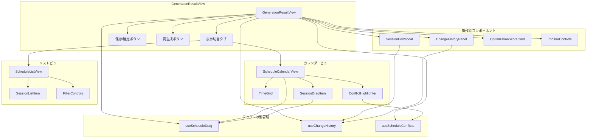
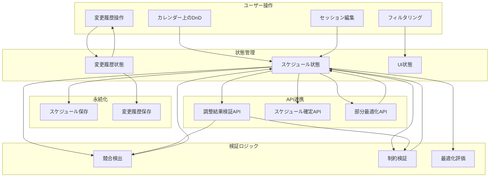
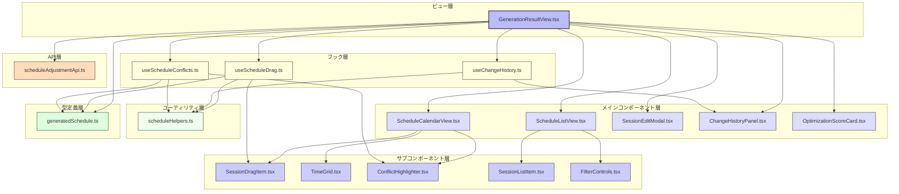

# FRONT-SCHED-002.2: 生成結果プレビューと手動調整インターフェース実装

## 概要
スケジュール自動生成の結果をプレビュー表示し、必要に応じて手動で調整できるインターフェースを実装します。自動生成されたスケジュールの確認、競合や問題点のハイライト表示、ドラッグ＆ドロップによる調整、および調整後のスケジュール確定機能を提供します。

## 詳細
- 自動生成結果の月別/週別プレビュー表示
- 競合・制約違反のハイライト表示
- ドラッグ＆ドロップによるセッション移動
- セッション詳細の編集機能
- 手動変更履歴の表示
- 最適化スコアのリアルタイム更新
- 調整後スケジュールの確定と保存

## 依存関係
- 親タスク: FRONT-SCHED-002
- FRONT-SCHED-002.1: 日程・パート・会場条件指定による生成パラメータ設定フォーム実装
- BACK-API-003.2: 生成結果調整と再最適化APIエンドポイント実装

## 参照ファイル
- [設計書/11c_画面設計詳細.md](../../../../../設計書/11c_画面設計詳細.md)
- [設計書/11f_実装指針_フロントエンド.md](../../../../../設計書/11f_実装指針_フロントエンド.md)
- [設計書/09_アルゴリズム詳細_1_スケジュール生成.md](../../../../../設計書/09_アルゴリズム詳細_1_スケジュール生成.md)

## 成果物
- スケジュールプレビューコンポーネント
- ドラッグ＆ドロップ調整機能
- 競合検出・表示機能
- セッション編集モーダル
- 変更履歴管理
- 単体・統合テストコード

## ステータス
- [x] 未開始
- [ ] 進行中
- [ ] レビュー中
- [ ] 完了

## 担当者
未割り当て

## 主要機能
1. **スケジュールプレビュー機能**
   - 月別/週別/日別表示切替
   - カラーコード化されたパート表示
   - ズームイン/アウト
   - フィルタリング（パート、会場、時間帯）
   - 競合・制約違反ハイライト

2. **ドラッグ＆ドロップ調整機能**
   - セッションの日時変更
   - セッションの会場変更
   - セッション時間の延長・短縮
   - セッションの分割・結合
   - マルチセレクトとグループ移動

3. **セッション詳細編集機能**
   - セッション詳細モーダル
   - 開始・終了時刻精密設定
   - パート割り当て変更
   - 備考・タグ付け
   - 予約状態管理

4. **変更追跡・最適化機能**
   - 変更履歴リスト
   - 変更の取り消し・やり直し
   - リアルタイム整合性チェック
   - 最適化スコア表示
   - 部分的再最適化要求

## 実装予定ファイル
以下は実装予定の全ファイルのリストです。各ファイルの役割と目的を簡潔に記載します。

- `src/features/schedule-generator/views/GenerationResultView.tsx` - 生成結果プレビュー画面のメインビュー
- `src/features/schedule-generator/components/ScheduleCalendarView.tsx` - カレンダー形式のスケジュール表示
- `src/features/schedule-generator/components/ScheduleListView.tsx` - リスト形式のスケジュール表示
- `src/features/schedule-generator/components/SessionDragItem.tsx` - ドラッグ可能なセッションアイテム
- `src/features/schedule-generator/components/TimeGrid.tsx` - 時間軸グリッド
- `src/features/schedule-generator/components/ConflictHighlighter.tsx` - 競合ハイライト表示
- `src/features/schedule-generator/components/SessionEditModal.tsx` - セッション編集モーダル
- `src/features/schedule-generator/components/ChangeHistoryPanel.tsx` - 変更履歴パネル
- `src/features/schedule-generator/components/OptimizationScoreCard.tsx` - 最適化スコア表示
- `src/features/schedule-generator/hooks/useScheduleDrag.ts` - ドラッグ＆ドロップ管理フック
- `src/features/schedule-generator/hooks/useChangeHistory.ts` - 変更履歴管理フック
- `src/features/schedule-generator/hooks/useScheduleConflicts.ts` - 競合検出フック
- `src/features/schedule-generator/utils/scheduleHelpers.ts` - スケジュール操作ヘルパー
- `src/features/schedule-generator/api/scheduleAdjustmentApi.ts` - スケジュール調整API連携
- `src/features/schedule-generator/types/generatedSchedule.ts` - 生成スケジュール型定義

## 設計図
### コンポーネント構成図

### データフロー図

## 実装アプローチ
### スケジュールプレビュー設計
1. **カレンダーベースのビジュアル表示**
   - 月/週/日ビューの切り替え
   - タイムグリッドによる時間軸表示
   - パート別カラーコーディング
   - ヒートマップによる予約密度表示
   - 会場別タブ/フィルタ

2. **ドラッグ＆ドロップ実装**
   - React DnDライブラリの活用
   - マウス/タッチ操作の両対応
   - ドラッグ中のスナップ機能
   - 無効なドロップ先の視覚的フィードバック
   - ドラッグ中のプレビュー表示

3. **競合検出と視覚化**
   - リアルタイム競合チェック
   - 競合の種類別視覚化（色分け、アイコン）
   - ホバーによる競合詳細表示
   - 競合解決候補の提案
   - 競合リスト表示

4. **変更履歴管理**
   - コマンドパターンによる変更追跡
   - Undo/Redo機能
   - 変更のグループ化
   - 変更の選択的適用/無視
   - 元の状態との差分表示

## 実装するすべてのコンポーネント詳細
以下に各コンポーネントの詳細仕様を記載します。

### `GenerationResultView.tsx`
**目的**: 生成結果表示と調整機能を提供するメインビュー

**プロパティ**:
- `generatedSchedule: GeneratedSchedule`: 生成スケジュールデータ
- `onScheduleConfirm: (schedule: GeneratedSchedule) => void`: スケジュール確定コールバック
- `onRegenerateRequest: (params: RegenerationParams) => void`: 再生成リクエストコールバック
- `readOnly?: boolean`: 読み取り専用モード

**状態**:
- `currentSchedule: GeneratedSchedule`: 現在のスケジュール（変更を含む）
- `viewMode: 'month' | 'week' | 'day' | 'list'`: 表示モード
- `selectedDate: Date`: 選択中日付
- `selectedVenueId: number | null`: 選択中会場ID
- `selectedPartIds: number[]`: 選択中パートID
- `isEditModalOpen: boolean`: 編集モーダル表示状態
- `selectedSessionId: string | null`: 選択中セッションID

**メソッド**:
- `handleViewModeChange(mode: string)`: 表示モード変更処理
- `handleDateChange(date: Date)`: 日付選択処理
- `handleVenueChange(venueId: number | null)`: 会場選択処理
- `handlePartFilterChange(partIds: number[])`: パートフィルタ変更処理
- `handleSessionDrop(sessionId: string, newData: SessionDropData)`: セッションドロップ処理
- `handleSessionEdit(sessionId: string, data: SessionEditData)`: セッション編集処理
- `handleSessionClick(sessionId: string)`: セッション選択処理
- `handleConfirmSchedule()`: スケジュール確定処理
- `handleUndoChange()`: 変更取消処理
- `handleRedoChange()`: 変更再適用処理

### `ScheduleCalendarView.tsx`
**目的**: カレンダー形式でスケジュールを表示するコンポーネント

**プロパティ**:
- `schedule: GeneratedSchedule`: スケジュールデータ
- `viewMode: 'month' | 'week' | 'day'`: 表示モード
- `selectedDate: Date`: 選択中日付
- `selectedVenueId: number | null`: 選択中会場ID
- `selectedPartIds: number[]`: 選択中パートID
- `conflicts: ScheduleConflict[]`: 競合情報
- `onSessionDrop: (sessionId: string, newData: SessionDropData) => void`: ドロップコールバック
- `onSessionClick: (sessionId: string) => void`: クリックコールバック
- `readOnly?: boolean`: 読み取り専用モード

**状態**:
- `visibleTimeRange: {start: number, end: number}`: 表示時間範囲
- `draggedSessionId: string | null`: ドラッグ中セッションID
- `dragPreviewPosition: {x: number, y: number} | null`: ドラッグプレビュー位置

**メソッド**:
- `handleTimeRangeChange(range: {start: number, end: number})`: 時間範囲変更処理
- `handleNavigatePrev()`: 前期間へ移動
- `handleNavigateNext()`: 次期間へ移動
- `handleNavigateToday()`: 今日へ移動
- `handleSessionDragStart(sessionId: string)`: ドラッグ開始処理
- `handleSessionDragOver(date: Date, venueId: number, hour: number)`: ドラッグオーバー処理
- `handleSessionDragEnd()`: ドラッグ終了処理
- `isDropAllowed(sessionId: string, date: Date, venueId: number, hour: number)`: ドロップ可否判定

### `SessionDragItem.tsx`
**目的**: ドラッグ可能なセッションアイテムを表示するコンポーネント

**プロパティ**:
- `session: Session`: セッションデータ
- `conflicts: ScheduleConflict[]`: 関連する競合
- `isDraggable: boolean`: ドラッグ可能フラグ
- `isSelected: boolean`: 選択状態
- `onClick: () => void`: クリックコールバック
- `style?: React.CSSProperties`: 追加スタイル

**状態**:
- `isDragging: boolean`: ドラッグ中フラグ

**メソッド**:
- `handleDragStart(e: React.DragEvent)`: ドラッグ開始処理
- `handleDragEnd(e: React.DragEvent)`: ドラッグ終了処理
- `getConflictSeverity()`: 競合の重大度を取得

### `ConflictHighlighter.tsx`
**目的**: スケジュール上の競合をハイライト表示するコンポーネント

**プロパティ**:
- `conflicts: ScheduleConflict[]`: 競合情報
- `selectedSessionId: string | null`: 選択中セッションID
- `onConflictClick: (conflictId: string) => void`: 競合クリックコールバック

**状態**:
- `hoveredConflictId: string | null`: ホバー中競合ID
- `groupedConflicts: Record<string, ScheduleConflict[]>`: 場所別にグループ化された競合

**メソッド**:
- `handleConflictMouseEnter(conflictId: string)`: 競合マウスオーバー処理
- `handleConflictMouseLeave()`: 競合マウスアウト処理
- `getConflictPosition(conflict: ScheduleConflict)`: 競合表示位置計算
- `getConflictIcon(conflictType: string)`: 競合タイプに応じたアイコン取得

### `SessionEditModal.tsx`
**目的**: セッション詳細編集のためのモーダルダイアログ

**プロパティ**:
- `session: Session | null`: 編集対象セッション
- `venues: Venue[]`: 利用可能会場
- `parts: Part[]`: パート一覧
- `conflicts: ScheduleConflict[]`: 関連する競合
- `onSave: (sessionId: string, data: SessionEditData) => void`: 保存コールバック
- `onCancel: () => void`: キャンセルコールバック
- `onDelete: (sessionId: string) => void`: 削除コールバック

**状態**:
- `editData: SessionEditData`: 編集中データ
- `validationErrors: Record<string, string>`: 検証エラー
- `isDeleteConfirmOpen: boolean`: 削除確認ダイアログ表示状態

**メソッド**:
- `handleInputChange(field: string, value: any)`: 入力変更処理
- `handleDateChange(date: Date)`: 日付変更処理
- `handleTimeChange(field: 'startTime' | 'endTime', value: string)`: 時刻変更処理
- `handleVenueChange(venueId: number)`: 会場変更処理
- `handlePartChange(partIds: number[])`: パート変更処理
- `validateForm()`: フォーム検証
- `handleSave()`: 保存処理
- `handleDeleteClick()`: 削除ボタンクリック処理
- `handleDeleteConfirm()`: 削除確認処理

### `useScheduleDrag.ts`
**目的**: スケジュールのドラッグ＆ドロップ操作を管理するカスタムフック

**パラメータ**:
- `schedule: GeneratedSchedule`: スケジュールデータ
- `onDrop: (sessionId: string, newData: SessionDropData) => void`: ドロップコールバック

**戻り値**:
- `draggedSession: string | null`: ドラッグ中セッションID
- `dragPreview: {x: number, y: number, width: number, height: number} | null`: ドラッグプレビュー情報
- `startDrag: (sessionId: string) => void`: ドラッグ開始メソッド
- `updateDragPosition: (x: number, y: number) => void`: ドラッグ位置更新メソッド
- `endDrag: (dropTarget: DropTarget | null) => void`: ドラッグ終了メソッド
- `isDragInProgress: boolean`: ドラッグ進行中フラグ
- `isValidDropTarget: (target: DropTarget) => boolean`: ドロップ先有効性チェックメソッド

**内部処理**:
- ドラッグ状態管理
- ドラッグプレビュー位置計算
- ドロップターゲットの検証
- ドロップ時の新しいセッションデータ生成

## ファイル間のコンポーネント連携図
