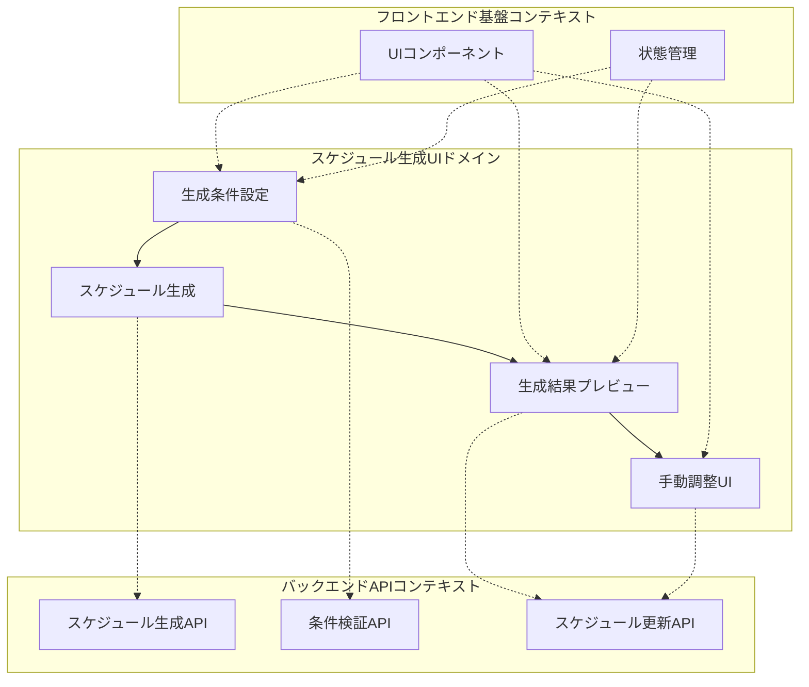
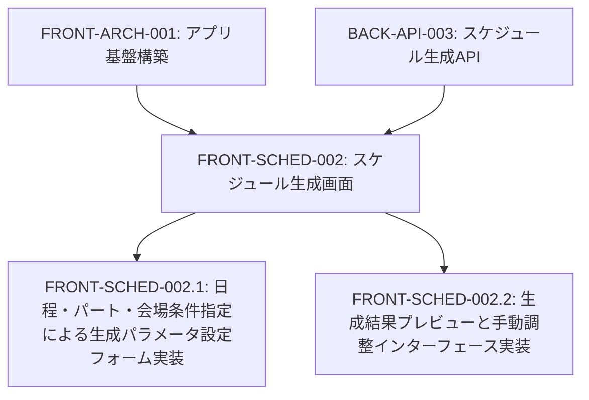
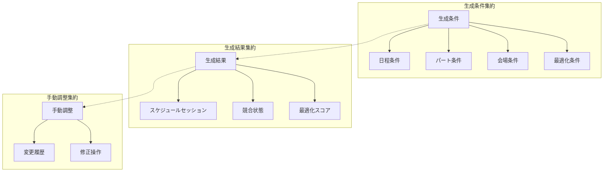
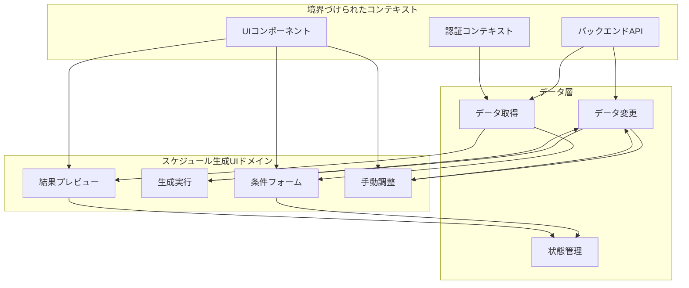
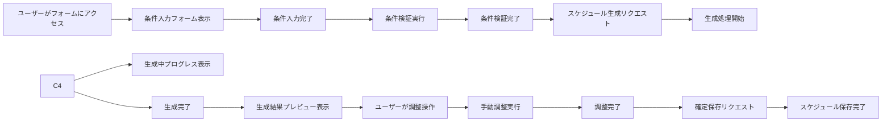

# FRONT-SCHED-002: スケジュール生成画面

## ドメインの概要
スケジュール生成画面ドメインは、練習表自動生成システムの中核となる自動スケジューリング機能のインターフェースを提供します。日程・パート・会場条件を指定して練習スケジュールを自動生成し、生成結果を確認・調整できる機能を実装します。

## ドメインモデルと境界づけられたコンテキスト

## ユビキタス言語

| 用語 | 定義 |
|------|------|
| 生成条件 | スケジュール自動生成時の制約となる設定項目群 |
| 日程条件 | 生成対象期間や除外日などの時間的制約 |
| パート条件 | 各パートの練習要件に関する制約 |
| 会場条件 | 利用可能会場や設備要件に関する制約 |
| スケジュール生成 | 与えられた条件に基づいて練習スケジュールを自動的に作成すること |
| 生成結果 | 自動生成されたスケジュール案 |
| 手動調整 | 生成結果に対する人間の判断による修正 |
| 競合 | 設定条件間の矛盾や、リソース（時間・会場・人員）の重複 |

## サブドメイン構成

## サブドメイン詳細

### FRONT-SCHED-002.1: 日程・パート・会場条件指定による生成パラメータ設定フォーム実装
**ドメイン責務**: ユーザーが自動スケジュール生成のための様々な条件を指定できるフォームインターフェースを実装する

**ドメインサービス**:
- 条件入力フォームサービス（日程・パート・会場条件の入力UI）
- 条件検証サービス（入力の整合性確認、制約違反の検出）
- 条件保存サービス（入力条件の保存と再利用）

**ステータス**: 未開始

### FRONT-SCHED-002.2: 生成結果プレビューと手動調整インターフェース実装
**ドメイン責務**: 自動生成されたスケジュールをプレビュー表示し、必要に応じて手動調整できるインターフェースを実装する

**ドメインサービス**:
- 生成結果表示サービス（自動生成スケジュールの視覚化）
- 競合ハイライトサービス（条件違反や問題箇所の強調表示）
- 手動調整サービス（ドラッグ＆ドロップによる調整、パラメータ微調整）
- 確定保存サービス（調整後スケジュールの確定と保存）

**ステータス**: 未開始

## コマンド・クエリ責務分離（CQRS）

### コマンド（書き込み操作）
- 生成条件設定
- スケジュール生成実行
- 生成結果の手動調整
- 調整後スケジュールの確定保存
- 条件テンプレートの保存

### クエリ（読み取り操作）
- 生成条件の取得・検証
- 生成結果の表示
- 競合・問題箇所の検出
- 最適化スコアの取得
- 条件テンプレートの読み込み

## 集約と整合性境界

## 開発コンテキスト図

## 進捗管理

| サブドメイン | ステータス | 担当者 | 開始日 | 完了予定 | 実際の完了日 |
|------------|-----------|--------|-------|---------|------------|
| FRONT-SCHED-002.1 | 未開始 | | | | |
| FRONT-SCHED-002.2 | 未開始 | | | | |

## イベントストーミング

## 課題・リスク

- 条件設定項目の増加による複雑なUI
- 生成処理の進行表示とタイムアウト管理
- フロントエンドでのリアルタイム検証と適切なフィードバック
- 大量の生成結果の効率的な表示
- 複雑な調整操作のUXデザイン
- 条件変更時の再計算効率

## レビューポイント

- 条件入力UIの使いやすさと網羅性
- 条件検証の即時性とエラー表示の明確さ
- 生成進行状況の可視化と中断機能
- 生成結果の視認性とフィルタリング機能
- 手動調整操作の直感性
- レスポンシブデザインの対応状況

## リファレンス

- [設計書/11c_画面設計詳細.md](../../../設計書/11c_画面設計詳細.md)
- [設計書/11f_実装指針_フロントエンド.md](../../../設計書/11f_実装指針_フロントエンド.md)
- [設計書/09_アルゴリズム詳細_1_スケジュール生成.md](../../../設計書/09_アルゴリズム詳細_1_スケジュール生成.md) 