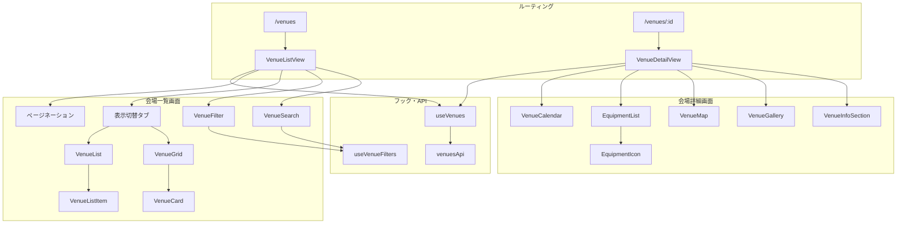
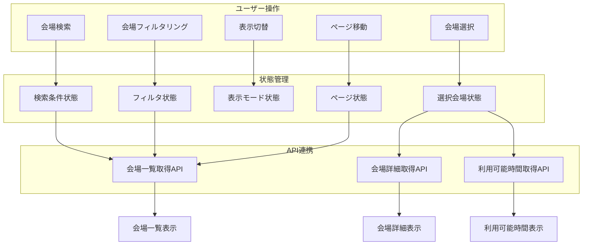
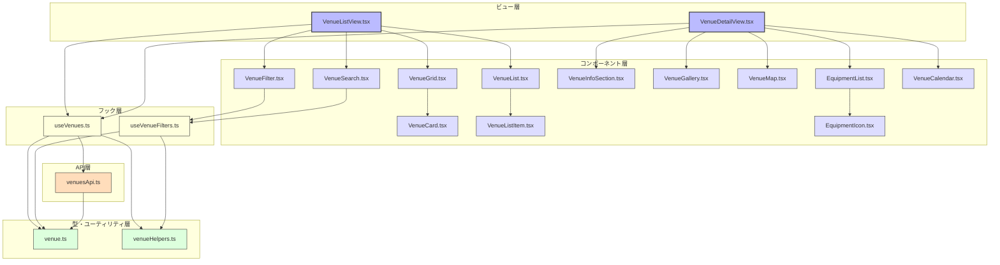

# FRONT-VENUE-001.1: 会場一覧表示と詳細情報表示画面実装

## 概要
練習表自動生成システムにおいて、登録されている練習会場の一覧と詳細情報を表示する画面を実装します。会場の基本情報、設備情報、収容人数、利用可能時間などを閲覧できるインターフェースを提供し、効率的な会場管理をサポートします。

## 詳細
- 会場一覧表示機能（フィルタリング、ソート、検索機能付き）
- 会場詳細表示機能（基本情報、設備情報、利用可能時間の表示）
- 利用可能時間カレンダー表示
- 地図表示（会場位置）
- 設備アイコン表示
- レスポンシブデザイン対応

## 依存関係
- 親タスク: FRONT-VENUE-001
- FRONT-ARCH-001: アプリ基盤構築
- BACK-API-004.1: 会場情報取得APIエンドポイント実装

## 参照ファイル
- [設計書/11c_画面設計詳細.md](../../../../../設計書/11c_画面設計詳細.md)
- [設計書/11f_実装指針_フロントエンド.md](../../../../../設計書/11f_実装指針_フロントエンド.md)

## 成果物
- 会場一覧表示コンポーネント
- 会場詳細表示コンポーネント
- 利用可能時間カレンダーコンポーネント
- 設備情報表示コンポーネント
- 会場検索・フィルタリングロジック
- 単体・統合テストコード

## ステータス
- [x] 未開始
- [ ] 進行中
- [ ] レビュー中
- [ ] 完了

## 担当者
未割り当て

## 主要機能
1. **会場一覧表示機能**
   - グリッドレイアウトとリストレイアウトの切替
   - 名称、地域、収容人数、設備などによるフィルタリング
   - カスタムソート（名前順、収容人数順、最寄り駅順など）
   - キーワード検索機能
   - ページネーション

2. **会場詳細情報表示機能**
   - 基本情報表示（名称、住所、連絡先など）
   - 収容人数・利用料金表示
   - アクセス情報表示（最寄り駅、バス路線など）
   - 写真ギャラリー
   - 地図表示（マップAPI連携）

3. **設備情報表示機能**
   - カテゴリ別設備リスト
   - 設備アイコン表示
   - 詳細情報ポップアップ
   - 在庫数・状態表示

4. **利用可能時間表示機能**
   - 月間カレンダー表示
   - 定期利用枠のパターン表示
   - 特別利用枠のハイライト
   - 利用不可時間の明示
   - 予約状況との連携表示

## 実装予定ファイル
以下は実装予定の全ファイルのリストです。各ファイルの役割と目的を簡潔に記載します。

- `src/features/venues/views/VenueListView.tsx` - 会場一覧表示画面のメインビュー
- `src/features/venues/views/VenueDetailView.tsx` - 会場詳細表示画面のメインビュー
- `src/features/venues/components/VenueGrid.tsx` - グリッド形式の会場一覧
- `src/features/venues/components/VenueList.tsx` - リスト形式の会場一覧
- `src/features/venues/components/VenueCard.tsx` - 会場カード（グリッド表示用）
- `src/features/venues/components/VenueListItem.tsx` - 会場リストアイテム（リスト表示用）
- `src/features/venues/components/VenueFilter.tsx` - 会場フィルタコントロール
- `src/features/venues/components/VenueSearch.tsx` - 会場検索コンポーネント
- `src/features/venues/components/VenueInfoSection.tsx` - 会場基本情報セクション
- `src/features/venues/components/VenueGallery.tsx` - 会場写真ギャラリー
- `src/features/venues/components/VenueMap.tsx` - 会場位置地図表示
- `src/features/venues/components/EquipmentList.tsx` - 設備リスト表示
- `src/features/venues/components/EquipmentIcon.tsx` - 設備アイコン表示
- `src/features/venues/components/VenueCalendar.tsx` - 利用可能時間カレンダー
- `src/features/venues/hooks/useVenues.ts` - 会場データ取得・管理フック
- `src/features/venues/hooks/useVenueFilters.ts` - 会場フィルタリングフック
- `src/features/venues/utils/venueHelpers.ts` - 会場データ操作ヘルパー
- `src/features/venues/api/venuesApi.ts` - 会場API連携
- `src/features/venues/types/venue.ts` - 会場関連型定義

## 設計図
### コンポーネント構成図

### データフロー図

## 実装アプローチ
### 会場一覧表示
1. **リスト/グリッド表示の実装**
   - 共通データソースからの表示切替
   - 表示密度の調整（コンパクト/標準/拡張）
   - 無限スクロールとページネーションの選択制
   - ビューポートベースの遅延読み込み
   - スケルトンローダーによる読み込み表示

2. **フィルタリング・検索機能**
   - デバウンス処理によるリアルタイム検索
   - 複合条件フィルタリング（AND/OR切替）
   - フィルタ条件の保存・再利用
   - クリアボタンとリセット機能
   - フィルタ適用結果カウント表示

3. **レスポンシブデザイン**
   - ブレイクポイントに応じたグリッドサイズ調整
   - モバイル向け表示最適化
   - タッチ操作対応
   - 限定的な情報表示から詳細表示への遷移
   - 画面サイズに応じたフィルタUIの変更

### 会場詳細表示
1. **タブ構造とスクロールナビゲーション**
   - 情報カテゴリごとのタブ分割
   - スクロールに追従するヘッダー
   - アンカーリンクによる各セクションへの移動
   - ブレッドクラム表示によるナビゲーション
   - 戻るボタンと履歴管理

2. **マップと位置情報**
   - Google Maps/OpenStreetMapの埋め込み
   - 複数の交通アクセス方法表示
   - 周辺施設情報の表示
   - ルート検索リンク
   - 位置情報の共有機能

3. **カレンダー表示**
   - 定期/特別利用枠の視覚的区別
   - 月/週表示の切替
   - 期間スクロール操作
   - 日付選択によるズーム表示
   - 当日を中心とした初期表示

## 実装するすべてのコンポーネント詳細
以下に各コンポーネントの詳細仕様を記載します。

### `VenueListView.tsx`
**目的**: 会場一覧表示画面のメインコンテナ

**プロパティ**:
- なし（ルーティングコンポーネント）

**状態**:
- `venues: Venue[]`: 会場一覧データ
- `loading: boolean`: 読み込み状態
- `error: Error | null`: エラー状態
- `viewMode: 'grid' | 'list'`: 表示モード
- `currentPage: number`: 現在のページ
- `searchTerm: string`: 検索語句
- `filters: VenueFilters`: フィルタ条件

**メソッド**:
- `handleSearchChange(term: string)`: 検索語句変更処理
- `handleFilterChange(filters: VenueFilters)`: フィルタ変更処理
- `handleViewModeChange(mode: 'grid' | 'list')`: 表示モード変更処理
- `handlePageChange(page: number)`: ページ変更処理
- `handleVenueClick(venueId: number)`: 会場選択処理
- `loadVenues()`: 会場データ読み込み処理

### `VenueDetailView.tsx`
**目的**: 会場詳細表示画面のメインコンテナ

**プロパティ**:
- なし（ルーティングコンポーネントにvenueIdがURLパラメータで渡される）

**状態**:
- `venue: Venue | null`: 会場詳細データ
- `loading: boolean`: 読み込み状態
- `error: Error | null`: エラー状態
- `activeTab: string`: アクティブタブ
- `availabilityDate: Date`: 利用可能時間表示日
- `galleryActiveIndex: number`: ギャラリーアクティブ画像インデックス

**メソッド**:
- `handleTabChange(tabId: string)`: タブ変更処理
- `handleDateChange(date: Date)`: 日付変更処理
- `handleGalleryNavigate(index: number)`: ギャラリーナビゲーション処理
- `handleBackClick()`: 戻るボタンクリック処理
- `loadVenueDetails(id: number)`: 会場詳細読み込み処理
- `handleImageClick(index: number)`: 画像クリック処理（拡大表示）

### `VenueGrid.tsx`
**目的**: グリッド形式で会場一覧を表示するコンポーネント

**プロパティ**:
- `venues: Venue[]`: 会場一覧データ
- `onVenueClick: (venueId: number) => void`: 会場クリックコールバック
- `loading?: boolean`: 読み込み状態
- `gridSize?: 'small' | 'medium' | 'large'`: グリッドサイズ

**状態**:
- `hoveredVenueId: number | null`: ホバー中会場ID

**メソッド**:
- `handleVenueHover(venueId: number | null)`: ホバー処理
- `renderSkeletons()`: スケルトンローダー表示処理
- `calculateGridLayout()`: グリッドレイアウト計算処理

### `VenueCalendar.tsx`
**目的**: 会場の利用可能時間をカレンダー形式で表示するコンポーネント

**プロパティ**:
- `venueId: number`: 会場ID
- `date: Date`: 表示月
- `onDateChange: (date: Date) => void`: 日付変更コールバック
- `viewMode?: 'month' | 'week'`: 表示モード

**状態**:
- `availability: VenueAvailability | null`: 利用可能時間データ
- `loading: boolean`: 読み込み状態
- `hoveredSlot: {date: Date, time: string} | null`: ホバー中スロット
- `selectedDate: Date | null`: 選択中日付

**メソッド**:
- `handleViewModeChange(mode: 'month' | 'week')`: 表示モード変更処理
- `handleNavigatePrev()`: 前月/前週へ移動
- `handleNavigateNext()`: 次月/次週へ移動
- `handleDateClick(date: Date)`: 日付クリック処理
- `handleSlotHover(date: Date, time: string)`: スロットホバー処理
- `getSlotStatus(date: Date, time: string)`: スロット状態取得処理
- `loadAvailability()`: 利用可能時間データ読み込み処理

### `EquipmentList.tsx`
**目的**: 会場の設備情報をリスト表示するコンポーネント

**プロパティ**:
- `equipment: Equipment[]`: 設備情報
- `categorized?: boolean`: カテゴリ分類表示フラグ
- `showCount?: boolean`: 個数表示フラグ
- `onEquipmentClick?: (equipmentId: number) => void`: 設備クリックコールバック

**状態**:
- `expandedCategories: string[]`: 展開中カテゴリ
- `searchTerm: string`: 設備検索語句

**メソッド**:
- `handleCategoryToggle(category: string)`: カテゴリ展開切替処理
- `handleSearchChange(term: string)`: 検索語句変更処理
- `groupByCategory()`: カテゴリ別グループ化処理
- `filterEquipment()`: 設備フィルタリング処理

### `useVenues.ts`
**目的**: 会場データの取得と管理を行うカスタムフック

**パラメータ**:
- `options?: { initialPage?: number, pageSize?: number }`: 初期オプション

**戻り値**:
- `venues: Venue[]`: 会場一覧
- `loading: boolean`: 読み込み状態
- `error: Error | null`: エラー状態
- `totalCount: number`: 総会場数
- `currentPage: number`: 現在のページ
- `fetchVenues: (params: VenueQueryParams) => Promise<void>`: 会場取得メソッド
- `fetchVenueById: (id: number) => Promise<Venue>`: 会場詳細取得メソッド
- `fetchVenueAvailability: (id: number, month: Date) => Promise<VenueAvailability>`: 利用可能時間取得メソッド
- `setPage: (page: number) => void`: ページ設定メソッド
- `hasNextPage: boolean`: 次ページ有無
- `hasPrevPage: boolean`: 前ページ有無

**内部処理**:
- APIとの通信処理
- ローディング状態管理
- エラーハンドリング
- キャッシュ処理

## ファイル間のコンポーネント連携図
