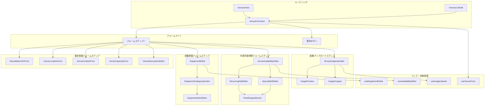
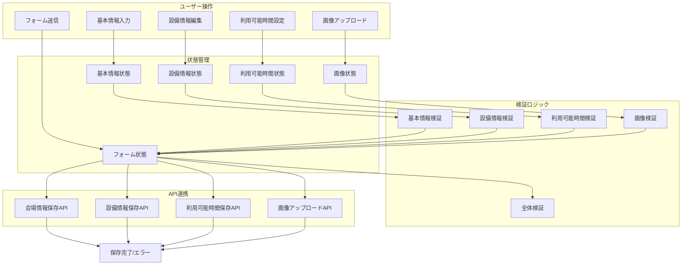

# FRONT-VENUE-001.2: 会場情報登録・編集フォームと利用可能時間設定実装

## 概要
練習表自動生成システムにおいて、新規会場の登録および既存会場情報の編集を行うためのフォームインターフェース、ならびに会場の利用可能時間を詳細に設定するためのインターフェースを実装します。会場の基本情報、設備情報、収容人数、利用可能時間などを登録・編集できる機能を提供し、スケジュール生成の際に適切な会場選択ができるようサポートします。

## 詳細
- 会場基本情報入力フォーム
- 設備情報登録・編集機能
- 利用可能時間設定カレンダーインターフェース
- 定期利用枠設定機能
- 特別利用枠設定機能
- 画像アップロード機能
- 入力検証機能
- レスポンシブデザイン対応

## 依存関係
- 親タスク: FRONT-VENUE-001
- FRONT-VENUE-001.1: 会場一覧表示と詳細情報表示画面実装
- FRONT-ARCH-001: アプリ基盤構築
- BACK-API-004.2: 会場情報登録・更新APIエンドポイント実装
- BACK-API-004.3: 会場利用可能時間設定APIエンドポイント実装

## 参照ファイル
- [設計書/11c_画面設計詳細.md](../../../../../設計書/11c_画面設計詳細.md)
- [設計書/11f_実装指針_フロントエンド.md](../../../../../設計書/11f_実装指針_フロントエンド.md)

## 成果物
- 会場基本情報編集フォームコンポーネント
- 設備情報編集コンポーネント
- 利用可能時間設定カレンダーコンポーネント
- 画像アップロードコンポーネント
- 入力検証ロジック
- 単体・統合テストコード

## ステータス
- [x] 未開始
- [ ] 進行中
- [ ] レビュー中
- [ ] 完了

## 担当者
未割り当て

## 主要機能
1. **会場基本情報編集機能**
   - 基本情報入力フォーム（名称、住所、連絡先など）
   - 収容人数・利用料金設定
   - アクセス情報入力
   - 備考・説明文入力（リッチテキスト対応）
   - バリデーション・エラー表示

2. **設備情報編集機能**
   - 設備カテゴリ別管理
   - 設備の追加・削除
   - 設備数量・状態設定
   - カスタム設備登録
   - 設備検索・フィルタリング

3. **利用可能時間設定機能**
   - カレンダーベースのUI
   - 定期利用枠設定（曜日・時間指定、繰り返しパターン）
   - 特別利用枠設定（特定日の例外設定）
   - 利用不可時間設定
   - ドラッグ操作による時間範囲設定

4. **画像管理機能**
   - 画像アップロード
   - 画像プレビュー
   - 画像編集（トリミング、回転）
   - 画像順序変更
   - 画像削除

## 実装予定ファイル
以下は実装予定の全ファイルのリストです。各ファイルの役割と目的を簡潔に記載します。

- `src/features/venues/views/VenueFormView.tsx` - 会場登録・編集フォームのメインビュー
- `src/features/venues/components/VenueBasicInfoForm.tsx` - 会場基本情報フォーム
- `src/features/venues/components/VenueLocationForm.tsx` - 会場位置情報フォーム
- `src/features/venues/components/VenueContactForm.tsx` - 会場連絡先フォーム
- `src/features/venues/components/VenueCapacityForm.tsx` - 会場収容人数・料金フォーム
- `src/features/venues/components/VenueDescriptionEditor.tsx` - 会場説明文エディタ
- `src/features/venues/components/EquipmentEditor.tsx` - 設備情報編集コンポーネント
- `src/features/venues/components/EquipmentCategorySection.tsx` - 設備カテゴリセクション
- `src/features/venues/components/EquipmentItemEditor.tsx` - 設備アイテム編集コンポーネント
- `src/features/venues/components/VenueAvailabilityEditor.tsx` - 利用可能時間設定エディタ
- `src/features/venues/components/RecurringSlotEditor.tsx` - 定期利用枠設定コンポーネント
- `src/features/venues/components/SpecialSlotEditor.tsx` - 特別利用枠設定コンポーネント
- `src/features/venues/components/TimeRangeSelector.tsx` - 時間範囲選択コンポーネント
- `src/features/venues/components/VenueImageUploader.tsx` - 会場画像アップローダー
- `src/features/venues/components/ImagePreview.tsx` - 画像プレビューコンポーネント
- `src/features/venues/components/ImageCropper.tsx` - 画像トリミングコンポーネント
- `src/features/venues/hooks/useVenueForm.ts` - 会場フォーム管理フック
- `src/features/venues/hooks/useEquipmentEditor.ts` - 設備編集管理フック
- `src/features/venues/hooks/useAvailabilityEditor.ts` - 利用可能時間管理フック
- `src/features/venues/hooks/useImageUpload.ts` - 画像アップロード管理フック
- `src/features/venues/utils/validationHelpers.ts` - バリデーションヘルパー
- `src/features/venues/utils/availabilityHelpers.ts` - 利用可能時間処理ヘルパー
- `src/features/venues/api/venueFormApi.ts` - 会場フォームAPI連携
- `src/features/venues/types/venueForm.ts` - 会場フォーム関連型定義

## 設計図
### コンポーネント構成図

### データフロー図

## 実装アプローチ
### フォーム設計
1. **ステップ型フォーム実装**
   - 複数ステップによる分割入力
   - ステップ間のナビゲーションバー
   - 各ステップの入力状態表示（完了/未完了/エラー）
   - プログレスバーによる全体進捗表示
   - 自動保存機能

2. **リアルタイムバリデーション**
   - フィールドごとの即時検証
   - エラーメッセージのインライン表示
   - 送信ボタンの有効/無効制御
   - バリデーションルールの一元管理
   - カスタムバリデーションフック

3. **リッチフォーム要素**
   - 住所自動補完
   - タグ入力
   - ドラッグ＆ドロップ
   - リッチテキストエディタ
   - カスタム日時選択コントロール

### 利用可能時間設定
1. **カレンダーインターフェース**
   - 視覚的な時間枠表示
   - ドラッグによる範囲選択
   - クリック操作によるトグル
   - カラーコードによる状態表示
   - パターン表示とインスタンス表示の切替

2. **定期利用パターン**
   - 特定曜日（例：毎週月曜）
   - 複数曜日選択（例：毎週月・水・金）
   - 隔週パターン設定
   - 月ごとのパターン（例：毎月第一月曜）
   - 開始日・終了日設定

3. **例外処理**
   - 特定日の例外設定
   - 例外の一括適用
   - 定期ルールの優先順位設定
   - 競合検出と解決
   - ドラッグによる例外範囲設定

## 実装するすべてのコンポーネント詳細
以下に各コンポーネントの詳細仕様を記載します。

### `VenueFormView.tsx`
**目的**: 会場登録・編集フォームのメインコンテナ

**プロパティ**:
- `venueId?: number`: 編集対象会場ID（新規登録時は未指定）
- `onSaveComplete?: (venueId: number) => void`: 保存完了時コールバック

**状態**:
- `formData: VenueFormData`: フォームデータ
- `currentStep: number`: 現在のステップ
- `isSaving: boolean`: 保存中フラグ
- `validationErrors: Record<string, string[]>`: 検証エラー
- `activeImageId: number | null`: 編集中画像ID

**メソッド**:
- `handleStepChange(step: number)`: ステップ変更処理
- `handleFormDataChange(path: string, value: any)`: フォームデータ変更処理
- `handleSave()`: 保存処理
- `validateCurrentStep()`: 現在のステップ検証
- `validateAllSteps()`: 全ステップ検証
- `isCurrentStepValid()`: 現在のステップ有効性確認
- `loadVenueData(id: number)`: 会場データ読込処理

### `VenueBasicInfoForm.tsx`
**目的**: 会場の基本情報を入力するフォーム

**プロパティ**:
- `value: VenueBasicInfo`: 基本情報データ
- `onChange: (data: VenueBasicInfo) => void`: 変更コールバック
- `errors?: Record<string, string>`: エラーメッセージ
- `disabled?: boolean`: 無効状態

**状態**:
- なし（制御コンポーネント）

**メソッド**:
- `handleInputChange(e: React.ChangeEvent<HTMLInputElement>)`: 入力変更処理
- `handleSelectChange(e: React.ChangeEvent<HTMLSelectElement>)`: 選択変更処理
- `handleBlur(field: string)`: フォーカス喪失処理

### `EquipmentEditor.tsx`
**目的**: 会場の設備情報を編集するコンポーネント

**プロパティ**:
- `value: EquipmentData[]`: 設備データ
- `onChange: (data: EquipmentData[]) => void`: 変更コールバック
- `equipmentTypes: EquipmentType[]`: 設備種別一覧
- `errors?: Record<string, string>`: エラーメッセージ
- `disabled?: boolean`: 無効状態

**状態**:
- `expandedCategories: string[]`: 展開中カテゴリ
- `searchTerm: string`: 検索語句
- `editingItemId: number | null`: 編集中アイテムID

**メソッド**:
- `handleCategoryToggle(category: string)`: カテゴリ展開切替処理
- `handleSearchChange(term: string)`: 検索語句変更処理
- `handleAddItem(categoryId: string)`: アイテム追加処理
- `handleEditItem(itemId: number)`: アイテム編集開始処理
- `handleDeleteItem(itemId: number)`: アイテム削除処理
- `handleItemChange(itemId: number, data: EquipmentItemData)`: アイテム変更処理
- `groupByCategory()`: カテゴリ別グループ化処理
- `filterEquipment()`: 設備フィルタリング処理

### `VenueAvailabilityEditor.tsx`
**目的**: 会場の利用可能時間を設定するカレンダーエディタ

**プロパティ**:
- `value: VenueAvailability`: 利用可能時間データ
- `onChange: (data: VenueAvailability) => void`: 変更コールバック
- `errors?: Record<string, string>`: エラーメッセージ
- `disabled?: boolean`: 無効状態

**状態**:
- `activeTab: 'recurring' | 'special'`: アクティブタブ
- `selectedDate: Date | null`: 選択中日付
- `editingSlotId: string | null`: 編集中スロットID
- `viewMode: 'month' | 'week'`: 表示モード
- `currentMonth: Date`: 表示月

**メソッド**:
- `handleTabChange(tab: 'recurring' | 'special')`: タブ変更処理
- `handleAddRecurringSlot()`: 定期利用枠追加処理
- `handleAddSpecialSlot()`: 特別利用枠追加処理
- `handleEditSlot(slotId: string)`: スロット編集開始処理
- `handleDeleteSlot(slotId: string)`: スロット削除処理
- `handleRecurringSlotChange(slotId: string, data: RecurringSlotData)`: 定期利用枠変更処理
- `handleSpecialSlotChange(slotId: string, data: SpecialSlotData)`: 特別利用枠変更処理
- `handleViewModeChange(mode: 'month' | 'week')`: 表示モード変更処理
- `handleMonthChange(date: Date)`: 表示月変更処理
- `detectConflicts()`: 競合検出処理

### `VenueImageUploader.tsx`
**目的**: 会場の画像をアップロード・管理するコンポーネント

**プロパティ**:
- `value: VenueImage[]`: 画像データ
- `onChange: (images: VenueImage[]) => void`: 変更コールバック
- `maxImages?: number`: 最大画像数
- `errors?: Record<string, string>`: エラーメッセージ
- `disabled?: boolean`: 無効状態

**状態**:
- `uploading: boolean`: アップロード中フラグ
- `dragOver: boolean`: ドラッグオーバー状態
- `selectedImageId: number | null`: 選択中画像ID
- `cropMode: boolean`: トリミングモード
- `cropData: CropData | null`: トリミングデータ

**メソッド**:
- `handleDragOver(e: React.DragEvent)`: ドラッグオーバー処理
- `handleDragLeave(e: React.DragEvent)`: ドラッグリーブ処理
- `handleDrop(e: React.DragEvent)`: ドロップ処理
- `handleFileSelect(e: React.ChangeEvent<HTMLInputElement>)`: ファイル選択処理
- `handleImageSelect(imageId: number)`: 画像選択処理
- `handleImageDelete(imageId: number)`: 画像削除処理
- `handleCropStart(imageId: number)`: トリミング開始処理
- `handleCropCancel()`: トリミングキャンセル処理
- `handleCropComplete(data: CropData)`: トリミング完了処理
- `handleReorder(oldIndex: number, newIndex: number)`: 画像順序変更処理
- `uploadImage(file: File)`: 画像アップロード処理

### `useVenueForm.ts`
**目的**: 会場フォームの状態と操作を管理するカスタムフック

**パラメータ**:
- `options?: { venueId?: number }`: 初期オプション

**戻り値**:
- `formData: VenueFormData`: フォームデータ
- `isLoading: boolean`: 読み込み中フラグ
- `isSaving: boolean`: 保存中フラグ
- `errors: Record<string, string[]>`: エラー情報
- `updateField: (path: string, value: any) => void`: フィールド更新メソッド
- `validateForm: () => boolean`: フォーム検証メソッド
- `saveForm: () => Promise<number>`: フォーム保存メソッド
- `resetForm: () => void`: フォームリセットメソッド
- `loadVenue: (id: number) => Promise<void>`: 会場データ読込メソッド
- `isDirty: boolean`: 変更有無フラグ

**内部処理**:
- APIとの通信処理
- フォーム状態管理
- バリデーション処理
- エラーハンドリング
- クリーンアップ処理

## ファイル間のコンポーネント連携図

```mermaid
graph TD
    subgraph "ビュー層"
        VFV[VenueFormView.tsx]
    end
    
    subgraph "基本情報コンポーネント層"
        VBIF[VenueBasicInfoForm.tsx]
        VLF[VenueLocationForm.tsx]
        VCF[VenueContactForm.tsx]
        VCAF[VenueCapacityForm.tsx]
        VDE[VenueDescriptionEditor.tsx]
    end
    
    subgraph "設備情報コンポーネント層"
        EE[EquipmentEditor.tsx]
        ECS[EquipmentCategorySection.tsx]
        EIE[EquipmentItemEditor.tsx]
    end
    
    subgraph "利用可能時間コンポーネント層"
        VAE[VenueAvailabilityEditor.tsx]
        RSE[RecurringSlotEditor.tsx]
        SSE[SpecialSlotEditor.tsx]
        TRS[TimeRangeSelector.tsx]
    end
    
    subgraph "画像コンポーネント層"
        VIU[VenueImageUploader.tsx]
        IP[ImagePreview.tsx]
        IC[ImageCropper.tsx]
    end
    
    subgraph "フック層"
        UVF[useVenueForm.ts]
        UEE[useEquipmentEditor.ts]
        UAE[useAvailabilityEditor.ts]
        UIU[useImageUpload.ts]
    end
    
    subgraph "API層"
        VFA[venueFormApi.ts]
    end
    
    subgraph "ユーティリティ層"
        VH[validationHelpers.ts]
        AH[availabilityHelpers.ts]
    end
    
    subgraph "型定義層"
        VFT[venueForm.ts]
    end
    
    VFV --> VBIF
    VFV --> VLF
    VFV --> VCF
    VFV --> VCAF
    VFV --> VDE
    
    VFV --> EE
    EE --> ECS
    ECS --> EIE
    
    VFV --> VAE
    VAE --> RSE
    VAE --> SSE
    RSE --> TRS
    SSE --> TRS
    
    VFV --> VIU
    VIU --> IP
    VIU --> IC
    
    VFV --> UVF
    EE --> UEE
    VAE --> UAE
    VIU --> UIU
    
    UVF --> VFA
    UEE --> VFA
    UAE --> VFA
    UIU --> VFA
    
    UVF --> VH
    UEE --> VH
    UAE --> VH
    UIU --> VH
    
    UAE --> AH
    
    UVF --> VFT
    UEE --> VFT
    UAE --> VFT
    UIU --> VFT
    
    classDef view fill:#bbf,stroke:#333,stroke-width:2px;
    classDef basicComponent fill:#ddf,stroke:#333,stroke-width:1px;
    classDef equipComponent fill:#ddf,stroke:#333,stroke-width:1px;
    classDef availComponent fill:#ddf,stroke:#333,stroke-width:1px;
    classDef imageComponent fill:#ddf,stroke:#333,stroke-width:1px;
    classDef hook fill:#ffd,stroke:#333,stroke-width:1px;
    classDef api fill:#fdb,stroke:#333,stroke-width:1px;
    classDef util fill:#efe,stroke:#333,stroke-width:1px;
    classDef type fill:#dfd,stroke:#333,stroke-width:1px;
    
    class VFV view;
    class VBIF,VLF,VCF,VCAF,VDE basicComponent;
    class EE,ECS,EIE equipComponent;
    class VAE,RSE,SSE,TRS availComponent;
    class VIU,IP,IC imageComponent;
    class UVF,UEE,UAE,UIU hook;
    class VFA api;
    class VH,AH util;
    class VFT type;
``` 
