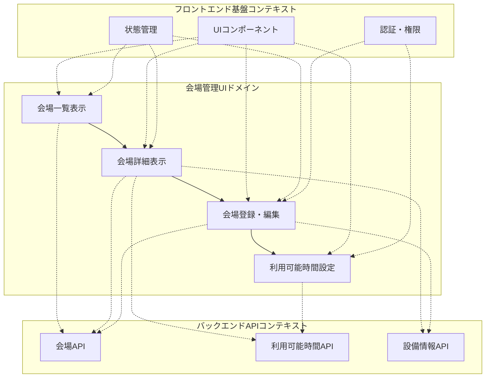
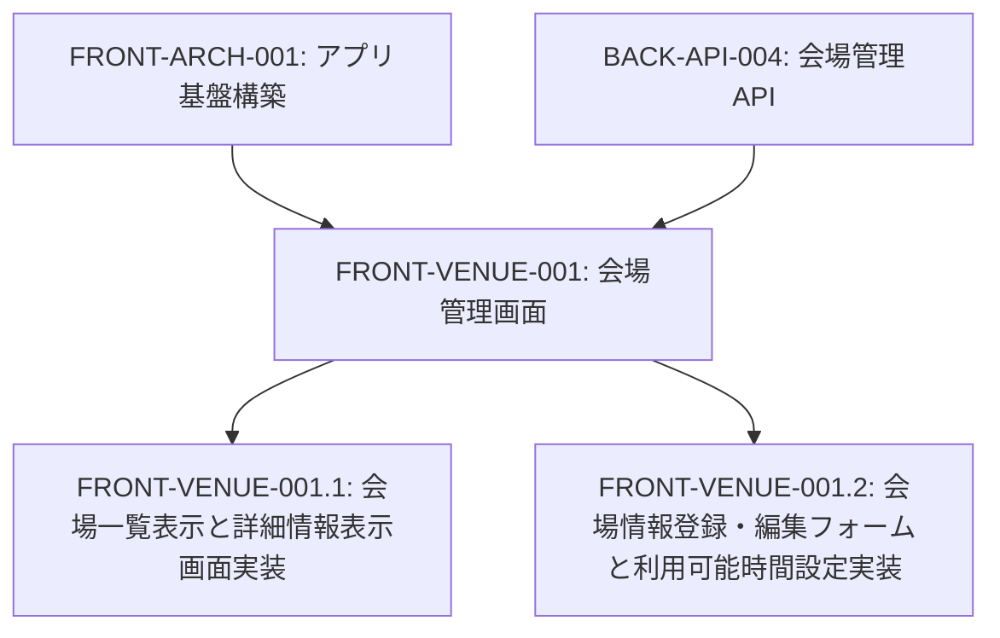
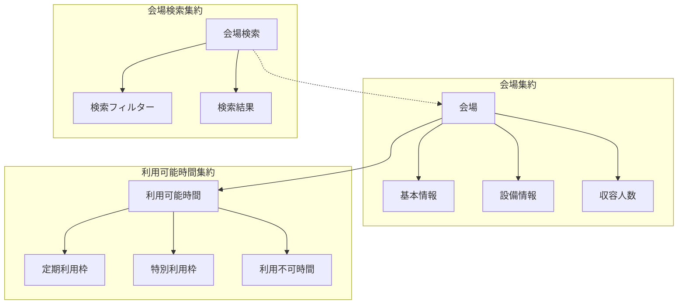
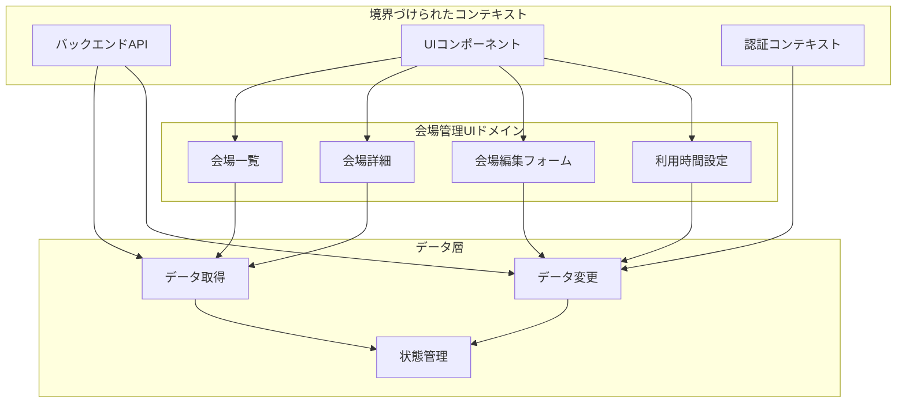

# FRONT-VENUE-001: 会場管理画面

## ドメインの概要
会場管理画面ドメインは、練習表自動生成システムにおける練習会場の登録・編集・管理を行うためのインターフェースを提供します。会場の基本情報、設備情報、収容人数、利用可能時間などを管理し、スケジュール生成の際に適切な会場選択が行えるようにします。

## ドメインモデルと境界づけられたコンテキスト

## ユビキタス言語

| 用語 | 定義 |
|------|------|
| 会場 | 練習を行う物理的な場所 |
| 設備 | 会場に備わっている練習用の設備や機材 |
| 収容人数 | 会場が同時に受け入れられる最大人数 |
| 利用可能時間 | 会場を利用できる時間帯 |
| 定期利用枠 | 定期的に確保されている利用枠（毎週水曜日など） |
| 特別利用枠 | 特定の日時だけ確保されている利用枠 |
| 利用不可時間 | 会場を利用できない時間帯 |
| 会場予約 | 特定の日時に会場を確保すること |

## サブドメイン構成

## サブドメイン詳細

### FRONT-VENUE-001.1: 会場一覧表示と詳細情報表示画面実装
**ドメイン責務**: 登録されている会場の一覧を表示し、各会場の詳細情報（設備・収容人数など）を閲覧できる画面を実装する

**ドメインサービス**:
- 会場一覧表示サービス（フィルタリング、ソート機能付き）
- 会場詳細表示サービス（基本情報、設備情報、利用可能時間の表示）
- 会場検索サービス（名称、地域、設備などによる検索）

**ステータス**: 未開始

### FRONT-VENUE-001.2: 会場情報登録・編集フォームと利用可能時間設定実装
**ドメイン責務**: 新規会場の登録や既存会場情報の編集を行うフォーム、および利用可能時間の詳細設定インターフェースを実装する

**ドメインサービス**:
- 会場情報編集サービス（基本情報、設備情報の編集UI）
- 利用可能時間設定サービス（カレンダーベースのスケジュール設定UI）
- 定期利用枠設定サービス（繰り返しパターンの設定）
- 特別利用枠設定サービス（特定日の例外設定）

**ステータス**: 未開始

## コマンド・クエリ責務分離（CQRS）

### コマンド（書き込み操作）
- 会場の新規登録
- 会場情報の更新
- 会場の削除
- 利用可能時間の設定
- 定期利用枠の登録・更新・削除
- 特別利用枠の登録・更新・削除

### クエリ（読み取り操作）
- 会場一覧の取得
- 会場詳細情報の取得
- 利用可能時間の照会
- 特定条件に合致する会場の検索
- 設備別会場リストの取得
- 特定日時の利用可能会場確認

## 集約と整合性境界

## 開発コンテキスト図

## 進捗管理

| サブドメイン | ステータス | 担当者 | 開始日 | 完了予定 | 実際の完了日 |
|------------|-----------|--------|-------|---------|------------|
| FRONT-VENUE-001.1 | 未開始 | | | | |
| FRONT-VENUE-001.2 | 未開始 | | | | |

## イベントストーミング

```mermaid
graph LR
    E1[ユーザーが会場画面にアクセス] --> C1[会場一覧表示]
    C1 --> E2[ユーザーが会場選択]
    E2 --> C2[会場詳細表示]
    C2 --> E3[ユーザーが編集開始]
    E3 --> C3[会場編集フォーム表示]
    C3 --> E4[基本情報編集完了]
    E4 --> C4[設備情報編集開始]
    C4 --> E5[設備情報編集完了]
    E5 --> C5[利用可能時間設定開始]
    C5 --> E6[定期利用枠設定]
    E6 --> C6[特別利用枠設定]
    C6 --> E7[利用可能時間設定完了]
    E7 --> C7[会場情報保存リクエスト]
    C7 --> E8[保存完了通知]
```

## 課題・リスク

- 複雑な時間設定パターンのUI表現
- 複数条件による会場検索の効率的な実装
- 設備情報の柔軟な拡張性確保
- 会場の追加・変更権限の適切な管理
- 大量の会場データの効率的な表示
- 他のモジュール（スケジュール生成など）との連携

## レビューポイント

- 会場一覧の視認性と操作性
- 詳細表示の情報量と構造
- 編集フォームの使いやすさと入力検証
- 利用可能時間設定UIの直感性
- 繰り返しパターン設定の柔軟性
- レスポンシブデザインの対応状況

## リファレンス

- [設計書/11c_画面設計詳細.md](../../../設計書/11c_画面設計詳細.md)
- [設計書/11f_実装指針_フロントエンド.md](../../../設計書/11f_実装指針_フロントエンド.md) 