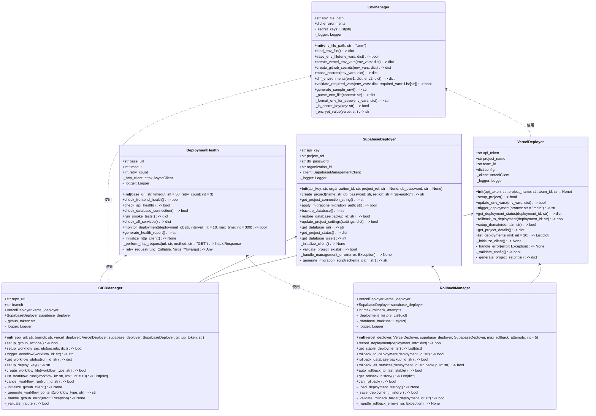
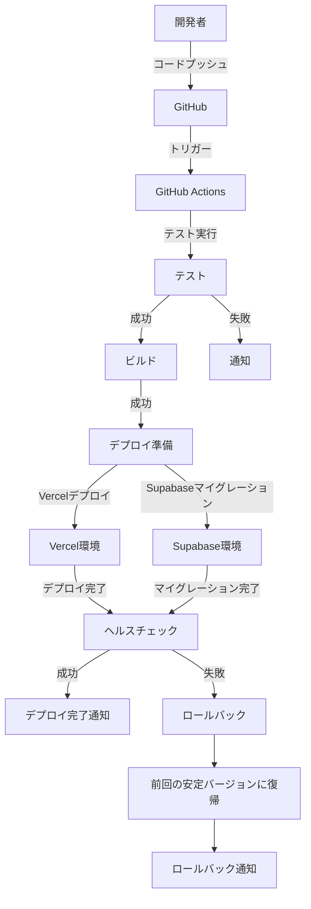

# OPS-DEPLOY-001.1: Vercel/Supabase本番環境初期設定とCI/CD基本構成

## 概要
練習表自動生成システムの本番環境をVercel/Supabase上に構築し、CI/CDパイプラインを設定します。セキュアなデプロイプロセスを確立し、安定した継続的デリバリー体制を構築することで、効率的なサービス提供環境を実現します。

## 詳細
- Vercel本番環境のプロジェクト設定と環境変数定義
- Supabase本番プロジェクトの作成とスキーマのマイグレーション設定
- GitHubActionsを活用したCI/CDパイプライン構築
- 本番・開発環境の分離と連携設定
- Vercel/Supabaseへの自動デプロイ設定とロールバック仕組みの構築

## 依存関係
- 親タスク: OPS-DEPLOY-001
- OPS-INFRA-001.2: Supabaseローカル開発環境とテストデータベース構築

## 参照ファイル
- [設計書/11i_実装指針_デプロイとインフラ.md](../../../../設計書/11i_実装指針_デプロイとインフラ.md)
- [設計書/11f_実装指針_フロントエンド.md](../../../../設計書/11f_実装指針_フロントエンド.md)
- [設計書/11g_実装指針_バックエンド.md](../../../../設計書/11g_実装指針_バックエンド.md)

## 成果物
- Vercel本番環境設定ファイル
- Supabase本番環境設定ファイル
- GitHubActionsワークフローファイル
- デプロイスクリプト
- ロールバックスクリプト
- 環境変数管理シート
- CI/CD構成ドキュメント

## ステータス
- [x] 未開始
- [ ] 進行中
- [ ] レビュー中
- [ ] 完了

## 担当者
未割り当て

## 主要機能
1. **Vercel本番環境設定**
   - プロジェクト初期設定とドメイン連携
   - ビルド設定とキャッシュ戦略の最適化
   - 環境変数の安全な管理と設定
   - プレビュー環境とブランチデプロイの設定

2. **Supabase本番環境設定**
   - プロジェクト作成と初期設定
   - データベーススキーマのマイグレーション設定
   - RLSポリシーの本番適用設定
   - バックアップと復旧戦略の設定

3. **CI/CD設定**
   - GitHubActionsワークフローの設計と実装
   - テスト自動化とコード品質チェック設定
   - 条件付きデプロイルールの設定
   - デプロイ通知とログ監視の設定

## 実装予定ファイル
以下は実装予定の全ファイルのリストです。各ファイルの役割と目的を簡潔に記載します。

- `deploy/vercel/vercel.json` - Vercelプロジェクトの設定ファイル
- `deploy/vercel/setup_vercel.py` - Vercel環境セットアップスクリプト
- `deploy/supabase/supabase_setup.py` - Supabase環境セットアップスクリプト
- `deploy/supabase/migrations_config.py` - マイグレーション管理設定
- `.github/workflows/ci.yml` - CIワークフロー定義
- `.github/workflows/deploy.yml` - デプロイワークフロー定義
- `deploy/scripts/rollback.py` - ロールバックスクリプト
- `deploy/scripts/env_manager.py` - 環境変数管理スクリプト
- `deploy/scripts/health_check.py` - デプロイ後のヘルスチェックスクリプト
- `deploy/docs/deploy_process.md` - デプロイプロセスのドキュメント
- `deploy/docs/rollback_process.md` - ロールバック手順のドキュメント
- `tests/deployment/test_deploy.py` - デプロイ機能のテスト
- `tests/deployment/test_rollback.py` - ロールバック機能のテスト

## 設計図
### クラス図


### デプロイフロー図


## 実装アプローチ
### 初期環境構築
1. **Vercel環境設定**
   - Python APIクライアントを使用してVercelプロジェクトを作成
   - プロジェクト設定とビルド環境の構成
   - 環境変数の設定とシークレットの安全な管理
   - ドメイン設定とSSL証明書の設定

2. **Supabase環境設定**
   - 管理APIを使用してSupabaseプロジェクトを作成
   - データベースパスワードと認証設定の構成
   - スキーママイグレーションツールの設定
   - バックアップスケジュールの設定

### CI/CD構築
1. **GitHubActionsワークフロー設計**
   - ワークフローYAMLファイルの作成
   - テスト・ビルド・デプロイのステップ定義
   - 環境変数とシークレットの設定
   - 条件付きワークフロートリガーの設定

2. **デプロイ自動化**
   - Pythonデプロイスクリプトの実装
   - デプロイ前後のチェックポイント設定
   - 段階的デプロイとカナリアリリースの設定
   - デプロイ結果の検証と通知設定

## 実装するすべてのファイル構成詳細
以下は全ての実装予定ファイルの詳細です。各ファイルごとに目的とクラス/インターフェース、メソッド、依存関係などを詳しく記載します。

### `deploy/vercel/vercel.json`
**目的**: Vercelプロジェクトの設定を定義するJSON設定ファイル

**主要設定項目**:
- `version`: 設定ファイルのバージョン
- `builds`: ビルド設定（Next.js用のビルド指示など）
- `routes`: ルーティング設定とリダイレクトルール
- `env`: 環境変数の参照定義
- `headers`: セキュリティヘッダーの設定
- `regions`: デプロイするリージョンの設定

### `deploy/vercel/setup_vercel.py`
**目的**: Vercel環境のセットアップを自動化するPythonスクリプト

**クラス/関数**:
- `VercelDeployer`: Vercel環境のセットアップと管理を行うクラス
  - **継承/実装**: なし
  - **主要メソッド**: 
    - `setup_project()`: プロジェクトの初期設定を行う
    - `update_env_vars(env_vars: dict)`: 環境変数を更新する
    - `trigger_deployment(branch: str)`: デプロイを開始する
    - `rollback_to_deployment(deployment_id: str)`: 特定のデプロイにロールバックする
  - **依存クラス**: なし

- `main()`: スクリプトのエントリーポイント関数
  - **処理内容**: コマンドライン引数の解析、設定ファイルの読み込み、デプロイヤーの初期化と実行

**依存関係**:
- `httpx`: HTTP通信ライブラリ
- `pydantic`: データ検証ライブラリ
- `typer`: コマンドラインインターフェース構築ライブラリ
- `python-dotenv`: 環境変数管理ライブラリ

### `deploy/supabase/supabase_setup.py`
**目的**: Supabase環境のセットアップを自動化するPythonスクリプト

**クラス/関数**:
- `SupabaseDeployer`: Supabase環境のセットアップと管理を行うクラス
  - **継承/実装**: なし
  - **主要メソッド**: 
    - `create_project(name: str, db_password: str, region: str)`: 新しいプロジェクトを作成する
    - `apply_migrations(migration_path: str)`: マイグレーションを適用する
    - `backup_database()`: データベースのバックアップを作成する
    - `restore_database(backup_id: str)`: バックアップからデータベースを復元する
  - **依存クラス**: なし

- `main()`: スクリプトのエントリーポイント関数
  - **処理内容**: コマンドライン引数の解析、Supabase接続情報の設定、デプロイヤーの初期化と実行

**依存関係**:
- `httpx`: HTTP通信ライブラリ
- `pydantic`: データ検証ライブラリ
- `typer`: コマンドラインインターフェース構築ライブラリ
- `python-dotenv`: 環境変数管理ライブラリ

### `deploy/supabase/migrations_config.py`
**目的**: Supabaseのマイグレーション設定を管理するモジュール

**クラス/関数**:
- `MigrationConfig`: マイグレーション設定を管理するクラス
  - **継承/実装**: なし
  - **主要メソッド**: 
    - `load_migrations(path: str)`: マイグレーションファイルをロードする
    - `generate_migration_script(schema_diff: dict)`: マイグレーションスクリプトを生成する
    - `validate_migration(migration_sql: str)`: マイグレーションの安全性を検証する
  - **依存クラス**: なし

- `migration_order`: マイグレーションの実行順序を定義する関数
  - **処理内容**: テーブル依存関係に基づいたマイグレーション順序の決定

**依存関係**:
- `pydantic`: データ検証ライブラリ
- `sqlparse`: SQLパース・フォーマットライブラリ

### `.github/workflows/ci.yml`
**目的**: 継続的インテグレーションのワークフロー定義ファイル

**主要設定項目**:
- `name`: ワークフロー名
- `on`: トリガー条件（プッシュ、プルリクエストなど）
- `jobs`: 実行ジョブの定義
  - `test`: テスト実行ジョブ
  - `lint`: コード品質チェックジョブ
  - `security`: セキュリティスキャンジョブ
- `env`: 環境変数設定

### `.github/workflows/deploy.yml`
**目的**: 継続的デリバリーのワークフロー定義ファイル

**主要設定項目**:
- `name`: ワークフロー名
- `on`: トリガー条件（mainブランチへのプッシュ、タグ作成など）
- `jobs`: 実行ジョブの定義
  - `build`: ビルドジョブ
  - `deploy-vercel`: Vercelデプロイジョブ
  - `deploy-supabase`: Supabaseデプロイジョブ
  - `health-check`: デプロイ後のヘルスチェックジョブ
- `env`: 環境変数設定
- `secrets`: 使用するシークレット

### `deploy/scripts/rollback.py`
**目的**: デプロイ失敗時のロールバック処理を行うPythonスクリプト

**クラス/関数**:
- `RollbackManager`: ロールバック操作を管理するクラス
  - **継承/実装**: なし
  - **主要メソッド**: 
    - `rollback_to_deployment(deployment_id: str)`: 特定のVercelデプロイにロールバックする
    - `rollback_database(backup_id: str)`: 特定のDBバックアップに復元する
    - `auto_rollback_to_last_stable()`: 最後の安定バージョンに自動ロールバックする
  - **依存クラス**: `VercelDeployer`, `SupabaseDeployer`

- `main()`: スクリプトのエントリーポイント関数
  - **処理内容**: コマンドライン引数の解析、ロールバックマネージャーの初期化と実行

**依存関係**:
- `typer`: コマンドラインインターフェース構築ライブラリ
- `pydantic`: データ検証ライブラリ
- `python-dotenv`: 環境変数管理ライブラリ

### `deploy/scripts/env_manager.py`
**目的**: 環境変数の管理と異なる環境間での同期を行うPythonスクリプト

**クラス/関数**:
- `EnvManager`: 環境変数の管理を行うクラス
  - **継承/実装**: なし
  - **主要メソッド**: 
    - `load_env_file()`: .envファイルをロードする
    - `save_env_file(env_vars: dict)`: 環境変数を.envファイルに保存する
    - `create_vercel_env_vars(env_vars: dict)`: Vercel用の環境変数形式に変換する
    - `mask_secrets(env_vars: dict)`: 機密情報をマスクする
  - **依存クラス**: なし

- `main()`: スクリプトのエントリーポイント関数
  - **処理内容**: コマンドライン引数の解析、環境ファイルの読み書き操作の実行

**依存関係**:
- `typer`: コマンドラインインターフェース構築ライブラリ
- `pydantic`: データ検証ライブラリ
- `python-dotenv`: 環境変数管理ライブラリ

### `deploy/scripts/health_check.py`
**目的**: デプロイ後の各サービスの健全性を確認するPythonスクリプト

**クラス/関数**:
- `DeploymentHealth`: デプロイのヘルスチェックを行うクラス
  - **継承/実装**: なし
  - **主要メソッド**: 
    - `check_frontend_health()`: フロントエンドの健全性をチェックする
    - `check_api_health()`: APIの健全性をチェックする
    - `check_database_connection()`: データベース接続をチェックする
    - `run_smoke_tests()`: 基本的な機能テストを実行する
  - **依存クラス**: なし

- `main()`: スクリプトのエントリーポイント関数
  - **処理内容**: コマンドライン引数の解析、ヘルスチェックの実行と結果の報告

**依存関係**:
- `httpx`: HTTP通信ライブラリ
- `typer`: コマンドラインインターフェース構築ライブラリ
- `pydantic`: データ検証ライブラリ

### `deploy/docs/deploy_process.md`
**目的**: デプロイプロセスの詳細なドキュメント

**主要内容**:
- デプロイの前提条件
- 環境準備手順
- デプロイフロー詳細
- 手動デプロイ手順
- トラブルシューティングガイド
- 連絡先とエスカレーションパス

### `deploy/docs/rollback_process.md`
**目的**: ロールバックプロセスの詳細なドキュメント

**主要内容**:
- ロールバックの判断基準
- 手動ロールバック手順
- 自動ロールバックの仕組み
- データ復旧手順
- ロールバック後の確認事項
- 障害報告プロセス

### `tests/deployment/test_deploy.py`
**目的**: デプロイ機能のユニットテスト

**テストケース**:
- `test_vercel_deployer_setup`: VercelDeployerの初期化と設定をテスト
- `test_supabase_deployer_setup`: SupabaseDeployerの初期化と設定をテスト
- `test_env_variable_handling`: 環境変数の取り扱いをテスト
- `test_deployment_trigger`: デプロイトリガーの機能をテスト
- `test_health_check`: ヘルスチェック機能をテスト
- `test_error_handling`: エラーハンドリングをテスト

**依存関係**:
- `pytest`: Pythonテストフレームワーク
- `pytest-mock`: モックライブラリ
- `httpx`: HTTP通信ライブラリ

### `tests/deployment/test_rollback.py`
**目的**: ロールバック機能のユニットテスト

**テストケース**:
- `test_rollback_manager_init`: RollbackManagerの初期化をテスト
- `test_rollback_to_deployment`: 特定デプロイへのロールバック機能をテスト
- `test_rollback_database`: データベースロールバック機能をテスト
- `test_auto_rollback`: 自動ロールバック機能をテスト
- `test_rollback_validation`: ロールバック検証機能をテスト
- `test_rollback_error_handling`: エラーハンドリングをテスト

**依存関係**:
- `pytest`: Pythonテストフレームワーク
- `pytest-mock`: モックライブラリ
- `httpx`: HTTP通信ライブラリ

## ファイル間クラス連携図
```mermaid
graph TD
    subgraph "Vercel管理"
        VJ[vercel.json]
        VS[setup_vercel.py]
    end
    
    subgraph "Supabase管理"
        SS[supabase_setup.py]
        MC[migrations_config.py]
    end
    
    subgraph "CI/CD管理"
        CI[ci.yml]
        DP[deploy.yml]
    end
    
    subgraph "デプロイツール"
        RB[rollback.py]
        EM[env_manager.py]
        HC[health_check.py]
    end
    
    VS --> VJ
    SS --> MC
    CI --> DP
    
    VS --> EM
    SS --> EM
    RB --> VS
    RB --> SS
    HC --> VS
    HC --> SS
    
    DP --> VS
    DP --> SS
    DP --> HC
    DP --> RB
    
    classDef config fill:#d9f7be,stroke:#389e0d,stroke-width:1px;
    classDef script fill:#b5f5ec,stroke:#13c2c2,stroke-width:1px;
    classDef workflow fill:#d3adf7,stroke:#722ed1,stroke-width:1px;
    
    class VJ,MC config;
    class VS,SS,RB,EM,HC script;
    class CI,DP workflow;
</rewritten_file> 