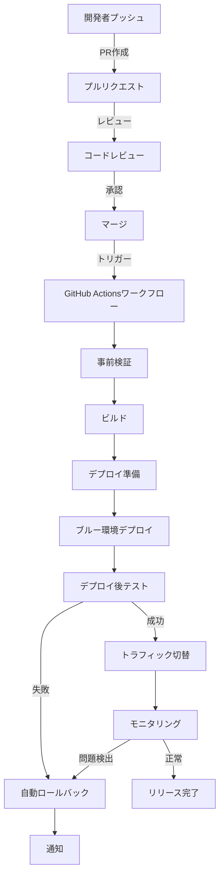
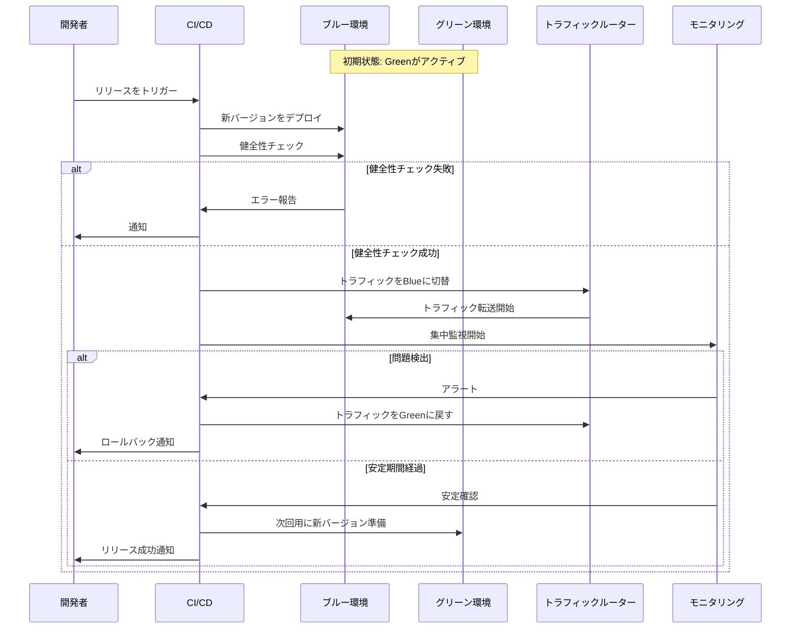
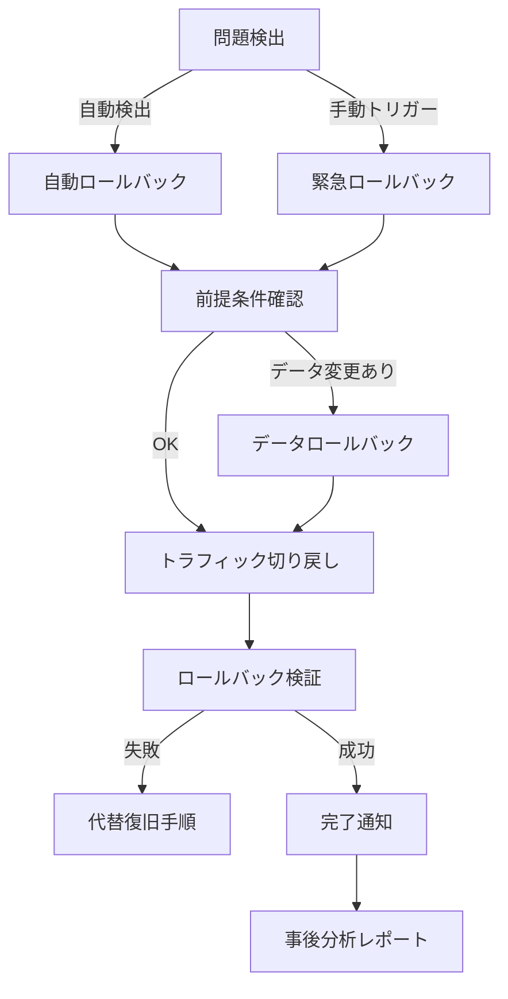

# OPS-DEPLOY-001.2: 本番リリース手順の自動化とロールバック対応

## 概要
練習表自動生成システムを本番環境へ安全かつ効率的にデプロイするための自動リリースパイプラインを構築し、問題発生時のロールバック手順を確立します。これにより、デプロイプロセスの効率化、エラー削減、リリース失敗時の迅速な復旧を実現します。

## 詳細
- 本番環境リリースプロセスの自動化
- デプロイ前の自動検証プロセス実装
- ブルー/グリーンデプロイメント戦略の採用
- ロールバック手順の確立と自動化
- リリースとロールバックのモニタリング設定

## 依存関係
- 親タスク: OPS-DEPLOY-001
- 先行タスク: OPS-DEPLOY-001.1（Vercel/Supabase本番環境・CI/CD構築）
- 関連タスク: OPS-INFRA-001.2（Supabase開発環境構築・テストDB設定）

## 参照ファイル
- [設計書/11i_実装指針_デプロイとインフラ.md](../../../../設計書/11i_実装指針_デプロイとインフラ.md)
- [設計書/11j_実装指針_CI_CD.md](../../../../設計書/11j_実装指針_CI_CD.md)
- [設計書/11k_実装指針_運用保守.md](../../../../設計書/11k_実装指針_運用保守.md)

## 成果物
- 本番リリース自動化スクリプト
- デプロイ前検証スクリプト
- ロールバックスクリプト
- デプロイモニタリング設定
- リリース手順書
- ロールバック手順書
- 障害対応フローチャート

## ステータス
- [x] 未開始
- [ ] 進行中
- [ ] レビュー中
- [ ] 完了

## 担当者
未割り当て

## 主要機能
1. **自動リリースパイプライン**
   - ブランチ保護によるリリース管理
   - マージによる自動デプロイトリガー
   - 段階的リリースプロセス
   - デプロイ状況通知
   - リリースアーティファクト管理

2. **デプロイ前検証**
   - 環境変数検証
   - 依存関係チェック
   - セキュリティスキャン
   - パフォーマンステスト
   - データベースマイグレーション検証

3. **ブルー/グリーンデプロイメント**
   - 冗長環境の管理
   - トラフィック切り替え制御
   - デプロイ後の健全性チェック
   - 切り替え判断ロジック
   - ロールバックポイント管理

4. **ロールバック自動化**
   - 障害検知ロジック
   - 自動ロールバックトリガー
   - ロールバック状況通知
   - データ整合性確保
   - 緊急ロールバックオプション

5. **デプロイモニタリング**
   - デプロイプロセス監視
   - パフォーマンス変化検出
   - エラーレート監視
   - ユーザー影響測定
   - アラート設定と通知

## 実装予定ファイル
以下は実装予定の全ファイルのリストです。各ファイルの役割と目的を簡潔に記載します。

- `.github/workflows/release.yml` - 本番リリースワークフロー定義
- `.github/workflows/deploy-verification.yml` - デプロイ前検証ワークフロー
- `.github/workflows/rollback.yml` - ロールバックワークフロー
- `scripts/deploy/pre-deploy-checks.sh` - デプロイ前検証スクリプト
- `scripts/deploy/verify-env-vars.js` - 環境変数検証スクリプト
- `scripts/deploy/verify-db-migrations.js` - DBマイグレーション検証
- `scripts/deploy/blue-green-deploy.sh` - ブルー/グリーンデプロイ実行
- `scripts/deploy/traffic-switch.js` - トラフィック切り替えスクリプト
- `scripts/deploy/health-check.js` - デプロイ後健全性チェック
- `scripts/rollback/auto-rollback.sh` - 自動ロールバック実行
- `scripts/rollback/data-consistency-check.js` - データ整合性確認
- `scripts/rollback/emergency-rollback.sh` - 緊急ロールバック実行
- `scripts/monitoring/deploy-monitor.js` - デプロイモニタリングスクリプト
- `scripts/monitoring/alert-setup.js` - アラート設定スクリプト
- `docs/release-procedure.md` - リリース手順書
- `docs/rollback-procedure.md` - ロールバック手順書
- `docs/incident-response.md` - 障害対応手順書

## 設計図
### リリースパイプライン全体図

### ブルー/グリーンデプロイメントフロー

### ロールバックプロセスフロー

## 実装アプローチ
### 自動リリースパイプライン
1. **デプロイトリガー設計**
   - mainブランチへのマージをトリガーとした自動デプロイ
   - リリースタグによる明示的デプロイオプション
   - 手動承認ステップの組み込み
   - 並行実行タスクの適切な同期

2. **段階的リリースフロー**
   - ステージング環境での事前検証
   - 本番環境の準備と検証
   - ブルー環境への安全なデプロイ
   - トラフィック切り替え判断と実行

3. **通知システム**
   - Slack/Discord/Teams統合
   - ステータス更新の自動通知
   - エラー詳細情報の添付
   - 担当者へのメンション機能

### デプロイ前検証
1. **環境検証アプローチ**
   - 必須環境変数の存在確認
   - シークレットの有効性検証
   - APIエンドポイントの整合性チェック
   - 依存サービスの接続性テスト

2. **セキュリティ検証**
   - 依存パッケージの脆弱性スキャン
   - シークレット漏洩チェック
   - アクセス権限検証
   - リソース制限確認

3. **テストサイト**
   - 主要機能の動作確認テスト
   - パフォーマンステスト
   - クロスブラウザテスト
   - アクセシビリティテスト

### ブルー/グリーンデプロイメント
1. **環境管理**
   - 冗長環境の自動プロビジョニング
   - 環境間の同期管理
   - リソース効率化設計
   - 環境メタデータ管理

2. **トラフィック制御**
   - 段階的トラフィック移行オプション
   - 異常検出時の自動切り戻し
   - セッション維持対策
   - 切り替え中のダウンタイム最小化

3. **健全性評価**
   - 複合健全性メトリクスの定義
   - ベースライン比較アルゴリズム
   - 異常検出しきい値の適切な設定
   - フェイルセーフ判断ロジック

### ロールバック自動化
1. **トリガーポイント**
   - エラーレート基準のトリガー
   - パフォーマンス低下トリガー
   - ユーザー影響度トリガー
   - 手動トリガーオプション

2. **データ整合性管理**
   - スキーマ変更対応策
   - データ変換ロジック
   - 整合性検証プロセス
   - 段階的データ復旧オプション

3. **完全性確保**
   - ロールバックプロセスの記録
   - 関連リソースの同期ロールバック
   - 依存サービスの状態検証
   - 外部統合の互換性確保

## 障害対応フローチャート概要
リリース後に発生する可能性のある障害に対する対応フローを定義します。

### 障害検知
- **自動検知**
  - エラーレート上昇
  - パフォーマンス低下
  - 異常なリソース使用
  - ユーザーエラー報告増加

- **手動検知**
  - ユーザーからの報告
  - 運用担当者の発見
  - モニタリングダッシュボード確認

### 初期対応
1. **影響評価**
   - 影響範囲の特定
   - 重大度の判定
   - ユーザー影響の見積り

2. **対応判断**
   - ロールバック実施判断
   - 修正デプロイ判断
   - 暫定対応判断

3. **実行と通知**
   - 選択した対応の実行
   - ステークホルダーへの通知
   - ユーザーへの影響と対応の通知

### 事後対応
1. **原因分析**
   - ログ分析と再現調査
   - 根本原因の特定
   - 再発防止策の検討

2. **プロセス改善**
   - テスト範囲の見直し
   - デプロイプロセスの改善
   - モニタリングの強化

3. **ドキュメント更新**
   - 障害報告書作成
   - 対応手順の更新
   - 知識ベースへの追加

## リリース手順書概要
リリースプロセスの各ステップを詳細に記載した手順書を作成します。

1. **準備フェーズ**
   - リリース内容の確認
   - 依存関係の検証
   - リリース計画の作成
   - ステークホルダーへの通知

2. **実行フェーズ**
   - ブランチ作成とPR提出
   - コードレビューとテスト
   - 自動デプロイの監視
   - トラフィック切り替え承認

3. **検証フェーズ**
   - デプロイ後の動作確認
   - 監視メトリクスの確認
   - ユーザーフィードバックの収集
   - 問題発生時の対応

4. **完了フェーズ**
   - リリース完了の宣言
   - 関連チケットのクローズ
   - リリースノートの公開
   - 振り返りと改善点の記録 