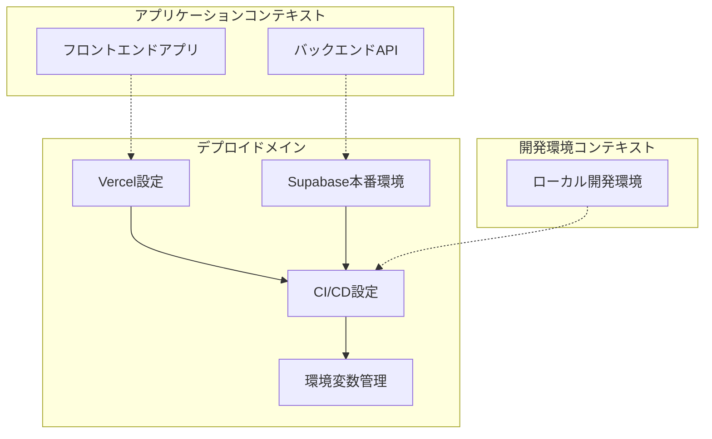
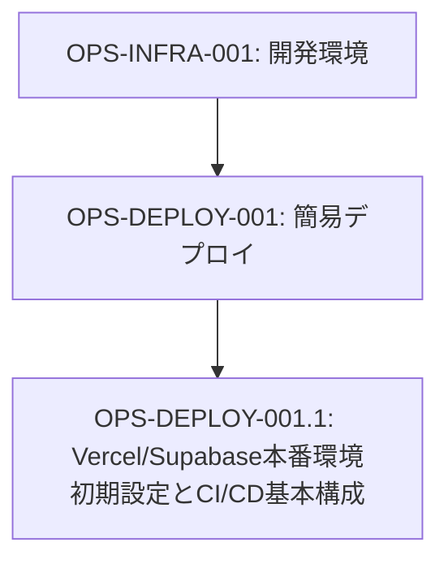
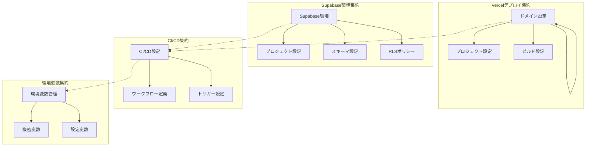
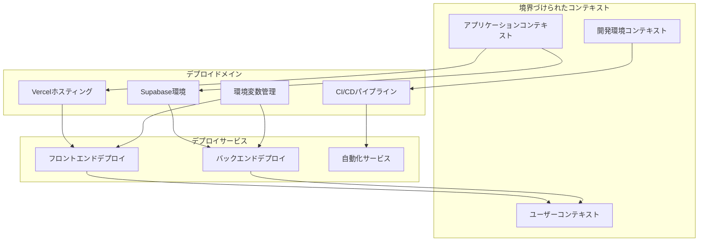

# OPS-DEPLOY-001: 簡易デプロイ

## ドメインの概要
簡易デプロイドメインは、練習表自動生成システムの本番環境への初期デプロイメントを実装します。Vercel/Supabase本番環境の初期設定とCI/CD基本構成の構築を通じて、自動化されたデプロイプロセスを確立し、安定したサービス提供環境を実現します。

## ドメインモデルと境界づけられたコンテキスト

## ユビキタス言語

| 用語 | 定義 |
|------|------|
| デプロイ | アプリケーションを実行環境へ配置する作業 |
| Vercel | フロントエンド特化型のホスティングとデプロイプラットフォーム |
| Supabase | PostgreSQL、認証、ストレージなどを提供するBaaS |
| CI/CD | 継続的インテグレーション/継続的デリバリー |
| 本番環境 | 実際のユーザーがアクセスする実行環境 |
| 環境変数 | アプリケーション設定を環境ごとに切り替えるための変数 |
| ビルドプロセス | ソースコードから実行可能ファイルを生成するプロセス |
| デプロイパイプライン | コードの更新から本番環境への反映までの自動化フロー |

## サブドメイン構成

## サブドメイン詳細

### OPS-DEPLOY-001.1: Vercel/Supabase本番環境初期設定とCI/CD基本構成
**ドメイン責務**: Vercel/Supabase本番環境を設定し、CI/CDパイプラインを構築する

**ドメインサービス**:
- Vercel環境管理（プロジェクト設定、ドメイン設定、ビルド設定）
- Supabase本番設定（プロジェクト作成、スキーマ適用、セキュリティ設定）
- CI/CD設定サービス（自動ビルド・デプロイ設定、テスト組込）
- 環境変数管理（機密情報、環境別設定の管理）

**ステータス**: 未開始

## コマンド・クエリ責務分離（CQRS）

### コマンド（書き込み操作）
- Vercelプロジェクト作成
- Supabase環境セットアップ
- CI/CDパイプライン設定
- 環境変数設定
- デプロイプロセス実行
- スキーママイグレーション適用

### クエリ（読み取り操作）
- デプロイ状態確認
- 環境変数参照
- ビルドログ取得
- デプロイ履歴確認
- 環境接続情報取得

## 集約と整合性境界

## 開発コンテキスト図

## 進捗管理

| サブドメイン | ステータス | 担当者 | 開始日 | 完了予定 | 実際の完了日 |
|------------|-----------|--------|-------|---------|------------|
| OPS-DEPLOY-001.1 | 未開始 | | | | |

## イベントストーミング

## 課題・リスク

- 開発環境と本番環境の差異による不具合
- 環境変数管理とセキュリティリスク
- デプロイ失敗時のロールバック戦略
- CI/CDパイプラインの安定性と信頼性
- フロントエンドとバックエンドのデプロイタイミング同期

## レビューポイント

- Vercel/Supabase設定の適切さ
- CI/CDパイプラインの効率性と安定性
- 環境変数管理の安全性
- デプロイプロセスの再現性
- ロールバック手順とディザスタリカバリ

## リファレンス

- [設計書/11i_実装指針_デプロイとインフラ.md](../../../設計書/11i_実装指針_デプロイとインフラ.md)
- [設計書/11f_実装指針_フロントエンド.md](../../../設計書/11f_実装指針_フロントエンド.md)
- [設計書/11g_実装指針_バックエンド.md](../../../設計書/11g_実装指針_バックエンド.md) 