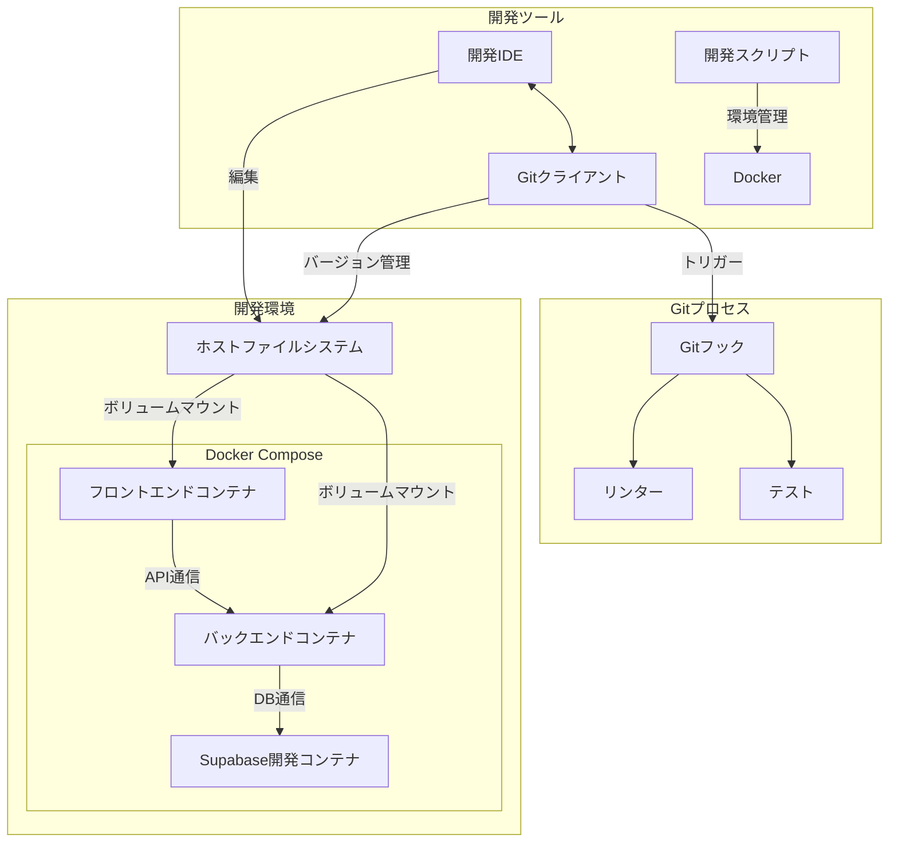
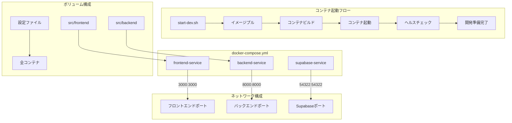

# OPS-INFRA-001.1: Docker開発環境セットアップとgit連携設定

## 概要
練習表自動生成システムの開発効率と環境一貫性を確保するため、Docker/Docker Composeを用いた開発環境の構築と、効率的な開発を実現するためのgit連携設定を行います。複数の開発者が同一の環境で開発できるようにし、「自分の環境では動くのに」という問題を解消します。

## 詳細
- Docker/Docker Composeによる開発環境構築
- 開発環境の自動起動・停止スクリプト作成
- Gitリポジトリの構成と運用ルールの設定
- Gitフックを活用した自動チェック機能実装
- 開発環境構築の手順書とトラブルシューティングガイド作成

## 依存関係
- 親タスク: OPS-INFRA-001
- なし（他のチケットに依存しない最初のタスク）

## 参照ファイル
- [設計書/11i_実装指針_デプロイとインフラ.md](../../../../設計書/11i_実装指針_デプロイとインフラ.md)
- [設計書/11g_実装指針_バックエンド.md](../../../../設計書/11g_実装指針_バックエンド.md)

## 成果物
- docker-compose.yml ファイル
- Dockerfileファイル（フロントエンド・バックエンド）
- 開発環境起動・停止スクリプト
- .gitignore 設定ファイル
- Git hooks スクリプト
- コミットメッセージテンプレート
- 環境構築手順書
- トラブルシューティングガイド

## ステータス
- [x] 未開始
- [ ] 進行中
- [ ] レビュー中
- [ ] 完了

## 担当者
未割り当て

## 主要機能
1. **Docker開発環境構築**
   - フロントエンド開発コンテナ（Node.js環境）
   - バックエンド開発コンテナ（Python環境）
   - ボリュームマウントによるコード変更の自動反映
   - 開発環境と本番環境の差異最小化設定
   - ホットリロード対応

2. **開発環境操作機能**
   - 環境初期化スクリプト
   - 起動・停止ワンコマンド実行
   - ログ確認簡易コマンド
   - コンテナシェルアクセス機能
   - 環境リセット機能

3. **Git連携機能**
   - コミット前リンター実行フック
   - コミットメッセージ形式チェックフック
   - ブランチ命名規則設定
   - プッシュ前テスト実行フック
   - 自動フォーマッター連携

## 実装予定ファイル
以下は実装予定の全ファイルのリストです。各ファイルの役割と目的を簡潔に記載します。

- `docker-compose.yml` - 開発環境全体の定義
- `docker/frontend/Dockerfile` - フロントエンド開発コンテナ定義
- `docker/backend/Dockerfile` - バックエンド開発コンテナ定義
- `docker/scripts/start-dev.sh` - 開発環境起動スクリプト
- `docker/scripts/stop-dev.sh` - 開発環境停止スクリプト
- `docker/scripts/reset-env.sh` - 開発環境リセットスクリプト
- `docker/scripts/logs.sh` - ログ確認ユーティリティ
- `.gitignore` - Git除外ファイル設定
- `.githooks/pre-commit` - コミット前実行フック
- `.githooks/commit-msg` - コミットメッセージ検証フック
- `.githooks/pre-push` - プッシュ前実行フック
- `.github/COMMIT_TEMPLATE.md` - コミットメッセージテンプレート
- `.github/PULL_REQUEST_TEMPLATE.md` - プルリクエストテンプレート
- `docs/dev-environment-setup.md` - 環境構築手順書
- `docs/troubleshooting.md` - トラブルシューティングガイド

## 設計図
### システム構成図


### Docker-Composeフロー図


## 実装アプローチ
### Docker環境構築
1. **マルチステージビルド設計**
   - 開発環境と本番環境で共通のベースイメージ利用
   - 開発時はボリュームマウントでホットリロード
   - 本番ビルドでは最適化された最小イメージ生成
   - ビルドキャッシュ最適化による高速ビルド

2. **Docker Compose設計**
   - サービス間の依存関係定義（起動順序制御）
   - 環境変数管理（.env分離と複数環境対応）
   - ネットワーク分離と適切なポート公開
   - ボリューム永続化設計（データ保持戦略）
   - ヘルスチェック組み込み

3. **スクリプト自動化**
   - シンプルなインターフェースによるコマンド実行
   - エラーハンドリングと復旧処理
   - 冪等性の確保（何度実行しても同じ結果）
   - OSに依存しない実行方法
   - 詳細ログ出力とサイレントモード

### Git連携設定
1. **GitHooksの実装**
   - リンターによるコード品質チェック
   - コミットメッセージフォーマット検証
   - インストール自動化（開発環境セットアップ時）
   - テスト実行によるコード品質保証
   - プッシュ前の最終検証

2. **ブランチ戦略とルール**
   - Git-flowベースのブランチモデル定義
   - ブランチ命名規則の強制
   - 保護ブランチの設定（main/develop）
   - マージリクエスト/プルリクエスト要件定義
   - レビュープロセスの組み込み

## 実装するスクリプト詳細
以下に各スクリプトファイルの詳細仕様を記載します。

### `docker/scripts/start-dev.sh`
**目的**: 開発環境を起動し、必要な初期設定を行うスクリプト

**処理内容**:
- docker-compose.ymlの存在確認
- 環境変数ファイル(.env)の確認と必要に応じたサンプルからの生成
- Docker Composeによるコンテナ起動
- ヘルスチェックによる起動完了確認
- 起動URLとアクセス方法の表示
- エラーハンドリングとトラブルシューティングガイダンス

**使用方法**:
```
./docker/scripts/start-dev.sh [--rebuild] [--verbose]
```

### `docker/scripts/stop-dev.sh`
**目的**: 開発環境を安全に停止するスクリプト

**処理内容**:
- 実行中のコンテナの確認
- Docker Composeによるコンテナ停止
- オプションによるボリュームやイメージの削除対応
- 停止結果の確認と表示

**使用方法**:
```
./docker/scripts/stop-dev.sh [--clean] [--remove-volumes]
```

### `.githooks/pre-commit`
**目的**: コミット前に実行される検証フック

**処理内容**:
- ステージングされた変更ファイルの取得
- ファイル種別に応じたリンター実行
  - JavaScriptファイル: ESLint
  - Pythonファイル: Flake8/Black
- コードフォーマットチェック
- 禁止パターン（コメントアウトされたコード、デバッグログなど）の検索
- ファイルサイズやパフォーマンス影響の大きい変更の警告
- 問題検出時のコミット中断とエラーメッセージ表示

**カスタマイズ**:
- `GITHOOKS_CONFIG.json`ファイルによる検証ルールのカスタマイズ
- スキップフラグ対応（緊急時のみ）:`git commit --no-verify`

### `.githooks/commit-msg`
**目的**: コミットメッセージのフォーマット検証フック

**処理内容**:
- コミットメッセージの読み取り
- メッセージフォーマットの検証
  - プレフィックス確認（feat:, fix:, docs:, style:, refactor:, test:, chore:）
  - タイトル行の長さ確認（最大72文字）
  - 内容記述の確認（必要に応じて）
- プレフィックスと作業内容の整合性確認
- 不適切な表現やプレースホルダーの検出
- 問題検出時のコミット中断とエラーメッセージ表示

**メッセージ形式**:
```
<type>[scope]: <description>

[optional body]

[optional footer]
```

## トラブルシューティングガイド概要
開発環境構築時に発生しうる主な問題と解決策をまとめます。

1. **Dockerインストール/起動問題**
   - WSL2連携問題（Windows）
   - リソース割り当て問題
   - 権限問題（Linux）

2. **ネットワーク関連問題**
   - ポート競合
   - コンテナ間通信問題
   - ホスト-コンテナ通信問題

3. **ボリュームマウント問題**
   - パス解決問題
   - 権限問題
   - パフォーマンス問題（特にWindows）

4. **Git連携問題**
   - フック実行権限問題
   - ブランチ切り替え時の環境差異
   - リモート連携問題

5. **環境固有問題**
   - OS特有の問題（Windows/macOS/Linux）
   - 低スペックマシンでの実行問題
   - IDEとの連携問題 