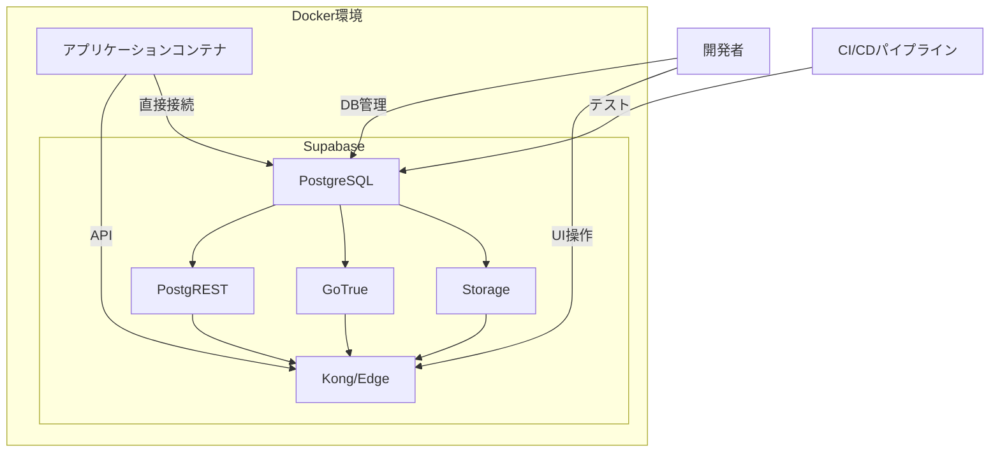
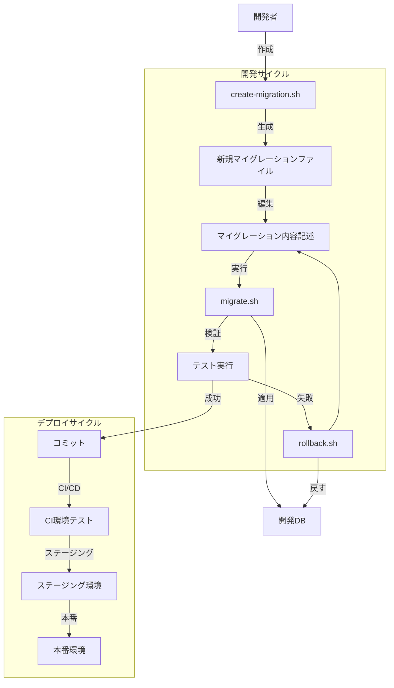
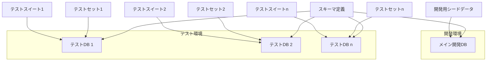

# OPS-INFRA-001.2: Supabase開発環境構築・テストDB設定

## 概要
練習表自動生成システムの開発においてSupabaseをローカル環境で実行し、データベーススキーマ管理とテスト用データベース環境を構築します。これにより本番環境に依存せずに開発とテストを進めることができ、CI/CDパイプラインの自動テストでも活用します。

## 詳細
- Supabaseローカル開発環境のDockerコンテナ設定
- データベーススキーマの自動適用機能実装
- マイグレーションスクリプト管理システム構築
- テスト用データベース環境構築と初期データ投入機能
- データベーステストユーティリティの実装

## 依存関係
- 親タスク: OPS-INFRA-001
- 先行タスク: OPS-INFRA-001.1（Docker開発環境セットアップ）
- 関連タスク: BACK-DB-001（データベース設計と実装）

## 参照ファイル
- [設計書/11i_実装指針_デプロイとインフラ.md](../../../../設計書/11i_実装指針_デプロイとインフラ.md)
- [設計書/11h_実装指針_データベース.md](../../../../設計書/11h_実装指針_データベース.md)
- [設計書/11g_実装指針_バックエンド.md](../../../../設計書/11g_実装指針_バックエンド.md)

## 成果物
- Supabase Docker設定ファイル
- データベースマイグレーションスクリプト
- スキーマ自動適用スクリプト
- テストデータ生成スクリプト
- テストデータベース初期化スクリプト
- データベーステストユーティリティ
- Supabase開発環境マニュアル

## ステータス
- [x] 未開始
- [ ] 進行中
- [ ] レビュー中
- [ ] 完了

## 担当者
未割り当て

## 主要機能
1. **Supabase開発環境構築**
   - Supabase Docker設定
   - PostgreSQLデータベース設定
   - Supabaseサービス連携設定
   - 環境変数管理
   - ローカルUIアクセス設定

2. **データベーススキーマ管理**
   - マイグレーションスクリプト管理
   - スキーマバージョン管理
   - スキーマ自動適用機能
   - ロールバック機能
   - スキーマ検証機能

3. **テストデータベース環境**
   - テストデータベース自動作成
   - テストデータ生成と投入
   - テストケース別データセット
   - データベースリセット機能
   - 並列テスト実行対応

4. **データベーステストサポート**
   - テスト用データベース接続ユーティリティ
   - トランザクション管理ヘルパー
   - データベースモック機能
   - データ比較ヘルパー
   - クリーンアップユーティリティ

## 実装予定ファイル
以下は実装予定の全ファイルのリストです。各ファイルの役割と目的を簡潔に記載します。

- `docker/supabase/docker-compose.yml` - Supabase開発環境設定
- `docker/supabase/Dockerfile.custom` - カスタム設定を含むSupabaseコンテナ定義
- `docker/supabase/env.sample` - Supabase環境変数サンプル
- `db/migrations/` - データベースマイグレーションスクリプトディレクトリ
- `db/migrations/000001_initial_schema.sql` - 初期スキーマ定義
- `db/migrations/000002_data_model_tables.sql` - データモデルテーブル定義
- `db/schema/` - データベーススキーマ定義ディレクトリ
- `db/schema/current.sql` - 現在のスキーマ定義
- `db/seeds/` - シードデータディレクトリ
- `db/seeds/development/` - 開発用シードデータ
- `db/seeds/test/` - テスト用シードデータ
- `scripts/db/migrate.sh` - マイグレーション実行スクリプト
- `scripts/db/rollback.sh` - ロールバック実行スクリプト
- `scripts/db/reset.sh` - データベースリセットスクリプト
- `scripts/db/seed.sh` - シードデータ投入スクリプト
- `scripts/db/create-migration.sh` - 新規マイグレーションファイル作成スクリプト
- `tests/db/conftest.py` - Pytestデータベーステスト設定
- `tests/db/helpers.py` - データベーステストヘルパー関数
- `tests/db/fixtures.py` - テスト用フィクスチャ
- `docs/supabase-local-dev.md` - Supabase開発環境マニュアル
- `docs/database-workflow.md` - データベース開発ワークフロー説明

## 設計図
### Supabase環境構成図



### データベースマイグレーションフロー



### テストデータベース構成



## 実装アプローチ
### Supabase環境構築
1. **コンテナ構成**
   - 公式Supabase Local Developmentイメージの活用
   - カスタム設定の注入による拡張
   - 本番環境との互換性確保
   - パフォーマンス最適化設定

2. **データベース接続管理**
   - 環境変数による接続情報の一元管理
   - セキュリティの確保（パスワード管理）
   - 複数環境切り替え機能（開発/テスト）
   - ネットワーク分離と適切なポート公開

3. **サービス連携**
   - Supabaseサービス間の連携設定
   - アプリケーションとの統合
   - 認証サービス設定
   - ストレージサービス設定

### データベーススキーマ管理
1. **マイグレーションシステム**
   - シンプルで拡張可能なマイグレーションフレームワーク設計
   - バージョン管理とタイムスタンプベース整理
   - マイグレーションメタデータテーブル
   - 依存関係解決機能

2. **スキーマ自動適用**
   - 起動時の自動マイグレーション実行オプション
   - スキーマ差分検出と適用
   - バージョン整合性チェック
   - 競合検出と解決支援

3. **マイグレーションファイル管理**
   - 命名規則の強制
   - 内容検証（シンタックスチェック）
   - ドキュメント化支援
   - 依存関係の明示

### テストデータベース環境
1. **テストデータベース管理**
   - 動的テストデータベース作成
   - テスト間のデータ分離
   - スキーマの一貫性確保
   - 高速リセット処理

2. **テストデータ生成**
   - ファクトリーパターン実装
   - 関連オブジェクトの自動生成
   - ランダムデータとシナリオベースデータの両対応
   - データ量スケーリング機能

3. **CI/CD連携**
   - CI環境でのテストデータベース自動構築
   - 並列テスト実行のサポート
   - ステータスレポート生成
   - 失敗時の診断情報収集

## マイグレーションファイル形式
すべてのマイグレーションファイルは以下の形式で実装します：

```sql
-- migration_name: 000001_initial_schema
-- description: 初期スキーマの作成
-- created_at: 2023-04-01 12:00:00
-- dependencies: none

-- !txn
-- ## ↑ トランザクションとして実行するマーカー

-- ===== UP =====
CREATE TABLE example_table (
    id UUID PRIMARY KEY DEFAULT gen_random_uuid(),
    name TEXT NOT NULL,
    created_at TIMESTAMPTZ NOT NULL DEFAULT now(),
    updated_at TIMESTAMPTZ NOT NULL DEFAULT now()
);

-- ===== DOWN =====
DROP TABLE IF EXISTS example_table;
```

## テストユーティリティ概要
テスト用データベースを操作するためのヘルパー関数やフィクスチャを提供します。

1. **データベース接続フィクスチャ**
   ```python
   @pytest.fixture
   def db_test_conn():
       """テスト用データベースへの接続を提供し、テスト終了後に自動クローズする"""
       # テスト用DBへの接続処理
       conn = create_test_db_connection()
       yield conn
       conn.close()
   ```

2. **トランザクションフィクスチャ**
   ```python
   @pytest.fixture
   def db_transaction(db_test_conn):
       """各テストをトランザクション内で実行し、自動ロールバックする"""
       conn = db_test_conn
       tx = conn.begin()
       yield conn
       tx.rollback()
   ```

3. **テストデータローダー**
   ```python
   def load_test_data(conn, dataset_name):
       """指定されたテストデータセットをロードする"""
       # データセットロード処理
   ```

## トラブルシューティングガイド概要
Supabase開発環境で発生しうる主な問題と解決策をまとめます。

1. **Supabase起動問題**
   - サービス依存関係エラー
   - ポート競合
   - データベース初期化エラー
   - メモリ不足

2. **データベース接続問題**
   - 認証情報エラー
   - ネットワーク接続問題
   - SSL設定問題
   - 権限エラー

3. **マイグレーション問題**
   - スキーマバージョン不一致
   - マイグレーション実行エラー
   - 依存関係解決エラー
   - ロールバック失敗

4. **テストデータベース問題**
   - テストDB作成失敗
   - テストデータロードエラー
   - テスト間の競合
   - テスト後のクリーンアップ失敗

5. **CI/CD統合問題**
   - CI環境での接続問題
   - 並列テスト競合
   - タイムアウト
   - リソース不足 
 