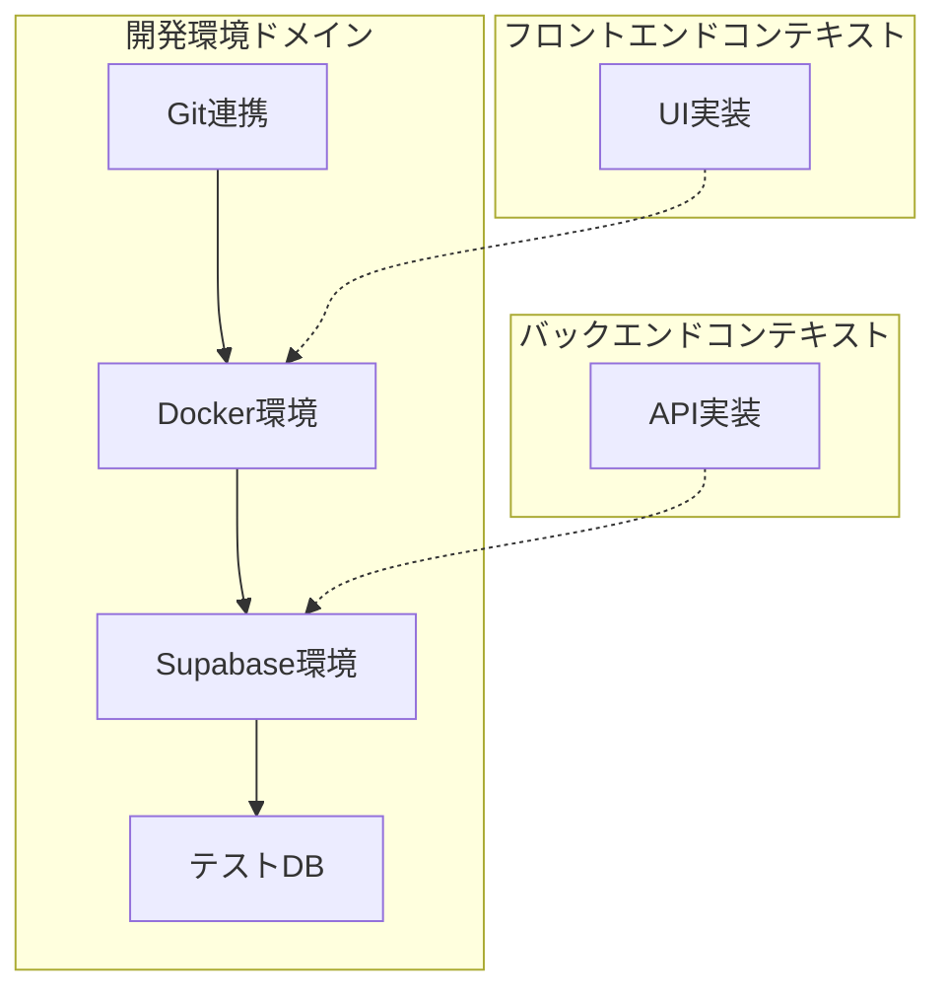
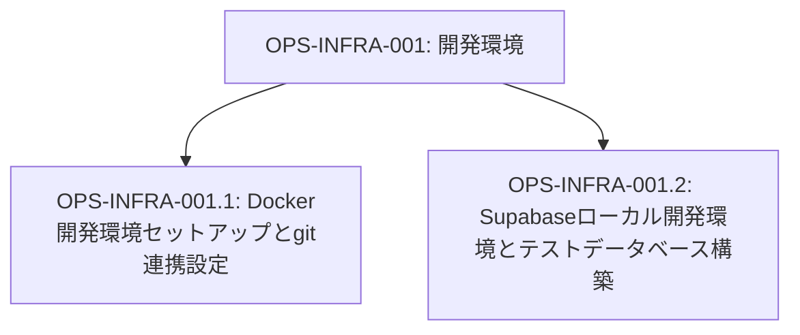
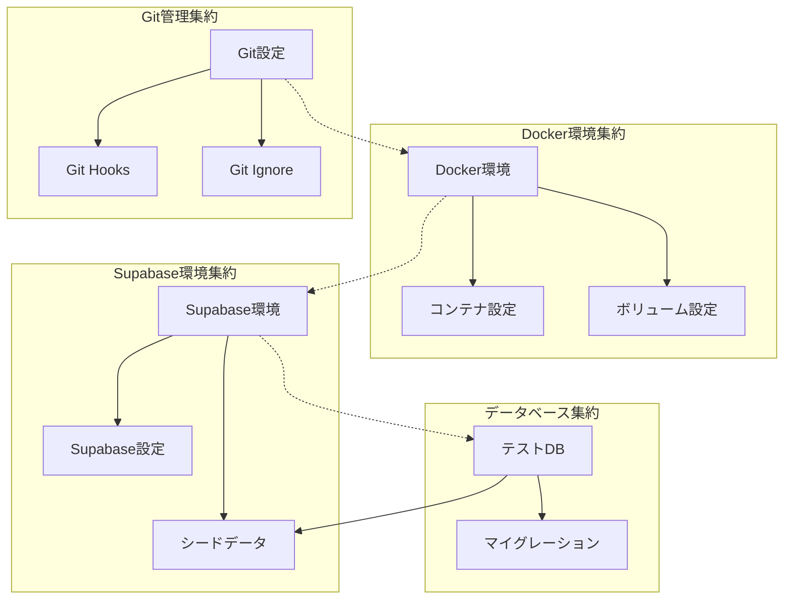
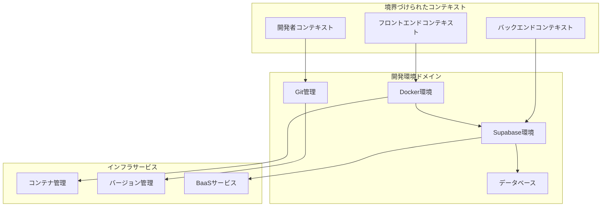

# OPS-INFRA-001: 開発環境

## ドメインの概要
開発環境ドメインは、練習表自動生成システムの開発に必要なローカル開発環境を構築し、効率的な開発ワークフローを確立します。Docker開発環境のセットアップとGit連携設定、Supabaseローカル開発環境とテストデータベースの構築を通じて、一貫性のある開発体験と効率的なコラボレーションを実現します。

## ドメインモデルと境界づけられたコンテキスト

## ユビキタス言語

| 用語 | 定義 |
|------|------|
| Docker | コンテナ化技術を使用したアプリケーション実行環境 |
| コンテナ | アプリケーションとその依存関係をパッケージ化した独立実行単位 |
| Git | 分散型バージョン管理システム |
| Supabase | PostgreSQL、認証、ストレージなどを提供するBaaS（Backend as a Service） |
| テストデータベース | 開発・テスト用の独立したデータベース環境 |
| 開発環境 | アプリケーション開発に使用するローカルセットアップ |
| マイグレーション | データベーススキーマの変更管理手法 |
| シードデータ | 開発・テスト用の初期データセット |

## サブドメイン構成

## サブドメイン詳細

### OPS-INFRA-001.1: Docker開発環境セットアップとgit連携設定
**ドメイン責務**: Dockerを使用した開発環境を構築し、Gitリポジトリとの連携設定を行う

**ドメインサービス**:
- Dockerコンテナ管理（環境構築、起動、停止、更新）
- Git設定管理（リポジトリ設定、フロー定義、フック設定）
- 共有設定サービス（共通設定ファイルの管理）

**ステータス**: 未開始

### OPS-INFRA-001.2: Supabaseローカル開発環境とテストデータベース構築
**ドメイン責務**: ローカルでのSupabase開発環境を構築し、テスト用データベースを設定する

**ドメインサービス**:
- Supabase環境管理（ローカルインスタンス構築、設定）
- データベース初期化サービス（スキーマ作成、シードデータ投入）
- 環境分離管理（開発・テスト環境の分離と切替）

**ステータス**: 未開始

## コマンド・クエリ責務分離（CQRS）

### コマンド（書き込み操作）
- Docker環境構築
- Git設定更新
- Supabase環境初期化
- データベーススキーマ作成
- シードデータ投入
- 環境変数設定

### クエリ（読み取り操作）
- 環境状態確認
- Docker状態確認
- Git設定参照
- Supabase接続情報取得
- データベース情報確認

## 集約と整合性境界

## 開発コンテキスト図

## 進捗管理

| サブドメイン | ステータス | 担当者 | 開始日 | 完了予定 | 実際の完了日 |
|------------|-----------|--------|-------|---------|------------|
| OPS-INFRA-001.1 | 未開始 | | | | |
| OPS-INFRA-001.2 | 未開始 | | | | |

## イベントストーミング

## 課題・リスク

- 複数OS環境（Windows/macOS/Linux）での一貫した動作保証
- Docker性能とホストマシンリソース消費
- Supabaseローカル環境と本番環境の差異管理
- 開発チーム間での環境の一貫性確保
- ネットワーク依存性とオフライン開発の可能性

## レビューポイント

- Docker設定の最適化（リソース使用量、起動速度）
- Git連携の効率性（ブランチ戦略、フック設定）
- Supabase環境の完全性（本番に近い環境の再現）
- データベース初期化の信頼性（確実なスキーマとデータ設定）
- 環境構築手順の明確さと再現性

## リファレンス

- [設計書/11i_実装指針_デプロイとインフラ.md](../../../設計書/11i_実装指針_デプロイとインフラ.md)
- [設計書/11g_実装指針_バックエンド.md](../../../設計書/11g_実装指針_バックエンド.md) 