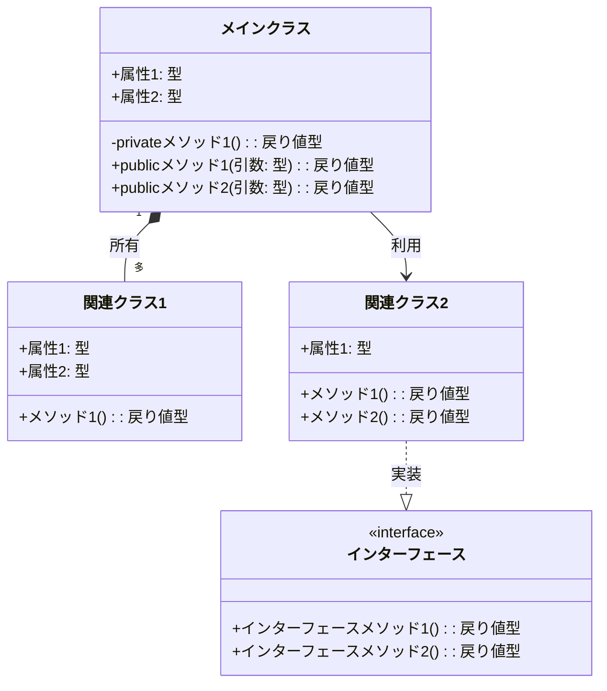
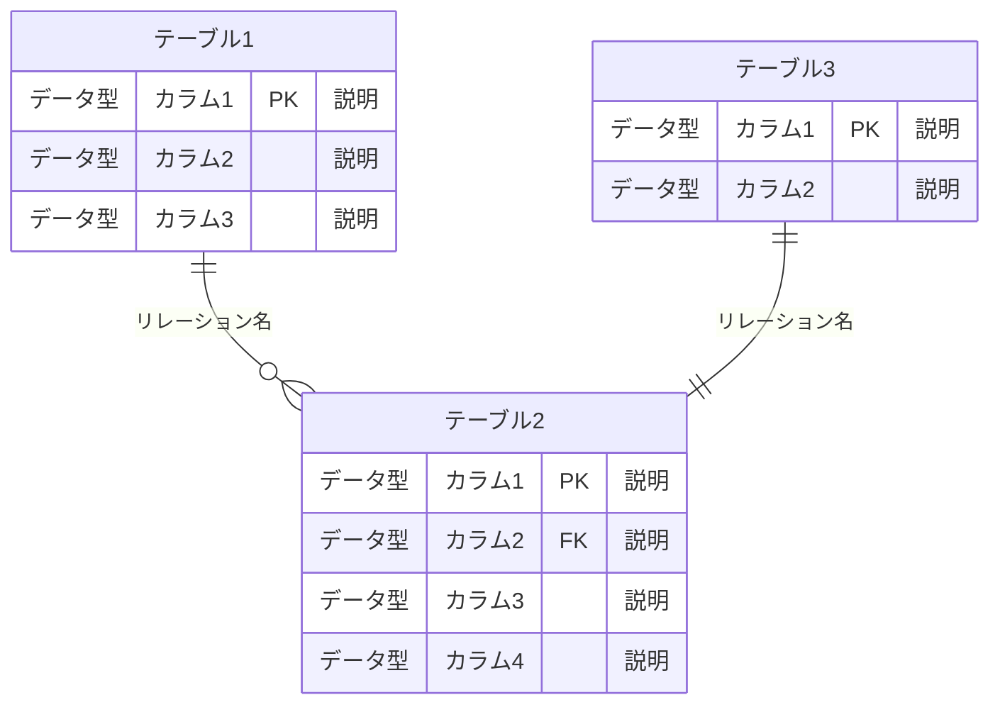
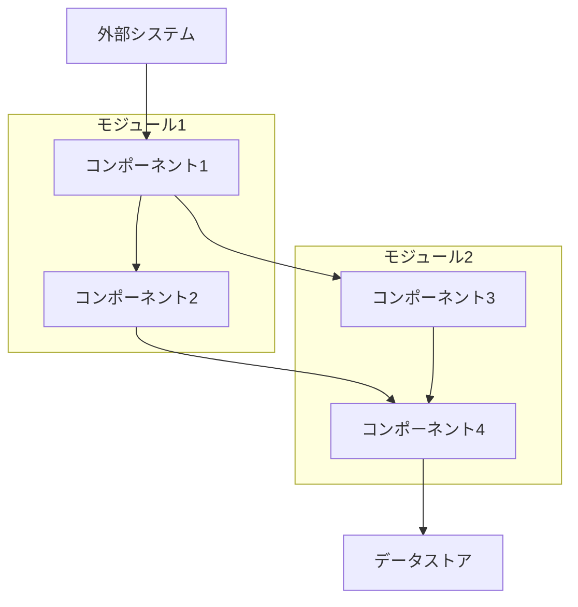

# 子チケットREADME作成手順書

## 概要
このドキュメントは、練習表自動生成システムにおける子チケット（サブタスク）のREADME.mdファイル作成の標準的な手順と構造を提供します。子チケットは親チケットを細分化したもので、具体的な実装タスクを定義します。このガイドに従うことで、プロジェクト全体の一貫性と管理効率を向上させます。

## ファイル配置
子チケットREADMEは以下のパスに配置します：
```
tickets/
  ├── [エリア]/
  │   ├── [親チケットID]/
  │   │   ├── README.md                     # 親チケット概要
  │   │   ├── [親チケットID.サブタスク番号]/  # 子チケット専用フォルダ
  │   │   │   ├── README.md                 # 子チケット概要（本ドキュメント）
  │   │   │   └── [関連ファイル]             # 子チケット固有のファイル
  │   │   └── [関連ファイル]                 # 親チケットに関連するファイル
```

## 命名規則
- 子チケットID: `[親チケットID].[連番]`（例：`ALGO-ROT-001.1`）
- 子チケットフォルダ名: `[親チケットID].[連番]`（例：`ALGO-ROT-001.1`）

## README.md テンプレート

```markdown
# [子チケットID]: [子チケットタイトル]

## 概要
[子チケットの目的と範囲を2〜3文で簡潔に説明します。具体的な機能や役割を明記し、システム全体における位置づけを明確にします。]

## 詳細
- [具体的な実装内容1]
- [具体的な実装内容2]
- [具体的な実装内容3]
- [具体的な実装内容4]
- [具体的な実装内容5]

## 依存関係
- 親タスク: [親チケットID]
- [依存する他のチケットID1]: [依存チケットの名称1]
- [依存する他のチケットID2]: [依存チケットの名称2]

## 参照ファイル
- [関連設計書へのリンク1]
- [関連設計書へのリンク2]
- [関連設計書へのリンク3]

## 成果物
- [成果物1]
- [成果物2]
- [成果物3]
- [成果物4]

## ステータス
- [ ] 未開始
- [ ] 進行中
- [ ] レビュー中
- [ ] 完了

## 担当者
[担当者名]

## 主要機能
1. **[機能カテゴリ1]**
   - [詳細機能1]
   - [詳細機能2]
   - [詳細機能3]
   - [詳細機能4]

2. **[機能カテゴリ2]**
   - [詳細機能1]
   - [詳細機能2]
   - [詳細機能3]
   - [詳細機能4]

3. **[機能カテゴリ3]**
   - [詳細機能1]
   - [詳細機能2]
   - [詳細機能3]
   - [詳細機能4]

## 実装予定ファイル
以下は実装予定の全ファイルのリストです。各ファイルの役割と目的を簡潔に記載します。

- `[ファイルパス1]` - [ファイル1の役割]
- `[ファイルパス2]` - [ファイル2の役割]
- `[ファイルパス3]` - [ファイル3の役割]
- `[ファイルパス4]` - [ファイル4の役割]
- `[ファイルパス5]` - [ファイル5の役割]
- `[テストファイルパス1]` - [テストファイル1の役割]
- `[テストファイルパス2]` - [テストファイル2の役割]

## 設計図
**注意**: このセクションは実装する機能によっては不要な場合があります。クラス設計、データベース設計、またはコンポーネント連携が含まれない実装では省略してください。必要な設計図のみを含め、関係のない図は作成しないでください。

### クラス図


### データベース構造図


### コンポーネント関係図


## 実装アプローチ
### [アプローチカテゴリ1]
1. **[フェーズ/ステップ1]**
   - [具体的な実装ステップ1]
   - [具体的な実装ステップ2]
   - [具体的な実装ステップ3]
   - [具体的な実装ステップ4]

2. **[フェーズ/ステップ2]**
   - [具体的な実装ステップ1]
   - [具体的な実装ステップ2]
   - [具体的な実装ステップ3]
   - [具体的な実装ステップ4]

### [アプローチカテゴリ2]
```
[実装アルゴリズムやコードの擬似コード]
```

## 実装するすべてのファイル構成詳細
以下は全ての実装予定ファイルの詳細です。各ファイルごとに目的とクラス/インターフェース、メソッド、依存関係などを詳しく記載します。

### `src/algorithm/rotation/qualificationManager.ts`
**目的**: 資格検証の中核機能を実装し、各メンバーの資格が特定のセッション要件に合致するかを判定する

**クラス/インターフェース**:
- `QualificationVerifier`: 資格検証の主要クラス
  - **継承/実装**: なし
  - **主要メソッド**: 
    - `verifyQualification(memberId: number, sessionId: number): QualificationResult` - メンバーの資格をセッション要件と照合
    - `findEligibleSupervisors(sessionId: number): Supervisor[]` - 特定セッションの監督候補者を抽出
    - `calculateScore(member: Member, requirements: QualificationRequirement): number` - 適合度スコアを計算
  - **依存クラス**: `QualificationRepository`, `MemberRepository`, `SessionRepository`

### `src/algorithm/rotation/requirementDefinition.ts`
**目的**: 各パートや練習内容に必要な資格要件を定義・管理する

**クラス/インターフェース**:
- `RequirementManager`: 資格要件管理クラス
  - **継承/実装**: なし
  - **主要メソッド**: 
    - `getSessionRequirements(sessionId: number): QualificationRequirement` - セッションの資格要件を取得
    - `defineRequirement(partId: number, qualifications: string[]): void` - パート別資格要件を定義
  - **依存クラス**: `DatabaseConnector`

- `QualificationRequirement`: 資格要件データモデル
  - **継承/実装**: なし
  - **主要メソッド**: なし（データモデル）
  - **依存クラス**: なし

### `src/algorithm/rotation/matchingEngine.ts`
**目的**: 監督候補者とセッションの最適なマッチングを行うアルゴリズムを実装

**クラス/インターフェース**:
- `MatchingEngine`: マッチングエンジンクラス
  - **継承/実装**: なし
  - **主要メソッド**: 
    - `generateMatches(sessions: Session[], members: Member[]): SupervisorAssignment[]` - 最適な監督者割り当てを生成
    - `optimizeAssignments(assignments: SupervisorAssignment[]): SupervisorAssignment[]` - 割り当てを最適化
  - **依存クラス**: `QualificationVerifier`, `RequirementManager`

### `src/algorithm/rotation/historyTracker.ts`
**目的**: 監督資格の履歴と使用状況を追跡・記録する

**クラス/インターフェース**:
- `QualificationHistoryTracker`: 資格履歴管理クラス
  - **継承/実装**: なし
  - **主要メソッド**: 
    - `recordUsage(memberId: number, qualificationId: number, sessionId: number): void` - 資格使用を記録
    - `getUsageHistory(memberId: number): QualificationUsage[]` - 資格使用履歴を取得
  - **依存クラス**: `DatabaseConnector`

### `src/algorithm/rotation/exceptionHandler.ts`
**目的**: 監督資格例外処理（一時的資格付与、特別承認など）の管理を行う

**クラス/インターフェース**:
- `QualificationExceptionHandler`: 資格例外処理クラス
  - **継承/実装**: なし
  - **主要メソッド**: 
    - `grantTemporaryQualification(memberId: number, qualificationId: number, expiry: Date): void` - 一時的資格を付与
    - `checkSpecialApproval(memberId: number, sessionId: number): boolean` - 特別承認を確認
  - **依存クラス**: `QualificationVerifier`, `DatabaseConnector`

### `src/algorithm/rotation/types/index.ts`
**目的**: システム全体で使用される型定義を一元管理する

**型定義**:
- `Qualification`: 資格情報の型定義
  - **プロパティ**: `id: number`, `name: string`, `level: number`, `description: string`
- `Member`: メンバー情報の型定義
  - **プロパティ**: `id: number`, `name: string`, `qualifications: Qualification[]`, `availability: Availability[]`
- `Session`: セッション情報の型定義
  - **プロパティ**: `id: number`, `name: string`, `date: Date`, `requiredQualifications: QualificationRequirement[]`
- `SupervisorAssignment`: 監督者割り当て情報の型定義
  - **プロパティ**: `sessionId: number`, `memberId: number`, `qualificationId: number`
- `QualificationUsage`: 資格使用履歴の型定義
  - **プロパティ**: `memberId: number`, `qualificationId: number`, `sessionId: number`, `date: Date`
- `QualificationResult`: 資格検証結果の型定義
  - **プロパティ**: `isEligible: boolean`, `score: number`, `missingQualifications: string[]`

### `src/algorithm/rotation/constants/index.ts`
**目的**: システム全体で使用される定数値を一元管理する

**定数定義**:
- `QUALIFICATION_LEVELS`: 資格レベル定数
  - **値**: `{ BEGINNER: 1, INTERMEDIATE: 2, ADVANCED: 3, EXPERT: 4 }`
- `MATCHING_PRIORITIES`: マッチング優先度定数
  - **値**: `{ HIGH: 3, MEDIUM: 2, LOW: 1 }`
- `SESSION_TYPES`: セッションタイプ定数
  - **値**: `{ REGULAR: 'regular', SPECIAL: 'special', INTENSIVE: 'intensive' }`
- `ERROR_CODES`: エラーコード定数
  - **値**: `{ INVALID_QUALIFICATION: 'ERR001', MISSING_MEMBER: 'ERR002', INVALID_SESSION: 'ERR003' }`
- `MAX_ASSIGNMENTS_PER_DAY`: 1日あたりの最大割り当て数
  - **値**: `3`

### `src/algorithm/rotation/utils/validationUtils.ts`
**目的**: 資格およびセッション関連の検証機能を提供するユーティリティ関数群

**関数**:
- `validateQualification(qualification: Qualification): boolean` - 資格情報の有効性を検証
- `validateMemberAvailability(memberId: number, sessionDate: Date): boolean` - メンバーの利用可能性を検証
- `checkRequirementCompatibility(requirement: QualificationRequirement, qualification: Qualification): boolean` - 要件と資格の互換性を確認
- `validateAssignmentConstraints(assignment: SupervisorAssignment): string[]` - 割り当ての制約条件を検証
- `formatValidationErrors(errors: string[]): FormattedError[]` - 検証エラーの書式設定

### `src/algorithm/rotation/config/qualificationConfig.ts`
**目的**: 資格関連の設定値やパラメータを管理する

**設定項目**:
- `QualificationSettings`: 資格設定オブジェクト
  - **プロパティ**: 
    - `expiry: { [qualificationId: number]: number }` - 資格の有効期限（日数）
    - `refreshRequirements: { [qualificationId: number]: string[] }` - 資格更新要件
    - `compatibilityMatrix: { [qualificationId: number]: number[] }` - 資格間の互換性マトリクス
- `DefaultScoreWeights`: スコア計算の重み付け設定
  - **プロパティ**: 
    - `experienceWeight: number` - 経験値の重み
    - `qualificationLevelWeight: number` - 資格レベルの重み
    - `lastUsedWeight: number` - 最終使用日の重み
- `ValidationThresholds`: 検証しきい値設定
  - **プロパティ**: 
    - `minimumScore: number` - 最小許容スコア
    - `warningThreshold: number` - 警告しきい値
    - `optimalAssignmentScore: number` - 最適割り当てスコア

### `tests/algorithm/rotation/qualificationManager.test.ts`
**目的**: 資格管理機能のユニットテストを実装

**テストケース**:
- `QualificationVerifier.verifyQualification()のテスト`
  - 有効な資格を持つメンバーの検証
  - 資格が不足しているメンバーの検証
  - 特別承認を持つメンバーの検証
  - 無効なメンバーIDまたはセッションIDの処理
- `QualificationVerifier.findEligibleSupervisors()のテスト`
  - 複数の候補者がいる場合の結果
  - 候補者がいない場合の結果
  - 資格レベルによるフィルタリング
- `QualificationVerifier.calculateScore()のテスト`
  - 適合度スコアの正確な計算
  - 境界値のテスト
  - 異なる重み付け設定の影響

### `tests/algorithm/rotation/matchingEngine.test.ts`
**目的**: マッチングエンジン機能のユニットテストを実装

**テストケース**:
- `MatchingEngine.generateMatches()のテスト`
  - 理想的な条件での割り当て生成
  - 利用可能なメンバーが不足している場合の処理
  - 資格要件が厳しい場合の処理
  - 大規模データセットでのパフォーマンス
- `MatchingEngine.optimizeAssignments()のテスト`
  - 負荷バランス最適化
  - メンバーの疲労度考慮
  - 割り当ての公平性
  - 制約条件下での最適化

## ファイル間クラス連携図
```mermaid
graph TD
    subgraph "qualificationManager.ts"
        QV[QualificationVerifier]
    end
    
    subgraph "requirementDefinition.ts"
        RM[RequirementManager]
        QR[QualificationRequirement]
    end
    
    subgraph "matchingEngine.ts"
        ME[MatchingEngine]
    end
    
    subgraph "historyTracker.ts"
        HT[QualificationHistoryTracker]
    end
    
    subgraph "exceptionHandler.ts"
        EH[QualificationExceptionHandler]
    end
    
    QV --> RM
    ME --> QV
    ME --> RM
    EH --> QV
    HT --> QV
    
    classDef main fill:#bbf,stroke:#333,stroke-width:2px;
    classDef model fill:#ddf,stroke:#333,stroke-width:1px;
    classDef util fill:#fdd,stroke:#333,stroke-width:1px;
    
    class QV,ME main;
    class QR model;
    class RM,HT,EH util;