```mermaid
flowchart LR
  %% ─────────────────────────────
  %% バリューチェーン：要点まとめ
  %% ─────────────────────────────

  subgraph RQ1[要件定義・設計]
    A0[/"論点コメント：\n・GenAIは要件定義から設計補助へ\n・UXやストーリー生成で加速\n・ただし説明責任と妥当性確保は人間に残る"/]
    A1["設計思考・UX設計とGenAIの応用"]
    A2["アジャイル内の役割再編"]
  end

  subgraph RQ2[実装]
    B0[/"論点コメント：\n・Copilot系で生産性↑（RCTや現場導入）\n・“どの案を採用するか”という新しい意思決定課題\n・熟練者×AIの補完は文脈依存"/]
    B1["Copilotによるコード生成"]
    B2["大規模導入事例（ZoomInfoなど）"]
    B3["OSS熟練開発者への影響"]
  end

  subgraph RQ3[テスト・レビュー]
    C0[/"論点コメント：\n・LLMによる自動テスト生成が実用段階\n・コードレビューの自動化で人間は例外検知に集中\n・検証設計が品質の中心へシフト"/]
    C1["自動テスト生成・改善"]
    C2["AIコードレビュー支援"]
  end

  subgraph RQ4[デプロイ・運用]
    D0[/"論点コメント：\n・チーム有効性や幸福度も含む多次元評価が必須\n・SPACE/DORAフレームで“速さだけでない生産性”を定量化"/]
    D1["チーム有効性研究"]
    D2["SPACEフレームワーク"]
  end

  subgraph RQ5[保守・継続改善]
    E0[/"論点コメント：\n・自律チーム化とフラット化で改善が持続\n・燃え尽き低減と協働の質が長期品質を決定"/]
    E1["自律組織モデル"]
    E2["ホラクラシー研究"]
    E3["燃え尽き低減の効果"]
  end

  subgraph TOP[開発手法の進化]
    F0[/"論点コメント：\n・Stage-GateはAI統合でゲート審査を強化\n・Agile-Stage-Gateで上流審査×下流反復を接続\n・方法論は“AI前提のプロセス基準”へ"/]
    F1["Stage-Gate理論の進化"]
    F2["Agile-Stage-Gate実証"]
    F3["ハイブリッド型の提案"]
  end

  subgraph BTM[意思決定・評価]
    G0[/"論点コメント：\n・AI推奨は強力だが“無監督運用は不可”\n・説明性（Narrative）が採否に影響\n・評価はプロセス×心理×成果の多軸で再設計"/]
    G1["AI推奨と人間の監督"]
    G2["Narrative AIの効果"]
    G3["SPACE・DORAによる評価指標"]
    G4["幸福度・満足度調査"]
  end

  subgraph RHS[組織・人材]
    H0[/"論点コメント：\n・クロス技能×T字型人材がAIと補完関係に\n・国内はDX人材不足と評価制度が課題"/]
    H1["アジャイル成熟度研究"]
    H2["スキルポートフォリオ設計"]
    H3["DX人材・評価制度"]
  end

  subgraph RISK[特例：セキュリティ]
    S0[/"論点コメント：\n・生成コードは別ゲートで監査必須\n・実装・テスト両工程で横断的に統制"/]
    S1["LLMのセキュリティ意識研究"]
  end

  %% 矢印
  RQ1 ==> RQ2 ==> RQ3 ==> RQ4 ==> RQ5
  TOP --> RQ1
  TOP --> RQ2
  TOP --> RQ3
  BTM --> RQ1
  BTM --> RQ2
  BTM --> RQ4
  RHS --> RQ2
  RHS --> RQ4
  RHS --> RQ5
  RISK -.-> RQ2
  RISK -.-> RQ3

  %% スタイル
  classDef chain fill:#FAFAFF,stroke:#4F46E5,stroke-width:1.5px,color:#111,border-radius:8px;
  classDef method fill:#EEF2FF,stroke:#6366F1,stroke-width:1.5px,color:#111,border-radius:8px;
  classDef decide fill:#F0FDF4,stroke:#22C55E,stroke-width:1.5px,color:#111,border-radius:8px;
  classDef org fill:#FFF7ED,stroke:#F59E0B,stroke-width:1.5px,color:#111,border-radius:8px;
  classDef risk fill:#FEF2F2,stroke:#EF4444,stroke-width:1.5px,color:#111,border-radius:8px;

  class RQ1,RQ2,RQ3,RQ4,RQ5,A0,B0,C0,D0,E0 chain;
  class F0,F1,F2,F3,TOP method;
  class G0,G1,G2,G3,G4,BTM decide;
  class H0,H1,H2,H3,RHS org;
  class S0,S1,RISK risk;

```

以下は、**練習表（スケジュール）生成システム**に必要な画面を、**利用者（一般ユーザ）／管理者（部・学年責任者等）／システム管理者**の三層で整理した提案です。

**実装状況**: ✅完了 🚧実装中 ❌未実装

# 1. 共通（全ロール共通）

* **サインイン／サインアップ**
  * メール・パスワード認証
    - フロントエンド: ❌未実装
    - バックエンド: ❌未実装
    - データベース: ✅完了（users, user_roles テーブル）
  * パスワード再設定
    - フロントエンド: ❌未実装
    - バックエンド: ❌未実装
    - データベース: ✅完了
  * SSO連携（Google/Microsoft）
    - フロントエンド: ❌未実装
    - バックエンド: ❌未実装
    - データベース: ❌未実装

* **ダッシュボード（ロール別メニュー出し分け）**
  * 今日～今週の練習・担当・施設予約のサマリ
    - フロントエンド: ❌未実装（画面骨格のみ）
    - バックエンド: ❌未実装
    - データベース: ✅完了（practice_schedules, sessions テーブル）
  * 未承認依頼数、通知バッジ
    - フロントエンド: ❌未実装
    - バックエンド: ❌未実装
    - データベース: ❌未実装
  * ロール別メニュー表示
    - フロントエンド: ✅完了
    - バックエンド: ❌未実装
    - データベース: ❌未実装

* **通知センター**
  * 承認結果、差戻し、施設衝突通知
    - フロントエンド: ❌未実装
    - バックエンド: ❌未実装
    - データベース: ❌未実装
  * メンバー未回答、生成完了通知
    - フロントエンド: ❌未実装
    - バックエンド: ❌未実装
    - データベース: ❌未実装
  * 通知履歴・既読管理
    - フロントエンド: ❌未実装
    - バックエンド: ❌未実装
    - データベース: ❌未実装

* **プロフィール／アカウント設定**
  * 氏名・所属・役割情報
    - フロントエンド: 🚧実装中（設定画面骨格のみ）
    - バックエンド: ✅完了（users API完備）
    - データベース: ✅完了（users, user_profiles テーブル）
  * 通知設定（Web/メール/LINE等）
    - フロントエンド: ❌未実装
    - バックエンド: ❌未実装
    - データベース: ❌未実装
  * パスワード変更
    - フロントエンド: ❌未実装
    - バックエンド: ❌未実装
    - データベース: ✅完了

---

# 2. 利用者（一般ユーザ）向け画面

1. **自分の予定カレンダー**
   * 週／月表示、担当（例：主役・裏方）・出欠
     - フロントエンド: ❌未実装
     - バックエンド: ❌未実装
     - データベース: ✅完了（practice_schedules, session_attendances テーブル）
   * 練習メニュー閲覧
     - フロントエンド: ❌未実装
     - バックエンド: ❌未実装
     - データベース: ✅完了（sessions テーブル）
   * 衝突（授業・バイト・他活動）ハイライト
     - フロントエンド: ❌未実装
     - バックエンド: ❌未実装
     - データベース: ❌未実装

2. **出欠・希望提出フォーム**
   * 期間一括提出、不可時間帯
     - フロントエンド: ❌未実装
     - バックエンド: ❌未実装
     - データベース: ✅完了（session_attendances テーブル）
   * 希望役割（例：舞可否、楽器種別）
     - フロントエンド: ❌未実装
     - バックエンド: ❌未実装
     - データベース: ✅完了（parts, member_assignments テーブル）
   * 負担回数上限・連続回避などの制約入力
     - フロントエンド: ❌未実装
     - バックエンド: ❌未実装
     - データベース: ❌未実装

3. **練習表ビュー（公開版）**
   * 決定スケジュールの閲覧、担当割、会場、備品
     - フロントエンド: 🚧実装中（練習表画面骨格のみ）
     - バックエンド: ❌未実装
     - データベース: ✅完了（practice_schedules, sessions, venues テーブル）
   * フィルタ（学年／役割／演目）
     - フロントエンド: ❌未実装
     - バックエンド: ❌未実装
     - データベース: ✅完了（parts, stages テーブル）
   * 印刷／CSV／Googleカレンダー連携
     - フロントエンド: ❌未実装
     - バックエンド: ❌未実装
     - データベース: ❌未実装

4. **調整リクエスト**
   * 代替要員募集、担当交換申請
     - フロントエンド: ❌未実装
     - バックエンド: ❌未実装
     - データベース: ❌未実装
   * 遅刻・早退申請
     - フロントエンド: ❌未実装
     - バックエンド: ❌未実装
     - データベース: ❌未実装
   * 管理者への質問・コメント
     - フロントエンド: ❌未実装
     - バックエンド: ❌未実装
     - データベース: ❌未実装

5. **資料庫**
   * 練習メニューPDF、演目別メモ
     - フロントエンド: ❌未実装
     - バックエンド: ❌未実装
     - データベース: ❌未実装
   * ルールの閲覧
     - フロントエンド: ❌未実装
     - バックエンド: ❌未実装
     - データベース: ❌未実装

---

# 3. 管理者（部・学年責任者等）向け画面

1. **練習表ジェネレータ（中核画面）**
   * 入力：期間、会場枠、演目／メニュー、必要人数・役割
     - フロントエンド: 🚧実装中（登録画面骨格のみ）
     - バックエンド: ❌未実装
     - データベース: ✅完了（practice_schedules, venues, parts テーブル）
   * 制約設定：公平性、連続回避、上限回数、スキル条件、施設制約
     - フロントエンド: ❌未実装
     - バックエンド: ❌未実装
     - データベース: ❌未実装
   * メンバー可用性インポート（出欠提出状況、学年・技能タグ）
     - フロントエンド: ❌未実装
     - バックエンド: ❌未実装
     - データベース: ✅完了（session_attendances, member_assignments テーブル）
   * 生成：案A/B/C（スコア表示：公平性・カバー率・移動コスト等）
     - フロントエンド: ❌未実装
     - バックエンド: ❌未実装
     - データベース: ❌未実装
   * 比較と採用、手修正（ドラッグ&ドロップ）、差分表示、履歴
     - フロントエンド: ❌未実装
     - バックエンド: ❌未実装
     - データベース: ❌未実装

2. **承認フロー**
   * 草案→一次承認→確定
     - フロントエンド: ❌未実装
     - バックエンド: ❌未実装
     - データベース: ❌未実装
   * 差戻しコメント、再生成
     - フロントエンド: ❌未実装
     - バックエンド: ❌未実装
     - データベース: ❌未実装
   * 承認者間の連携機能
     - フロントエンド: ❌未実装
     - バックエンド: ❌未実装
     - データベース: ❌未実装

3. **衝突・欠員解消コンソール**
   * 会場ダブルブッキング、必要人数未充足、スキル不足を自動検知
     - フロントエンド: ❌未実装
     - バックエンド: ❌未実装
     - データベース: ✅完了（venue_availability_rules テーブル）
   * 代替候補サジェスト
     - フロントエンド: ❌未実装
     - バックエンド: ❌未実装
     - データベース: ❌未実装
   * 募集通知の一括送信
     - フロントエンド: ❌未実装
     - バックエンド: ❌未実装
     - データベース: ❌未実装

4. **メンバー管理（権限内）**
   * 新入部員登録、技能タグ付与
     - フロントエンド: ❌未実装
     - バックエンド: ✅完了（users API完備）
     - データベース: ✅完了（users, members テーブル）
   * 舞可否・担当可能範囲の更新
     - フロントエンド: ❌未実装
     - バックエンド: ❌未実装
     - データベース: ✅完了（member_assignments テーブル）
   * パート配属・役割管理
     - フロントエンド: ❌未実装
     - バックエンド: ❌未実装
     - データベース: ✅完了（parts, member_assignments テーブル）

5. **テンプレート管理**
   * 週次テンプレ、試験期間テンプレ、合宿テンプレ
     - フロントエンド: 🚧実装中（テンプレート画面骨格のみ）
     - バックエンド: ❌未実装
     - データベース: ❌未実装
   * カスタムテンプレート作成・編集
     - フロントエンド: ❌未実装
     - バックエンド: ❌未実装
     - データベース: ❌未実装
   * テンプレート共有機能
     - フロントエンド: ❌未実装
     - バックエンド: ❌未実装
     - データベース: ❌未実装

6. **アナリティクス**
   * 参加率、担当配分の公平性
     - フロントエンド: ❌未実装
     - バックエンド: ❌未実装
     - データベース: ✅完了（session_attendances テーブル）
   * 遅刻・欠席傾向、施設稼働率
     - フロントエンド: ❌未実装
     - バックエンド: ❌未実装
     - データベース: ✅完了（venues テーブル）
   * レポート出力機能
     - フロントエンド: ❌未実装
     - バックエンド: ❌未実装
     - データベース: ❌未実装

7. **連絡・掲示**
   * 日別アナウンス
     - フロントエンド: ❌未実装
     - バックエンド: ❌未実装
     - データベース: ❌未実装
   * 当日変更のプッシュ通知
     - フロントエンド: ❌未実装
     - バックエンド: ❌未実装
     - データベース: ❌未実装
   * 一括メール配信
     - フロントエンド: ❌未実装
     - バックエンド: ❌未実装
     - データベース: ❌未実装

---

# 4. システム管理者（全体運用・設定）向け画面

1. **組織・ロール設定**
   * 組織階層、チーム・班、ロール（利用者／管理者／監督者）
     - フロントエンド: ❌未実装
     - バックエンド: ❌未実装
     - データベース: ✅完了（user_roles, departments テーブル）
   * 権限テンプレ、監査ログの保持期間
     - フロントエンド: ❌未実装
     - バックエンド: ❌未実装
     - データベース: ❌未実装
   * ロール継承設定
     - フロントエンド: ❌未実装
     - バックエンド: ❌未実装
     - データベース: ❌未実装

2. **マスタ設定**
   * 会場・備品・利用時間枠、演目マスタ、役割定義、技能タグ
     - フロントエンド: 🚧実装中（部屋設定画面骨格のみ）
     - バックエンド: ✅完了（venues API完備）
     - データベース: ✅完了（venues, stages, parts テーブル）
   * 公平性ルール・最適化パラメータの既定値
     - フロントエンド: ❌未実装
     - バックエンド: ❌未実装
     - データベース: ❌未実装
   * システム全体設定
     - フロントエンド: ❌未実装
     - バックエンド: ❌未実装
     - データベース: ❌未実装

3. **連携設定**
   * カレンダー（Google/Microsoft）、SSO、通知（メール・Webhook・LINE）
     - フロントエンド: ❌未実装
     - バックエンド: ❌未実装
     - データベース: ❌未実装
   * CSV/Google Sheets取り込みマッピング
     - フロントエンド: ❌未実装
     - バックエンド: ❌未実装
     - データベース: ❌未実装
   * 外部システム連携
     - フロントエンド: ❌未実装
     - バックエンド: ❌未実装
     - データベース: ❌未実装

4. **監査・ログ／変更履歴**
   * 誰がいつ何を変更したか、生成アルゴリズムのバージョン差分
     - フロントエンド: ❌未実装
     - バックエンド: ❌未実装
     - データベース: ❌未実装
   * ロールバック（確定版からの復元）
     - フロントエンド: ❌未実装
     - バックエンド: ❌未実装
     - データベース: ❌未実装
   * セキュリティログ管理
     - フロントエンド: ❌未実装
     - バックエンド: ❌未実装
     - データベース: ❌未実装

5. **品質・キュー監視**
   * ジョブ実行状況、失敗リトライ、レート制限
     - フロントエンド: ❌未実装
     - バックエンド: ❌未実装
     - データベース: ❌未実装
   * システム稼働状況監視
     - フロントエンド: ❌未実装
     - バックエンド: ❌未実装
     - データベース: ❌未実装
   * パフォーマンス分析
     - フロントエンド: ❌未実装
     - バックエンド: ❌未実装
     - データベース: ❌未実装

6. **バックアップ／エクスポート**
   * 学期単位の書き出し、退避、アーカイブ管理
     - フロントエンド: ❌未実装
     - バックエンド: ❌未実装
     - データベース: ❌未実装
   * データ移行・復旧機能
     - フロントエンド: ❌未実装
     - バックエンド: ❌未実装
     - データベース: ❌未実装
   * 定期バックアップ設定
     - フロントエンド: ❌未実装
     - バックエンド: ❌未実装
     - データベース: ❌未実装

7. **利用ポリシー／権限レビュー**
   * 休部・退部のアーカイブ、権限自動失効
     - フロントエンド: ❌未実装
     - バックエンド: ❌未実装
     - データベース: ❌未実装
   * コンプライアンス管理
     - フロントエンド: ❌未実装
     - バックエンド: ❌未実装
     - データベース: ❌未実装
   * アクセス権限の定期見直し
     - フロントエンド: ❌未実装
     - バックエンド: ❌未実装
     - データベース: ❌未実装

