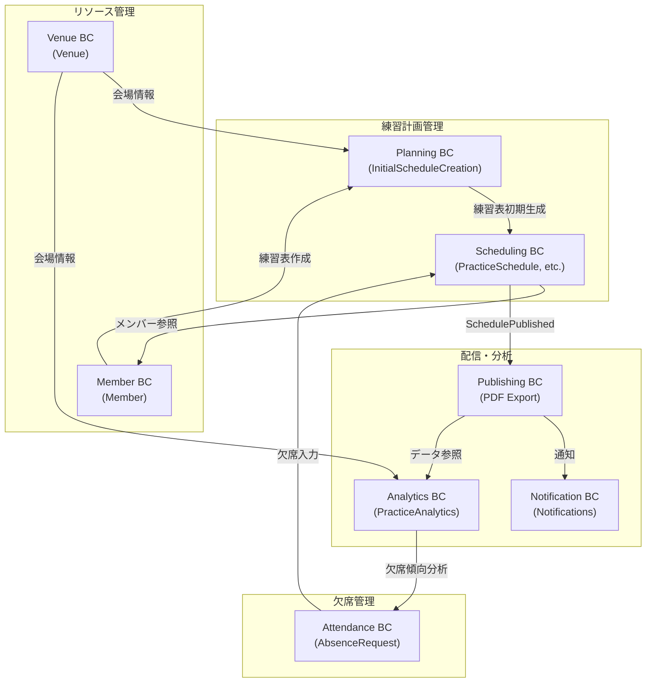

# 練習表自動生成システム 要件定義書（DDDベース）

## [査読済み]0. ドキュメントの目的
本書は、同志社大学能部が運用する「練習表」作成業務をドメイン駆動設計（DDD）のアプローチで分析し、効率化・公平性向上を実現するシステムの要件を定義する。開発者・ステークホルダー間の共通言語を確立し、今後の実装・テスト・運用フェーズの指針とする。

---

## [査読済み]1. ドメイン概要
- **現状課題**  
  1. 練習表の手動作成に平均◯時間/回を要し、担当者（こうすけさん）・部長に負荷が集中。  
  2. 直前欠席への再編成が困難で、質のばらつき・練習機会の逸失が発生。  
  3. 練習表共有が遅れ、部員への周知が練習直前になる。  
  4. 公平な監督者ローテーションが保証できない。  
  5. 権限管理が曖昧で、無許可変更による混乱リスクがある。

- **目標**  
  - 練習表作成・再生成時間を「秒〜数分」に短縮し、部長主導で即時共有可能にする。  
  - 欠席情報を反映した自動リスケジュールで、全員が等しく練習機会を得る。  
  - 監督者ローテ―ションをアルゴリズムで最適化し、公平性を担保。  
  - 閲覧／編集権限を分離し、変更履歴とバージョン管理を実装。  

---

## [査読済み]2. ステークホルダー
| 役割 | 主な関心事 | システム上の権限 |
|------|-----------|----------------|
| **部長 (ClubCaptain)** | 出欠入力・最終承認・共有 | Admin (作成・公開・編集・ロール設定) |
| **作成担当 (Scheduler)** | データ入力補助・初期草案 | Editor (作成・編集) |
| **部員 (Member)** | 練習内容確認・欠席連絡 | Viewer / AbsenceReporter (欠席登録) |
| **システム管理者 (ITAdmin)** | 運用・保守 | SysAdmin |

---

## [査読済み]3. ユビキタス言語
| 用語 | 定義 |
|------|------|
| **練習セッション (PracticeSession)** | 特定日時・会場で実施される1コマの練習単位 |
| **パート (Part)** | 謡、舞の役割別グループ、謡にリーダーがいる |
| **監督者 (Supervisor)** | パートを指導・監督する担当者 |
| **欠席リクエスト (AbsenceRequest)** | 部員が提出する欠席申請 |
| **タイムテーブル (ScheduleGrid)** | 縦軸：時間、横軸：練習場所の数のパートの配置表 |
| **再生成 (Reschedule)** | 欠席・会場変更等の入力をトリガに練習表を再計算する処理 |
| **公開 (Publish)** | 確定版をPDFにエクスポートする機能 |

---

## [査読済み]4. コンテキストマップ

### バウンデッドコンテキスト詳細

#### 練習計画管理
- **Planning BC**: 練習表の初期作成、基本スケジュールのテンプレート管理
- **Scheduling BC**: アルゴリズムによる練習表生成・再生成、制約条件の管理

#### リソース管理
- **Member BC**: メンバー情報の管理、パート所属、役割設定
- **Venue BC**: 会場情報の管理、利用可能時間の制御、設備管理

#### 欠席管理
- **Attendance BC**: 欠席申請の受理と状態管理、欠席履歴の追跡

#### 配信・分析
- **Publishing BC**: 確定版スケジュールのPDFエクスポートとバージョン管理、共有機能
- **Notification BC**: 練習表公開、欠席承認などの通知管理
- **Analytics BC**: 練習データの分析、統計情報の生成、最適化提案

---

## [査読済み]5. エンティティ & 値オブジェクト

### 5.1 エンティティ
| Entity | 識別子 | 主な属性 | 振る舞い |
|--------|-------|----------|----|
| **Member** | memberId | name, partType, email, joinDate, supervisorCapable, absenceCount, role, status | validateAbsenceRequest(), calculateSupervisionLoad(), updateRole(), checkAvailability() |
| **PracticeSession** | sessionId | date, venueId, timeSlot, part, supervisorId, attendees[], contentDescription, status, qualityScore | validateAttendees(), reassignSupervisor(), updateContent(), calculateQualityScore() |
| **PracticeSchedule** | scheduleId | version, generatedAt, sessions[], status, publishedBy, optimizationScore, constraints[], history[] | publish(), addSession(), removeSession(), recalculateOptimization(), validateConstraints() |
| **AbsenceRequest** | requestId | memberId, date, reason, status, alternativeDate, notificationSent, impactAnalysis | approve(), reject(), cancel(), reschedule(), analyzeImpact() |
| **Venue** | venueId | name, address, capacity, availableTimes[], simultaneousTeams, equipments[], restrictions[] | checkAvailability(), reserveTimeSlot(), calculateCapacityFor(part), validateEquipment() |
| **Part** | partId | name, requiredEquipment, minimumMembers, leaderIds[], practiceLevel, specialization[] | validateFormation(), assignLeader(), mergeParts(), calculatePracticeQuality() |
| **PracticeContent** | contentId | title, description, objectives[], requiredEquipment[], difficulty, targetLevel, estimatedDuration | validateRequirements(), calculateDifficulty(), checkEquipmentAvailability() |
| **SystemConfig** | configId | settings, validationRules, constraints, maintenanceSchedule, backupConfig | updateSettings(), validateRules(), scheduleMaintenance() |

### 5.2 値オブジェクト
- **TimeSlot** `(startTime, endTime, durationMinutes, breakTime, isRecurring)`
- **VenueCapacity** `(totalCapacity, simultaneousTeams, partCapacities{partId: capacity}, equipmentAvailability)`
- **RotationPolicy** `(algorithm, parameters{maxConsecutive, balanceThreshold, priorityMembers[], fairnessMetrics})`
- **Role** `(type:Admin/Editor/Viewer, permissions[], scope, restrictions[])`
- **Version** `(major, minor, patch, timestamp, changedBy, changeLog[])`
- **ScheduleStatus** `(status:Draft/Published/Archived, lastModified, modifiedBy, approvalChain[])`
- **PracticeContent** `(title, description, objectives[], requiredEquipment[], difficulty, targetAudience)`
- **AbsenceStatus** `(status:Pending/Approved/Rejected, reason, responseMessage, impactLevel)`
- **OptimizationScore** `(overallScore, fairnessScore, qualityScore, stabilityScore, constraintSatisfaction)`
- **MemberAvailability** `(memberId, availableDates[], preferredTimes[], restrictions[], priorityLevel)`
- **QualityMetrics** `(practiceQuality, attendanceRate, supervisionBalance, equipmentUtilization)`
- **AuditLog** `(action, timestamp, userId, targetEntity, changes[], reason)`
- **Notification** `(type, recipient, content, priority, status, deliveryAttempts)`
- **BackupConfig** `(schedule, retention, compression, encryption, location)`

---

## [査読済み]6. 集約と不変条件

### 6.1 PracticeSchedule Aggregate
- **ルート**: PracticeSchedule
- **エンティティ**: PracticeSession[], PracticeContent[]
- **値オブジェクト**: Version, ScheduleStatus, OptimizationScore, QualityMetrics
- **不変条件**:
  1. 同一 `TimeSlot` に同一 `Member` が複数セッションに登場しない
  2. `Venue.capacity` を超えるメンバー数を割り当てない
  3. 監督者ローテーション: 連続`n`回以上同一Supervisorを同一Partに割り当て不可 (n=2)
  4. `version` は公開時にインクリメントし、履歴を保持
  5. 各パートには最低1名の監督者が割り当てられている
  6. すべてのセッションに最低限必要な人数が割り当てられている
  7. 練習内容の難易度は参加メンバーの平均レベルに適合している
  8. 会場の設備要件は練習内容の要件を満たしている

### 6.2 Attendance Aggregate
- **ルート**: AbsenceRequest
- **値オブジェクト**: AbsenceStatus, TimeSlot, ImpactAnalysis
- **不変条件**:
  1. 同一メンバーの同一日の欠席申請は1件のみ
  2. 欠席申請は練習日の24時間前までのみ受付
  3. 連続3回を超える欠席は特別承認が必要
  4. 欠席取消は承認ステータスに関わらず可能
  5. 代替日の提案は有効な練習日でなければならない
  6. 欠席による影響分析は自動的に実行される
  7. 欠席理由は必須項目として記録される

### 6.3 Member Aggregate
- **ルート**: Member
- **値オブジェクト**: Role, MemberAvailability, QualityMetrics
- **不変条件**:
  1. パート所属は必ず1つ以上
  2. 監督者資格のないメンバーは監督者として割り当てられない
  3. 同一パートのリーダーは最大2名まで
  4. 欠席回数は毎月リセットされ、統計として保持
  5. メンバーの役割変更は履歴として記録される
  6. メンバーのステータス（有効/無効）は管理者のみ変更可能

### 6.4 Venue Aggregate
- **ルート**: Venue
- **値オブジェクト**: VenueCapacity, EquipmentStatus
- **不変条件**:
  1. 同一時間帯の予約は `simultaneousTeams` を超えない
  2. 利用可能時間外の予約はできない
  3. 各パートの必須設備が揃っていないとそのパートの練習はできない
  4. 会場の設備状態は定期的に更新される
  5. 会場の利用制限は事前に設定されたルールに従う

### 6.5 SystemConfig Aggregate
- **ルート**: SystemConfig
- **値オブジェクト**: BackupConfig, AuditLog
- **不変条件**:
  1. システム設定の変更は管理者権限が必要
  2. 設定変更は監査ログに記録される
  3. バックアップ設定は最低週1回の実行を保証
  4. バリデーションルールは整合性が保たれている
  5. メンテナンススケジュールは利用時間外に設定

---

## [査読済み]7. ドメインサービス
| サービス | 責務 | 主要メソッド |
|----------|------|------------|
| **PlanningService** | 練習表の初期作成と基本計画管理 | createBasePlan(), managePracticeTemplates(), applyTemplates(), defineConstraints() |
| **ScheduleGenerator** | 出席者一覧と会場制約から最適スケジュールを生成 | generateOptimalSchedule(), evaluateScheduleQuality(), applyConstraints(), optimizeResourceUsage() |
| **Rescheduler** | AbsenceRequest をトリガに再生成 | recalculateWithAbsences(), minimizeChanges(), prioritizeParts(), analyzeImpact() |
| **RotationEngine** | 監督者配置を公平に計算 | assignSupervisors(), calculateFairnessScore(), optimizeRotation(), detectBias() |
| **ConflictDetector** | 制約違反を検出 | detectTimeConflicts(), checkCapacityViolations(), validateRotationRules(), checkEquipmentConflicts() |
| **AbsenceManager** | 欠席申請の処理と影響分析 | processRequest(), analyzeImpact(), suggestAlternatives(), notifyStakeholders(), trackAbsencePatterns() |
| **QualityAssurance** | 練習の質を評価・保証 | evaluatePracticeQuality(), recommendImprovements(), trackQualityTrends(), validateContentDifficulty() |
| **VenueAllocator** | 会場の最適割り当て | allocateVenues(), optimizeSpaceUsage(), handleVenueChanges(), checkEquipmentAvailability() |
| **MemberBalancer** | パート間のメンバーバランス調整 | balancePartSizes(), suggestTransfers(), evaluateDistribution(), calculateSkillGaps() |
| **PermissionEnforcer** | 権限とアクセス制御 | validateAccess(), enforceEditRules(), auditChanges(), manageVersions(), trackUserActions() |
| **PracticeAnalytics** | 練習データの分析 | analyzeTrends(), generateInsights(), recommendOptimizations(), predictAttendance() |
| **NotificationService** | 通知の管理と配信 | sendNotification(), scheduleReminders(), trackDeliveryStatus(), handleFailures() |
| **BackupManager** | データバックアップと復元 | scheduleBackups(), performBackup(), verifyBackup(), restoreData() |
| **AuditLogger** | システム操作の監査 | logAction(), trackChanges(), generateReports(), detectAnomalies() |
| **ContentManager** | 練習内容の管理 | validateContent(), suggestImprovements(), trackProgress(), adjustDifficulty() |
| **MaintenanceScheduler** | システムメンテナンスの管理 | scheduleMaintenance(), notifyUsers(), trackStatus(), handleEmergencies() |

---

## [査読済み]8. アプリケーションサービス (ユースケース)

### 8.1 初期スケジュール計画
1. **基本計画管理**
   - **CreateBasePlan(academicTerm, practiceGoals)**
     - 入力: 学期、練習目標
     - 振る舞い: `PlanningService` → 基本練習計画テンプレートの作成
     - 出力: 学期ごとの練習計画テンプレート
   - **ManagePracticeTemplates(practiceTemplates)**
     - 練習内容テンプレートの管理（パート別練習内容）
     - テンプレートの保存と再利用

2. **練習表初期作成**
   - **GenerateInitialSchedule(dateRange, venues, members, templates)**
     - 入力: 日程範囲、会場リスト、対象メンバー、練習テンプレート
     - 振る舞い: `PlanningService` → `ScheduleGenerator` の初期生成
     - 出力: 初期練習表案（未最適化）
   - **ApplyPracticeConstraints(scheduleId, constraints)**
     - パート別特殊要件の適用
     - 連続練習制限など時間的制約の適用

### 8.2 スケジュール管理
1. **スケジュール最適化・管理**
   - **OptimizeSchedule(scheduleId, optimizationParams)**
     - 入力: 初期スケジュールID、最適化パラメータ
     - 振る舞い: `ScheduleGenerator` → 最適化 → `PracticeSchedule` 保存（status = Draft）
     - 出力: 最適化スコア付きの練習表ドラフト
   - **UpdateSchedule(scheduleId, changes)**
     - 変更内容をバリデーション → `ConflictDetector` → 変更適用
     - 変更影響の分析と表示
   - **PublishSchedule(scheduleId)**
     - Adminのみ許可、状態を Published に変更
     - PDFエクスポート実行、バージョン管理
     - `NotificationService` → メンバーへの通知
   - **CloneSchedule(sourceScheduleId, targetDateRange)**
     - 既存スケジュールをテンプレートとして新規作成
     - 監督者ローテーションは自動調整

2. **練習表検索・閲覧**
   - **SearchSchedules(criteria)**
     - 日付、会場、パート等による検索
     - バージョン別の履歴表示
   - **ViewPersonalSchedule(memberId, dateRange)**
     - メンバー個人向けカスタマイズされた練習表表示
     - モバイル最適化ビュー

### 8.3 欠席管理
1. **欠席申請ワークフロー**
   - **SubmitAbsence(request)**
     - 入力: 欠席日時、理由、代替希望
     - バリデーション（期限、回数上限）
     - `AbsenceManager` → `AbsenceRequest` 保存 
     - 承認が必要なケースを自動判別
   - **ProcessAbsenceImpact(requestId)**
     - `Rescheduler` → 影響分析
     - 影響度に応じた承認フロー振り分け
     - 自動・手動承認の判断
   - **ApproveAbsence(requestId)**
     - 管理者による承認処理
     - スケジュール再生成のトリガー
     - `NotificationService` → 申請者への通知
   - **CancelAbsence(requestId, reason)**
     - 欠席取消処理と影響の最小化
     - スケジュール再調整必要性の判断

2. **欠席履歴管理**
   - **ViewAbsenceHistory(memberId, dateRange)**
     - 欠席履歴と統計表示
     - 欠席パターン分析（オプション）
   - **GenerateAbsenceAnalytics(filters)**
     - パート別、時期別の欠席傾向分析
     - 問題パターンの検出と警告

### 8.4 監督者管理
1. **監督者割り当て**
   - **AssignSupervisors(scheduleId)**
     - `RotationEngine` による自動割り当て
     - 公平性スコアの評価と表示
   - **OverrideSupervisor(sessionId, newSupervisorId)**
     - 手動割り当て（管理者権限）
     - 変更理由の記録と履歴保存
   - **ViewSupervisionStats(dateRange)**
     - 監督回数と公平性の統計表示
     - マンネリ化リスクの検出
   - **GenerateRotationPlan(months)**
     - 長期的な監督者ローテーション計画の作成
     - 公平性指標のシミュレーション

2. **監督品質管理**
   - **EvaluateSupervisorPerformance(supervisorId, criteria)**
     - 監督者の指導品質の評価
     - フィードバック収集と改善提案
   - **MatchSupervisorToContent(supervisorId, contentType)**
     - 監督者の専門性と練習内容のマッチング
     - 最適配置の提案

### 8.5 会場管理
1. **会場情報管理**
   - **RegisterVenue(venueDetails)**
     - 会場情報の登録・更新
     - 利用可能時間と制約の設定
     - 設備情報の登録
   - **CheckVenueAvailability(date, timeSlot)**
     - 利用可能会場の検索
     - 収容人数と適合性の確認
   - **ReassignVenue(sessionId, newVenueId)**
     - 会場変更と影響セッションの調整
     - `NotificationService` → 変更通知の発行

2. **会場最適化**
   - **OptimizeVenueUsage(dateRange)**
     - 会場利用の効率性分析
     - 最適配置の提案
   - **PredictVenueNeeds(futureRange)**
     - 将来的な会場需要予測
     - キャパシティプランニング

### 8.6 メンバー管理
1. **メンバー情報管理**
   - **RegisterMember(memberDetails)**
     - メンバー情報の登録・更新
     - パート所属と権限の設定
   - **AssignRole(memberId, role)**
     - 役割の割り当てと権限の自動設定
     - 監査ログへの記録
   - **TransferPart(memberId, newPartId)**
     - パート移動と影響の評価
     - 練習表への影響分析

2. **メンバー分析**
   - **AnalyzeMemberParticipation(memberId, dateRange)**
     - 参加率・欠席パターンの分析
     - 問題傾向の検出
   - **EvaluatePartBalance()**
     - パート間のメンバーバランス分析
     - 移籍提案の生成

### 8.7 システム管理
1. **設定管理**
   - **UpdateSystemConfig(configParams)**
     - システム設定の更新
     - バリデーションルールの管理
   - **ManageBackupSchedule(backupParams)**
     - バックアップスケジュールの設定
     - 復元ポイントの管理

2. **監査・セキュリティ**
   - **ViewAuditLog(filters)**
     - 操作ログの閲覧・検索
     - セキュリティイベントの分析
   - **ManagePermissions(roleId, permissions)**
     - 権限設定の詳細管理
     - アクセス制御ポリシーの更新

### 9.8 通知管理機能
1. **通知設定**
   - 通知チャネルの設定（メール、プッシュ通知、アプリ内通知）
   - 通知イベントの設定（練習表公開、欠席承認、会場変更など）
   - 通知頻度と優先度の設定

2. **通知配信**
   - リアルタイム通知
   - 定期通知（リマインダー）
   - 一括通知（練習表公開時）

3. **通知履歴**
   - 通知履歴の表示と検索
   - 既読/未読管理
   - 通知の再送機能

---

## [査読済み]9. 機能要件詳細

### 9.1 練習表管理機能
1. **練習表作成・編集**
   - 練習日時、会場、パートの設定
   - 監督者の割り当て
   - 練習内容の記入
   - ドラフト版の保存と編集
   - 確定版のPDFエクスポート

2. **練習表閲覧**
   - 日付範囲指定による検索

### 9.2 欠席管理機能
1. **欠席登録**
   - 欠席日時の選択
   - 欠席理由の入力
   - 登録期限（24時間前）のチェック

2. **出席 / 欠席履歴管理(管理者向け)**
   - 個人別出席 / 欠席履歴の表示
   - 期間指定による履歴検索
   - 欠席理由の集計・分析
   - 管理者向け全員の出席 / 欠席履歴表示

3. **欠席取消**
   - 登録済み欠席の取消申請
   - 取消理由の入力
   - 取消期限の設定
   - 取消履歴の記録

### 9.3 監督者管理機能
1. **監督者割り当て**
   - 手動割り当て
   - 連続割り当て制限（2回まで）
   - パート別の監督者設定

2. **監督者スケジュール**
   - 担当回数の集計
   - 監督者不在時の代替者設定

3. **公平性評価ダッシュボード**
   - 監督者の担当回数グラフ表示
   - パート別監督回数バランス分析
   - 過去n回分の偏り検出アラート
   - マンネリ化防止のためのローテーション最適化提案

### 9.4 会場管理機能
1. **会場設定**
   - 会場情報の登録・編集
   - 収容人数の設定
   - 同時開催可能チーム数の設定
   - 会場利用可能時間の設定

2. **会場スケジュール**
   - 会場別の利用予定表示

### 9.5 権限管理機能
1. **ユーザー管理**
   - ユーザー登録・編集
   - ロール（役割）の割り当て
   - パート所属の設定
   - アカウントの有効/無効設定

2. **アクセス制御**
   - 機能別の権限設定

### 9.6 データ管理機能
1. **バックアップ・リストア**
   - 定期的なデータバックアップ
   - バックアップからのリストア
   - バージョン管理
   - データ整合性チェック

2. **データエクスポート**
   - 練習表のPDFエクスポート

### 9.7 システム管理機能
1. **システム設定**
   - 基本設定（練習時間、休日設定など）
   - バリデーションルールの設定

2. **メンテナンス**
   - エラーログの分析

### 9.8 通知管理機能
1. **通知設定**
   - 通知チャネルの設定（メール、プッシュ通知、アプリ内通知）
   - 通知イベントの設定（練習表公開、欠席承認、会場変更など）
   - 通知頻度と優先度の設定

2. **通知配信**
   - リアルタイム通知
   - 定期通知（リマインダー）
   - 一括通知（練習表公開時）

3. **通知履歴**
   - 通知履歴の表示と検索
   - 既読/未読管理
   - 通知の再送機能

---

## [査読済み]10. 非機能要件

### 10.1 パフォーマンス要件
| 要件 | 詳細 |
|------|------|
| **レスポンス時間** | 練習表表示: 1秒以内、PDF生成: 3秒以内 |
| **再生成時間** | 欠席3名までなら 5 秒以内、10名でも 30 秒以内に再生成 |
| **最適化計算** | 初期スケジュール最適化: 最大 60 秒以内 |
| **バッチ処理** | 日次統計処理: 5分以内、月次分析: 30分以内 |

### 10.2 即時性・リアルタイム性
| 要件 | 詳細 |
|------|------|
| **欠席処理** | 欠席登録から再スケジュールまで10秒以内、共有まで30秒以内 |
| **通知配信** | 練習表公開から通知まで 30 秒以内 |
| **同時編集** | 複数管理者による同時編集の衝突検出と解決（最終更新優先） |
| **リアルタイム表示** | 練習表変更の即時反映（WebSocketによる） |

### 10.3 品質保証
| 要件 | 詳細 |
|------|------|
| **練習質保証** | 欠席者発生時も練習の質を90%以上維持（パート練習の重要度スコアリングによる） |
| **公平性アルゴリズム** | 監督者配置の公平性スコア95%以上（各メンバーの監督回数の標準偏差≤1.0） |
| **アルゴリズム検証** | 自動テストによるスケジュール最適化の品質検証（月次） |
| **フィードバック収集** | 練習質評価の自動収集と分析 |

### 10.4 可用性・信頼性
| 要件 | 詳細 |
|------|------|
| **サービス可用性** | 週7日稼働、月間稼働率 99.5% 以上 |
| **計画メンテナンス** | 年4回、休日深夜に実施（2時間以内） |
| **障害復旧** | RTO: 2時間以内、RPO: 24時間以内 |
| **データバックアップ** | 日次増分、週次完全バックアップ、90日保持 |

### 10.5 スケーラビリティ
| 要件 | 詳細 |
|------|------|
| **ユーザー数** | 部員数最大 200 名、同時アクセス 50 ユーザーを想定 |
| **データ量** | 年間10,000セッション、履歴5年分の保持 |
| **トランザクション** | ピーク時 100 req/分の処理能力 |
| **ストレージ** | 年間データ増加量 5GB 以内（バックアップ含まず） |

### 10.6 セキュリティ
| 要件 | 詳細 |
|------|------|
| **認証** | JWT + OAuth2.0、セッションタイムアウト 8 時間 |
| **認可** | RBAC方式、最小権限の原則適用 |
| **通信暗号化** | すべての通信は TLS1.3 以上を使用 |
| **データ保護** | 個人情報は暗号化して保存 |
| **監査** | すべての管理操作ログを90日間保持 |

### 10.7 ユーザビリティ
| 要件 | 詳細 |
|------|------|
| **デバイス対応** | モバイルファースト設計、PWA対応 |
| **アクセシビリティ** | WCAG 2.1 AA レベル準拠 |
| **オフライン対応** | オフライン閲覧キャッシュ対応、再接続時同期 |
| **多言語** | 日本語UIを基本、英語切替を将来オプション |

### 10.8 運用保守性
| 要件 | 詳細 |
|------|------|
| **監視** | システムメトリクス、ユーザー行動、エラー率の常時監視 |
| **アラート** | 重要エラー発生時の管理者通知（メール、Slack） |
| **診断** | 詳細ログ記録、トレース機能、パフォーマンス分析 |
| **自動化** | CI/CD パイプラインによる自動デプロイ |

---

## [査読済み]11. インフラ構成

### 11.1 フロントエンド
- **フレームワーク**: Next.js + React + PWA
- **状態管理**: Redux Toolkit
- **UIコンポーネント**: Material-UI + カスタムコンポーネント
- **オフライン対応**: Service Worker + IndexedDB
- **パフォーマンス最適化**: 
  - コード分割
  - 画像最適化
  - キャッシュ戦略
  - プリフェッチ

### 11.2 バックエンド
- **API Layer**: NestJS
  - RESTful API
  - GraphQL (オプション)
  - WebSocket (リアルタイム通知)
- **認証・認可**: 
  - JWT + RBAC
  - OAuth2.0 (将来拡張用)
  - 2要素認証

### 11.3 データストア
- **メインDB**: PostgreSQL
  - TimescaleDB拡張 (時系列データ)
  - PostGIS (地理空間データ)
- **キャッシュ**: Redis
  - セッション管理
  - スケジュール計算結果
  - リアルタイムデータ
- **検索エンジン**: Elasticsearch
  - 全文検索
  - ログ分析
  - メトリクス集計

### 11.4 バッチ処理
- **スケジューラー**: Python Worker
  - OR-Tools (スケジューリング最適化)
  - 制約充足問題（CSP）ソルバー
  - 機械学習モデル (予測・最適化)
- **ジョブ管理**: Celery
  - 非同期タスク
  - 定期バッチ
  - リトライ制御

### 11.5 インフラストラクチャ
- **コンテナ化**: Docker + Kubernetes
- **CI/CD**: GitHub Actions
- **モニタリング**: 
  - Prometheus
  - Grafana
  - ELK Stack
- **バックアップ**: 
  - 自動バックアップ
  - ポイントインタイムリカバリ
  - 地理的冗長性

### 11.6 セキュリティ
- **ネットワーク**: 
  - VPC
  - WAF
  - DDoS対策
- **データ保護**: 
  - 暗号化 (転送時・保存時)
  - アクセス制御
  - 監査ログ

### 11.7 スケーラビリティ
- **水平スケーリング**: 
  - 自動スケーリング
  - ロードバランシング
  - リージョン分散
- **パフォーマンス**: 
  - CDN
  - キャッシュ戦略
  - データベース最適化