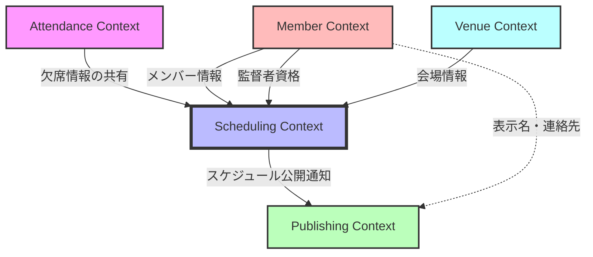
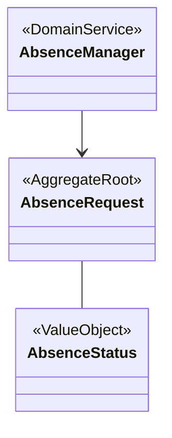
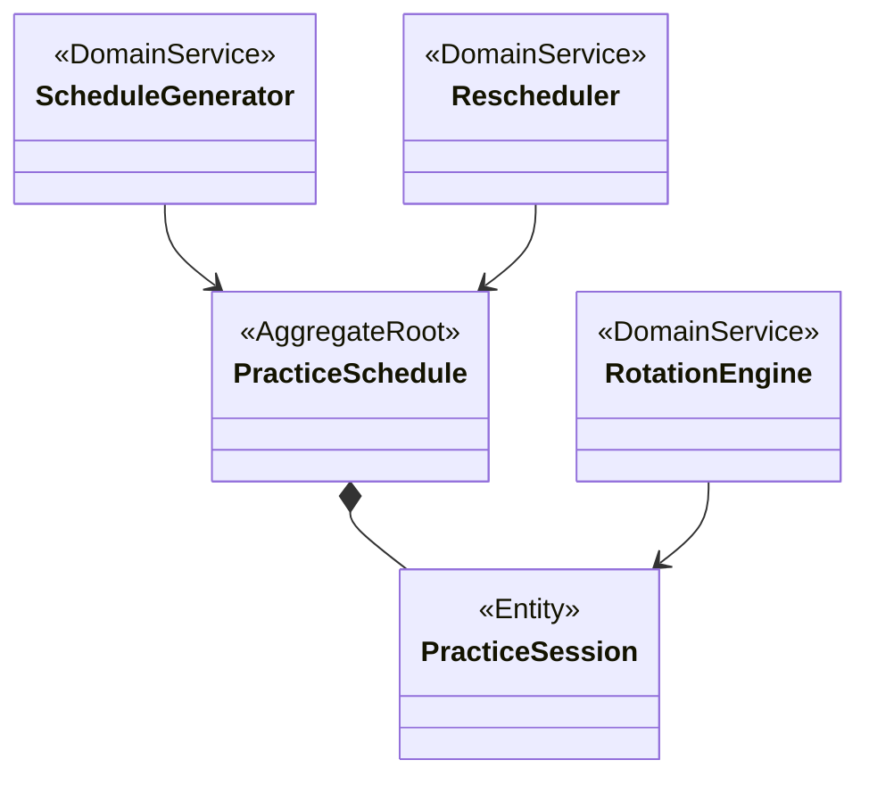
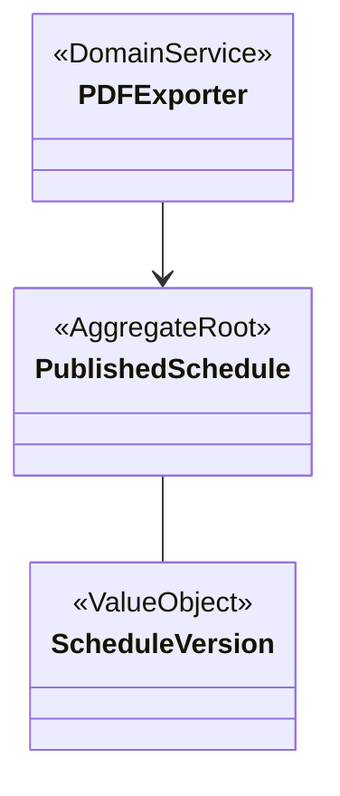
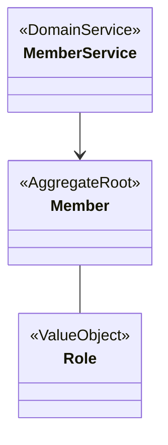
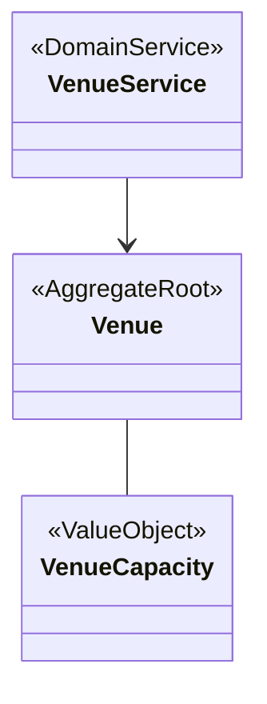
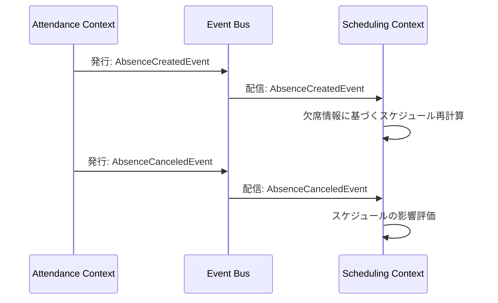
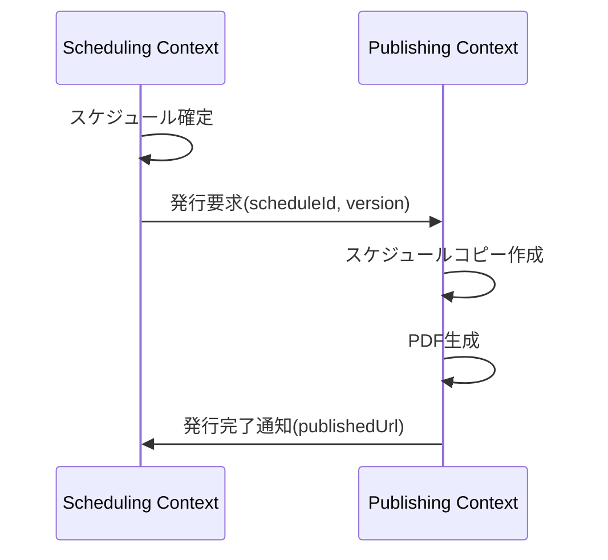
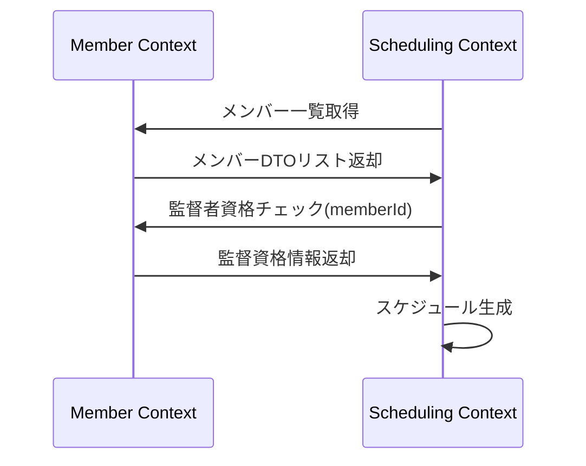
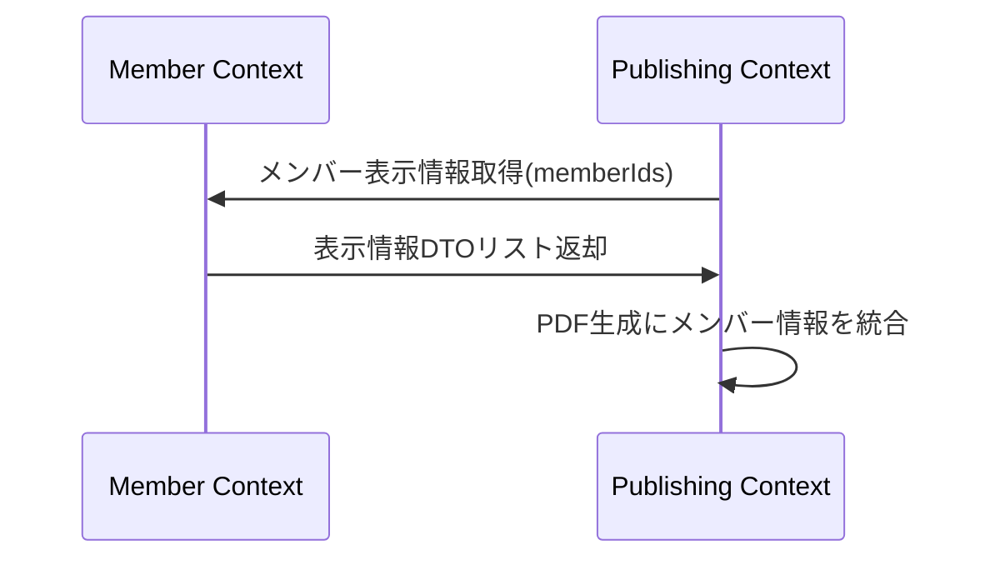

# 練習表自動生成システム 設計書：バウンデッドコンテキスト

## コンテキストマップ

本システムは以下の3つの主要バウンデッドコンテキストから構成されます。

### コンテキスト間の関係性

| 関係 | 上流 | 下流 | 統合方式 | データ交換 |
|------|------|------|----------|------------|
| 欠席情報の共有 | Attendance Context | Scheduling Context | 発行-購読型 | 欠席イベント |
| スケジュール公開 | Scheduling Context | Publishing Context | 顧客-サプライヤー | 確定スケジュール |
| メンバー情報提供 | Member Context | Scheduling Context | 共有カーネル | メンバーリスト |
| 監督者資格確認 | Member Context | Scheduling Context | 共有カーネル | 監督資格フラグ |
| 会場情報提供 | Venue Context | Scheduling Context | 顧客-サプライヤー | 会場データ |
| 表示情報連携 | Member Context | Publishing Context | コンフォーミスト | 表示用プロファイル |

## 各コンテキストの責務

### Attendance Context（出欠管理コンテキスト）

**主な責務**:
- 欠席申請の受付と状態管理
- 申請の承認/拒否ワークフロー
- 欠席理由の集計・分析
- 欠席パターンの検出
- 代替日程の提案

**主要エンティティ**:
- AbsenceRequest（欠席申請）

**主要値オブジェクト**:
- AbsenceStatus（欠席状態）

**提供するインターフェース**:
- IAbsenceService: 欠席申請のCRUD操作
- IAbsenceNotification: 欠席イベント通知

**消費するインターフェース**:
- IMemberQuery: メンバー情報照会
- IScheduleQuery: スケジュール情報照会

### Scheduling Context（スケジューリングコンテキスト）

**主な責務**:
- 練習スケジュールの最適生成
- 欠席情報に基づく再スケジューリング
- 監督者の公平な割り当て
- 練習の質の評価と最適化
- 会場の適切な割り当て

**主要エンティティ**:
- PracticeSchedule（練習スケジュール）
- PracticeSession（練習セッション）

**主要値オブジェクト**:
- TimeSlot（時間枠）
- OptimizationScore（最適化スコア）
- RotationPolicy（ローテーションポリシー）

**提供するインターフェース**:
- IScheduleService: スケジュール操作
- IScheduleNotification: スケジュール変更通知
- ISupervisorAssignment: 監督者割り当て

**消費するインターフェース**:
- IAbsenceQuery: 欠席情報照会
- IMemberQuery: メンバー情報照会
- IVenueQuery: 会場情報照会

### Publishing Context（公開コンテキスト）

**主な責務**:
- スケジュールのバージョン管理
- 確定版のPDFエクスポート
- 変更履歴の管理
- 公開通知の送信
- 公開スケジュールの管理

**主要エンティティ**:
- PublishedSchedule（公開スケジュール）

**主要値オブジェクト**:
- ScheduleVersion（スケジュールバージョン）
- PublicationStatus（公開状態）

**提供するインターフェース**:
- IPublishService: スケジュール公開操作
- IExportService: エクスポート機能
- IHistoryService: 変更履歴管理

**消費するインターフェース**:
- IScheduleQuery: スケジュール情報照会
- IMemberDisplayInfo: メンバー表示情報

### Member Context（メンバー管理コンテキスト）

**主な責務**:
- メンバー情報の管理
- 権限・ロールの管理
- 監督者資格の管理
- パート所属の管理
- メンバー統計情報の集計

**主要エンティティ**:
- Member（メンバー）

**主要値オブジェクト**:
- Role（役割）
- MemberAvailability（メンバー可用性）

**提供するインターフェース**:
- IMemberService: メンバー情報CRUD操作
- IRoleService: 役割・権限管理
- ISupervisorEligibility: 監督者資格確認

**消費するインターフェース**:
- なし（他コンテキストへ情報提供する中心的コンテキスト）

### Venue Context（会場管理コンテキスト）

**主な責務**:
- 会場情報の管理
- 会場予約状況の管理
- 会場適合性の評価
- 設備情報の管理
- 収容人数の管理

**主要エンティティ**:
- Venue（会場）

**主要値オブジェクト**:
- VenueCapacity（会場収容人数）
- TimeSlot（利用可能時間枠）

**提供するインターフェース**:
- IVenueService: 会場情報CRUD操作
- IVenueAvailability: 会場利用可否確認
- IVenueCapacityCheck: 収容人数確認

**消費するインターフェース**:
- なし（他コンテキストへ情報提供する中心的コンテキスト）

## コンテキスト間の連携

### 発行-購読型統合

### 顧客-サプライヤー型統合

### 共有カーネル統合

### コンフォーミスト統合

