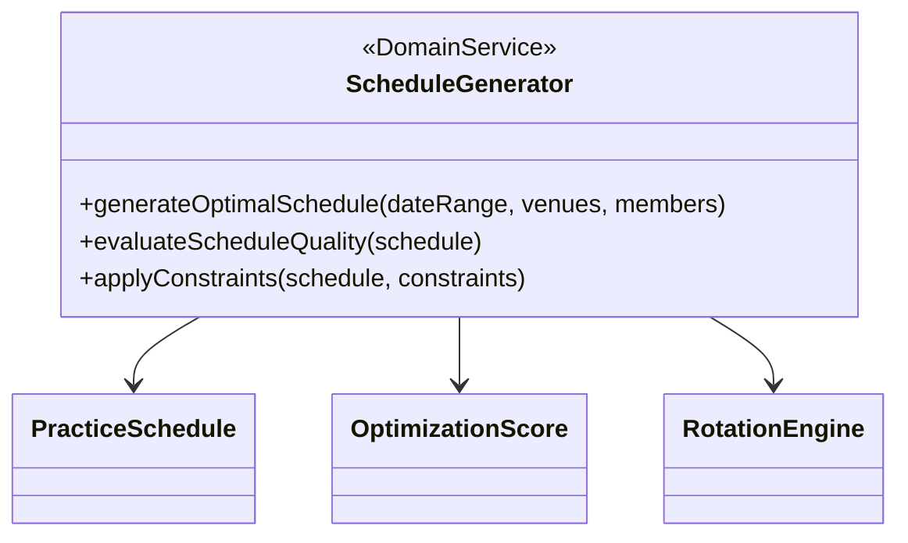
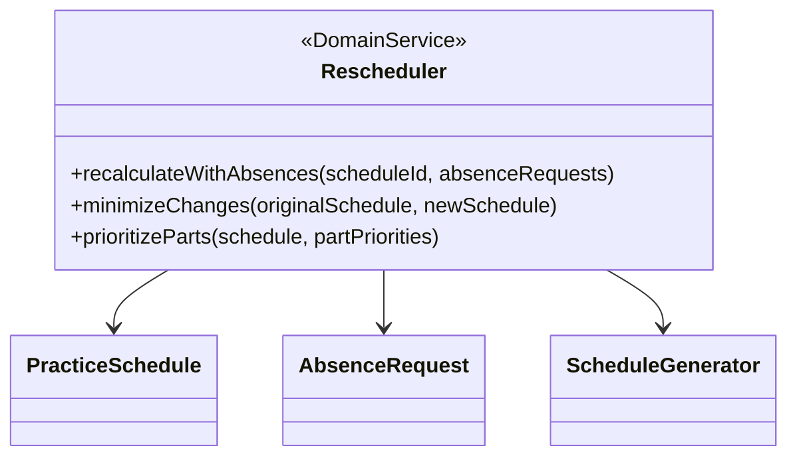
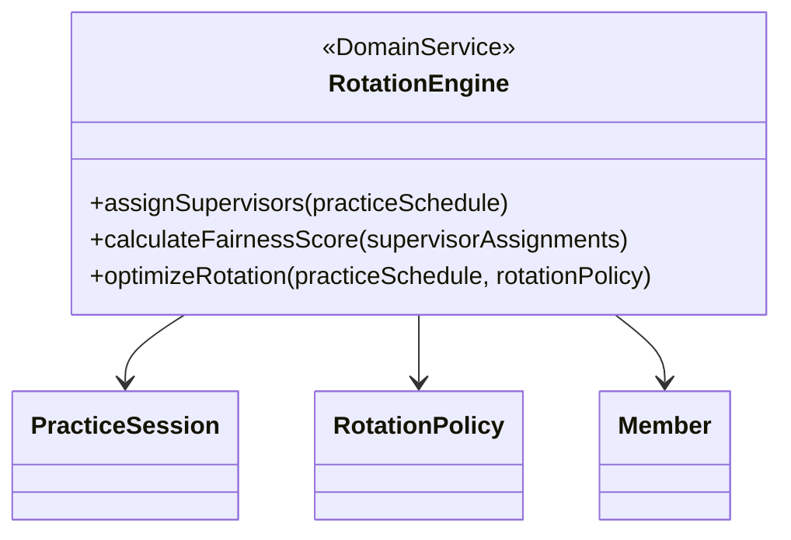
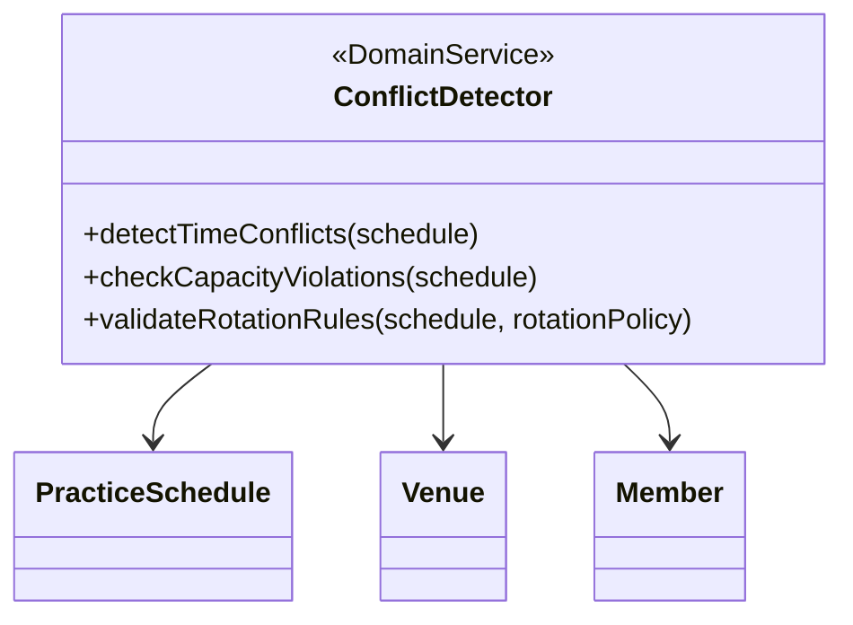
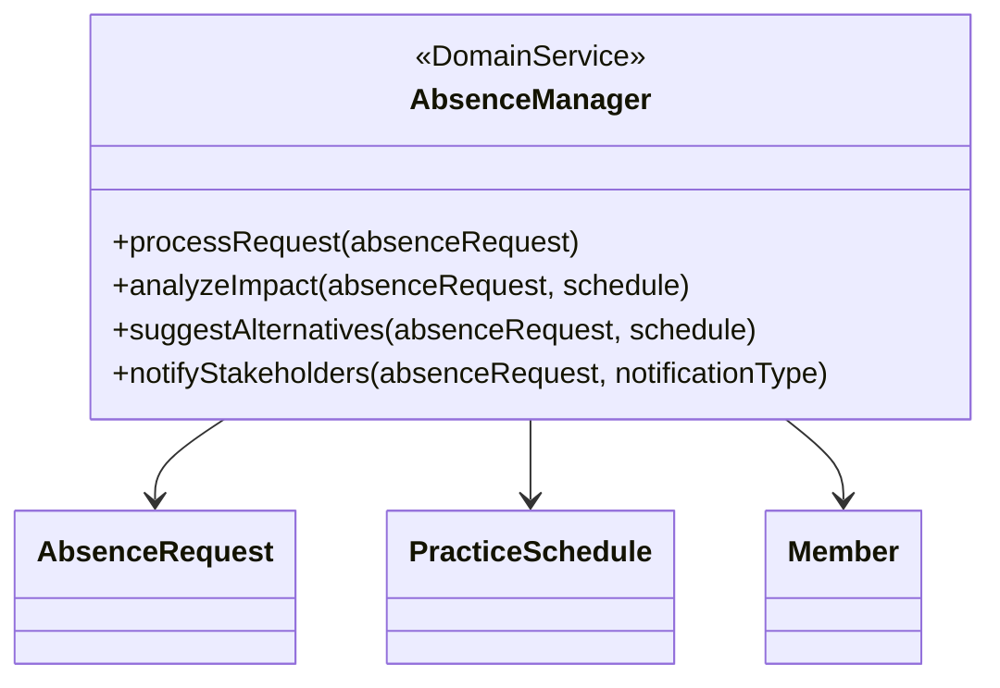
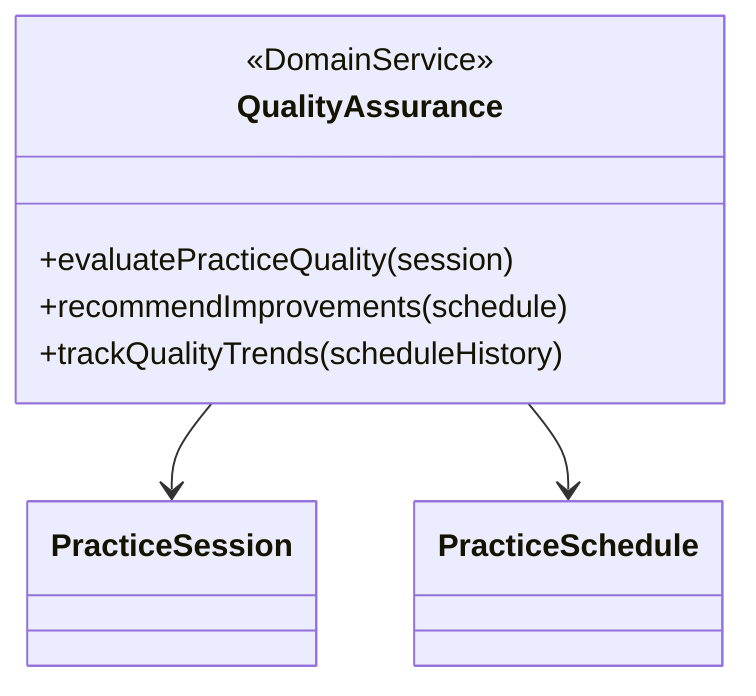
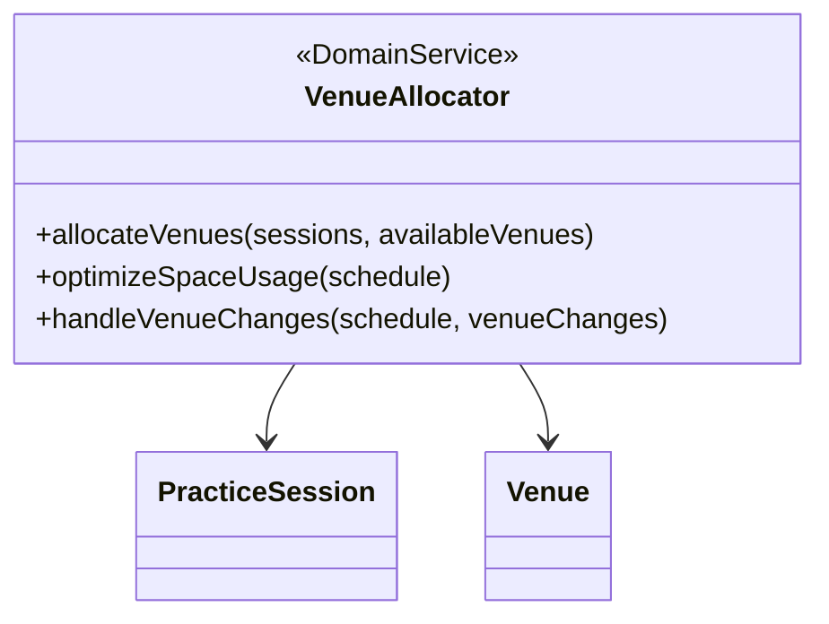
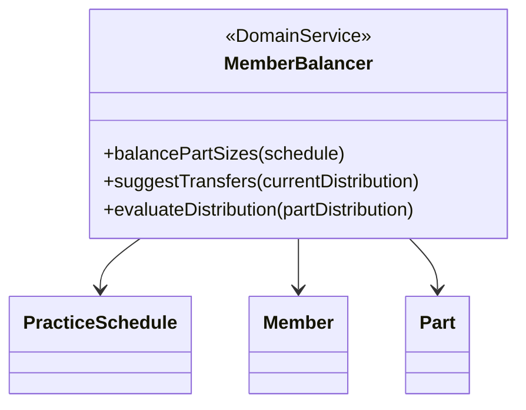
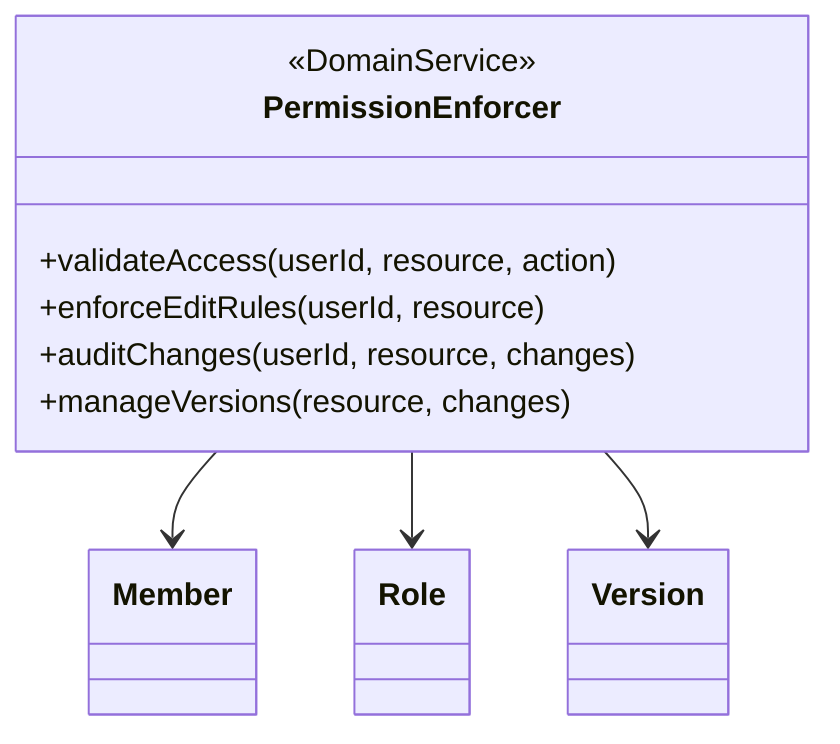
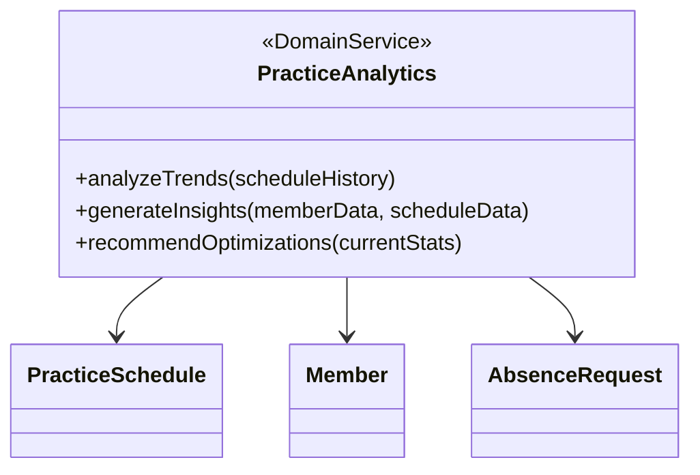

# 練習表自動生成システム 設計書：ドメインサービス

ドメインサービスは、特定のエンティティに属さない、ドメインの重要な振る舞いを表現するコンポーネントです。本システムでは以下のドメインサービスを定義します。

## ScheduleGenerator（スケジュール生成サービス）

**責務**:
- 練習日程、会場、メンバー情報から最適なスケジュールを生成する
- 生成されたスケジュールの品質を評価する
- 特定の制約を適用してスケジュールを調整する

**主要メソッド**:

1. `generateOptimalSchedule(dateRange, venues, members)`
   - 入力: 日程範囲、利用可能会場リスト、メンバーリスト
   - 処理: 制約充足問題（CSP）として解き、最適スケジュールを生成
   - 出力: 最適化された PracticeSchedule インスタンス

2. `evaluateScheduleQuality(schedule)`
   - 入力: スケジュールインスタンス
   - 処理: 公平性、効率性、練習の質などの観点でスコアリング
   - 出力: OptimizationScore インスタンス

3. `applyConstraints(schedule, constraints)`
   - 入力: スケジュール、適用する制約リスト
   - 処理: 特定の制約に基づきスケジュールを微調整
   - 出力: 調整済みスケジュール

**依存**:
- PracticeScheduleRepository
- MemberRepository
- VenueRepository
- RotationEngine

## Rescheduler（再スケジュールサービス）

**責務**:
- 欠席情報をトリガーにスケジュールを再生成する
- 元のスケジュールからの変更を最小化する
- パート間の優先度を考慮した調整を行う

**主要メソッド**:

1. `recalculateWithAbsences(scheduleId, absenceRequests)`
   - 入力: スケジュールID、欠席申請リスト
   - 処理: 欠席情報を考慮して再生成アルゴリズムを実行
   - 出力: 再生成されたスケジュール

2. `minimizeChanges(originalSchedule, newSchedule)`
   - 入力: 元のスケジュール、新しく生成されたスケジュール
   - 処理: 差分を最小化する最適化を実行
   - 出力: 変更最小化されたスケジュール

3. `prioritizeParts(schedule, partPriorities)`
   - 入力: スケジュール、パート優先度マップ
   - 処理: 重要なパートを優先的に配置
   - 出力: 優先度を反映したスケジュール

**依存**:
- PracticeScheduleRepository
- AbsenceRequestRepository
- ScheduleGenerator

## RotationEngine（ローテーションエンジン）

**責務**:
- 監督者の公平な割り当てを計算する
- 監督者配置の公平性スコアを評価する
- ローテーションポリシーに基づき最適な配置を行う

**主要メソッド**:

1. `assignSupervisors(practiceSchedule)`
   - 入力: 練習スケジュール
   - 処理: 各セッションに適切な監督者を割り当て
   - 出力: 監督者割り当て済みのスケジュール

2. `calculateFairnessScore(supervisorAssignments)`
   - 入力: 監督者割り当て情報
   - 処理: 負荷バランスや連続担当などの観点で公平性を計算
   - 出力: 公平性スコア（0-100）

3. `optimizeRotation(practiceSchedule, rotationPolicy)`
   - 入力: スケジュール、ローテーションポリシー
   - 処理: 指定されたポリシーに基づき監督者割り当てを最適化
   - 出力: 最適化されたスケジュール

**依存**:
- MemberRepository
- PracticeSessionRepository

## ConflictDetector（競合検出サービス）

**責務**:
- スケジュールの時間的競合を検出する
- 会場の収容人数違反をチェックする
- ローテーションルールの違反を検証する

**主要メソッド**:

1. `detectTimeConflicts(schedule)`
   - 入力: スケジュール
   - 処理: 同一メンバーの時間重複をチェック
   - 出力: 競合リスト

2. `checkCapacityViolations(schedule)`
   - 入力: スケジュール
   - 処理: 各会場・時間枠での収容人数オーバーをチェック
   - 出力: 違反リスト

3. `validateRotationRules(schedule, rotationPolicy)`
   - 入力: スケジュール、ローテーションポリシー
   - 処理: 監督者ローテーションルールの遵守をチェック
   - 出力: 違反リスト

**依存**:
- VenueRepository
- MemberRepository

## AbsenceManager（欠席管理サービス）

**責務**:
- 欠席申請の処理とワークフロー管理
- 欠席による影響分析
- 代替日程の提案
- 関係者への通知

**主要メソッド**:

1. `processRequest(absenceRequest)`
   - 入力: 欠席申請
   - 処理: バリデーション、ステータス更新、履歴記録
   - 出力: 処理済み申請

2. `analyzeImpact(absenceRequest, schedule)`
   - 入力: 欠席申請、現行スケジュール
   - 処理: パートバランス、人数、監督者配置への影響を分析
   - 出力: 影響分析レポート

3. `suggestAlternatives(absenceRequest, schedule)`
   - 入力: 欠席申請、スケジュール
   - 処理: 代替日程の候補を計算
   - 出力: 代替日程候補リスト

4. `notifyStakeholders(absenceRequest, notificationType)`
   - 入力: 欠席申請、通知タイプ
   - 処理: 関係者への適切な通知を送信
   - 出力: 通知送信結果

**依存**:
- AbsenceRequestRepository
- PracticeScheduleRepository
- MemberRepository

## QualityAssurance（品質保証サービス）

**責務**:
- 練習セッションの質を評価する
- 品質向上のための改善案を提案する
- 長期的な品質トレンドを追跡する

**主要メソッド**:

1. `evaluatePracticeQuality(session)`
   - 入力: 練習セッション
   - 処理: パートバランス、監督者適合性、内容の難易度などを評価
   - 出力: 品質スコア

2. `recommendImprovements(schedule)`
   - 入力: スケジュール
   - 処理: 低品質と判断されたセッションの改善案を生成
   - 出力: 改善提案リスト

3. `trackQualityTrends(scheduleHistory)`
   - 入力: 過去のスケジュール履歴
   - 処理: 時間経過に伴う品質変化を分析
   - 出力: トレンドレポート

**依存**:
- PracticeSessionRepository
- PracticeScheduleRepository

## VenueAllocator（会場割当サービス）

**責務**:
- 練習セッションに最適な会場を割り当てる
- 会場スペースの効率的な利用を最適化する
- 会場変更に対応したスケジュール調整を行う

**主要メソッド**:

1. `allocateVenues(sessions, availableVenues)`
   - 入力: 練習セッションリスト、利用可能会場リスト
   - 処理: 各セッションに最適な会場を割り当て
   - 出力: 会場割り当て済みセッションリスト

2. `optimizeSpaceUsage(schedule)`
   - 入力: スケジュール
   - 処理: 空間利用効率を最大化するよう会場割り当てを調整
   - 出力: 最適化されたスケジュール

3. `handleVenueChanges(schedule, venueChanges)`
   - 入力: スケジュール、会場変更情報
   - 処理: 会場変更に伴う影響を最小化する調整を実施
   - 出力: 調整済みスケジュール

**依存**:
- VenueRepository
- PracticeSessionRepository

## MemberBalancer（メンバーバランサー）

**責務**:
- パート間のメンバー数バランスを調整する
- メンバーの最適な移動を提案する
- 分布の均衡性を評価する

**主要メソッド**:

1. `balancePartSizes(schedule)`
   - 入力: スケジュール
   - 処理: パート間の人数バランスを調整
   - 出力: バランス調整済みスケジュール

2. `suggestTransfers(currentDistribution)`
   - 入力: 現在のパート分布
   - 処理: 最適なメンバー移動パターンを計算
   - 出力: メンバー移動提案リスト

3. `evaluateDistribution(partDistribution)`
   - 入力: パート分布
   - 処理: 分布の均衡性をスコア化
   - 出力: バランススコア

**依存**:
- MemberRepository
- PartRepository

## PermissionEnforcer（権限管理サービス）

**責務**:
- アクセス権限のバリデーションを行う
- 編集ルールを適用する
- 変更履歴を監査する
- バージョン管理を行う

**主要メソッド**:

1. `validateAccess(userId, resource, action)`
   - 入力: ユーザーID、リソース、アクション
   - 処理: 指定アクションの権限を確認
   - 出力: アクセス許可/拒否結果

2. `enforceEditRules(userId, resource)`
   - 入力: ユーザーID、リソース
   - 処理: 編集可能性とルールをチェック
   - 出力: 編集許可/拒否結果

3. `auditChanges(userId, resource, changes)`
   - 入力: ユーザーID、リソース、変更内容
   - 処理: 変更履歴を記録
   - 出力: 監査ログエントリ

4. `manageVersions(resource, changes)`
   - 入力: リソース、変更内容
   - 処理: バージョン番号更新と履歴保存
   - 出力: 新バージョン情報

**依存**:
- MemberRepository
- VersionRepository

## PracticeAnalytics（練習分析サービス）

**責務**:
- 練習データの傾向分析を行う
- データに基づく洞察を生成する
- 最適化のための提案を行う

**主要メソッド**:

1. `analyzeTrends(scheduleHistory)`
   - 入力: スケジュール履歴
   - 処理: 時系列分析、パターン検出
   - 出力: トレンドレポート

2. `generateInsights(memberData, scheduleData)`
   - 入力: メンバーデータ、スケジュールデータ
   - 処理: データマイニングと相関分析
   - 出力: インサイトレポート

3. `recommendOptimizations(currentStats)`
   - 入力: 現在の統計データ
   - 処理: 最適化アルゴリズムを適用
   - 出力: 最適化提案

**依存**:
- PracticeScheduleRepository
- MemberRepository
- AbsenceRequestRepository 