# 練習表自動生成システム 設計書：アプリケーション層

## アプリケーション層の概要

アプリケーション層は、ユーザーの意図をドメイン層の機能に変換し、ユーザーインターフェースとドメインモデル間の仲介を行う層です。本システムでのアプリケーション層の主な役割は以下の通りです：

1. **ユースケースの実装**
   - 要件定義から導出されたユースケースを実現する
   - トランザクション境界の定義とアプリケーションサービスの提供

2. **ドメインサービスのオーケストレーション**
   - 複数のドメインサービスを連携させた処理フローの制御
   - 各バウンデッドコンテキスト間の連携の仲介

3. **入出力変換**
   - 外部インターフェース（API/UI）からの入力をドメインモデルに変換
   - ドメインモデルの出力を表示用データに変換（DTOマッピング）

4. **横断的関心事の処理**
   - 認証・認可の実施
   - ロギング
   - エラーハンドリング

## ユースケース設計

本システムの主要ユースケースを以下に示します。

### 1. スケジュール管理ユースケース

#### 1.1 CreateDraftScheduleUseCase（練習表草案作成）

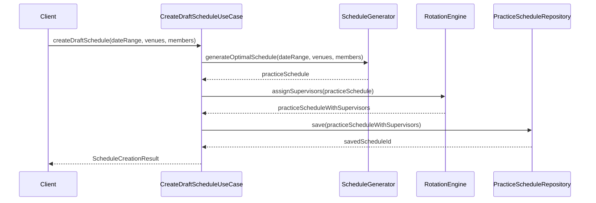

**入力**:
- `dateRange`: 練習スケジュールの対象期間
- `venues`: 利用可能会場リスト
- `members`: 参加メンバーリスト

**処理**:
1. `ScheduleGenerator`を使用して最適なスケジュールを生成
2. `RotationEngine`を使用して監督者を割り当て
3. 生成されたスケジュールをリポジトリに保存（ステータス = Draft）

**出力**:
- `ScheduleCreationResult`: 生成結果（スケジュールID、最適化スコア、警告など）

#### 1.2 UpdateScheduleUseCase（練習表更新）

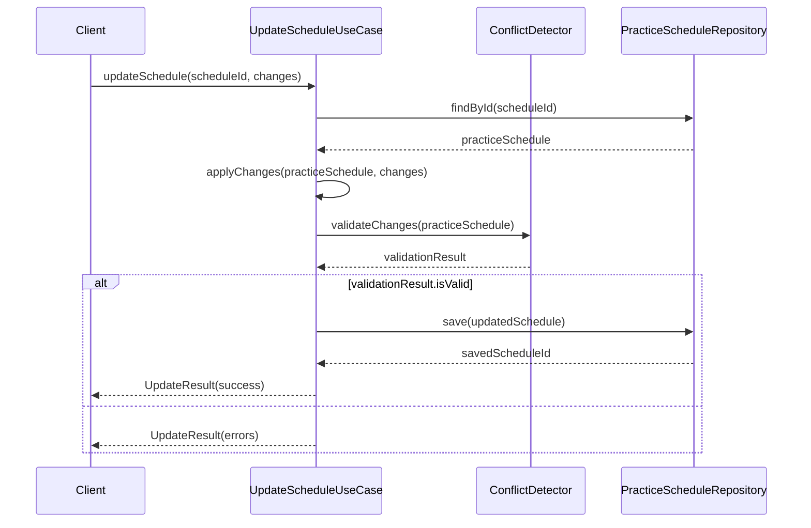

**入力**:
- `scheduleId`: 更新対象のスケジュールID
- `changes`: 変更内容（セッション追加/削除/変更など）

**処理**:
1. 対象スケジュールを取得
2. 変更を適用
3. `ConflictDetector`で変更内容の競合チェック
4. 問題がなければ保存

**出力**:
- `UpdateResult`: 更新結果（成功/エラー情報）

#### 1.3 PublishScheduleUseCase（練習表公開）

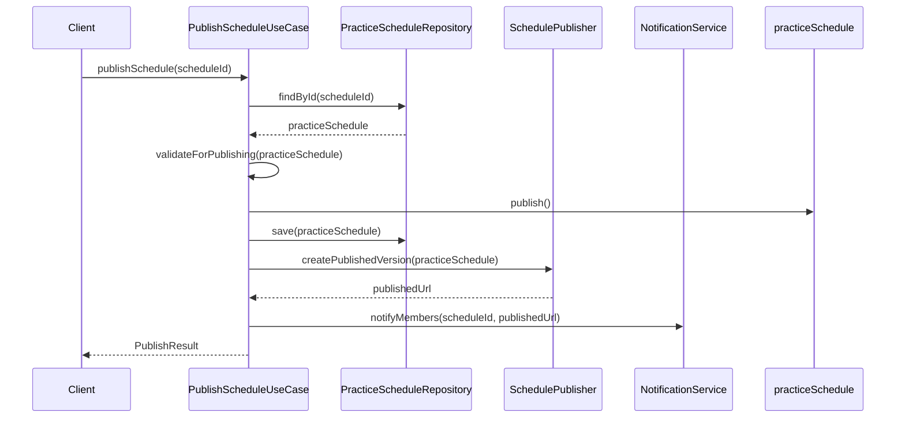

**入力**:
- `scheduleId`: 公開対象のスケジュールID

**処理**:
1. 対象スケジュールを取得
2. 公開可能かの最終チェック
3. ステータスを「Published」に変更
4. `SchedulePublisher`を使用してPDF生成などの公開処理
5. メンバーへの通知

**出力**:
- `PublishResult`: 公開結果（URL、バージョン情報など）

#### 1.4 CloneScheduleUseCase（練習表複製）

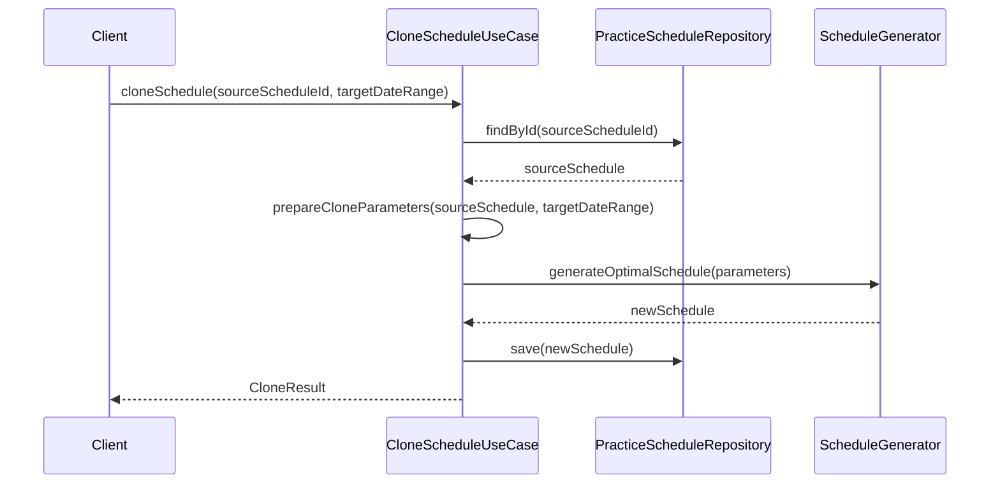

**入力**:
- `sourceScheduleId`: 複製元スケジュールID
- `targetDateRange`: 複製先の日付範囲

**処理**:
1. 複製元スケジュールの取得
2. 複製元のパターンを維持しつつ日付を変更
3. 監督者ローテーションを自動調整
4. 新スケジュールを保存

**出力**:
- `CloneResult`: 複製結果（新スケジュールIDなど）

### 2. 欠席管理ユースケース

#### 2.1 SubmitAbsenceUseCase（欠席申請）

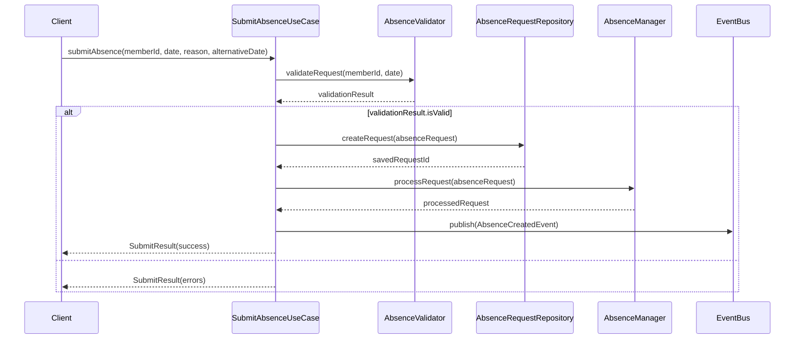

**入力**:
- `memberId`: 欠席申請者ID
- `date`: 欠席予定日
- `reason`: 欠席理由
- `alternativeDate`: 代替希望日（オプション）

**処理**:
1. 欠席申請のバリデーション（期限、重複チェックなど）
2. 申請を作成・保存
3. `AbsenceManager`で申請を処理
4. `AbsenceCreatedEvent`の発行

**出力**:
- `SubmitResult`: 申請結果（成功/エラー情報）

#### 2.2 ApproveAbsenceUseCase（欠席承認）

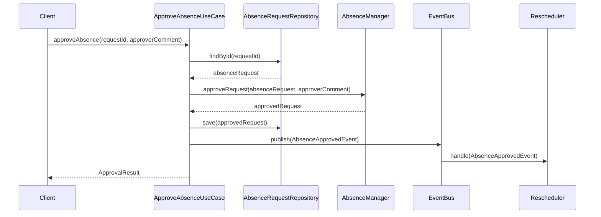

**入力**:
- `requestId`: 承認対象の欠席申請ID
- `approverComment`: 承認者コメント（オプション）

**処理**:
1. 対象欠席申請の取得
2. `AbsenceManager`で承認処理
3. 承認済み申請の保存
4. `AbsenceApprovedEvent`の発行（→スケジュール再生成トリガー）

**出力**:
- `ApprovalResult`: 承認結果（スケジュール再生成の影響レポートなど）

#### 2.3 CancelAbsenceUseCase（欠席取消）

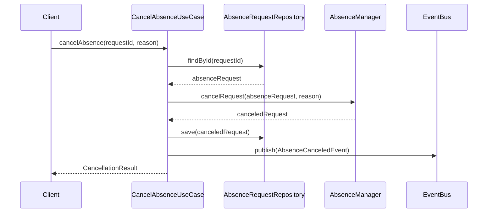

**入力**:
- `requestId`: 取消対象の欠席申請ID
- `reason`: 取消理由

**処理**:
1. 対象欠席申請の取得
2. `AbsenceManager`で取消処理
3. 取消済み申請の保存
4. `AbsenceCanceledEvent`の発行

**出力**:
- `CancellationResult`: 取消結果

#### 2.4 ViewAbsenceHistoryUseCase（欠席履歴表示）

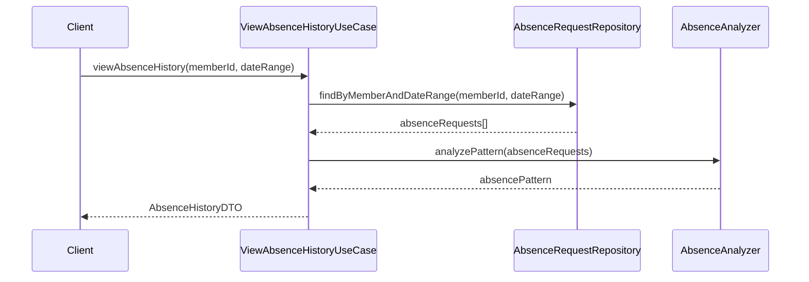

**入力**:
- `memberId`: 対象メンバーID
- `dateRange`: 日付範囲

**処理**:
1. 対象期間の欠席申請履歴取得
2. 欠席パターン分析
3. DTOへの変換

**出力**:
- `AbsenceHistoryDTO`: 欠席履歴データ（統計情報付き）

### 3. 監督者管理ユースケース

#### 3.1 AssignSupervisorsUseCase（監督者割当）

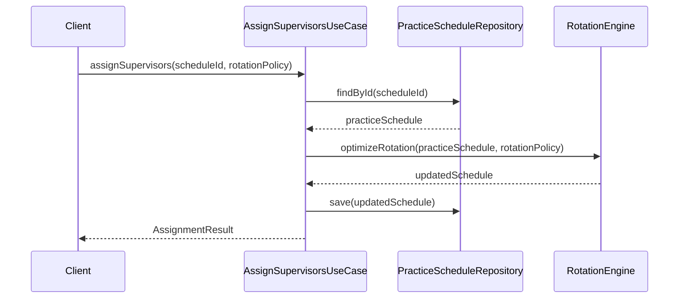

**入力**:
- `scheduleId`: 対象スケジュールID
- `rotationPolicy`: ローテーションポリシー（オプション）

**処理**:
1. 対象スケジュールの取得
2. `RotationEngine`で最適な監督者割り当て計算
3. 更新したスケジュールの保存

**出力**:
- `AssignmentResult`: 割り当て結果（公平性スコアなど）

#### 3.2 OverrideSupervisorUseCase（監督者手動割当）

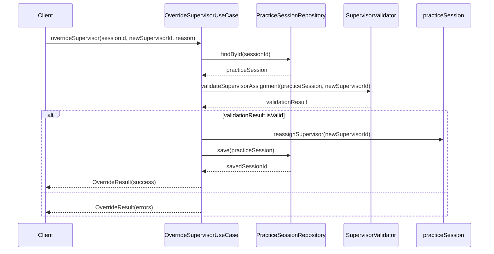

**入力**:
- `sessionId`: 対象セッションID
- `newSupervisorId`: 新しい監督者ID
- `reason`: 変更理由

**処理**:
1. 対象セッションの取得
2. 監督者割り当ての妥当性検証
3. 監督者の変更と保存
4. 変更理由の記録

**出力**:
- `OverrideResult`: 変更結果（成功/エラー情報）

#### 3.3 ViewSupervisionStatsUseCase（監督統計表示）

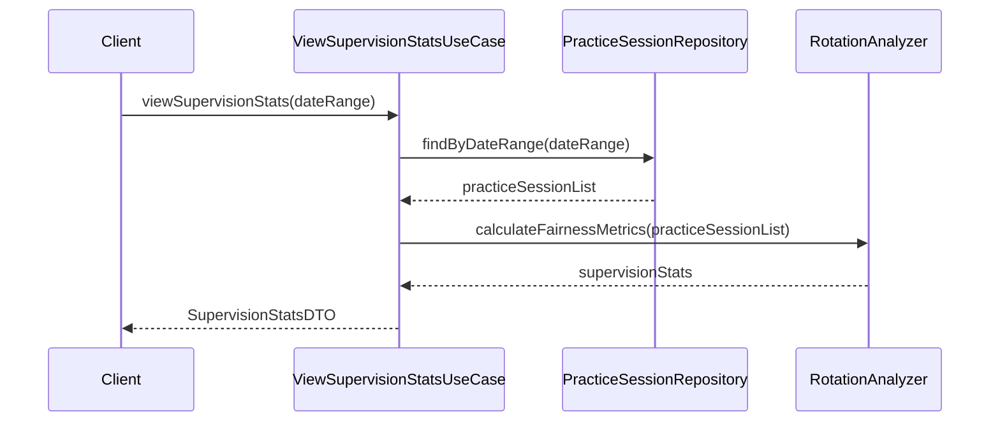

**入力**:
- `dateRange`: 対象期間

**処理**:
1. 対象期間のセッション一覧取得
2. 監督回数集計と公平性分析
3. DTOへの変換

**出力**:
- `SupervisionStatsDTO`: 監督統計データ（メンバー別回数、公平性指標など）

### 4. 会場管理ユースケース

#### 4.1 RegisterVenueUseCase（会場登録）

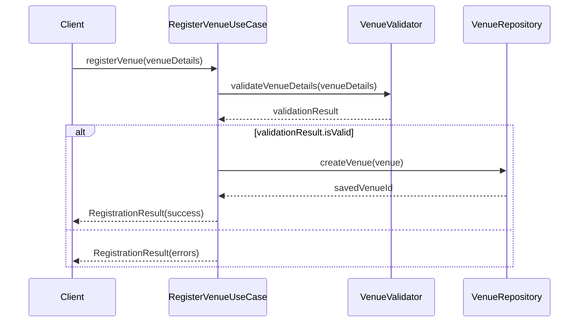

**入力**:
- `venueDetails`: 会場情報（名称、住所、収容人数など）

**処理**:
1. 会場情報のバリデーション
2. 会場エンティティの作成・保存

**出力**:
- `RegistrationResult`: 登録結果（成功/エラー情報）

#### 4.2 ReassignVenueUseCase（会場再割当）

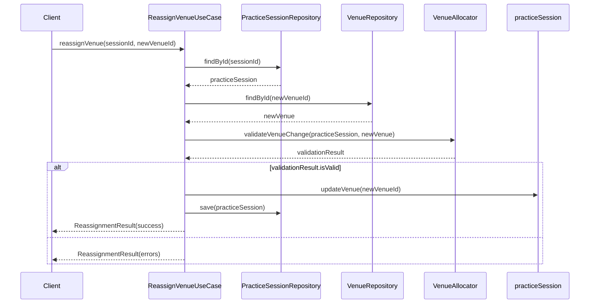

**入力**:
- `sessionId`: 対象セッションID
- `newVenueId`: 新しい会場ID

**処理**:
1. 対象セッションと新会場の取得
2. 会場変更の妥当性検証（収容人数、設備など）
3. 会場の変更と保存

**出力**:
- `ReassignmentResult`: 変更結果

## サービス間連携

アプリケーションサービス間の連携は以下のパターンで行われます。

### イベント駆動型連携

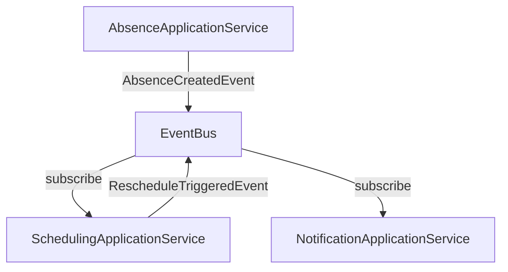

主なイベント:
- `AbsenceCreatedEvent`: 欠席申請作成時に発行
- `AbsenceApprovedEvent`: 欠席申請承認時に発行
- `AbsenceCanceledEvent`: 欠席取消時に発行
- `ScheduleCreatedEvent`: スケジュール作成時に発行
- `SchedulePublishedEvent`: スケジュール公開時に発行
- `RescheduleTriggeredEvent`: 再スケジューリング開始時に発行

### 同期型サービス呼び出し

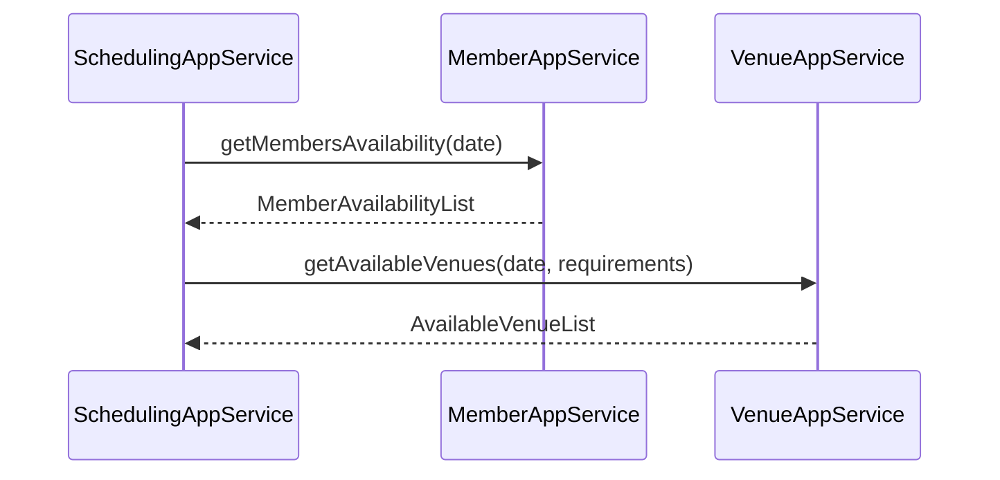

### バッチ処理・非同期処理

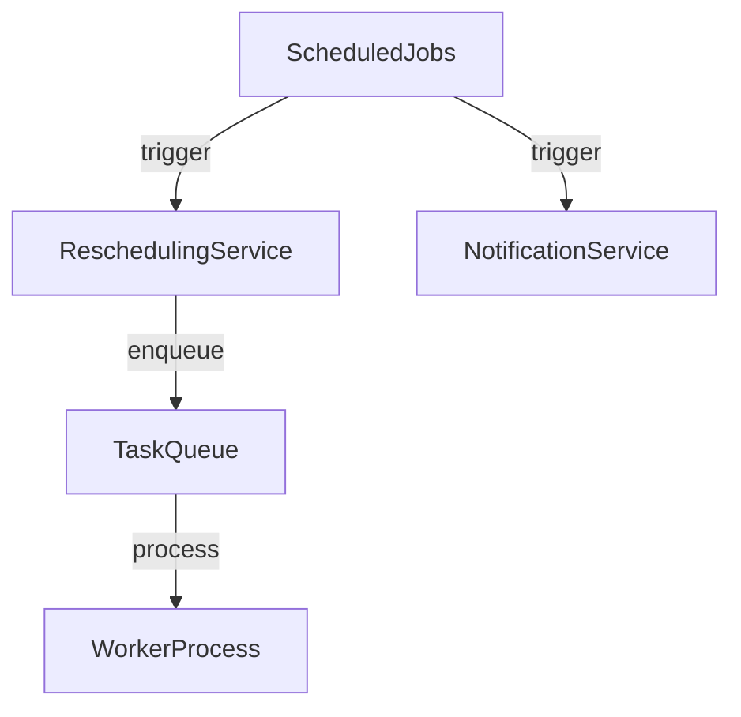

- `ReschedulingService`: 欠席申請処理や定期的なスケジュール最適化を非同期実行
- `NotificationService`: メンバーへの通知を非同期送信
- `StatisticsCollector`: 利用統計の集計をバッチ処理

## 入出力変換（DTOパターン）

外部インターフェースとドメインモデル間のデータ変換には、以下のDTOを使用します。

### 入力DTOs（リクエスト）

- `CreateScheduleRequestDTO`: スケジュール作成リクエスト
- `AbsenceRequestDTO`: 欠席申請リクエスト
- `UpdateSessionRequestDTO`: セッション更新リクエスト
- `VenueRegistrationRequestDTO`: 会場登録リクエスト

### 出力DTOs（レスポンス）

- `ScheduleResponseDTO`: スケジュール情報レスポンス
- `AbsenceResponseDTO`: 欠席情報レスポンス
- `SupervisionStatsResponseDTO`: 監督統計レスポンス
- `OptimizationScoreDTO`: 最適化スコアレスポンス

## 例外処理

アプリケーション層では以下の例外ハンドリングを行います。

1. **ドメイン例外のラップ**:
   - `DomainValidationException` → `ApplicationValidationException`
   - `DomainEntityNotFoundException` → `ResourceNotFoundException`

2. **アプリケーション固有例外**:
   - `UnauthorizedAccessException`: 権限不足
   - `ConcurrentModificationException`: 同時更新の競合
   - `InvalidOperationException`: 操作の順序違反 