# 練習表自動生成システム 設計書：インターフェース設計

## API設計

本システムは、フロントエンドとバックエンド間の通信にRESTful APIを採用します。主要なエンドポイントとその設計について説明します。

### API設計原則

1. リソース指向の設計
2. HTTPメソッドの適切な使用
3. 統一されたエラーレスポンス形式
4. JSON形式でのデータ交換
5. JWT認証の実装

### エンドポイント構成

#### スケジュール関連API

| エンドポイント | メソッド | 説明 | 権限 |
|--------------|--------|------|------|
| `/api/schedules` | GET | スケジュール一覧取得 | Viewer以上 |
| `/api/schedules` | POST | 新規スケジュール作成 | Editor以上 |
| `/api/schedules/{id}` | GET | 特定スケジュール取得 | Viewer以上 |
| `/api/schedules/{id}` | PUT | スケジュール更新 | Editor以上 |
| `/api/schedules/{id}` | DELETE | スケジュール削除 | Admin |
| `/api/schedules/{id}/publish` | POST | スケジュール公開 | Admin |
| `/api/schedules/{id}/sessions` | GET | セッション一覧取得 | Viewer以上 |
| `/api/schedules/{id}/sessions` | POST | セッション追加 | Editor以上 |
| `/api/schedules/{id}/clone` | POST | スケジュール複製 | Editor以上 |
| `/api/schedules/export/{id}` | GET | PDF出力 | Viewer以上 |

#### 欠席管理API

| エンドポイント | メソッド | 説明 | 権限 |
|--------------|--------|------|------|
| `/api/absences` | GET | 欠席一覧取得 | Admin |
| `/api/absences` | POST | 欠席申請 | AbsenceReporter以上 |
| `/api/absences/{id}` | GET | 欠席詳細取得 | AbsenceReporter(自身)/Admin |
| `/api/absences/{id}` | PUT | 欠席情報更新 | AbsenceReporter(自身)/Admin |
| `/api/absences/{id}/approve` | POST | 欠席承認 | Admin |
| `/api/absences/{id}/reject` | POST | 欠席拒否 | Admin |
| `/api/absences/{id}/cancel` | POST | 欠席取消 | AbsenceReporter(自身)/Admin |
| `/api/absences/stats` | GET | 欠席統計取得 | Admin |
| `/api/members/{id}/absences` | GET | メンバー欠席履歴 | AbsenceReporter(自身)/Admin |

#### 監督者管理API

| エンドポイント | メソッド | 説明 | 権限 |
|--------------|--------|------|------|
| `/api/supervisors/assign` | POST | 監督者一括割当 | Editor以上 |
| `/api/sessions/{id}/supervisor` | PUT | 監督者個別変更 | Editor以上 |
| `/api/supervisors/stats` | GET | 監督統計取得 | Viewer以上 |
| `/api/supervisors/rotation-plan` | GET | ローテーション計画取得 | Editor以上 |

#### 会場管理API

| エンドポイント | メソッド | 説明 | 権限 |
|--------------|--------|------|------|
| `/api/venues` | GET | 会場一覧取得 | Viewer以上 |
| `/api/venues` | POST | 会場登録 | Admin |
| `/api/venues/{id}` | GET | 会場詳細取得 | Viewer以上 |
| `/api/venues/{id}` | PUT | 会場情報更新 | Admin |
| `/api/venues/{id}` | DELETE | 会場削除 | Admin |
| `/api/venues/available` | GET | 利用可能会場検索 | Editor以上 |
| `/api/sessions/{id}/venue` | PUT | セッション会場変更 | Editor以上 |

#### メンバー管理API

| エンドポイント | メソッド | 説明 | 権限 |
|--------------|--------|------|------|
| `/api/members` | GET | メンバー一覧取得 | Viewer以上 |
| `/api/members` | POST | メンバー登録 | Admin |
| `/api/members/{id}` | GET | メンバー詳細取得 | Viewer以上 |
| `/api/members/{id}` | PUT | メンバー情報更新 | Admin |
| `/api/members/{id}` | DELETE | メンバー削除 | Admin |
| `/api/members/{id}/role` | PUT | ロール変更 | Admin |
| `/api/members/supervisors` | GET | 監督者資格保有者取得 | Editor以上 |

### レスポンス形式

#### 正常レスポンス

```json
{
  "status": "success",
  "data": {
    // レスポンスデータ
  }
}
```

#### エラーレスポンス

```json
{
  "status": "error",
  "error": {
    "code": "ERROR_CODE",
    "message": "エラーメッセージ",
    "details": {
      // 詳細情報
    }
  }
}
```

### セキュリティ設計

1. **認証**：JWTベースの認証
   ```
   Authorization: Bearer <token>
   ```

2. **認可**：ロールベースのアクセス制御（RBAC）
   - Admin：全権限
   - Editor：閲覧、編集
   - Viewer：閲覧のみ
   - AbsenceReporter：閲覧＋欠席申請

3. **APIレート制限**：
   - 一般エンドポイント：60リクエスト/分
   - 管理者エンドポイント：120リクエスト/分

## 画面遷移図

本システムの主要な画面遷移を以下に示します。

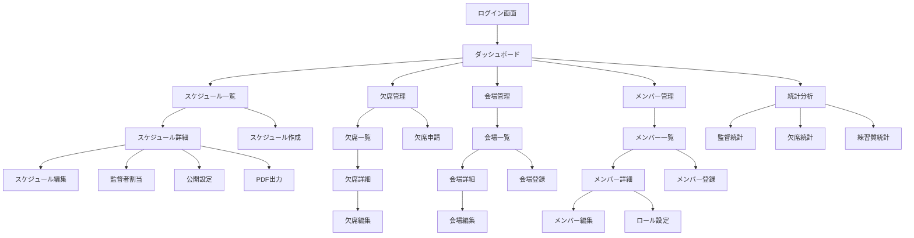

## 主要画面概要

### 1. ダッシュボード画面

ユーザーの役割に応じた主要情報とアクションを表示する画面です。

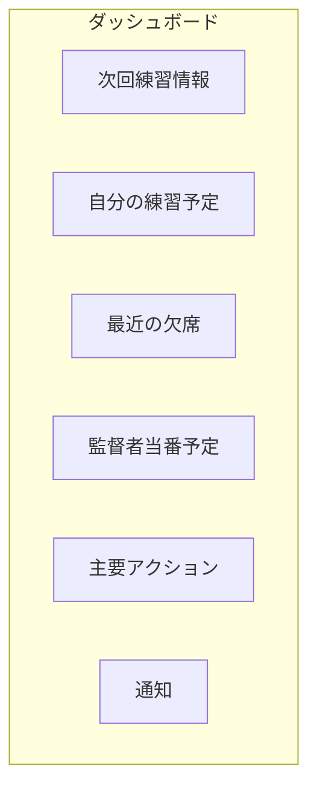

**主な機能**:
- 次回の練習情報（日時、会場、パート）の表示
- ログインユーザーの練習予定一覧
- 最近の欠席情報（管理者向け）
- 監督者当番予定（監督者資格者向け）
- よく使うアクションへのショートカットボタン
- システム通知

### 2. スケジュール関連画面

#### 2.1 スケジュール一覧画面

作成済みのスケジュール一覧を表示する画面です。

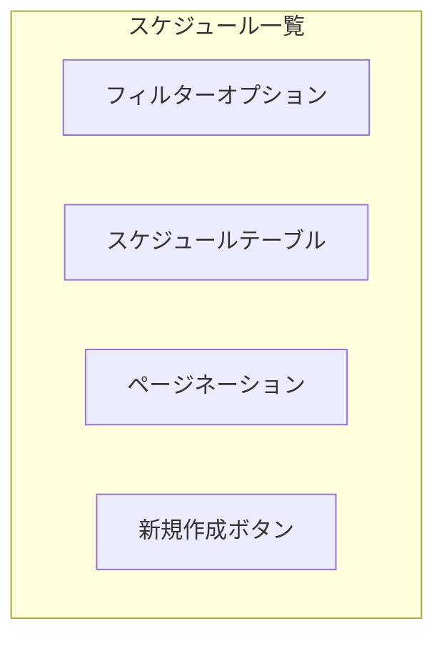

**主な機能**:
- 日付範囲、ステータスによるフィルタリング
- スケジュール一覧表示（期間、作成者、状態、最終更新日）
- 詳細表示、編集、削除アクション
- 新規スケジュール作成ボタン（権限者のみ）

#### 2.2 スケジュール詳細/編集画面

スケジュールの詳細表示と編集を行う画面です。

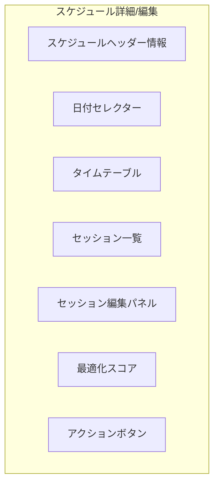

**主な機能**:
- スケジュール基本情報の表示/編集
- 日付ごとのタイムテーブル表示（セッション配置可視化）
- セッションの追加/編集/削除
- ドラッグ＆ドロップによるセッション移動
- 監督者手動割り当て
- 会場変更
- 公開/エクスポートなどのアクション

### 3. 欠席管理画面

#### 3.1 欠席申請画面

欠席の申請を行う画面です。

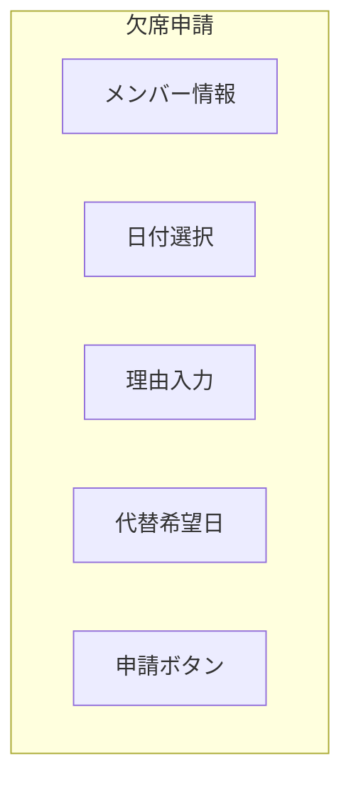

**主な機能**:
- 欠席日の選択（カレンダーUI）
- 欠席理由の入力
- 代替希望日の指定（オプション）
- 申請履歴の表示
- 申請ボタン

#### 3.2 欠席一覧/承認画面（管理者向け）

欠席申請の一覧表示と承認/拒否を行う画面です。

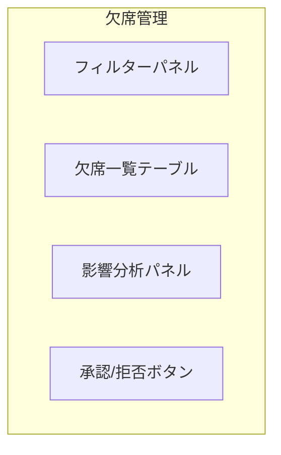

**主な機能**:
- 状態、日付、メンバーによるフィルタリング
- 欠席申請一覧表示
- 承認/拒否アクション
- 欠席の影響分析（パート人数バランス、監督者欠席チェックなど）
- 一括承認機能

### 4. 監督者管理画面

#### 4.1 監督者割当画面

監督者の割り当てを行う画面です。

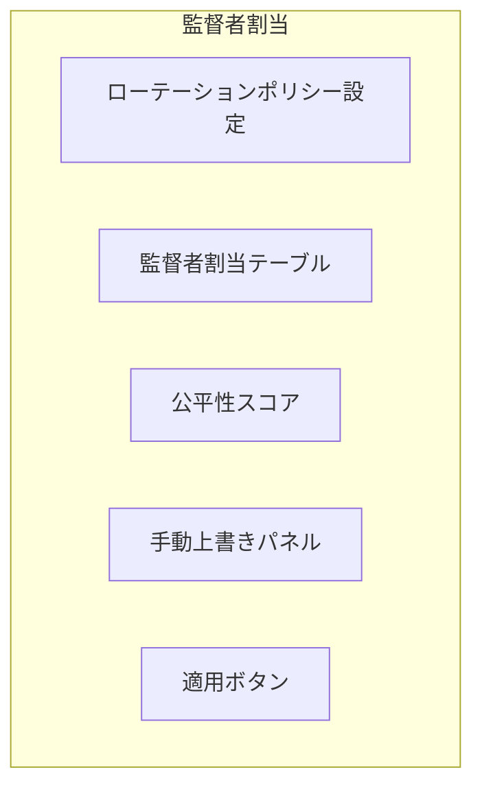

**主な機能**:
- ローテーションポリシーの設定（最大連続回数、優先メンバーなど）
- パート別の監督者割当表示
- 監督者の手動変更
- 公平性スコアのリアルタイム表示
- 割当の適用

#### 4.2 監督統計画面

監督者の割当状況を分析する画面です。

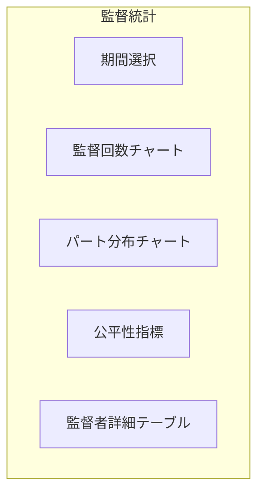

**主な機能**:
- 期間別の監督回数グラフ表示
- メンバー別の監督回数比較
- パート別の監督割当分布
- 監督者ローテーションの公平性指標表示
- 詳細データのエクスポート

### 5. 会場管理画面

#### 5.1 会場一覧/詳細画面

会場情報の管理を行う画面です。

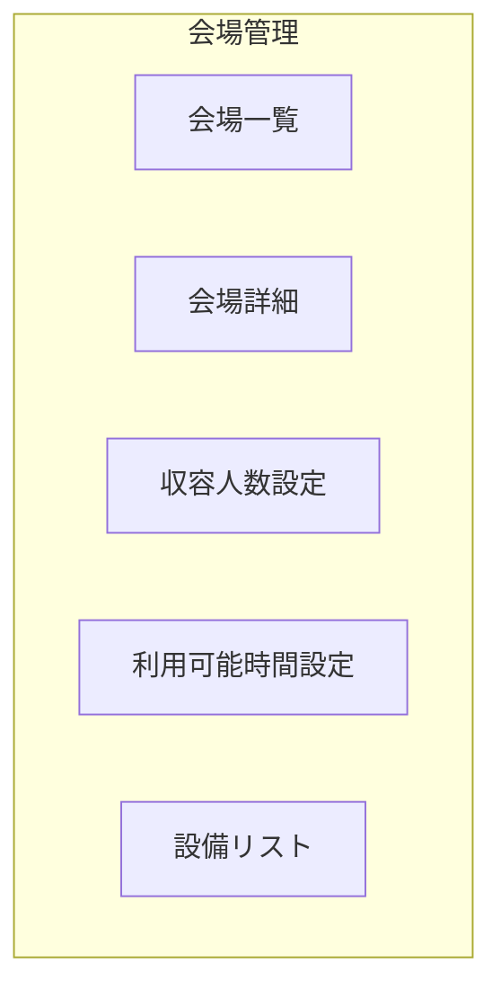

**主な機能**:
- 会場の登録/編集/削除
- 基本情報設定（名称、住所、連絡先など）
- 収容人数設定（全体、パート別）
- 同時利用可能チーム数設定
- 利用可能時間帯設定（カレンダーUI）
- 設備情報管理

### 6. メンバー管理画面

#### 6.1 メンバー一覧/詳細画面

メンバー情報の管理を行う画面です。

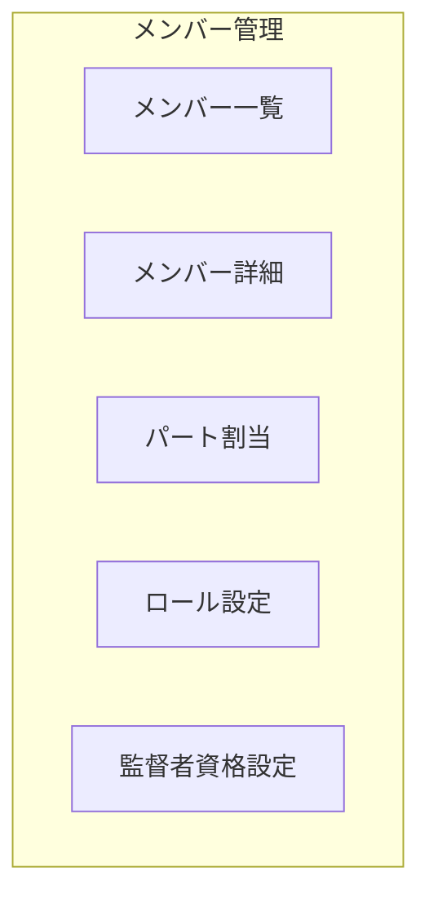

**主な機能**:
- メンバーの登録/編集/削除
- 基本情報設定（氏名、連絡先など）
- パート所属設定
- システムロール設定
- 監督者資格の設定
- 欠席履歴の確認

## モバイル対応設計

本システムはレスポンシブデザインを採用し、以下の画面サイズに最適化します：

1. デスクトップ (1024px以上)
2. タブレット (768px - 1023px)
3. モバイル (767px以下)

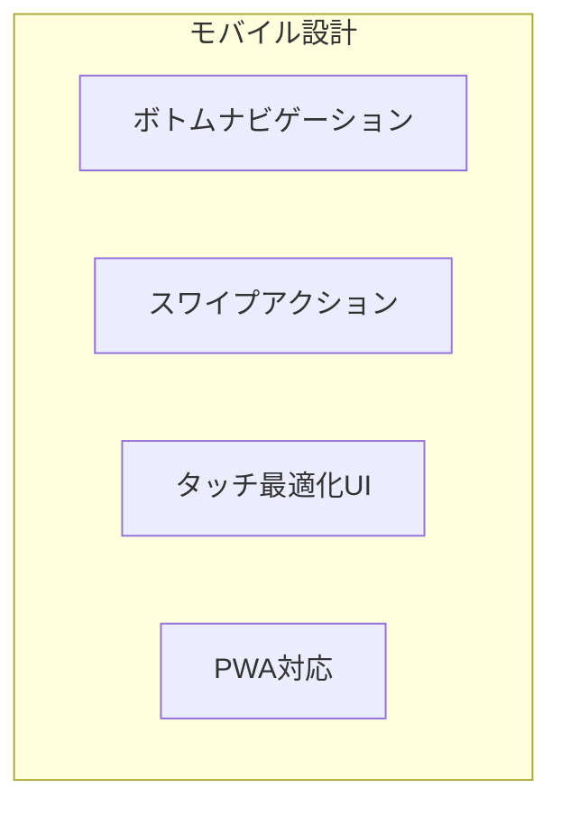

**モバイル特有の機能**:
- ボトムナビゲーション（主要機能へのアクセス）
- スワイプによるアクションの実行
- プッシュ通知（欠席承認、スケジュール公開など）
- オフライン表示のためのキャッシュ機能 