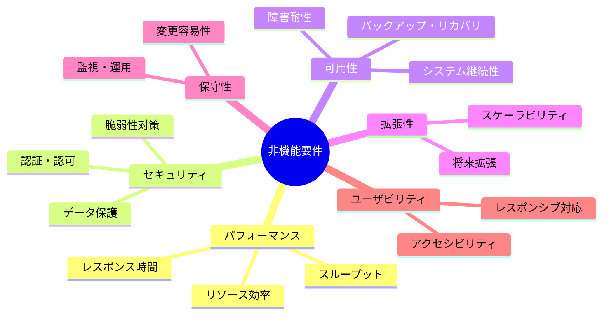
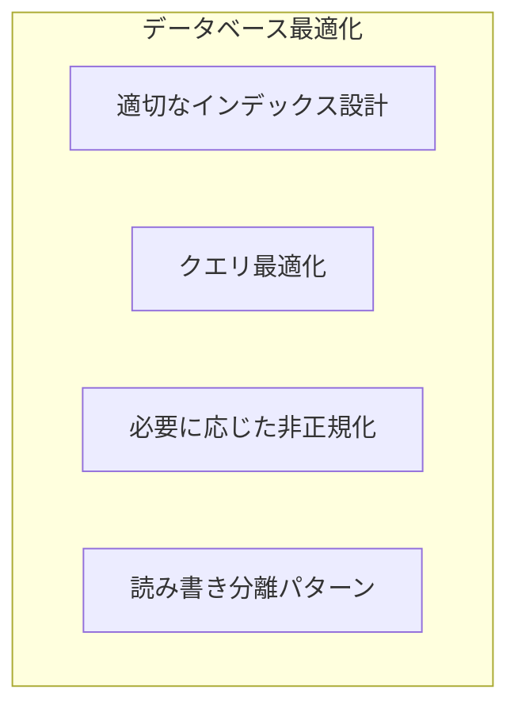
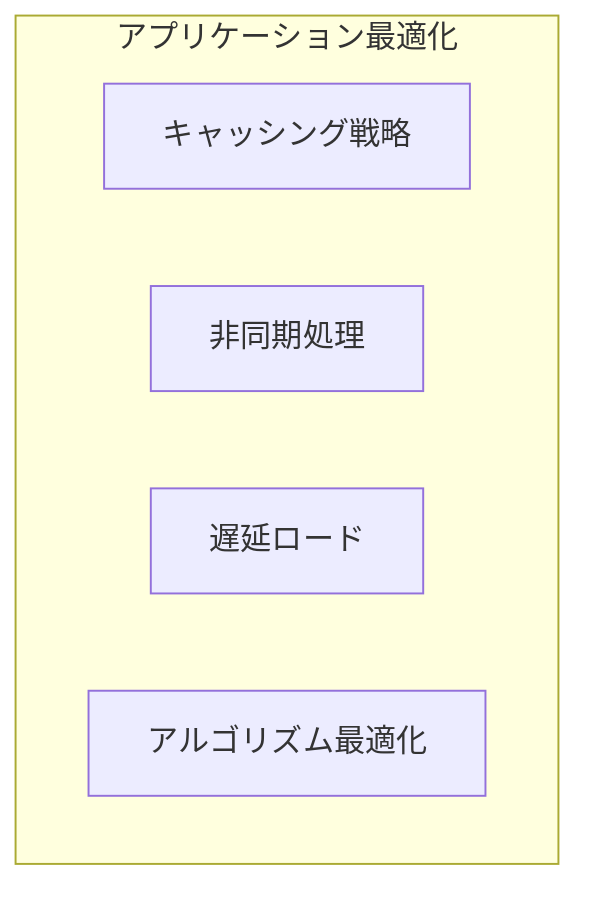
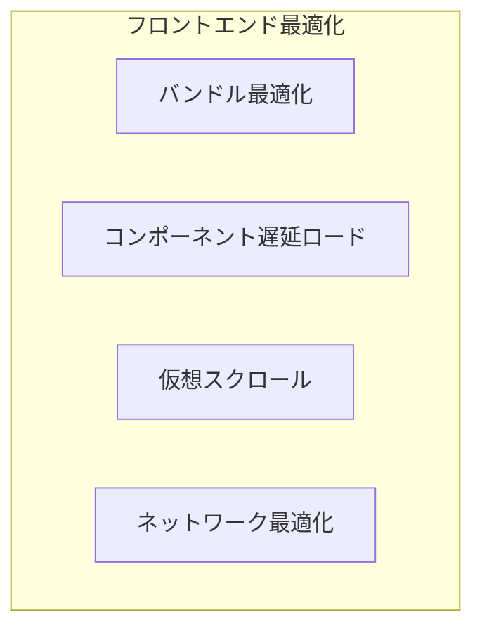
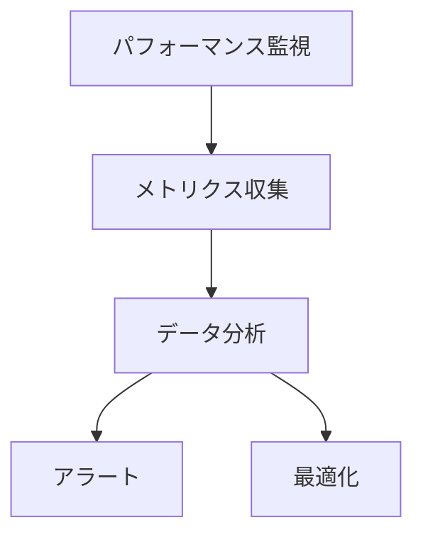

# 練習表自動生成システム 設計書：非機能要件対応（1/3）- 概要とパフォーマンス

本書では、「練習表自動生成システム」における非機能要件への対応方針について詳述します。システムの品質特性を確保するための設計上の考慮点を明確にし、開発・運用段階での指針とします。

## 1. 非機能要件の全体像

本システムでは、以下の非機能要件カテゴリについて対応方針を定義します。

## 2. パフォーマンス要件

本システムのパフォーマンス要件として、以下の目標値を設定します。

### 2.1 レスポンス時間目標

ユーザー体験の品質を確保するために、以下のレスポンス時間目標値を設定します。

| 操作カテゴリ | 平均レスポンス時間 | 90パーセンタイル | 最大許容時間 |
|------------|-----------------|--------------|------------|
| 画面表示（初期ロード） | 1.0秒以内 | 2.0秒以内 | 3.0秒以内 |
| 画面遷移 | 0.5秒以内 | 1.0秒以内 | 2.0秒以内 |
| データ検索・一覧表示 | 0.8秒以内 | 1.5秒以内 | 3.0秒以内 |
| 単純なデータ保存 | 0.5秒以内 | 1.0秒以内 | 2.0秒以内 |
| スケジュール自動生成 | 5.0秒以内 | 10.0秒以内 | 30.0秒以内 |
| PDF出力 | 3.0秒以内 | 5.0秒以内 | 10.0秒以内 |

### 2.2 同時アクセス対応

以下の同時アクセス状況下でも上記のレスポンス時間を維持できる設計とします。

| ユーザーカテゴリ | 通常時 | ピーク時 |
|----------------|-------|--------|
| 同時ログインユーザー数 | 20人 | 100人 |
| 同時アクティブユーザー数 | 10人 | 50人 |
| データ検索同時実行数 | 5件 | 20件 |
| スケジュール生成同時実行数 | 1件 | 3件 |

### 2.3 パフォーマンス最適化策

上記の目標を達成するために、以下の最適化策を実装します。

#### 2.3.1 データベース最適化

- **インデックス設計**：検索・ソートの頻度が高いフィールド（日付、会場ID、メンバーID、ステータスなど）に適切なインデックスを設定します
- **クエリチューニング**：
  - N+1問題を回避するための結合クエリの最適化
  - 大量データに対するページネーション実装
  - 不要なカラム取得の回避
- **非正規化戦略**：
  - スケジュール関連の集計データは非正規化テーブルに保持
  - 頻繁に参照される設定値はキャッシュに保持

#### 2.3.2 アプリケーション最適化

- **キャッシング戦略**：
  - アプリケーションレベルキャッシュ：頻繁に使用される設定データ、マスターデータ
  - HTTPレベルキャッシュ：静的リソース、稀に変更されるデータ
  - 分散キャッシュ：スケジュール最終表示状態、ユーザー権限情報

- **非同期処理**：
  - スケジュール自動生成処理はバックグラウンドジョブとして実行
  - PDFエクスポート処理はキューイング
  - メール通知などは非同期処理

- **アルゴリズム最適化**：
  - スケジュール生成アルゴリズムの計算量削減
  - 監督者割当アルゴリズムの最適化
  - メモ化を活用した再計算の回避

#### 2.3.3 フロントエンド最適化

- **バンドル最適化**：
  - コード分割とルートベースのチャンキング
  - 未使用コードの削除（ツリーシェイキング）
  - 画像・アセットの最適化

- **コンポーネント最適化**：
  - 大規模コンポーネントの遅延ロード
  - 不要な再レンダリングの防止
  - メモ化を活用したコンポーネント最適化

- **データ取得最適化**：
  - グラフQLの活用による必要データのみの取得
  - キャッシュファーストアプローチの実装
  - ページネーションとウィンドウベースのデータロード

### 2.4 パフォーマンス監視計画

パフォーマンス要件の達成状況を継続的に監視するための計画を以下に示します。

- **監視指標**：
  - API応答時間（エンドポイント別）
  - ページロード時間（画面別）
  - データベースクエリ実行時間
  - CPUとメモリ使用率
  - キャッシュヒット率

- **ツール導入**：
  - APM（Application Performance Monitoring）ソリューション
  - フロントエンドパフォーマンス監視
  - 合成モニタリング
  - リアルユーザーモニタリング

- **アラート設定**：
  - レスポンスタイム閾値超過
  - エラー率増加
  - リソース使用率閾値超過

## 2.5 負荷テスト計画

本番環境デプロイ前に以下の負荷テストを実施し、パフォーマンス要件の達成を検証します。

| テスト種別 | 目的 | 内容 |
|-----------|------|------|
| 負荷テスト | 通常負荷でのパフォーマンス検証 | 同時20ユーザーでの一般操作実行 |
| ストレステスト | 限界性能の把握 | 徐々に負荷を上げて限界点を特定 |
| 耐久テスト | 長時間安定性の確認 | 24時間連続で通常負荷をかけ続ける |
| スパイクテスト | 急激な負荷増加への対応 | 突発的な同時100ユーザーアクセス |

### 2.6 パフォーマンス要件のトレードオフ

パフォーマンス最適化における主なトレードオフと対応方針を以下に示します。

| トレードオフ | 対応方針 |
|------------|---------|
| 応答速度 vs 正確性 | スケジュール生成では正確性を優先し、プログレスインジケータで対応 |
| メモリ使用量 vs 処理速度 | 一部処理でメモリキャッシュを活用するが、サーバーリソースを考慮して上限設定 |
| リアルタイム性 vs サーバー負荷 | 通知系機能は準リアルタイムとし、ポーリング間隔を適切に設定 |
| 詳細データ vs ページ応答速度 | 大量データ表示時は必須項目のみ初期表示し、詳細は遅延ロード | 