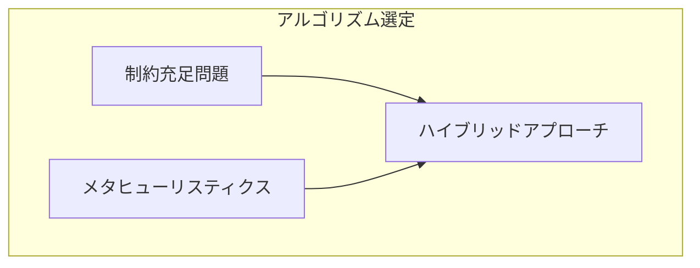
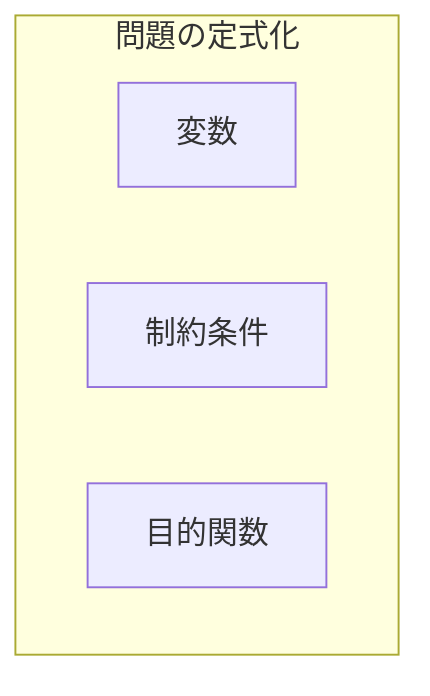
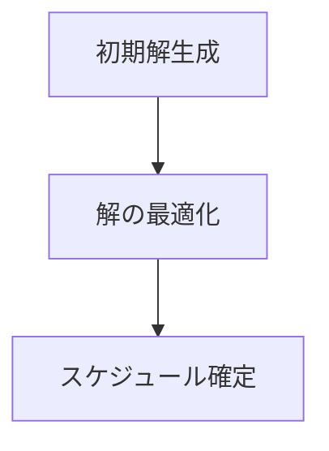
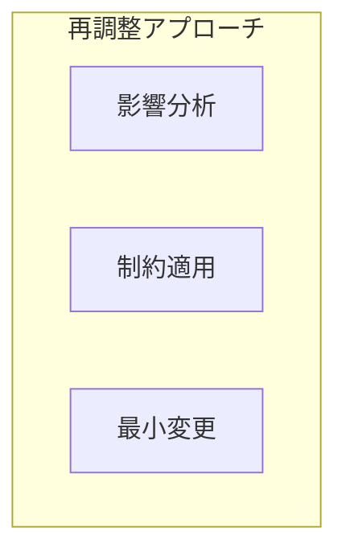
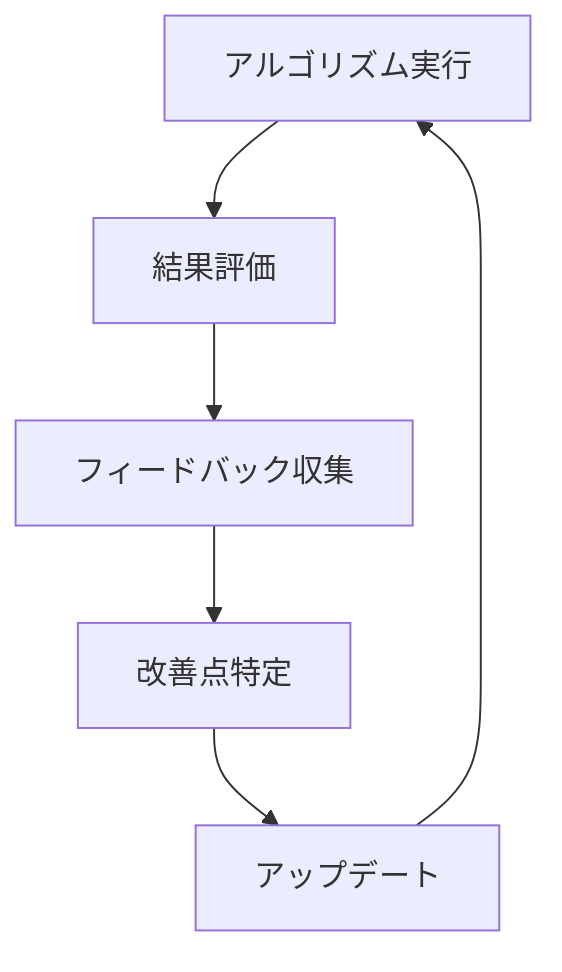

# 練習表自動生成システム 設計書：アルゴリズム詳細（1/2）- スケジュール生成

本書では、練習表自動生成システムの核となるアルゴリズムの詳細設計について記述します。特に、スケジュール生成アルゴリズムとローテーション最適化アルゴリズムに焦点を当てて説明します。

## 1. スケジュール生成アルゴリズム概要

スケジュール生成は本システムの中核機能です。メンバーの予定、会場の空き状況、パート間のバランスなどの制約条件を考慮しながら、最適な練習スケジュールを生成します。

### 1.1 アルゴリズムの目標

スケジュール生成アルゴリズムの主な目標は以下の通りです：

1. **実現可能性**：すべての制約条件（ハード制約）を満たすスケジュールを生成する
2. **最適性**：望ましい条件（ソフト制約）をできるだけ多く満たすスケジュールを生成する
3. **効率性**：現実的な時間内にスケジュールを生成する
4. **柔軟性**：優先度や制約条件の変更に対応できる設計とする

### 1.2 アルゴリズム選定

本システムでは、以下の理由から**制約充足問題（CSP）**と**メタヒューリスティクス**を組み合わせたハイブリッドアプローチを採用します：



| アルゴリズム | 長所 | 短所 | 適用範囲 |
|------------|-----|------|---------|
| 制約充足問題（CSP） | ハード制約を確実に満たす | 大規模問題での計算量 | ハード制約の充足 |
| 遺伝的アルゴリズム | 大域的最適解の探索 | 解の品質保証なし | 多目的最適化 |
| 焼きなまし法 | 局所解からの脱出 | パラメータ調整が必要 | 解の改善 |
| ヒューリスティックス | 計算効率が良い | 最適性の保証なし | 初期解生成 |

## 2. スケジュール生成のモデル化

### 2.1 問題の定式化

スケジュール生成問題を以下のように定式化します：



#### 2.1.1 決定変数

- $X_{ijkl}$：日付$i$、時間帯$j$、会場$k$、パート$l$のセッションが割り当てられるかどうか（1または0）
- $Y_{im}$：メンバー$m$が日付$i$のセッションに参加するかどうか（1または0）
- $Z_{ijk}$：日付$i$、時間帯$j$、会場$k$が使用されるかどうか（1または0）

#### 2.1.2 ハード制約

実現可能なスケジュールが満たすべき必須条件：

1. **会場容量制約**：各時間帯における会場の利用者数は会場の収容人数を超えない
   - $\sum_{l} \sum_{m} X_{ijkl} \cdot Y_{im} \leq Capacity_k \quad \forall i,j,k$

2. **会場利用可能時間制約**：会場が利用可能な時間帯のみスケジュールを組む
   - $X_{ijkl} \leq Availability_{ijk} \quad \forall i,j,k,l$

3. **同時刻重複回避制約**：同じメンバーが同じ時間に複数の場所にいることはできない
   - $\sum_{k} \sum_{l} X_{ijkl} \cdot Y_{im} \leq 1 \quad \forall i,j,m$

4. **最小参加人数制約**：各パートの最小必要人数を確保する
   - $\sum_{m} X_{ijkl} \cdot Y_{im} \cdot PartMember_{ml} \geq MinAttendance_l \quad \forall i,j,k,l$

5. **欠席メンバー考慮制約**：欠席届が提出されているメンバーはその日のスケジュールに含めない
   - $Y_{im} = 0 \quad \forall i,m \text{ where } Absence_{im} = 1$

#### 2.1.3 ソフト制約

スケジュールの質を高めるための望ましい条件：

1. **練習頻度均等性**：各パートの練習頻度をできるだけ均等にする
2. **メンバー参加率最大化**：できるだけ多くのメンバーが参加できるようにする
3. **会場利用効率最大化**：会場の無駄な空き時間を最小化する
4. **連続練習の最適化**：適切な間隔での練習セッションを配置する
5. **特別要望対応**：可能な限り特別な要望（特定の日の練習希望など）に対応する

#### 2.1.4 目的関数

ソフト制約の充足度を数値化した目的関数を最大化します：

$Maximize \quad w_1 \cdot PartFrequencyScore + w_2 \cdot MemberAttendanceScore + w_3 \cdot VenueUtilizationScore + w_4 \cdot ContinuityScore + w_5 \cdot SpecialRequestScore$

ここで、$w_1, w_2, \ldots, w_5$は各評価指標の重み係数です。

### 2.2 アルゴリズム設計

スケジュール生成アルゴリズムは以下の3段階で構成されます：



#### 2.2.1 初期解生成フェーズ

1. **グリーディ法による初期割り当て**
   - 会場の利用可能時間と各パートの優先度に基づいて、貪欲法で初期割り当てを行う
   - 最も制約の厳しいパート・時間帯から順に割り当てていく

2. **フィージビリティチェック**
   - 初期解がすべてのハード制約を満たしているか確認
   - 満たしていない場合は、制約違反の最小化を目指した調整を行う

#### 2.2.2 解の最適化フェーズ

1. **局所探索法**
   - 初期解を出発点として、近傍解を探索
   - セッションの移動、入れ替え、追加、削除などの操作で近傍を定義

2. **シミュレーテッドアニーリング**
   - 局所最適解に陥ることを防ぐため、確率的に悪化する解も受け入れる
   - 温度パラメータを徐々に下げながら探索範囲を狭めていく

```python
# シミュレーテッドアニーリングの疑似コード
def simulated_annealing(initial_solution, max_iterations, initial_temperature, cooling_rate):
    current_solution = initial_solution
    best_solution = initial_solution
    current_score = evaluate(current_solution)
    best_score = current_score
    temperature = initial_temperature
    
    for iteration in range(max_iterations):
        # 近傍解の生成
        neighbor = generate_neighbor(current_solution)
        
        # ハード制約チェック
        if not is_feasible(neighbor):
            continue
        
        # 評価値の計算
        neighbor_score = evaluate(neighbor)
        
        # 解の受理判定
        delta = neighbor_score - current_score
        if delta > 0 or random() < exp(delta / temperature):
            current_solution = neighbor
            current_score = neighbor_score
            
            # 最良解の更新
            if current_score > best_score:
                best_solution = current_solution
                best_score = current_score
        
        # 温度の更新
        temperature *= cooling_rate
    
    return best_solution
```

3. **遺伝的アルゴリズム**
   - 複数の解候補を維持し、交叉と突然変異によって新たな解を生成
   - 多様な解を探索することで、より良いスケジュールを発見

```python
# 遺伝的アルゴリズムの疑似コード
def genetic_algorithm(population_size, generations, mutation_rate, crossover_rate):
    # 初期集団の生成
    population = [generate_random_solution() for _ in range(population_size)]
    
    for generation in range(generations):
        # 評価
        fitness_scores = [evaluate(solution) for solution in population]
        
        # 次世代の集団
        new_population = []
        
        while len(new_population) < population_size:
            # 選択
            parent1 = selection(population, fitness_scores)
            parent2 = selection(population, fitness_scores)
            
            # 交叉
            if random() < crossover_rate:
                child1, child2 = crossover(parent1, parent2)
            else:
                child1, child2 = parent1, parent2
            
            # 突然変異
            if random() < mutation_rate:
                child1 = mutate(child1)
            if random() < mutation_rate:
                child2 = mutate(child2)
            
            # ハード制約チェック
            if is_feasible(child1):
                new_population.append(child1)
            if len(new_population) < population_size and is_feasible(child2):
                new_population.append(child2)
        
        population = new_population
    
    # 最良解を返す
    fitness_scores = [evaluate(solution) for solution in population]
    best_index = fitness_scores.index(max(fitness_scores))
    return population[best_index]
```

#### 2.2.3 スケジュール確定フェーズ

1. **後処理最適化**
   - 細かな調整による最終的な品質向上
   - パート間バランスの微調整
   - 連続する練習の間隔最適化

2. **実行可能性の最終確認**
   - すべてのハード制約が確実に満たされているか最終確認
   - 矛盾がある場合は修正または警告表示

3. **品質評価**
   - 生成されたスケジュールの品質スコアを計算
   - 各評価指標の詳細を可視化

### 2.3 アルゴリズムパラメータ

アルゴリズムの動作を調整するパラメータ：

| パラメータ | 説明 | デフォルト値 | 調整範囲 |
|-----------|------|-------------|---------|
| 初期温度 | シミュレーテッドアニーリングの初期温度 | 100.0 | 50.0-200.0 |
| 冷却率 | 温度の減少率 | 0.95 | 0.90-0.99 |
| 反復回数 | 最適化の反復回数 | 10000 | 5000-20000 |
| 集団サイズ | 遺伝的アルゴリズムの集団サイズ | 100 | 50-200 |
| 交叉率 | 交叉が発生する確率 | 0.8 | 0.6-0.9 |
| 突然変異率 | 突然変異が発生する確率 | 0.1 | 0.05-0.2 |
| 重み係数 | 各評価指標の重み | 均等配分 | 管理者が調整可能 |

## 3. 欠席情報を考慮したスケジュール再調整

既存の練習スケジュールに対して欠席情報が事後的に提出された場合、最小限の変更でスケジュールを再調整するアルゴリズムを設計します。

### 3.1 再調整のアプローチ



#### 3.1.1 影響分析

欠席情報が提出された際の影響を分析します：

1. **クリティカリティ評価**
   - 欠席するメンバーの役割重要度を評価
   - 監督者欠席の場合は優先度高で代替が必要
   - パート人数が最小人数を下回る場合は再調整が必要

2. **代替案の自動検討**
   - 欠席影響の少ないケース：変更なし
   - 監督者欠席：他の監督資格者で代替
   - パート人数不足：練習内容調整または日程変更

#### 3.1.2 再調整アルゴリズム

1. **最小変更原則**
   - できるだけ少ない変更で対応
   - 変更範囲を特定の日付・セッションに限定

2. **再調整手法**
   - **監督者再割当**：監督者が欠席する場合、別の監督資格者を割り当て
   - **セッション調整**：パート人数が不足する場合、練習内容を調整
   - **日程変更**：必要な場合のみ日程を変更（最終手段）

```python
# 再調整アルゴリズムの疑似コード
def reschedule_after_absences(schedule, new_absences):
    adjusted_schedule = copy(schedule)
    impact_assessment = assess_impact(schedule, new_absences)
    
    # 影響の少ないケースはスキップ
    if impact_assessment.criticality == 'LOW':
        return adjusted_schedule
    
    # 監督者欠席の処理
    supervisor_absences = filter_supervisor_absences(new_absences)
    for absence in supervisor_absences:
        session = find_affected_session(adjusted_schedule, absence)
        alternative_supervisors = find_alternative_supervisors(session.date)
        if alternative_supervisors:
            session.supervisor = select_best_supervisor(alternative_supervisors)
        else:
            # 代替監督者がいない場合の対応
            add_to_critical_issues(session, "No alternative supervisor available")
    
    # パート人数不足の処理
    part_shortage = identify_part_shortage(adjusted_schedule, new_absences)
    for part, date, session in part_shortage:
        if can_adjust_practice_content(session):
            adjust_practice_content(session)
        elif can_find_alternative_date(part, date, session):
            reschedule_to_alternative_date(adjusted_schedule, session)
        else:
            # 対応策がない場合の対応
            add_to_critical_issues(session, f"Part {part} shortage on {date}")
    
    return adjusted_schedule, get_critical_issues()
```

### 3.2 変更の優先順位と意思決定

変更が必要な場合の優先順位と意思決定プロセス：

| 変更種別 | 優先順位 | 自動/手動 | 承認者 |
|---------|---------|----------|-------|
| 練習内容の微調整 | 高 | 自動 | 不要 |
| 監督者の再割当 | 中 | 自動+通知 | 管理者 |
| セッション時間の変更 | 中 | 提案+承認 | 管理者 |
| 日程の変更 | 低 | 手動 | 管理者 |
| セッションの中止 | 最低 | 手動 | 管理者 |

### 3.3 再調整結果の評価

再調整されたスケジュールの品質を評価するための指標：

1. **変更量指標**：元のスケジュールからの変更量
2. **影響範囲指標**：変更による影響を受けるメンバー数
3. **ソフト制約満足度**：再調整後のソフト制約の充足度

## 4. パフォーマンス最適化

スケジュール生成アルゴリズムの実行時間を最適化するための戦略：

### 4.1 計算量削減

1. **探索空間の絞り込み**
   - 明らかに実現不可能な組み合わせを事前に除外
   - ヒューリスティクスによる有望解の優先的探索

2. **増分計算**
   - スケジュールの部分的な変更時に、影響範囲のみを再計算
   - 評価関数の効率的な実装

### 4.2 並列処理

1. **探索の並列化**
   - 複数の初期解からの並列探索
   - 遺伝的アルゴリズムの並列評価

2. **分散処理対応**
   - 大規模スケジュール生成時の分散処理
   - クラウドリソースの活用

### 4.3 メモリ最適化

1. **データ構造の最適化**
   - メモリ効率の良いデータ構造の使用
   - キャッシュ最適化

2. **インクリメンタル更新**
   - 全体の再計算ではなく差分更新を活用
   - 中間結果の効率的な保存と再利用

## 5. アルゴリズム改善計画

スケジュール生成アルゴリズムの継続的な改善計画：

### 5.1 フィードバックループ



1. **実績データ収集**
   - 生成されたスケジュールの実際の利用状況
   - 手動での調整箇所の記録
   - 利用者満足度調査

2. **機械学習による最適化**
   - 過去のスケジュールデータからのパターン学習
   - パラメータの自動チューニング
   - 予測モデルによる欠席予測の組み込み

### 5.2 バージョンアップ計画

| バージョン | 追加機能 | 予定時期 |
|-----------|---------|---------|
| 1.0 | 基本的なスケジュール生成 | リリース時 |
| 1.1 | 欠席情報を考慮した再調整 | リリース後3ヶ月 |
| 1.2 | パラメータ自動チューニング | リリース後6ヶ月 |
| 2.0 | 機械学習による予測組み込み | リリース後1年 | 