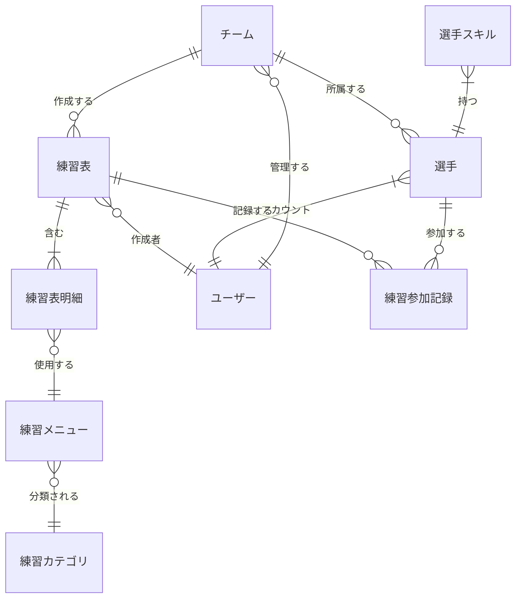
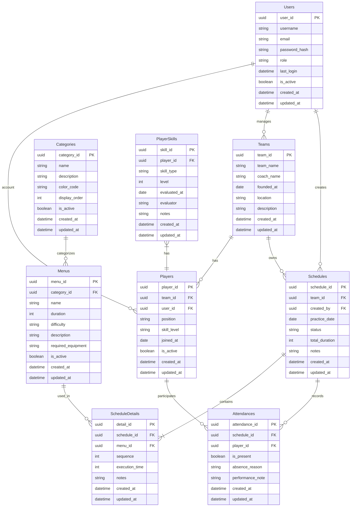
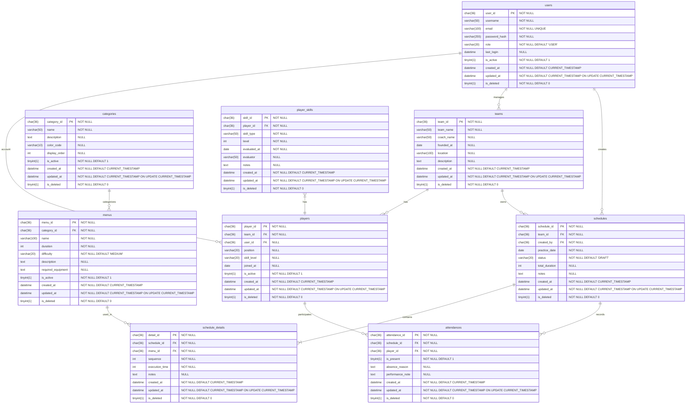

# ER図詳細

## 1. 概要

本ドキュメントでは、練習表自動生成システムのデータモデルを表現するER図について詳細に説明します。Entity-Relationship（実体関連）モデルは、データ構造を実体（エンティティ）とその関連（リレーションシップ）で表現するモデルであり、データベース設計の基礎となります。

本システムでは、概念レベル・論理レベル・物理レベルの3段階でER図を作成し、段階的に詳細化することで、要件からデータベース実装までの一貫性を確保します。

- **概念ER図**：ビジネス要件をエンティティと関連で表現した高レベルの図
- **論理ER図**：データベース設計に向けた正規化を考慮したモデル
- **物理ER図**：実際のDBMS実装を反映した詳細モデル

各図はMermaid記法を用いて記述し、データベース設計や実装の参照として活用します。

## 2. 概念ER図

概念ER図では、ビジネスドメインにおける主要な概念とその関連性を表現します。この段階では正規化や実装の詳細は考慮せず、業務上の関連性に焦点を当てています。

### 2.1 主要エンティティの説明

- **チーム**：練習を行う単位となるグループ
- **選手**：チームに所属し練習に参加する個人
- **練習表**：特定の日に行う練習の計画
- **練習表明細**：練習表の中の個別メニュー項目
- **練習メニュー**：繰り返し使用できる練習の内容
- **練習カテゴリ**：練習メニューの分類
- **ユーザー**：システムにアクセスする利用者
- **選手スキル**：選手の技術レベル
- **練習参加記録**：選手の練習への参加履歴

## 3. 論理ER図

論理ER図では、概念モデルを基に、正規化やパフォーマンスを考慮したデータモデルを表現します。このレベルでは主キーや外部キー、属性の詳細を定義します。

## 4. 物理ER図

物理ER図では、特定のDBMSの実装を考慮したデータモデルを表現します。テーブル名やカラム名、データ型、制約などを詳細に定義し、実際のデータベース実装の基礎となります。

## 5. テーブル定義

各テーブルの詳細な定義を示します。ここでは主要なテーブルについて説明します。

### 5.1 teams（チーム）テーブル

チームの基本情報を管理するテーブルです。

| カラム名 | データ型 | NULL | デフォルト | 説明 |
|----------|----------|------|------------|------|
| team_id | CHAR(36) | NO | - | チームを一意に識別するUUID |
| team_name | VARCHAR(50) | NO | - | チームの名称 |
| coach_name | VARCHAR(50) | YES | NULL | 監督/コーチの名前 |
| founded_at | DATE | YES | NULL | チームの設立日 |
| location | VARCHAR(100) | YES | NULL | 活動拠点 |
| description | TEXT | YES | NULL | チームの説明 |
| created_at | DATETIME | NO | CURRENT_TIMESTAMP | レコード作成日時 |
| updated_at | DATETIME | NO | CURRENT_TIMESTAMP | レコード更新日時 |
| is_deleted | TINYINT(1) | NO | 0 | 論理削除フラグ |

**インデックス**:
- PRIMARY KEY (team_id)
- INDEX idx_team_name (team_name)

### 5.2 players（選手）テーブル

選手情報を管理するテーブルです。

| カラム名 | データ型 | NULL | デフォルト | 説明 |
|----------|----------|------|------------|------|
| player_id | CHAR(36) | NO | - | 選手を一意に識別するUUID |
| team_id | CHAR(36) | NO | - | 所属チームのID（外部キー） |
| user_id | CHAR(36) | YES | NULL | 関連するユーザーアカウントのID（外部キー） |
| position | VARCHAR(20) | YES | NULL | プレイポジション |
| skill_level | VARCHAR(20) | YES | NULL | 技術レベル |
| joined_at | DATE | YES | NULL | チーム加入日 |
| is_active | TINYINT(1) | NO | 1 | アクティブフラグ |
| created_at | DATETIME | NO | CURRENT_TIMESTAMP | レコード作成日時 |
| updated_at | DATETIME | NO | CURRENT_TIMESTAMP | レコード更新日時 |
| is_deleted | TINYINT(1) | NO | 0 | 論理削除フラグ |

**インデックス**:
- PRIMARY KEY (player_id)
- FOREIGN KEY (team_id) REFERENCES teams(team_id)
- FOREIGN KEY (user_id) REFERENCES users(user_id)
- INDEX idx_team_id (team_id)
- INDEX idx_user_id (user_id)
- INDEX idx_position (position)

### 5.3 schedules（練習表）テーブル

練習表の基本情報を管理するテーブルです。

| カラム名 | データ型 | NULL | デフォルト | 説明 |
|----------|----------|------|------------|------|
| schedule_id | CHAR(36) | NO | - | 練習表を一意に識別するUUID |
| team_id | CHAR(36) | NO | - | 関連するチームのID（外部キー） |
| created_by | CHAR(36) | NO | - | 作成者のユーザーID（外部キー） |
| practice_date | DATE | NO | - | 練習実施日 |
| status | VARCHAR(20) | NO | 'DRAFT' | 練習表のステータス（DRAFT, PUBLISHED, CANCELED） |
| total_duration | INT | YES | NULL | 練習の合計時間（分） |
| notes | TEXT | YES | NULL | 備考 |
| created_at | DATETIME | NO | CURRENT_TIMESTAMP | レコード作成日時 |
| updated_at | DATETIME | NO | CURRENT_TIMESTAMP | レコード更新日時 |
| is_deleted | TINYINT(1) | NO | 0 | 論理削除フラグ |

**インデックス**:
- PRIMARY KEY (schedule_id)
- FOREIGN KEY (team_id) REFERENCES teams(team_id)
- FOREIGN KEY (created_by) REFERENCES users(user_id)
- INDEX idx_team_id (team_id)
- INDEX idx_practice_date (practice_date)
- INDEX idx_status (status)

## 6. リレーションシップ

主要なリレーションシップとその制約について説明します。

### 6.1 チームと選手の関係

- 関係：「1対多」（1つのチームに多数の選手が所属）
- 外部キー制約：players.team_id → teams.team_id
- ON DELETE：RESTRICT（チームが削除されるとき、関連する選手の削除をブロック）
- ON UPDATE：CASCADE（チームIDが変更されると選手のチームIDも更新）

### 6.2 練習表と練習表明細の関係

- 関係：「1対多」（1つの練習表に多数の明細項目）
- 外部キー制約：schedule_details.schedule_id → schedules.schedule_id
- ON DELETE：CASCADE（練習表が削除されるとき、関連する明細も削除）
- ON UPDATE：CASCADE（練習表IDが変更されると明細のIDも更新）

### 6.3 練習メニューとカテゴリの関係

- 関係：「多対1」（1つのカテゴリに多数のメニューが分類）
- 外部キー制約：menus.category_id → categories.category_id
- ON DELETE：RESTRICT（カテゴリが削除されるとき、関連するメニューの削除をブロック）
- ON UPDATE：CASCADE（カテゴリIDが変更されるとメニューのカテゴリIDも更新）

## 7. データ整合性制約

データベースの整合性を保証するための制約条件について説明します。

### 7.1 エンティティ整合性

- すべてのテーブルはUUID形式の主キーを持ち、一意性を保証
- 論理削除を使用し、物理削除を最小限に抑える（is_deletedフラグ）

### 7.2 参照整合性

- 外部キー制約により、参照整合性を保証
- ON DELETE/UPDATE動作を適切に設定し、データの一貫性を維持

### 7.3 ドメイン整合性

- 各カラムの適切なデータ型と長さを設定
- NULLの許可/不許可を適切に設定
- DEFAULT値による不正値の防止

### 7.4 ビジネスルール整合性

- トリガーやアプリケーションロジックによる複雑なビジネスルールの保証
  - 練習表のステータス遷移の制限
  - 練習時間の合計と個別メニュー時間の整合性確認
  - 選手の重複登録防止

## 8. データベース設計上の考慮点

### 8.1 パフォーマンス最適化

- 頻繁に検索される項目に対するインデックスの設定
- 大量データが予想されるテーブルでのパーティショニング検討
- 長期データに対するアーカイブ戦略

### 8.2 スケーラビリティ

- UUIDによる分散システムでのID生成の対応
- 将来的なシャーディングを考慮したテーブル設計
- 拡張性を考慮したカラム設計（予備カラムの検討）

### 8.3 セキュリティ

- 個人情報を含むカラムの暗号化
- データアクセス制御の考慮
- 監査証跡のための変更履歴管理 