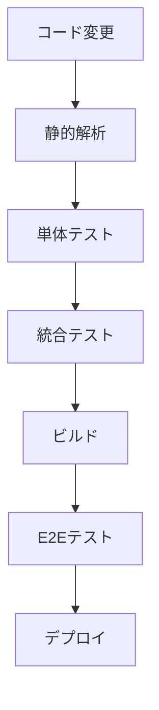

# 実装指針：テスト戦略

## 1. 概要

本ドキュメントでは、練習表自動生成システムのテスト戦略について説明します。品質を確保し、バグを早期に発見するための包括的なテスト手法を定義します。

## 2. テストピラミッド

テスト戦略は、以下のテストピラミッドに基づいて構築します：

```
    /\
   /E2E\
  /-----\
 /統合テスト\
/-------------\
/   単体テスト   \
-----------------
```

- **単体テスト**: 個々の関数、クラス、コンポーネントが期待通りに動作するか検証
- **統合テスト**: 複数のモジュールやシステムコンポーネント間の相互作用を検証
- **E2Eテスト**: ユーザーの視点からシステム全体の動作を検証

## 3. テスト種類と範囲

### 3.1 単体テスト

| 対象 | ツール | カバレッジ目標 |
|------|--------|--------------|
| フロントエンド | Vitest + Testing Library | 80% |
| バックエンド | Jest | 90% |

#### 3.1.1 フロントエンド単体テスト

- **コンポーネントテスト**: UIコンポーネントの表示と動作
- **Hooksテスト**: カスタムフックの動作
- **Utilsテスト**: ユーティリティ関数の動作

#### 3.1.2 バックエンド単体テスト

- **Serviceテスト**: ビジネスロジックのテスト
- **Repositoryテスト**: データアクセス層のテスト
- **Middlewareテスト**: ミドルウェアの動作検証

### 3.2 統合テスト

| 対象 | ツール | カバレッジ目標 |
|------|--------|--------------|
| フロントエンド | Vitest + Testing Library | 60% |
| バックエンド | Jest + Supertest | 70% |

#### 3.2.1 フロントエンド統合テスト

- **ページテスト**: 複数のコンポーネントが統合されたページの動作
- **ストアテスト**: Redux状態管理とコンポーネントの連携
- **APIテスト**: APIクライアントとモックサーバーの連携

#### 3.2.2 バックエンド統合テスト

- **API Routeテスト**: エンドポイントの動作検証
- **データフローテスト**: リクエストからレスポンスまでの一連の流れ
- **依存サービステスト**: 外部サービスとの連携

### 3.3 E2Eテスト

| 対象 | ツール | テスト範囲 |
|------|--------|----------|
| アプリケーション全体 | Cypress | 主要ユーザーフロー |

- **ユーザーフロー**: 重要なユーザーシナリオをカバー
- **クロスブラウザテスト**: 主要ブラウザでの動作検証
- **レスポンシブネステスト**: 様々な画面サイズでの表示確認

## 4. テスト自動化戦略

### 4.1 CI/CDパイプラインとの統合



### 4.2 テスト実行タイミング

| テスト種類 | 実行タイミング |
|-----------|--------------|
| 静的解析 | pre-commit, CI |
| 単体テスト | 開発中, pre-push, CI |
| 統合テスト | pre-push, CI |
| E2Eテスト | CI (プルリクエスト, main/master) |

### 4.3 テスト環境

- **開発環境**: ローカル開発マシン
- **CI環境**: GitHub Actions / Jenkins
- **ステージング環境**: 本番に近い環境でのE2Eテスト
- **プレプロダクション環境**: 最終検証

## 5. フロントエンドテスト実装例

### 5.1 コンポーネントテスト

```tsx
// ScheduleCard.test.tsx
import { render, screen, fireEvent } from '@testing-library/react';
import { ScheduleCard } from './ScheduleCard';

const mockSchedule = {
  id: 'schedule-1',
  practiceDate: '2023-05-10',
  startTime: '13:00',
  endTime: '15:00',
  location: '第2体育館',
  status: '公開済み'
};

describe('ScheduleCard', () => {
  test('スケジュール情報が正しく表示されること', () => {
    const onView = vi.fn();
    const onEdit = vi.fn();
    
    render(
      <ScheduleCard 
        schedule={mockSchedule} 
        onView={onView} 
        onEdit={onEdit} 
      />
    );
    
    // テキスト表示の検証
    expect(screen.getByText('2023-05-10')).toBeInTheDocument();
    expect(screen.getByText(/13:00 - 15:00/)).toBeInTheDocument();
    expect(screen.getByText(/第2体育館/)).toBeInTheDocument();
    
    // ボタンクリックの検証
    fireEvent.click(screen.getByText('詳細'));
    expect(onView).toHaveBeenCalledWith('schedule-1');
    
    fireEvent.click(screen.getByText('編集'));
    expect(onEdit).toHaveBeenCalledWith('schedule-1');
  });
});
```

### 5.2 カスタムフックテスト

```tsx
// useSchedules.test.tsx
import { renderHook, waitFor } from '@testing-library/react';
import { QueryClient, QueryClientProvider } from '@tanstack/react-query';
import { useSchedules } from './useSchedules';
import { scheduleService } from '@/services/scheduleService';

// APIモック
vi.mock('@/services/scheduleService', () => ({
  scheduleService: {
    getSchedules: vi.fn()
  }
}));

const mockSchedules = [
  {
    id: 'schedule-1',
    practiceDate: '2023-05-10',
    startTime: '13:00',
    endTime: '15:00',
    location: '第2体育館'
  }
];

describe('useSchedules', () => {
  let queryClient: QueryClient;

  beforeEach(() => {
    queryClient = new QueryClient({
      defaultOptions: {
        queries: {
          retry: false,
        },
      },
    });
    vi.clearAllMocks();
  });

  test('スケジュール一覧を取得できること', async () => {
    (scheduleService.getSchedules as vi.Mock).mockResolvedValue(mockSchedules);

    const wrapper = ({ children }: { children: React.ReactNode }) => (
      <QueryClientProvider client={queryClient}>{children}</QueryClientProvider>
    );

    const { result } = renderHook(() => useSchedules('team-1'), { wrapper });

    expect(result.current.isLoading).toBe(true);
    
    await waitFor(() => expect(result.current.isSuccess).toBe(true));

    expect(scheduleService.getSchedules).toHaveBeenCalledWith('team-1');
    expect(result.current.data).toEqual(mockSchedules);
  });
});
```

### 5.3 統合テスト

```tsx
// SchedulePage.test.tsx
import { render, screen, waitFor } from '@testing-library/react';
import { MemoryRouter, Routes, Route } from 'react-router-dom';
import { QueryClient, QueryClientProvider } from '@tanstack/react-query';
import { Provider } from 'react-redux';
import { configureStore } from '@reduxjs/toolkit';
import { SchedulePage } from './SchedulePage';
import { scheduleService } from '@/services/scheduleService';
import scheduleReducer from '@/store/schedule/scheduleSlice';

// APIモック
vi.mock('@/services/scheduleService', () => ({
  scheduleService: {
    getSchedules: vi.fn()
  }
}));

const mockSchedules = [
  {
    id: 'schedule-1',
    practiceDate: '2023-05-10',
    startTime: '13:00',
    endTime: '15:00',
    location: '第2体育館'
  }
];

describe('SchedulePage', () => {
  let queryClient: QueryClient;
  let store: ReturnType<typeof configureStore>;

  beforeEach(() => {
    queryClient = new QueryClient({
      defaultOptions: {
        queries: {
          retry: false,
        },
      },
    });
    
    store = configureStore({
      reducer: {
        schedule: scheduleReducer
      }
    });
    
    vi.clearAllMocks();
    (scheduleService.getSchedules as vi.Mock).mockResolvedValue(mockSchedules);
  });

  test('スケジュール一覧ページが正しく表示されること', async () => {
    render(
      <Provider store={store}>
        <QueryClientProvider client={queryClient}>
          <MemoryRouter initialEntries={['/team/team-1/schedules']}>
            <Routes>
              <Route 
                path="/team/:teamId/schedules" 
                element={<SchedulePage />} 
              />
            </Routes>
          </MemoryRouter>
        </QueryClientProvider>
      </Provider>
    );

    // ローディング状態の検証
    expect(screen.getByText(/読み込み中/i)).toBeInTheDocument();
    
    // データロード後の表示検証
    await waitFor(() => {
      expect(screen.getByText('練習スケジュール一覧')).toBeInTheDocument();
      expect(screen.getByText('2023-05-10')).toBeInTheDocument();
      expect(screen.getByText(/13:00 - 15:00/)).toBeInTheDocument();
    });
    
    expect(scheduleService.getSchedules).toHaveBeenCalledWith('team-1');
  });
});
```

## 6. バックエンドテスト実装例

### 6.1 サービス単体テスト

```typescript
// schedule.service.spec.ts
import { Test, TestingModule } from '@nestjs/testing';
import { ScheduleService } from './schedule.service';
import { ScheduleRepository } from './schedule.repository';
import { CreateScheduleDto } from './dto/create-schedule.dto';
import { Schedule } from './entities/schedule.entity';
import { NotFoundException } from '@nestjs/common';

describe('ScheduleService', () => {
  let service: ScheduleService;
  let repository: ScheduleRepository;

  const mockScheduleRepository = {
    create: jest.fn(),
    findAll: jest.fn(),
    findOneById: jest.fn(),
    findByTeamId: jest.fn(),
    update: jest.fn(),
    remove: jest.fn(),
  };

  beforeEach(async () => {
    const module: TestingModule = await Test.createTestingModule({
      providers: [
        ScheduleService,
        {
          provide: ScheduleRepository,
          useValue: mockScheduleRepository,
        },
      ],
    }).compile();

    service = module.get<ScheduleService>(ScheduleService);
    repository = module.get<ScheduleRepository>(ScheduleRepository);
  });

  afterEach(() => {
    jest.clearAllMocks();
  });

  describe('create', () => {
    it('スケジュールが正常に作成されること', async () => {
      const createScheduleDto: CreateScheduleDto = {
        teamId: 'team-1',
        practiceDate: new Date('2023-05-10'),
        startTime: '13:00',
        endTime: '15:00',
        location: '第2体育館',
      };

      const expectedResult: Partial<Schedule> = {
        id: 'schedule-1',
        ...createScheduleDto,
        status: 'draft',
      };

      mockScheduleRepository.create.mockResolvedValue(expectedResult);

      const result = await service.create(createScheduleDto);
      
      expect(result).toEqual(expectedResult);
      expect(mockScheduleRepository.create).toHaveBeenCalledWith(createScheduleDto);
    });
  });

  describe('findOne', () => {
    it('存在するIDで検索すると、スケジュールが返されること', async () => {
      const scheduleId = 'schedule-1';
      const expectedSchedule: Partial<Schedule> = {
        id: scheduleId,
        teamId: 'team-1',
        practiceDate: new Date('2023-05-10'),
      };

      mockScheduleRepository.findOneById.mockResolvedValue(expectedSchedule);

      const result = await service.findOne(scheduleId);
      
      expect(result).toEqual(expectedSchedule);
      expect(mockScheduleRepository.findOneById).toHaveBeenCalledWith(scheduleId);
    });

    it('存在しないIDで検索すると、NotFoundExceptionが発生すること', async () => {
      const scheduleId = 'non-existent-id';
      
      mockScheduleRepository.findOneById.mockResolvedValue(null);

      await expect(service.findOne(scheduleId)).rejects.toThrow(NotFoundException);
      expect(mockScheduleRepository.findOneById).toHaveBeenCalledWith(scheduleId);
    });
  });
});
```

### 6.2 コントローラー統合テスト

```typescript
// schedule.controller.spec.ts
import { Test, TestingModule } from '@nestjs/testing';
import { ScheduleController } from './schedule.controller';
import { ScheduleService } from './schedule.service';
import { CreateScheduleDto } from './dto/create-schedule.dto';
import { Schedule } from './entities/schedule.entity';
import { NotFoundException } from '@nestjs/common';

describe('ScheduleController', () => {
  let controller: ScheduleController;
  let service: ScheduleService;

  const mockScheduleService = {
    create: jest.fn(),
    findAll: jest.fn(),
    findOne: jest.fn(),
    findByTeamId: jest.fn(),
    update: jest.fn(),
    remove: jest.fn(),
  };

  beforeEach(async () => {
    const module: TestingModule = await Test.createTestingModule({
      controllers: [ScheduleController],
      providers: [
        {
          provide: ScheduleService,
          useValue: mockScheduleService,
        },
      ],
    }).compile();

    controller = module.get<ScheduleController>(ScheduleController);
    service = module.get<ScheduleService>(ScheduleService);
  });

  afterEach(() => {
    jest.clearAllMocks();
  });

  describe('create', () => {
    it('スケジュールが正常に作成されること', async () => {
      const createScheduleDto: CreateScheduleDto = {
        teamId: 'team-1',
        practiceDate: new Date('2023-05-10'),
        startTime: '13:00',
        endTime: '15:00',
        location: '第2体育館',
      };

      const expectedResult: Partial<Schedule> = {
        id: 'schedule-1',
        ...createScheduleDto,
        status: 'draft',
      };

      mockScheduleService.create.mockResolvedValue(expectedResult);

      const result = await controller.create(createScheduleDto);
      
      expect(result).toEqual(expectedResult);
      expect(mockScheduleService.create).toHaveBeenCalledWith(createScheduleDto);
    });
  });

  describe('findAll', () => {
    it('ページネーションパラメータを使用して全スケジュールを取得すること', async () => {
      const paginationDto = { page: 1, limit: 10 };
      const expectedSchedules = [
        { id: 'schedule-1' },
        { id: 'schedule-2' },
      ];

      mockScheduleService.findAll.mockResolvedValue(expectedSchedules);

      const result = await controller.findAll(paginationDto);
      
      expect(result).toEqual(expectedSchedules);
      expect(mockScheduleService.findAll).toHaveBeenCalledWith(paginationDto);
    });
  });
});
```

### 6.3 E2Eテスト

```typescript
// schedule.e2e-spec.ts
import { Test, TestingModule } from '@nestjs/testing';
import { INestApplication, ValidationPipe } from '@nestjs/common';
import * as request from 'supertest';
import { AppModule } from '../src/app.module';
import { HttpExceptionFilter } from '../src/core/filters/http-exception.filter';
import { AuthService } from '../src/modules/auth/auth.service';

describe('ScheduleController (e2e)', () => {
  let app: INestApplication;
  let authService: AuthService;
  let jwtToken: string;

  beforeAll(async () => {
    const moduleFixture: TestingModule = await Test.createTestingModule({
      imports: [AppModule],
    }).compile();

    app = moduleFixture.createNestApplication();
    app.useGlobalPipes(
      new ValidationPipe({
        whitelist: true,
        transform: true,
      }),
    );
    app.useGlobalFilters(new HttpExceptionFilter());
    await app.init();

    // 認証サービスを取得
    authService = moduleFixture.get<AuthService>(AuthService);
    
    // テスト用のユーザーでログイン
    const authResult = await authService.login({
      id: 'user-1',
      email: 'coach@example.com',
      roles: ['COACH'],
    });
    
    jwtToken = authResult.accessToken;
  });

  afterAll(async () => {
    await app.close();
  });

  describe('/api/schedules (POST)', () => {
    it('認証済みユーザーが練習スケジュールを作成できること', () => {
      const createScheduleDto = {
        teamId: 'team-1',
        practiceDate: '2023-05-10',
        startTime: '13:00',
        endTime: '15:00',
        location: '第2体育館',
      };

      return request(app.getHttpServer())
        .post('/api/schedules')
        .set('Authorization', `Bearer ${jwtToken}`)
        .send(createScheduleDto)
        .expect(201)
        .then((response) => {
          expect(response.body).toHaveProperty('id');
          expect(response.body.teamId).toBe(createScheduleDto.teamId);
          expect(response.body.practiceDate).toContain('2023-05-10');
          expect(response.body.location).toBe(createScheduleDto.location);
        });
    });

    it('認証なしでアクセスすると401エラーが返されること', () => {
      const createScheduleDto = {
        teamId: 'team-1',
        practiceDate: '2023-05-10',
        startTime: '13:00',
        endTime: '15:00',
        location: '第2体育館',
      };

      return request(app.getHttpServer())
        .post('/api/schedules')
        .send(createScheduleDto)
        .expect(401);
    });

    it('無効なデータを送信すると400エラーが返されること', () => {
      // 必須フィールドを省略
      const invalidDto = {
        teamId: 'team-1',
        // practiceDate が欠落
        startTime: '13:00',
        endTime: '15:00',
      };

      return request(app.getHttpServer())
        .post('/api/schedules')
        .set('Authorization', `Bearer ${jwtToken}`)
        .send(invalidDto)
        .expect(400);
    });
  });
});
```

## 7. Cypressによる E2Eテスト

### 7.1 テスト実装例

```typescript
// cypress/e2e/schedule-management.cy.ts
describe('練習スケジュール管理', () => {
  beforeEach(() => {
    // テスト用ユーザーでログイン
    cy.login('coach@example.com', 'password');
    
    // チーム選択ページに移動
    cy.visit('/teams');
    
    // テスト用チームを選択
    cy.contains('テストチーム').click();
  });

  it('新しい練習スケジュールを作成できること', () => {
    // スケジュール一覧に移動
    cy.contains('練習スケジュール').click();
    
    // 新規作成ボタンをクリック
    cy.contains('新規作成').click();
    
    // フォームに入力
    cy.get('[data-testid=practice-date]').type('2023-05-15');
    cy.get('[data-testid=start-time]').type('13:00');
    cy.get('[data-testid=end-time]').type('15:00');
    cy.get('[data-testid=location]').type('第2体育館');
    
    // 保存ボタンをクリック
    cy.contains('保存').click();
    
    // 成功メッセージの表示を確認
    cy.contains('練習スケジュールが作成されました').should('be.visible');
    
    // スケジュール一覧に戻り、作成したアイテムを確認
    cy.contains('2023-05-15').should('be.visible');
    cy.contains('13:00 - 15:00').should('be.visible');
    cy.contains('第2体育館').should('be.visible');
  });

  it('既存の練習スケジュールを編集できること', () => {
    // スケジュール一覧に移動
    cy.contains('練習スケジュール').click();
    
    // 既存のスケジュールの編集ボタンをクリック
    cy.contains('tr', '2023-05-10')
      .find('[data-testid=edit-button]')
      .click();
    
    // 場所を変更
    cy.get('[data-testid=location]')
      .clear()
      .type('新体育館');
    
    // 保存ボタンをクリック
    cy.contains('保存').click();
    
    // 成功メッセージの表示を確認
    cy.contains('練習スケジュールが更新されました').should('be.visible');
    
    // 更新された情報を確認
    cy.contains('新体育館').should('be.visible');
  });

  it('練習スケジュールを削除できること', () => {
    // スケジュール一覧に移動
    cy.contains('練習スケジュール').click();
    
    // 既存のスケジュールの削除ボタンをクリック
    cy.contains('tr', '2023-05-10')
      .find('[data-testid=delete-button]')
      .click();
    
    // 確認ダイアログの削除ボタンをクリック
    cy.contains('削除').click();
    
    // 成功メッセージの表示を確認
    cy.contains('練習スケジュールが削除されました').should('be.visible');
    
    // 削除されたアイテムがリストに表示されないことを確認
    cy.contains('2023-05-10').should('not.exist');
  });
});
```

### 7.2 カスタムコマンド

```typescript
// cypress/support/commands.ts
Cypress.Commands.add('login', (email: string, password: string) => {
  cy.session([email, password], () => {
    cy.visit('/login');
    cy.get('[data-testid=email-input]').type(email);
    cy.get('[data-testid=password-input]').type(password);
    cy.get('[data-testid=login-button]').click();
    cy.url().should('include', '/dashboard');
  });
});

Cypress.Commands.add('createSchedule', (scheduleData: any) => {
  cy.request({
    method: 'POST',
    url: '/api/schedules',
    body: scheduleData,
    headers: {
      Authorization: `Bearer ${Cypress.env('token')}`,
    },
  });
});
```

## 8. テスト可能なコードの作成ガイドライン

### 8.1 フロントエンド

- **関心の分離**: 表示（UI）とロジックを分離する
- **純粋コンポーネント**: props のみに依存する再利用可能なコンポーネントを作成
- **フックの分離**: ロジックを独立したカスタムフックに分離
- **テスト可能な状態管理**: グローバル状態へのアクセスをラップして依存性を隔離

### 8.2 バックエンド

- **依存性の注入**: 外部依存を注入可能にして、モックを容易にする
- **インターフェースの活用**: 具象クラスではなくインターフェースに依存する
- **ドメインロジックの分離**: ビジネスロジックをインフラストラクチャから分離
- **副作用の制限**: 副作用を特定のレイヤーに制限する

## 9. テスト計画とレポート

### 9.1 テスト実施計画

- **定期的なテスト実行**: CI/CD パイプラインでの自動実行
- **回帰テスト**: 主要機能の変更時に実施
- **パフォーマンステスト**: 月次で実施
- **セキュリティテスト**: 四半期ごとに実施

### 9.2 テストレポート

- **カバレッジレポート**: Jest/Vitest + Istanbul によるコードカバレッジ
- **テスト結果ダッシュボード**: テスト成功率とトレンド
- **バグトラッキング**: 発見されたバグとその状態

## 10. まとめ

本テスト戦略は、以下のポイントを重視しています：

1. **階層的アプローチ**: テストピラミッドに基づく効率的なテスト構造
2. **自動化**: CI/CDと統合された自動テスト
3. **カバレッジ**: 重要な機能と高リスク領域の優先的なカバー
4. **保守性**: テスト自体の保守性を確保する設計

この戦略に従うことで、高品質なソフトウェアの提供と、効率的な開発プロセスの両立を実現します。 