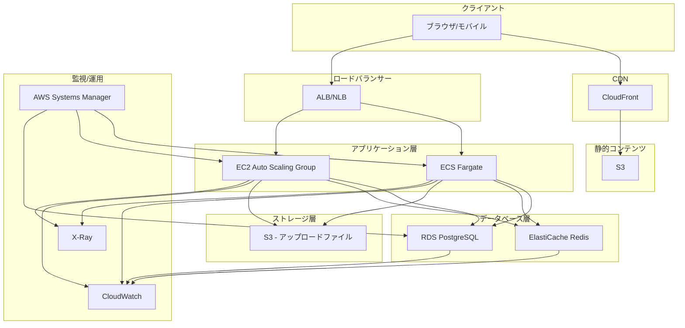
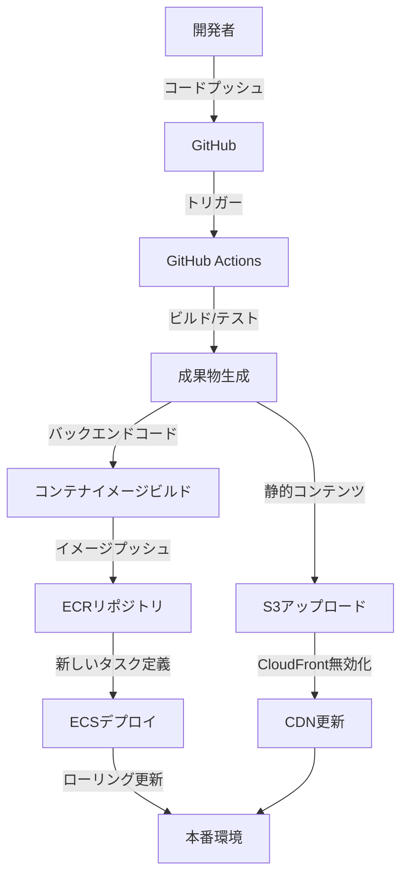

# 実装指針：デプロイとインフラストラクチャ

## 1. 概要

本ドキュメントでは、練習表自動生成システムのデプロイとインフラストラクチャに関する指針について説明します。安定性、スケーラビリティ、セキュリティを確保するための設計と運用方法を定義します。

## 2. デプロイアーキテクチャ

### 2.1 全体構成

システムは以下の環境で構成されます：

- **開発環境**: 開発者のローカル環境およびCI/CD環境
- **テスト環境**: QAテスト、統合テスト用の環境
- **ステージング環境**: 本番と同等の構成を持つ検証環境
- **本番環境**: エンドユーザーが使用する実運用環境

### 2.2 デプロイアーキテクチャ図



## 3. インフラストラクチャ技術スタック

### 3.1 クラウドプラットフォーム

- **メインプラットフォーム**: AWS
- **代替プラットフォーム**: Azure/GCP（ハイブリッド構成の場合）

### 3.2 主要サービス

| カテゴリ | サービス | 用途 |
|---------|--------|------|
| コンピューティング | ECS Fargate, EC2 | アプリケーション実行環境 |
| データベース | RDS PostgreSQL | メインデータベース |
| キャッシュ | ElastiCache Redis | キャッシュ、セッション管理 |
| ストレージ | S3 | 静的ファイル、バックアップ |
| CDN | CloudFront | 静的コンテンツ配信 |
| ネットワーク | VPC, ALB/NLB | ネットワーク分離、負荷分散 |
| セキュリティ | WAF, Security Groups, IAM | セキュリティ対策 |
| モニタリング | CloudWatch, X-Ray | 監視、トレーシング |
| CI/CD | CodePipeline, GitHub Actions | 継続的デリバリー |

## 4. インフラストラクチャ設計

### 4.1 ネットワーク設計

AWS VPC を利用した多層ネットワーク設計を採用します：

```
+------------------------+
| VPC (10.0.0.0/16)      |
|                        |
| +--------------------+ |
| | パブリックサブネット  | |
| | 10.0.1.0/24        | |
| | 10.0.2.0/24        | |
| | (ALB, NAT Gateway) | |
| +--------------------+ |
|                        |
| +--------------------+ |
| | アプリケーションサブネット |
| | 10.0.3.0/24        | |
| | 10.0.4.0/24        | |
| | (ECS, EC2)         | |
| +--------------------+ |
|                        |
| +--------------------+ |
| | データベースサブネット |
| | 10.0.5.0/24        | |
| | 10.0.6.0/24        | |
| | (RDS, ElastiCache) | |
| +--------------------+ |
+------------------------+
```

### 4.2 セキュリティ設計

- **ネットワークセキュリティ**:
  - セキュリティグループによるトラフィック制限
  - NACLによる追加のネットワークフィルタリング
  - VPCエンドポイントでのAWSサービスプライベートアクセス

- **アプリケーションセキュリティ**:
  - WAFによるWebアプリケーション保護
  - セキュアな通信（HTTPS、TLS 1.2+）
  - シークレット管理（AWS Secrets Manager）

- **データセキュリティ**:
  - データベース暗号化（保存時）
  - S3オブジェクト暗号化
  - バックアップの暗号化

### 4.3 高可用性設計

- **マルチAZ配置**:
  - 複数のアベイラビリティゾーンにリソースを配置
  - ALBによる負荷分散とヘルスチェック
  - RDSマルチAZ構成

- **障害自動復旧**:
  - Auto Scalingによる障害インスタンスの自動置換
  - ECSサービスの自動回復
  - RDSの自動フェイルオーバー

### 4.4 スケーラビリティ設計

- **水平スケーリング**:
  - Auto Scalingによるインスタンス数の動的調整
  - ECSタスク数の自動スケーリング
  - Amazon Aurora Serverlessの検討（トラフィック変動が大きい場合）

- **垂直スケーリング**:
  - インスタンスタイプの選定と適宜アップグレード
  - データベースインスタンスクラスの最適化

## 5. デプロイパイプライン

### 5.1 CI/CDフロー



### 5.2 デプロイ戦略

- **フロントエンド**:
  - 静的コンテンツをS3にアップロード
  - CloudFrontキャッシュの無効化
  - 複数バージョンのサポート（A/Bテスト用）

- **バックエンド**:
  - ブルー/グリーンデプロイ
  - カナリアリリース（段階的なトラフィック移行）
  - ローリングアップデート

### 5.3 GitHub Actionsワークフロー例

```yaml
# .github/workflows/deploy.yml
name: Deploy to Production

on:
  push:
    branches: [main]

jobs:
  test:
    runs-on: ubuntu-latest
    steps:
      - uses: actions/checkout@v3
      - name: Set up Node.js
        uses: actions/setup-node@v3
        with:
          node-version: '18'
      - name: Install dependencies
        run: npm ci
      - name: Run tests
        run: npm test

  build-frontend:
    needs: test
    runs-on: ubuntu-latest
    steps:
      - uses: actions/checkout@v3
      - name: Set up Node.js
        uses: actions/setup-node@v3
        with:
          node-version: '18'
      - name: Install dependencies
        run: cd frontend && npm ci
      - name: Build
        run: cd frontend && npm run build
      - name: Upload artifact
        uses: actions/upload-artifact@v3
        with:
          name: frontend-build
          path: frontend/dist

  build-backend:
    needs: test
    runs-on: ubuntu-latest
    steps:
      - uses: actions/checkout@v3
      - name: Set up Docker Buildx
        uses: docker/setup-buildx-action@v2
      - name: Login to Amazon ECR
        uses: aws-actions/amazon-ecr-login@v1
      - name: Build and push
        uses: docker/build-push-action@v4
        with:
          context: ./backend
          push: true
          tags: ${{ secrets.AWS_ECR_REPO_URI }}:${{ github.sha }}

  deploy-frontend:
    needs: build-frontend
    runs-on: ubuntu-latest
    steps:
      - name: Download artifact
        uses: actions/download-artifact@v3
        with:
          name: frontend-build
          path: frontend-build
      - name: Configure AWS credentials
        uses: aws-actions/configure-aws-credentials@v1
        with:
          aws-access-key-id: ${{ secrets.AWS_ACCESS_KEY_ID }}
          aws-secret-access-key: ${{ secrets.AWS_SECRET_ACCESS_KEY }}
          aws-region: ap-northeast-1
      - name: Deploy to S3
        run: aws s3 sync frontend-build/ s3://${{ secrets.S3_BUCKET }} --delete
      - name: Invalidate CloudFront cache
        run: aws cloudfront create-invalidation --distribution-id ${{ secrets.CLOUDFRONT_DISTRIBUTION_ID }} --paths "/*"

  deploy-backend:
    needs: build-backend
    runs-on: ubuntu-latest
    steps:
      - name: Configure AWS credentials
        uses: aws-actions/configure-aws-credentials@v1
        with:
          aws-access-key-id: ${{ secrets.AWS_ACCESS_KEY_ID }}
          aws-secret-access-key: ${{ secrets.AWS_SECRET_ACCESS_KEY }}
          aws-region: ap-northeast-1
      - name: Download task definition
        run: aws ecs describe-task-definition --task-definition ${{ secrets.ECS_TASK_DEFINITION }} --query taskDefinition > task-definition.json
      - name: Update ECS task definition
        id: task-def
        uses: aws-actions/amazon-ecs-render-task-definition@v1
        with:
          task-definition: task-definition.json
          container-name: ${{ secrets.ECS_CONTAINER_NAME }}
          image: ${{ secrets.AWS_ECR_REPO_URI }}:${{ github.sha }}
      - name: Deploy to Amazon ECS
        uses: aws-actions/amazon-ecs-deploy-task-definition@v1
        with:
          task-definition: ${{ steps.task-def.outputs.task-definition }}
          service: ${{ secrets.ECS_SERVICE }}
          cluster: ${{ secrets.ECS_CLUSTER }}
          wait-for-service-stability: true
```

## 6. コンテナ化戦略

### 6.1 Dockerイメージ最適化

- **マルチステージビルド**: ビルド時の依存関係を含めない最小イメージ
- **ベースイメージ選定**: Alpine Linuxなどの軽量イメージの使用
- **レイヤーキャッシュ**: 変更頻度に基づく効率的なレイヤー構成

### 6.2 バックエンドDockerfile例

```dockerfile
# ビルドステージ
FROM node:18-alpine AS build
WORKDIR /app
COPY package*.json ./
RUN npm ci
COPY . .
RUN npm run build

# 実行ステージ
FROM node:18-alpine
WORKDIR /app
ENV NODE_ENV=production
COPY --from=build /app/package*.json ./
COPY --from=build /app/node_modules ./node_modules
COPY --from=build /app/dist ./dist

# ヘルスチェック設定
HEALTHCHECK --interval=30s --timeout=3s --start-period=5s --retries=3 \
  CMD wget -q --spider http://localhost:3000/health || exit 1

# 非root ユーザーで実行
USER node

# コンテナ起動コマンド
CMD ["node", "dist/main"]
EXPOSE 3000
```

### 6.3 コンテナオーケストレーション

- **ECS Fargate**: サーバーレスコンテナ実行環境
- **タスク定義**: CPU/メモリ割り当て、ネットワーク、ボリューム設定
- **サービス設定**: 自動スケーリング、ロードバランシング、ヘルスチェック

## 7. バックアップと災害復旧

### 7.1 バックアップ戦略

- **データベース**:
  - RDS自動バックアップ（日次）
  - 手動スナップショット（重要な変更前）
  - Point-in-Time Recovery（PITR）の有効化

- **アプリケーションデータ**:
  - S3バージョニングの有効化
  - クロスリージョンレプリケーション

- **設定/コード**:
  - Infrastructure as Code（IaC）によるインフラ定義
  - GitHubリポジトリのバックアップ

### 7.2 災害復旧計画

- **RPO（目標復旧時点）**: 1時間以内
- **RTO（目標復旧時間）**: 4時間以内

- **復旧シナリオ**:
  1. **単一コンポーネント障害**: 自動フェイルオーバーで対応
  2. **AZ障害**: マルチAZ構成で自動的に他AZに移行
  3. **リージョン障害**: クロスリージョンバックアップからの復元

## 8. モニタリングと運用

### 8.1 監視指標

以下の主要指標を継続的に監視します：

- **インフラストラクチャ指標**:
  - CPU/メモリ使用率
  - ディスク使用量/I/O
  - ネットワークトラフィック

- **アプリケーション指標**:
  - レスポンスタイム
  - エラー率
  - リクエスト数
  - アクティブユーザー数

- **データベース指標**:
  - クエリ実行時間
  - コネクション数
  - リードレプリカラグ
  - キャッシュヒット率

### 8.2 アラート設定

緊急度に応じた3段階のアラートレベルを設定します：

1. **情報（Info）**: 通常範囲を超える傾向があるが、即時対応不要
2. **警告（Warning）**: 潜在的な問題があり、計画的な対応が必要
3. **重大（Critical）**: 即時対応が必要なサービス影響の可能性がある問題

### 8.3 ログ管理

- **集中ログ収集**: CloudWatch Logs
- **ログ保持ポリシー**: 
  - 運用ログ: 30日
  - アクセスログ: 90日
  - セキュリティログ: 1年
- **ログ分析**: CloudWatch Logs Insights, Elasticsearch

### 8.4 運用自動化

- **インフラストラクチャの自動スケーリング**
- **定期的なメンテナンスタスクの自動化**
- **チャットボット連携によるインシデント通知**
- **自動復旧手順の実装**

## 9. コスト最適化

### 9.1 コスト削減戦略

- **適切なインスタンスサイズとタイプの選定**
- **リザーブドインスタンス/Savings Plansの活用**
- **AutoScalingによる需要に応じたリソース調整**
- **ストレージのライフサイクル管理**
- **キャッシュ戦略の最適化**

### 9.2 リソースタグ付け規則

以下のタグをすべてのリソースに付与し、コスト配分とリソース管理を容易にします：

- `Project`: プロジェクト名
- `Environment`: 環境（dev/test/stage/prod）
- `Service`: マイクロサービス/コンポーネント名
- `Owner`: 責任者/チーム
- `CostCenter`: コスト配分先

## 10. セキュリティとコンプライアンス

### 10.1 セキュリティ対策

- **最小権限の原則適用**: IAMポリシーの厳格な管理
- **侵入検知/防止**: WAF, GuardDuty, Shield
- **脆弱性管理**: Inspector, 定期的な脆弱性スキャン
- **証跡記録**: CloudTrail, VPCフローログ
- **秘密情報管理**: Secrets Manager, KMS

### 10.2 コンプライアンス対応

- **PCI DSS**: カード情報処理に関するセキュリティ基準
- **GDPR**: 個人情報保護規制
- **ISO 27001**: 情報セキュリティマネジメント
- **定期的なセキュリティ監査**: 第三者による監査

## 11. インフラスクリプト例

### 11.1 Terraform例（VPC設定）

```hcl
provider "aws" {
  region = "ap-northeast-1"
}

module "vpc" {
  source = "terraform-aws-modules/vpc/aws"
  version = "~> 3.0"

  name = "practice-schedule-vpc"
  cidr = "10.0.0.0/16"

  azs             = ["ap-northeast-1a", "ap-northeast-1c"]
  private_subnets = ["10.0.1.0/24", "10.0.2.0/24"]
  public_subnets  = ["10.0.101.0/24", "10.0.102.0/24"]
  database_subnets = ["10.0.201.0/24", "10.0.202.0/24"]

  enable_nat_gateway = true
  single_nat_gateway = false
  one_nat_gateway_per_az = true

  enable_vpn_gateway = false

  tags = {
    Project     = "practice-schedule"
    Environment = "production"
    Terraform   = "true"
  }
}

# RDS Subnet Group
resource "aws_db_subnet_group" "main" {
  name       = "practice-schedule-db-subnet"
  subnet_ids = module.vpc.database_subnets
  
  tags = {
    Project     = "practice-schedule"
    Environment = "production"
  }
}

# Security Group for RDS
resource "aws_security_group" "db" {
  name        = "practice-schedule-db-sg"
  description = "Security group for RDS instances"
  vpc_id      = module.vpc.vpc_id

  ingress {
    from_port       = 5432
    to_port         = 5432
    protocol        = "tcp"
    security_groups = [aws_security_group.app.id]
  }

  tags = {
    Project     = "practice-schedule"
    Environment = "production"
  }
}

# Security Group for Application
resource "aws_security_group" "app" {
  name        = "practice-schedule-app-sg"
  description = "Security group for application instances"
  vpc_id      = module.vpc.vpc_id

  egress {
    from_port   = 0
    to_port     = 0
    protocol    = "-1"
    cidr_blocks = ["0.0.0.0/0"]
  }

  tags = {
    Project     = "practice-schedule"
    Environment = "production"
  }
}
```

### 11.2 CloudFormation例（ECSサービス）

```yaml
AWSTemplateFormatVersion: '2010-09-09'
Description: 'ECS Service for Practice Schedule Backend'

Parameters:
  VPC:
    Type: AWS::EC2::VPC::Id
    Description: VPC where the ECS service will be deployed

  Subnets:
    Type: List<AWS::EC2::Subnet::Id>
    Description: Subnets where the ECS tasks will be placed
  
  ContainerImage:
    Type: String
    Description: ECR image URI for the backend container

Resources:
  ECSCluster:
    Type: AWS::ECS::Cluster
    Properties:
      ClusterName: practice-schedule-cluster
      CapacityProviders:
        - FARGATE
        - FARGATE_SPOT
      DefaultCapacityProviderStrategy:
        - CapacityProvider: FARGATE
          Weight: 1

  TaskExecutionRole:
    Type: AWS::IAM::Role
    Properties:
      AssumeRolePolicyDocument:
        Version: '2012-10-17'
        Statement:
          - Effect: Allow
            Principal:
              Service: ecs-tasks.amazonaws.com
            Action: sts:AssumeRole
      ManagedPolicyArns:
        - arn:aws:iam::aws:policy/service-role/AmazonECSTaskExecutionRolePolicy

  TaskDefinition:
    Type: AWS::ECS::TaskDefinition
    Properties:
      Family: practice-schedule-backend
      NetworkMode: awsvpc
      RequiresCompatibilities:
        - FARGATE
      Cpu: '512'
      Memory: '1024'
      ExecutionRoleArn: !GetAtt TaskExecutionRole.Arn
      ContainerDefinitions:
        - Name: backend
          Image: !Ref ContainerImage
          Essential: true
          PortMappings:
            - ContainerPort: 3000
              HostPort: 3000
              Protocol: tcp
          LogConfiguration:
            LogDriver: awslogs
            Options:
              awslogs-group: !Ref CloudWatchLogsGroup
              awslogs-region: !Ref AWS::Region
              awslogs-stream-prefix: ecs
          Environment:
            - Name: NODE_ENV
              Value: production
          HealthCheck:
            Command:
              - CMD-SHELL
              - wget -q --spider http://localhost:3000/health || exit 1
            Interval: 30
            Timeout: 5
            Retries: 3

  CloudWatchLogsGroup:
    Type: AWS::Logs::LogGroup
    Properties:
      LogGroupName: /ecs/practice-schedule-backend
      RetentionInDays: 14

  ServiceSG:
    Type: AWS::EC2::SecurityGroup
    Properties:
      GroupDescription: Security group for practice schedule backend service
      VpcId: !Ref VPC
      SecurityGroupIngress:
        - IpProtocol: tcp
          FromPort: 3000
          ToPort: 3000
          CidrIp: 0.0.0.0/0

  Service:
    Type: AWS::ECS::Service
    Properties:
      ServiceName: practice-schedule-backend
      Cluster: !Ref ECSCluster
      TaskDefinition: !Ref TaskDefinition
      DesiredCount: 2
      LaunchType: FARGATE
      PlatformVersion: LATEST
      NetworkConfiguration:
        AwsvpcConfiguration:
          AssignPublicIp: ENABLED
          SecurityGroups:
            - !GetAtt ServiceSG.GroupId
          Subnets: !Ref Subnets
      DeploymentConfiguration:
        MaximumPercent: 200
        MinimumHealthyPercent: 100
      DeploymentCircuitBreaker:
        Enable: true
        Rollback: true

Outputs:
  ClusterName:
    Description: ECS Cluster Name
    Value: !Ref ECSCluster
  ServiceName:
    Description: ECS Service Name
    Value: !Ref Service
  TaskDefinitionArn:
    Description: Task Definition ARN
    Value: !Ref TaskDefinition
```

## 12. まとめ

本ドキュメントでは、練習表自動生成システムのデプロイとインフラストラクチャに関する指針を説明しました。この指針に従うことで、以下の目標を達成します：

1. **安定性**: 高可用性アーキテクチャと自動復旧機能によるサービス継続性の確保
2. **スケーラビリティ**: 需要変動に対応可能な柔軟なリソース割り当て
3. **セキュリティ**: 多層防御によるアプリケーションとデータの保護
4. **効率的な運用**: 自動化と監視によるメンテナンスの効率化
5. **コスト最適化**: 適切なリソース選定とライフサイクル管理

プロジェクトのフェーズやリソースに応じて、本ドキュメントを適宜見直し、最新の技術やベストプラクティスを反映させてください。 